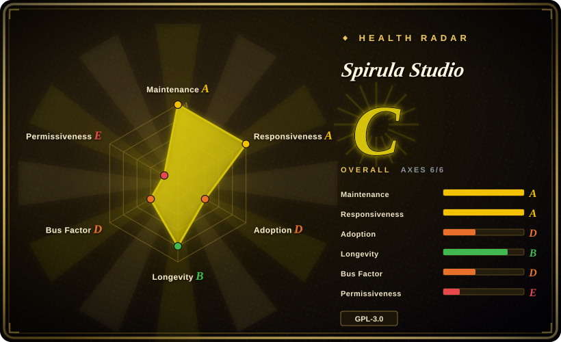
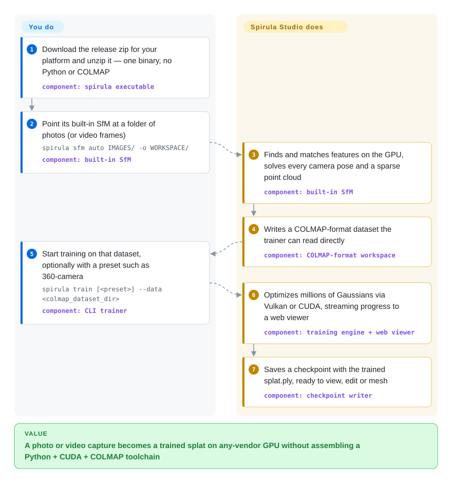

# Spirula Studio

You filmed a room or a garden and want a 3D scene you can walk around in, but every open trainer wants an NVIDIA card, a Python/PyTorch install and a separate COLMAP run before the first step. Spirula Studio packs camera solving, masking, Gaussian-splat training and meshing into one downloadable binary that trains through Vulkan on NVIDIA, AMD, Intel or Apple GPUs.

## When to use

You are a 3D artist, a drone or 360-camera hobbyist, or a small studio turning captures into Gaussian splats — scenes made of millions of small fuzzy colored blobs that render photo-real views from angles you never filmed. The usual open-source route is a chain of separately installed tools: COLMAP to solve camera poses, a script to extract sharp frames from video, a Python environment with the right PyTorch and CUDA versions, and then a research trainer such as gsplat or the INRIA reference code. On a MacBook or a Radeon card that chain simply stops at `torch.cuda.is_available() → False`; on an 8 GB laptop GPU it stops at an out-of-memory error once the scene passes a few million blobs. Spirula Studio is the pick when you want the whole path — video or photos in, splat and textured mesh out — in one app you unzip, on whatever GPU you have, including 360° and fisheye footage it trains on directly without first converting it to ordinary pinhole images.

The deciding tradeoff against its closest peers: LichtFeld Studio is a comparably complete desktop trainer but requires a recent NVIDIA card; Brush is also cross-vendor and runs even in a browser, but it expects you to bring COLMAP or Nerfstudio poses. Spirula Studio bundles its own structure-from-motion and masking, and pays for that breadth with a one-person maintainer and a GPL-3.0 license.

## How it works

Everything is one C++ program with two faces: a desktop GUI (Dear ImGui) and a `spirula` command line that shares the same engine. First, its built-in structure-from-motion — the step that works out where each photo was taken from by matching the same visual features across photos — turns your images into camera poses and a sparse point cloud, written in COLMAP's on-disk format so other tools can read it too; the GUI can also pull the sharpest frames out of a video, cut out moving people with a downloaded SAM segmentation model, and use a phone or 360-camera's GPS/IMU metadata to get real-world scale. Then the trainer seeds Gaussians from those points and repeatedly renders them from each camera, compares against the real photo and nudges every blob's position, size and color — like sanding a sculpture until every photo of it matches. The compute kernels are written once in Slang (a shader language) and compiled both to Vulkan and to CUDA, which is how the same trainer runs on non-NVIDIA GPUs; quantized training keeps up to ~10M full-color Gaussians inside 8 GB of video memory. You choose the inputs, a preset (general, 360-camera, HDR, meshing …) and when to stop; it does the solving, training, live preview (served as a web page you can open over SSH) and export to a `splat.ply` or a PLY/OBJ/glTF/STL mesh.

<!-- flow-steps:begin (generated from flows/spirula-studio.json by tools/flow_card.py — do not edit) -->

Text version of the flow

1. **You**: Download the release zip for your platform and unzip it — one binary, no Python or COLMAP — component: `spirula executable`
2. **You**: Point its built-in SfM at a folder of photos (or video frames) — `spirula sfm auto IMAGES/ -o WORKSPACE/` — component: `built-in SfM`
3. **Spirula Studio**: Finds and matches features on the GPU, solves every camera pose and a sparse point cloud — component: `built-in SfM`
4. **Spirula Studio**: Writes a COLMAP-format dataset the trainer can read directly — component: `COLMAP-format workspace`
5. **You**: Start training on that dataset, optionally with a preset such as 360-camera — `spirula train [<preset>] --data <colmap_dataset_dir>` — component: `CLI trainer`
6. **Spirula Studio**: Optimizes millions of Gaussians via Vulkan or CUDA, streaming progress to a web viewer — component: `training engine + web viewer`
7. **Spirula Studio**: Saves a checkpoint with the trained splat.ply, ready to view, edit or mesh — component: `checkpoint writer`

**Value**: A photo or video capture becomes a trained splat on any-vendor GPU without assembling a Python + CUDA + COLMAP toolchain

<!-- flow-steps:end -->

## When NOT to use

- **You are doing splatting research in Python and need to edit the loss or the rasterizer.** Spirula Studio retired its Python/PyTorch layer in 2026 and its engine is a C++ process-global singleton; use gsplat (the CUDA rasterizer library behind Nerfstudio's `splatfacto`) or the INRIA reference implementation, where a new loss term is a few lines of PyTorch.
- **You need to embed the trainer in a closed-source product.** The project switched from Apache-2.0 to GPL-3.0 on 2026-05-07, in the author's words "to discourage closed-source wrappers" and to reuse code from GPL-licensed LichtFeld Studio, and the SAM 3 masking checkpoint is under Meta's own non-standard license; Brush (Apache-2.0) is the permissive cross-vendor option, and a commercial app such as Jawset Postshot is the licensed-binary route.
- **Your team needs a trainer that outlives one person.** About 98% of commits (911 of 930) come from the author, who writes that the project is "developed and maintained almost entirely by one person"; LichtFeld Studio (63 contributors) or gsplat (≈100) spread that risk better if you are building a production pipeline on top.
- **You train on an AMD Radeon RX 5000/6000-series card under Windows.** Users report `vkQueueSubmit failed (VkResult -4)` device-lost crashes that the maintainer attributes to recent Adrenalin drivers and has declined to work around without test hardware (issues #23, #75); run Linux, use an NVIDIA card, or try OpenSplat's ROCm build.
- **You need the trainer in a browser tab or on a phone.** Spirula Studio is a desktop binary; Brush trains in Chrome's WebGPU and on Android.
- **You need survey-grade geometry or a certified photogrammetry deliverable.** Meshes here are extracted from a trained splat, and the SfM module's own design notes scope it as "splatting-grade first, COLMAP parity as a stretch goal"; use COLMAP plus a dense photogrammetry pipeline such as Meshroom or OpenMVS, or a commercial photogrammetry suite, for measured mesh accuracy.
- **Your machines block unsigned or AV-flagged downloads.** Windows Defender flagged the v2026.9.20 and v2026.9.24 Windows zips as `Trojan:Script/Wacatac.H!ml` for some users (issue #92, VirusTotal clean), and the macOS app is only ad-hoc signed, not notarized; in locked-down environments, build from source or pick a signed commercial tool.

## Comparison

| Alternative | In index | Our verdict | Tradeoff |
|---|---|---|---|
| LichtFeld Studio | not indexed | If every training machine has a recent NVIDIA GPU and you want a wider contributor base, pick LichtFeld Studio; pick Spirula Studio when AMD, Intel or Apple GPUs must train too or you want SfM and masking in the same app. | CUDA 12.8+ C++ desktop trainer under the same GPL-3.0 (Spirula Studio relicensed partly to adapt its IGS+/MRNF code), 63 contributors versus one main author, but no non-NVIDIA path. Real repository, not added in this tab-intake batch. |
| Brush | not indexed | If you need training in a browser, on Android, or an Apache-2.0 license you can ship inside a product, pick Brush; pick Spirula Studio when you want raw video or photos to go in without a separate COLMAP step. | Rust + WebGPU (Burn) binaries with no CUDA dependency and a permissive license, but it takes COLMAP or Nerfstudio data as input and its last tagged release is 2025-09. Real repository, not added in this tab-intake batch. |
| OpenSplat | not indexed | If you already run WebODM/OpenSfM and want a headless trainer you can drop into that pipeline — even CPU-only — pick OpenSplat; pick Spirula Studio for a GUI that also solves cameras and meshes. | C++ on LibTorch with CUDA, ROCm, Metal or CPU backends under AGPL-3.0, backed by the WebODM ecosystem; no built-in SfM and no GUI. Real repository, not added in this tab-intake batch. |
| gsplat (Nerfstudio) | not indexed | If you are changing the method — new losses, densification strategies, camera models — pick gsplat inside a PyTorch codebase; pick Spirula Studio when you want to produce splats, not modify how they are trained. | Apache-2.0 CUDA rasterizer with Python bindings and ≈100 contributors, the research default; requires NVIDIA + PyTorch and leaves pose solving and UI to you. Real repository, not added in this tab-intake batch. |
| Jawset Postshot | not a repo | If you want a supported, closed commercial splat trainer on Windows and a vendor to call, pick Postshot; pick Spirula Studio when source access, Linux/macOS, or non-NVIDIA GPUs matter. | A proprietary desktop application — nothing to fork or audit, so it is out of scope for this index by shape. |

## Tech stack

- **Language & build:** C++ (≈15.5 MB of the repo's code), CMake + Ninja; `build_develop.bash` / `build_develop.bat` wrap per-platform setup. There is no Python package — `pyproject.toml` only says so.
- **Compute backends:** Vulkan 1.2 (recommended; SPIR-V compiled from Slang, MoltenVK statically linked on macOS) and CUDA (legacy, NVIDIA only). Shared device math lives in `src/shaders/*.slang`, compiled to both CUDA headers and SPIR-V, behind one backend seam (`src/backend/api/`).
- **GUI & viewer:** Dear ImGui v1.92.8 + GLFW 3.4 + OpenGL 3.2 core for the desktop app; an embedded HTTP web viewer for remote training; a separate WebGL2/WASM viewer (`viewer/`) published on GitHub Pages.
- **Built-in pipeline stages:** native SfM (GPU SIFT/ALIKED/LoMa features, incremental mapper, GPU bundle adjustment), native SAM/BiRefNet/Grounding-DINO masking, MoGe/Metric3D depth and normals, Vulkan video decode (opt-in), meshing with UV-atlas texture baking; 13 UI languages.
- **Vendored libraries:** stb_image, miniz and similar under `external/`; the only remaining Python is hand-run tooling (for example LPIPS evaluation and `tools/gui_mcp.py`, an MCP server that drives the GUI).

## Dependencies

- **Hardware:** a GPU with a Vulkan 1.2 driver (NVIDIA, AMD, Intel, Apple Silicon) or, for the CUDA build, an NVIDIA card with the CUDA toolkit. VRAM sets the ceiling on scene size.
- **Prebuilt binaries:** Windows x86_64 zip, Ubuntu x86_64 zip and macOS arm64 `.dmg` on each release — all Vulkan builds; no CUDA binary is published.
- **Model checkpoints (downloaded on first use):** SAM 2.1 / SAM 3 for masking and depth/normal models are fetched by the GUI (with a ModelScope mirror) and shown with their licenses before download; they are never bundled.
- **Optional external tools:** ffmpeg for frame extraction when the patented-codec Vulkan video decoder is compiled out (`SS_ENABLE_PATENTED=OFF`, the build default); COLMAP ≥ 4.x only if you pick the COLMAP path instead of the built-in SfM.
- **Source build:** the Vulkan SDK and a C++ toolchain; GLFW, ImGui and a pinned Slang compiler are fetched by CMake (network needed once).

## Ops difficulty

**Low for a desktop user, medium at the edges.** On a supported GPU it is unzip-and-run with no service or database. The friction comes from GPU drivers — the Vulkan backend exercises driver paths hard enough that specific driver/card combinations crash (AMD RDNA1/2 on Windows is the known case) — and from very large scenes, where you split the capture into partitions with `spirula partition split` / `merge` and tune splat counts to your VRAM. Releases land every few days with changelog notes such as "carries difference in SfM", so pin a version for repeatable batch runs. Building from source means the Vulkan SDK plus a Slang toolchain CMake fetches for you, and enabling on-GPU video decoding (`-DSS_ENABLE_PATENTED=ON`) moves H.264/H.265 patent compliance onto you.

## Health & viability

- **Maintenance — very active (verified 2026-09-28).** Commits land daily, with the latest on 2026-09-28; twelve CalVer releases shipped between 2026-08-09 and 2026-09-24, and the maintainer answers issues within about a day.
- **Governance / bus factor — one person.** A personal repository; the author has 911 of 930 commits and states the project is "developed and maintained almost entirely by one person". No organization, foundation or company is behind it, and there is no CONTRIBUTING or governance document beyond the agent-oriented `AGENTS.md`.
- **Age & Lindy — young as a product.** The repo dates to 2024-05 as a research splatting codebase (`spirulae-splat`), but the Python-free app, the rename and the public binaries only arrived in mid-2026, so the thing you would actually depend on is a few months old. Treat the Lindy prior as weak here.
- **Adoption — early but real.** ~1.1k stars and 95 forks, about 1.5k downloads of the v2026.9.24 binaries within four days, and a professional scan library (Megascapes) plus a SuperSplat software tag that publish splats trained with it. Issue traffic is dominated by genuine hardware and dataset reports, not hype.
- **Risk flags.** A relicense inside the last year — Apache-2.0 → GPL-3.0 on 2026-05-07, to adapt IGS+/MRNF code from LichtFeld Studio and discourage closed-source wrappers — so pre-2026-05 snapshots are Apache-2.0 but everything current is copyleft; third-party model licenses (SAM 3) and AVC/HEVC patent exposure for opt-in features; AV false positives on Windows release zips; a changelog that warns SfM changes may regress; and heavy AI-agent-assisted development [推断], which moves fast but concentrates design knowledge in one maintainer's workflow.

## Caveats (unverified)

- [未验证] Star, fork, issue and download counts (1,132 stars / 95 forks / 43 open issues+PRs; 969 + 294 + 258 downloads of the v2026.9.24 assets) are a GitHub API snapshot taken 2026-09-28 and move daily.
- [未验证] "10M full-SH Gaussians in 8 GB VRAM" and the claim that one training strategy combines the advantages of MCMC/IGS+/MRNF are the author's own README claims; no independent benchmark was run for this page.
- [未验证] The README says the CUDA and Vulkan backends are generally within a few percent of each other in speed; this was not reproduced.
- [推断] "Heavy AI-agent-assisted development" is inferred from the 45 KB agent-oriented `AGENTS.md`, `CLAUDE.md` and the in-repo MCP server, not from a statement by the maintainer.
- [推断] That meshes are not survey-grade is inferred from the SfM design note ("splatting-grade first, COLMAP parity as a stretch goal") and from meshes being extracted from a splat; no accuracy measurement was made.
- [未验证] The AMD RX 5000/6000 Windows crash is reported by several users on issues #23 and #75 and attributed to Adrenalin drivers by the maintainer; it was not reproduced here and may be fixed by later drivers or releases.
- [推断] Gatekeeper friction on downloaded macOS builds is inferred from `docs/build.md` (ad-hoc signing, notarization "not wired into the build"); the actual first-launch experience was not tested.
- [未验证] Jawset Postshot's platform and GPU requirements were not verified from the vendor's site for this page; only its closed-source commercial status is relied on.
- [未验证] LichtFeld Studio, Brush, OpenSplat and gsplat facts (licenses, backends, contributor counts, last releases) come from their READMEs and the GitHub API on 2026-09-28, not from running them.
