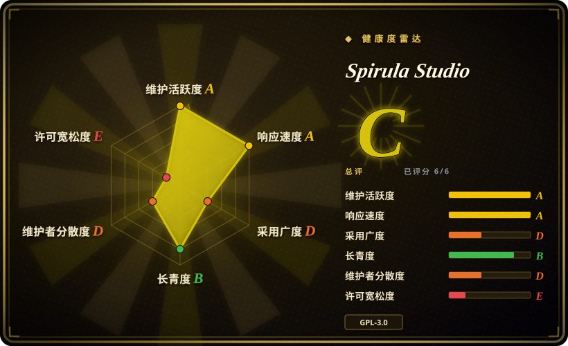
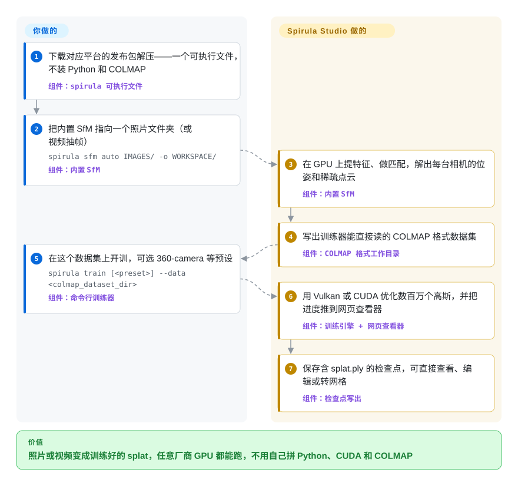

# Spirula Studio

你拍了一段房间或院子的视频，想要一个能自由走动观看的三维场景，可开源训练器几乎都要求 NVIDIA 显卡、一套 Python/PyTorch 环境，还得先单独跑一遍 COLMAP 才能开始第一步。Spirula Studio 把相机位姿求解、抠图、高斯泼溅训练和转网格塞进一个下载即用的程序，通过 Vulkan 在 NVIDIA、AMD、Intel 和苹果 GPU 上都能训练。

## 何时使用

你是三维美术、无人机或全景相机玩家，或者一个把实拍素材做成高斯泼溅（Gaussian splat）的小工作室——场景由几百万个带颜色的模糊小团组成，能从你没拍过的角度渲染出照片级画面。常规开源路线是一串各自安装的工具：用 COLMAP 解相机位姿，用脚本从视频里挑清晰帧，配好版本对得上的 PyTorch 和 CUDA，再跑 gsplat 或 INRIA 参考实现这类研究训练器。在 MacBook 或 Radeon 显卡上，这条链直接卡在 `torch.cuda.is_available() → False`；在 8 GB 显存的笔记本上，场景一过几百万个高斯就爆显存。当你想要整条路径——进去的是视频或照片，出来的是 splat 和带贴图的网格——都在一个解压即用的程序里完成、用你手头任何 GPU 都能跑、全景和鱼眼素材不用先转成普通针孔图像就能直接训练时，选 Spirula Studio。

和最接近的同类比，决定性的取舍是：LichtFeld Studio 同样是功能完整的桌面训练器，但只支持较新的 NVIDIA 卡；Brush 也跨厂商，甚至能在浏览器里跑，但要你自带 COLMAP 或 Nerfstudio 的位姿数据。Spirula Studio 自带运动恢复结构（SfM）和抠图，代价是只有一位主要维护者和 GPL-3.0 许可证。

## 怎么用起来

整个项目是一个 C++ 程序，有两张脸：桌面图形界面（Dear ImGui）和共用同一引擎的 `spirula` 命令行。第一步，内置的运动恢复结构——通过在多张照片里匹配同一批视觉特征，反推出每张照片是从哪个位置拍的——把你的图片变成相机位姿和稀疏点云，并按 COLMAP 的磁盘格式写出，别的工具也能读；图形界面还能从视频里挑最清晰的帧、用下载的 SAM 分割模型抠掉走动的路人、借手机或全景相机里的 GPS/IMU 元数据恢复真实尺度。第二步，训练器用这些点播下初始高斯，然后反复从每个相机视角渲染、和真实照片对比、微调每个小团的位置、大小和颜色——像打磨雕塑，直到从每张照片的角度看都对得上。计算核用 Slang（一种着色器语言）只写一遍，同时编译成 Vulkan 和 CUDA，所以同一个训练器能跑在非 NVIDIA 的 GPU 上；量化训练让最多约一千万个全彩高斯挤进 8 GB 显存。你负责选输入、选预设（general、360-camera、HDR、meshing 等）和决定何时停；它负责求解、训练、实时预览（以网页形式提供，可经 SSH 转发打开）以及导出 `splat.ply` 或 PLY/OBJ/glTF/STL 网格。

<!-- flow-steps:begin (generated from flows/spirula-studio.json by tools/flow_card.py — do not edit) -->

流程文字版

1. **你**：下载对应平台的发布包解压——一个可执行文件，不装 Python 和 COLMAP — 组件：`spirula 可执行文件`
2. **你**：把内置 SfM 指向一个照片文件夹（或视频抽帧） — `spirula sfm auto IMAGES/ -o WORKSPACE/` — 组件：`内置 SfM`
3. **Spirula Studio**：在 GPU 上提特征、做匹配，解出每台相机的位姿和稀疏点云 — 组件：`内置 SfM`
4. **Spirula Studio**：写出训练器能直接读的 COLMAP 格式数据集 — 组件：`COLMAP 格式工作目录`
5. **你**：在这个数据集上开训，可选 360-camera 等预设 — `spirula train [<preset>] --data <colmap_dataset_dir>` — 组件：`命令行训练器`
6. **Spirula Studio**：用 Vulkan 或 CUDA 优化数百万个高斯，并把进度推到网页查看器 — 组件：`训练引擎 + 网页查看器`
7. **Spirula Studio**：保存含 splat.ply 的检查点，可直接查看、编辑或转网格 — 组件：`检查点写出`

**价值**：照片或视频变成训练好的 splat，任意厂商 GPU 都能跑，不用自己拼 Python、CUDA 和 COLMAP

<!-- flow-steps:end -->

## 何时不用

- **你在用 Python 做泼溅研究，需要改损失函数或光栅化器。** Spirula Studio 已在 2026 年移除 Python/PyTorch 层，引擎是一个进程级全局单例的 C++ 程序；这种情况用 gsplat（Nerfstudio `splatfacto` 背后的 CUDA 光栅化库）或 INRIA 参考实现，新加一项损失只是几行 PyTorch。
- **你要把训练器嵌进闭源产品。** 项目在 2026-05-07 从 Apache-2.0 改为 GPL-3.0，作者原话是为了“劝退闭源套壳”，并复用 GPL 许可的 LichtFeld Studio 代码；SAM 3 抠图模型还挂着 Meta 自定的非标准许可；要宽松许可的跨厂商方案选 Brush（Apache-2.0），要商业授权的二进制就选 Jawset Postshot 这类商业软件。
- **你的团队需要一个不依赖某一个人的训练器。** 约 98% 的提交（930 次里的 911 次）出自作者本人，作者也写明项目“几乎完全由一个人开发和维护”；要在上面搭生产管线，LichtFeld Studio（63 位贡献者）或 gsplat（约 100 位）更能分散这个风险。
- **你在 Windows 上用 AMD Radeon RX 5000/6000 系列显卡训练。** 多位用户报告 `vkQueueSubmit failed (VkResult -4)` 设备丢失崩溃，维护者判断是新版 Adrenalin 驱动的问题，并表示没有测试硬件前不做代码绕行（issue #23、#75）；改用 Linux、换 NVIDIA 卡，或试试 OpenSplat 的 ROCm 构建。
- **你要在浏览器标签页或手机上训练。** Spirula Studio 是桌面程序；Brush 能在 Chrome 的 WebGPU 和 Android 上训练。
- **你需要测绘级几何精度或正式的摄影测量交付物。** 这里的网格是从训练好的 splat 里提取的，SfM 模块自己的设计记录也把目标定为“先达到泼溅可用的精度，与 COLMAP 持平是延伸目标”；要可度量的网格精度，用 COLMAP 加 Meshroom、OpenMVS 这类稠密摄影测量管线，或商业摄影测量套件。
- **你的机器会拦截未签名或被杀软标记的下载。** 部分用户的 Windows Defender 把 v2026.9.20 和 v2026.9.24 的 Windows 压缩包报为 `Trojan:Script/Wacatac.H!ml`（issue #92，VirusTotal 显示干净），macOS 应用也只做了 ad-hoc 签名、没有公证；管控严格的环境里，从源码构建或选有正式签名的商业工具。

## 横向对比

| 替代品 | 是否收录 | 我们的评价 | 取舍 |
|---|---|---|---|
| LichtFeld Studio | 未收录 | 如果每台训练机都有较新的 NVIDIA 显卡、又想要更宽的贡献者基础，选 LichtFeld Studio；如果 AMD、Intel 或苹果 GPU 也得能训练，或者想在同一个程序里完成 SfM 和抠图，选 Spirula Studio。 | 同为 GPL-3.0 的 C++ 桌面训练器（Spirula Studio 改许可证的原因之一就是移植它的 IGS+/MRNF 代码），需要 CUDA 12.8+，有 63 位贡献者而非一位主力作者，但没有非 NVIDIA 路径。真实仓库，本轮标签页收录批次未添加。 |
| Brush | 未收录 | 如果要在浏览器、Android 上训练，或需要能随产品分发的 Apache-2.0 许可，选 Brush；如果想让原始视频或照片不经单独的 COLMAP 步骤直接进来，选 Spirula Studio。 | Rust + WebGPU（Burn）的无 CUDA 依赖二进制，许可宽松，但输入必须是 COLMAP 或 Nerfstudio 格式数据，最近一次打 tag 的发布停在 2025-09。真实仓库，本轮标签页收录批次未添加。 |
| OpenSplat | 未收录 | 如果你已经在跑 WebODM/OpenSfM，想要一个能塞进这条管线的无界面训练器——甚至只用 CPU——选 OpenSplat；要一个同时会解相机、会转网格的图形界面，选 Spirula Studio。 | 基于 LibTorch 的 C++，支持 CUDA、ROCm、Metal 或纯 CPU，AGPL-3.0，背靠 WebODM 生态；没有内置 SfM，也没有图形界面。真实仓库，本轮标签页收录批次未添加。 |
| gsplat（Nerfstudio） | 未收录 | 如果你在改方法本身——新损失、新致密化策略、新相机模型——在 PyTorch 代码库里用 gsplat；如果你要的是产出 splat 而不是改训练方式，选 Spirula Studio。 | Apache-2.0 的 CUDA 光栅化库，带 Python 绑定，约 100 位贡献者，是研究界默认选择；需要 NVIDIA + PyTorch，位姿求解和界面都得自己配。真实仓库，本轮标签页收录批次未添加。 |
| Jawset Postshot | 非仓库 | 如果想要一个有厂商支持的闭源商业泼溅训练器、在 Windows 上用、出问题有人可找，选 Postshot；如果看重源码可见、Linux/macOS 或非 NVIDIA GPU，选 Spirula Studio。 | 专有桌面应用——没有可 fork 或审计的源码，形态上不在本索引收录范围内。 |

## 技术栈

- **语言与构建：** C++（占仓库代码约 15.5 MB），CMake + Ninja；`build_develop.bash` / `build_develop.bat` 封装各平台的配置。没有 Python 包——`pyproject.toml` 只是写明这一点。
- **计算后端：** Vulkan 1.2（推荐；SPIR-V 由 Slang 编译，macOS 上静态链接 MoltenVK）和 CUDA（遗留路线，仅 NVIDIA）。共用的设备端数学放在 `src/shaders/*.slang`，同时编译成 CUDA 头文件和 SPIR-V，藏在同一个后端接缝（`src/backend/api/`）后面。
- **界面与查看器：** 桌面程序用 Dear ImGui v1.92.8 + GLFW 3.4 + OpenGL 3.2 core；远程训练时内嵌 HTTP 网页查看器；另有独立的 WebGL2/WASM 查看器（`viewer/`），发布在 GitHub Pages。
- **内置流水线环节：** 原生 SfM（GPU SIFT/ALIKED/LoMa 特征、增量式建图、GPU 光束法平差），原生 SAM/BiRefNet/Grounding-DINO 抠图，MoGe/Metric3D 深度与法线，Vulkan 视频解码（需手动开启），带 UV 图集贴图烘焙的网格提取；界面支持 13 种语言。
- **内置第三方库：** `external/` 下的 stb_image、miniz 等；剩下的 Python 只是手动运行的工具（例如 LPIPS 评估，以及驱动图形界面的 MCP 服务器 `tools/gui_mcp.py`）。

## 依赖

- **硬件：** 一块有 Vulkan 1.2 驱动的 GPU（NVIDIA、AMD、Intel、Apple Silicon），或者 CUDA 构建所需的 NVIDIA 显卡加 CUDA 工具链。显存决定场景规模上限。
- **预编译包：** 每个发布都有 Windows x86_64 压缩包、Ubuntu x86_64 压缩包和 macOS arm64 `.dmg`——全部是 Vulkan 构建，不发布 CUDA 二进制。
- **模型权重（首次使用时下载）：** 抠图用的 SAM 2.1 / SAM 3 以及深度、法线模型由图形界面下载（带 ModelScope 镜像），下载前展示各自许可证；从不随包分发。
- **可选外部工具：** 当涉及专利编解码的 Vulkan 视频解码没有编进来时（`SS_ENABLE_PATENTED=OFF`，构建默认值），抽帧要用 ffmpeg；只有选 COLMAP 路线而不用内置 SfM 时，才需要 COLMAP ≥ 4.x。
- **源码构建：** Vulkan SDK 和 C++ 工具链；GLFW、ImGui 和锁定版本的 Slang 编译器由 CMake 自动拉取（需要联网一次）。

## 运维难度

**桌面用户低，边缘场景中等。** 在受支持的 GPU 上就是解压即跑，没有服务也没有数据库。麻烦来自 GPU 驱动——Vulkan 后端对驱动的压榨足以让特定显卡/驱动组合崩溃（Windows 上的 AMD RDNA1/2 是已知案例）——以及超大场景：这时要用 `spirula partition split` / `merge` 把采集切块训练再合并，并按显存调 splat 数量。发布每隔几天一次，更新说明里会写“SfM 有改动”，所以批量任务要锁定版本才可复现。源码构建需要 Vulkan SDK，外加 CMake 自动拉取的 Slang 工具链；打开 GPU 视频解码（`-DSS_ENABLE_PATENTED=ON`）意味着 H.264/H.265 的专利合规责任落到你头上。

## 健康度与可持续性

- **维护——非常活跃（2026-09-28 核实）。** 每天都有提交，最近一次在 2026-09-28；2026-08-09 至 2026-09-24 之间发布了 12 个 CalVer 版本，维护者通常一天内回复 issue。
- **治理与巴士因子——一个人。** 个人仓库；作者在 930 次提交中占 911 次，并自述项目“几乎完全由一个人开发和维护”。背后没有组织、基金会或公司，除了面向 agent 的 `AGENTS.md` 之外没有 CONTRIBUTING 或治理文档。
- **年龄与林迪效应——作为产品还很年轻。** 仓库始于 2024-05，当时是一个研究用的泼溅代码库（`spirulae-splat`），而不依赖 Python 的应用、改名和公开二进制都是 2026 年年中才出现，所以你真正要依赖的东西只有几个月大。这里林迪先验的分量要打折。
- **采用度——早期但真实。** 约 1.1k 星、95 个 fork，v2026.9.24 的二进制四天内下载约 1.5k 次；专业扫描素材库 Megascapes 以及 SuperSplat 的软件标签页都在发布用它训练的 splat。issue 里以真实的硬件和数据集问题为主，不是炒作。
- **风险信号。** 近一年内改过许可证——2026-05-07 从 Apache-2.0 改为 GPL-3.0，目的是移植 LichtFeld Studio 的 IGS+/MRNF 代码、劝退闭源套壳——所以 2026-05 之前的快照是 Apache-2.0，当前代码一律是 copyleft；第三方模型许可（SAM 3）和可选功能的 AVC/HEVC 专利风险；Windows 发布包被杀软误报；更新说明提醒 SfM 改动可能退化；以及大量借助 AI agent 开发 [推断]，迭代很快，但设计知识集中在一位维护者的工作流里。

## 存疑（未验证）

- [未验证] 星数、fork、issue 和下载量（1,132 星 / 95 fork / 43 个开放 issue+PR；v2026.9.24 各资产下载 969 + 294 + 258 次）是 2026-09-28 的 GitHub API 快照，每天都在变。
- [未验证] “8 GB 显存训练一千万个全阶球谐高斯”以及“一套训练策略融合 MCMC/IGS+/MRNF 的优点”都是作者 README 的自述，本页没有做独立基准测试。
- [未验证] README 称 CUDA 与 Vulkan 后端速度一般相差几个百分点以内；本页未复现。
- [推断] “大量借助 AI agent 开发”是从 45 KB 的面向 agent 的 `AGENTS.md`、`CLAUDE.md` 和仓库内 MCP 服务器推断的，并非维护者的声明。
- [推断] “网格达不到测绘级”是根据 SfM 设计记录（“先达到泼溅可用的精度，与 COLMAP 持平是延伸目标”）以及网格从 splat 提取这一点推断的，没有做精度测量。
- [未验证] AMD RX 5000/6000 在 Windows 上的崩溃由多位用户在 issue #23、#75 报告，维护者归因于 Adrenalin 驱动；本页未复现，后续驱动或版本可能已修复。
- [推断] 下载的 macOS 版本会遇到 Gatekeeper 拦截，是从 `docs/build.md`（ad-hoc 签名、公证“没有接入构建”）推断的，没有实测首次启动体验。
- [未验证] Jawset Postshot 的平台和 GPU 要求未从厂商网站核实；本页只依赖它是闭源商业软件这一点。
- [未验证] LichtFeld Studio、Brush、OpenSplat 和 gsplat 的事实（许可证、后端、贡献者数、最近发布）来自它们的 README 和 2026-09-28 的 GitHub API，没有实际运行。
