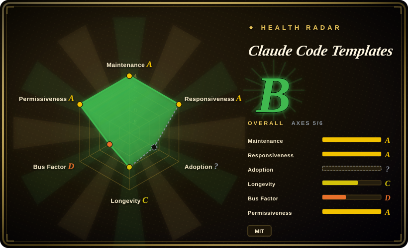
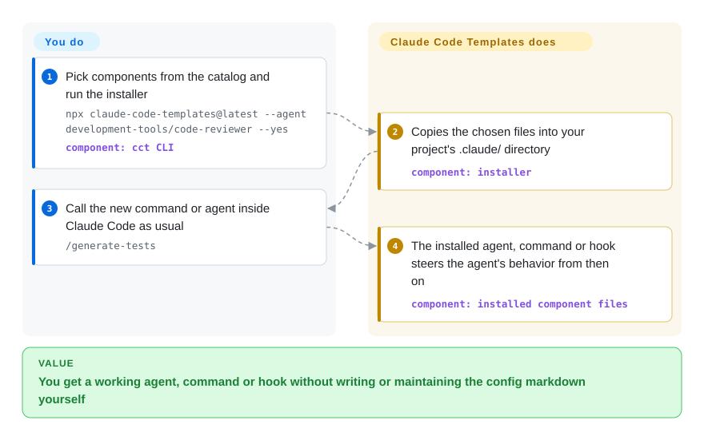

# Claude Code Templates

You want a code-review subagent or a `/generate-tests` slash command in Claude Code, and writing the config markdown yourself feels like reinventing something a hundred people already wrote. Claude Code Templates is a browsable catalog plus an `npx` installer that copies ready-made agents, commands, hooks, MCPs, settings and skills straight into your `.claude/` directory.

## When to use

You're a developer setting up Claude Code on a new project (or a new hire's machine) and you don't yet have your own library of agents, slash commands, and hooks. Instead of writing a security-auditor agent or a pre-commit hook from a blank page, you browse aitmpl.com (or the repo's `cli-tool/components/` tree — 28 agents, 25 commands, 12 hooks, 13 MCPs, 13 settings, 31 skills as of 2026-09-23) and install what looks useful with one command. Two minutes later the component behaves as if you wrote it yourself.

You pick this over the alternatives when what you want is **breadth and à-la-carte choice**, not a coherent methodology: Superpowers and Compound Engineering each install one opinionated end-to-end workflow, while this is a supermarket shelf — many unrelated components from many upstream authors, and you assemble your own combination. The deciding tradeoff: maximum choice and zero commitment per component, at the cost of no guarantee the pieces were designed to work together.

## Q&A

**Will installing this mess up the harness I already tuned?**
It can. The installer writes into the same `.claude/` namespace your own agents, commands and hooks already occupy, with no isolation beyond a same-name overwrite prompt. Read the catalog and port one component into your own system instead of installing over it.

**Isn't it mostly a repackaging of other people's work?**
Largely, yes. The README's Attribution section lists the upstream collections it aggregates — `anthropics/skills`, `wshobson/agents`, `obra/superpowers` among them. When you want a specific component, its original repo is the better source: fewer moving parts, and the author's own docs.

**Should I copy the first install command in the README?**
No. It installs a sponsor's (Bright Data) skills and MCP, not a neutral starter set. Every default in this project is worth reading before you run it.

**Are the `--analytics` / `--chats` dashboards part of the catalog?**
No — they are a second product inside the same CLI, watching your sessions rather than installing components. Evaluate them separately, and note `--chats --tunnel` exposes conversations over the internet.

## How it works

The project is two things glued together: a **catalog** (Markdown component files under `cli-tool/components/`, most of them aggregated from upstream collections like `anthropics/skills` and `wshobson/agents`, each keeping its original license) and an **installer CLI** (npm package `claude-code-templates`, binaries `cct` / `claude-code-templates`, with a Rust rewrite under `cli-rust/`). The installer does no magic: it downloads the component files you named and writes them into the places Claude Code already reads — verified in the source, agents land in `<project>/.claude/agents/`, commands in `.claude/commands/`, hooks in `.claude/hooks/`, MCP servers in `.mcp.json`. After that the catalog's job is done; **Claude Code's own native loader picks the files up**, and the installed agent or hook steers your sessions from then on. Think of it as a bookstore, not a librarian: it hands you the book, and your own Claude Code does the reading. The same CLI also ships optional local dashboards (`--analytics`, `--chats`, `--health-check`, `--plugins`) that watch your Claude Code sessions — those are separate from the catalog and not part of the backbone below.

<!-- flow-steps:begin (generated from flows/claude-code-templates.json by tools/flow_card.py — do not edit) -->

Text version of the flow

1. **You**: Pick components from the catalog and run the installer — `npx claude-code-templates@latest --agent development-tools/code-reviewer --yes` — component: `cct CLI`
2. **Claude Code Templates**: Copies the chosen files into your project's .claude/ directory — component: `installer`
3. **You**: Call the new command or agent inside Claude Code as usual — `/generate-tests`
4. **Claude Code Templates**: The installed agent, command or hook steers the agent's behavior from then on — component: `installed component files`

**Value**: You get a working agent, command or hook without writing or maintaining the config markdown yourself

<!-- flow-steps:end -->

<!-- flow-steps:begin (generated from flows/claude-code-templates.json by tools/flow_card.py — do not edit) -->
<!-- flow-steps:end -->

## When NOT to use

- **You already maintain your own curated harness** (a dotfiles repo, synced `~/.claude/`, your own hooks and skills). The installer writes into the same `.claude/` namespace with no conflict detection beyond file overwrite prompts, and a same-named component can shadow or replace yours. Instead, treat the catalog as read-only reading material: find a component you like, then copy that one file from its original upstream repo (the README's Attribution section lists them) into your own system.
- **You want one coherent, tested-as-a-whole workflow.** A supermarket shelf gives you parts, not a process. If you want brainstorm→plan→TDD→verify enforced end to end, install [Superpowers](superpowers.md); if you want a batteries-included harness where skills, hooks and memory were designed together, install [ECC](ecc.md).
- **You're not on Claude Code.** The components are Claude-Code-shaped (`.claude/agents`, `.mcp.json`, Claude skill format). For a methodology that follows you across Codex, Cursor, OpenCode and others, [Superpowers](superpowers.md) ships per-agent manifests instead.
- **You vet everything you run before it touches your config.** The catalog aggregates content from many third-party authors with one maintainer reviewing, 270 open issues (2026-09-23), and sponsor-driven defaults — the README's first quick-install command installs Bright Data's (a sponsor) skills and MCP. If provenance review matters, go straight to the first-party [Anthropic Skills](../../agent-skills/vendor-collections/anthropic-skills.md) collection.
- **You want a library or runtime to build on.** There's nothing to `import` — the deliverable is copied Markdown files plus optional monitoring dashboards. For programmatic agent construction, look at the `agent-frameworks` category instead.

## Comparison

| Alternative | In index | Our verdict | Tradeoff |
|---|---|---|---|
| [SuperClaude Framework](superclaude.md) | ✅ | Choose SuperClaude when you want one integrated persona/command/mode framework for Claude Code; choose this page when you'd rather assemble à-la-carte from a larger catalog. | SuperClaude is a single designed system (coherent but take-it-or-leave-it); Claude Code Templates is broader and per-component, with no coherence guarantee across picks. |
| [Superpowers](superpowers.md) | ✅ | Choose Superpowers when you want an opinionated SDLC discipline enforced across sessions; choose this page when you just need a specific agent or command, not a methodology. | Superpowers is narrow and deep (one workflow, cross-harness); this is wide and shallow (100+ unrelated components, Claude Code only). |
| [ECC](ecc.md) | ✅ | Choose ECC when you want a single maintainer-curated harness where skills, hooks, memory and a security scanner are designed as one set. | ECC trades catalog breadth for internal consistency; with Claude Code Templates you pick more freely but own the integration risk between components. |
| [Anthropic Skills](../../agent-skills/vendor-collections/anthropic-skills.md) | ✅ | Choose Anthropic Skills when first-party provenance and stability matter more than variety. | Anthropic's collection is smaller and official (slower-moving, vendor-maintained); this catalog re-ships some of it alongside community content of uneven quality. |

## Tech stack

- **Installer CLI**: Node.js (npm package `claude-code-templates`, bins `cct` and `claude-code-templates`; commander, inquirer/@clack, fs-extra, express + ws for the dashboards). A Rust rewrite lives in `cli-rust/`. (2026-09-23)
- **Catalog**: plain Markdown/JSON component files under `cli-tool/components/` (agents, commands, hooks, mcps, settings, skills, plus `loops`, `mods`, `sandbox`).
- **Website**: aitmpl.com frontend in `dashboard/`, Cloudflare Workers + Supabase backend (`cloudflare-workers/`, `@supabase/supabase-js` dependency).
- **Automation scripts**: Python under `scripts/` — this is why GitHub Linguist reports the repo's primary language as Python. [推断]

## Dependencies

- **Runtime**: Node.js (via `npx`) for the CLI; Claude Code itself is the real dependency — nothing the installer produces does anything outside it.
- **Network**: fetches components from GitHub at install time; the `--chats --tunnel` remote-view feature routes through Cloudflare Tunnel.
- **No standing infrastructure**: no daemon, no database to run; dashboards are local express servers started on demand. Supabase is only used by the hosted aitmpl.com site, not by local installs. [推断]

## Ops difficulty

**Low mechanically, medium in review burden.** Installing is a one-shot `npx` command with nothing to keep running. The real ongoing cost is configuration hygiene: components accumulate in `.claude/`, hooks execute on your machine at every commit, and an upgrade means re-running the installer over your existing files. Budget time to read any hook or setting before installing it, and keep `.claude/` in version control so installs are reviewable diffs.

## Health & viability

- **Maintenance (2026-09):** very active — pushed 2026-09-23, 21 releases on a v1.x line, latest v1.29.6; npm ~10.7k downloads/month (last-month window ending 2026-09-21). High release cadence on a young version line also means churn.
- **Governance / bus factor:** single-maintainer project (davila7: 1071 of ~1150 commits; the rest are bots and trivial contributions). No foundation or co-maintainer governance. The roadmap, including which sponsors get default placement, is one person's call. [推断]
- **Age & Lindy:** created 2025-07, ~14 months old. Young-hyped profile: 31.2k stars against ~10.7k monthly npm downloads suggests star-driven attention well ahead of actual usage. Unproven by age; adopt for current value, not expected longevity.
- **Backing:** commercial sponsorship (Bright Data, Z.AI, Vercel/Neon OSS programs) pays for the site and presumably maintainer time, but sponsor placement leaks into the product — the README's headline install command installs the sponsor's skills. Sponsorship is not governance; it can also disappear.
- **Risk flags:** MIT, no relicense history. The real risks are content-level: aggregated third-party components each carry their original license and quality; hooks run arbitrary code on your machine; no CLA or security-audit process published beyond a `SECURITY.md` and a committed `security-report.json`. [未验证]

## Caveats (unverified)

- [未验证] Component counts (28 agents / 25 commands / 12 hooks / 13 MCPs / 13 settings / 31 skills) were counted as top-level subdirectories of `cli-tool/components/` on 2026-09-23; the project's own "100+" marketing count may use a different unit.
- [未验证] Star count (31,216) and open-issue count (270) per GitHub API on 2026-09-23; both move fast and are indicative only.
- [未验证] npm download figure (~10.7k/month) is the npm `last-month` point API for the window ending 2026-09-21; it counts CI and mirror traffic, not humans.
- [推断] GitHub Linguist reports Python as the repo's primary language; the user-facing CLI is JavaScript (npm) with a Rust rewrite in `cli-rust/` — Python appears to be utility scripts, but the exact share was not measured.
- [推断] The claim that `--yes` installs overwrite same-named files without namespacing is based on the installer's write-into-`.claude/` behavior seen in `cli-rust/src/commands/install.rs`; the interactive conflict prompts were not exercised.
- [未验证] Sponsorship influence on default commands and catalog ranking is inferred from README placement; no editorial policy was found.
- [未验证] Whether installed components behave correctly across Claude Code versions is untested here; component quality varies by upstream author.
