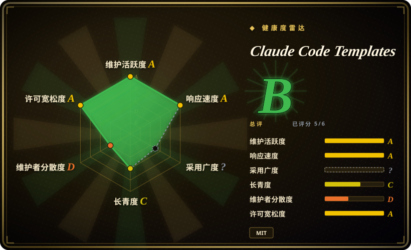
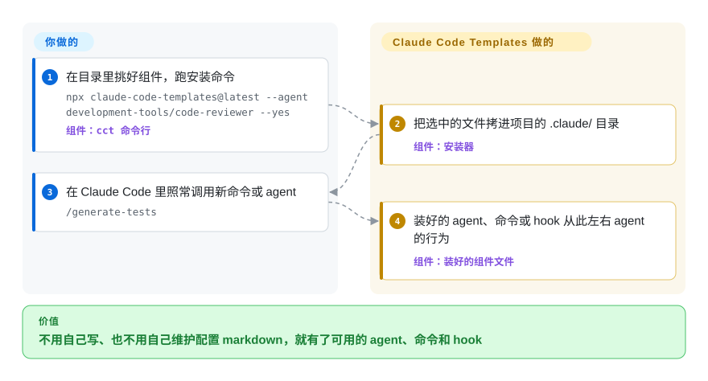

# Claude Code Templates

你想给 Claude Code 加一个代码审查子 agent 或 `/generate-tests` 之类的斜杠命令，又觉得那份配置 markdown 别人早就写过一百遍了。Claude Code Templates 就是一个可浏览的组件目录加一个 `npx` 安装器，把现成的 agent、命令、hook、MCP、设置和 skill 直接拷进你的 `.claude/` 目录。

## 何时使用

你在给一个新项目（或新同事的机器）配置 Claude Code，手头还没有自己积累 agent、斜杠命令和 hook 的仓库。与其从空白页开始写一个安全审查 agent 或 pre-commit hook，不如打开 aitmpl.com（或直接翻仓库的 `cli-tool/components/` 目录——截至 2026-09-23 有 28 个 agent、25 个命令、12 个 hook、13 个 MCP、13 个设置、31 个 skill），看上什么一条命令装好，两分钟后这个组件用起来就像你自己写的。

和替代品相比，选它的场景是**要广度和单点自选，而不是一套自洽的方法论**：Superpowers 和 Compound Engineering 各自只装一条有主见的端到端工作流，而这里是超市货架——来自许多上游作者的互不相关的组件，由你自己搭配。决定性取舍是：单组件选择最多、承诺最轻，代价是没人保证这些部件能协同工作。

## 快问快答

**装它会不会把我已经调好的 harness 搞乱？**
有可能。安装器写的是和你自己的 agent、命令、hook 同一个 `.claude/` 命名空间，除了同名覆盖提示之外没有隔离。正确做法是读目录，把某一个组件移植进你自己的体系，而不是整包覆盖上去。

**它是不是基本在二次分发别人的东西？**
大体上是。README 的 Attribution 一节列出了它聚合的上游合集——`anthropics/skills`、`wshobson/agents`、`obra/superpowers` 等。你要某个具体组件时，它的原仓库是更好的来源：环节更少，文档也是作者自己写的。

**README 里第一条安装命令能直接照抄吗？**
不能。它装的是赞助商（Bright Data）的 skill 和 MCP，不是中性的入门套装。这个项目的每个默认值都值得先读再跑。

**`--analytics` / `--chats` 这些面板也是目录的一部分吗？**
不是——它们是同一个 CLI 里的第二个产品，观察你的会话，和装组件没有关系。要把它们当独立工具单独评估，另外 `--chats --tunnel` 会把对话暴露到公网。

## 怎么用起来

这个项目是两部分粘在一起的：一个**目录**（`cli-tool/components/` 下的 Markdown 组件文件，大部分聚合自 `anthropics/skills`、`wshobson/agents` 等上游合集，各自保留原 license），加一个**安装器 CLI**（npm 包 `claude-code-templates`，二进制名 `cct` / `claude-code-templates`，另有 `cli-rust/` 下的 Rust 重写版）。安装器没有魔法：它把你点名的组件文件下载下来，写进 Claude Code 本来就会读的位置——源码可查证，agent 落到 `<项目>/.claude/agents/`，命令落到 `.claude/commands/`，hook 落到 `.claude/hooks/`，MCP 服务写进 `.mcp.json`。装完之后目录的使命就结束了，**由 Claude Code 自己的原生加载机制接管这些文件**，装好的 agent 或 hook 从此左右你的会话。它更像书店而不是图书管理员：只负责把书递给你，读书的是你自己的 Claude Code。同一个 CLI 还附带几个可选的本地监控面板（`--analytics`、`--chats`、`--health-check`、`--plugins`）用来观察你的会话，它们与组件目录无关，不在下面的主干流程里。

<!-- flow-steps:begin (generated from flows/claude-code-templates.json by tools/flow_card.py — do not edit) -->

流程文字版

1. **你**：在目录里挑好组件，跑安装命令 — `npx claude-code-templates@latest --agent development-tools/code-reviewer --yes` — 组件：`cct 命令行`
2. **Claude Code Templates**：把选中的文件拷进项目的 .claude/ 目录 — 组件：`安装器`
3. **你**：在 Claude Code 里照常调用新命令或 agent — `/generate-tests`
4. **Claude Code Templates**：装好的 agent、命令或 hook 从此左右 agent 的行为 — 组件：`装好的组件文件`

**价值**：不用自己写、也不用自己维护配置 markdown，就有了可用的 agent、命令和 hook

<!-- flow-steps:end -->

<!-- flow-steps:begin (generated from flows/claude-code-templates.json by tools/flow_card.py — do not edit) -->
<!-- flow-steps:end -->

## 何时不用

- **你已经维护着自己调好的 harness**（dotfiles 仓库、同步的 `~/.claude/`、自己的 hook 和 skill）。安装器和你共用同一个 `.claude/` 命名空间，除了覆盖提示外没有冲突检测，同名组件会盖掉你的东西。这时把它当只读读物：在目录里看到喜欢的组件，从 README 的 Attribution 一节找到上游原仓库，把那一个文件抄进你自己的体系。
- **你想要一套自洽、整体测过的工作流。** 超市货架只给零件不给流程。想要端到端的「头脑风暴→计划→TDD→验证」，装 [Superpowers](superpowers.zh.md)；想要 skill、hook、memory 配套设计好的开箱底座，装 [ECC](ecc.zh.md)。
- **你用的不是 Claude Code。** 这些组件是按 Claude Code 的形状做的（`.claude/agents`、`.mcp.json`、Claude skill 格式）。想让方法论跟着你跨 Codex、Cursor、OpenCode 等 harness，[Superpowers](superpowers.zh.md) 为各家 agent 分别提供了插件清单。
- **你对进入配置的东西都要先审一遍。** 这个目录聚合了许多第三方作者的内容，只有一个维护者把关，270 个未关闭 issue（2026-09-23），而且默认命令带赞助商标向——README 第一条快速安装命令装的是赞助商 Bright Data 的 skill 和 MCP。看重来源审核的话，直接用第一方的 [Anthropic Skills](../../agent-skills/vendor-collections/anthropic-skills.zh.md) 合集。
- **你想要的是库或运行时。** 这里没有可以 `import` 的东西——交付物就是拷进来的 Markdown 文件加几个可选监控面板。要以编程方式构建 agent，去看 `agent-frameworks` 分类。

## 横向对比

| 替代品 | 是否收录 | 我们的评价 | 取舍 |
|---|---|---|---|
| [SuperClaude Framework](superclaude.zh.md) | ✅ | 想要一套集成好的 Claude Code 人格、命令、模式框架时选 SuperClaude；想从更大的目录里自由单选时选本页项目。 | SuperClaude 是单一设计好的体系（自洽但只能整体接受）；Claude Code Templates 更广、按组件自选，但部件之间的协同没有保证。 |
| [Superpowers](superpowers.zh.md) | ✅ | 想要一套跨会话强制执行的 SDLC 纪律时选 Superpowers；只是缺某个具体 agent 或命令时选本页项目。 | Superpowers 窄而深（一条工作流、跨 harness）；本项目宽而浅（100 多个互不相关的组件、只支持 Claude Code）。 |
| [ECC](ecc.zh.md) | ✅ | 想要单一维护者策划、skill、hook、memory 和安全扫描成套设计的底座时选 ECC。 | ECC 用目录广度换内部一致性；用 Claude Code Templates 选择更自由，但组件间的集成风险归你自己。 |
| [Anthropic Skills](../../agent-skills/vendor-collections/anthropic-skills.zh.md) | ✅ | 第一方来源和稳定性比丰富度更重要时选 Anthropic Skills。 | Anthropic 官方合集更小更权威（更新慢、厂商维护）；本目录转发了其中一部分，混在质量参差的社区内容里。 |

## 技术栈

- **安装器 CLI**：Node.js（npm 包 `claude-code-templates`，二进制 `cct` 与 `claude-code-templates`；commander、inquirer/@clack、fs-extra，面板用 express + ws）。`cli-rust/` 下有 Rust 重写版。（2026-09-23）
- **组件目录**：`cli-tool/components/` 下的纯 Markdown/JSON 文件（agents、commands、hooks、mcps、settings、skills，外加 `loops`、`mods`、`sandbox`）。
- **网站**：aitmpl.com 前端在 `dashboard/`，后端用 Cloudflare Workers + Supabase（`cloudflare-workers/` 目录与 `@supabase/supabase-js` 依赖）。
- **自动化脚本**：`scripts/` 下的 Python——这也是 GitHub Linguist 把仓库主语言判成 Python 的原因。[推断]

## 依赖

- **运行时**：CLI 需要 Node.js（经 `npx`）；真正的依赖是 Claude Code 本身——安装器产出的东西离开它没有任何作用。
- **网络**：安装时从 GitHub 拉取组件；`--chats --tunnel` 的远程查看功能走 Cloudflare Tunnel。
- **无常驻基础设施**：没有守护进程，没有要运维的数据库；面板是按需启动的本地 express 服务。Supabase 只服务于托管的 aitmpl.com 站点，本地安装用不到。[推断]

## 运维难度

**机械操作上低，审查负担上中等。** 安装是一条一次性的 `npx` 命令，没有要常驻运行的东西。真实的持续成本是配置卫生：组件会在 `.claude/` 里越积越多，hook 会在你每次提交时在你机器上执行，升级就是拿安装器再覆盖一遍现有文件。装任何 hook 或设置之前先读一遍它的内容，并把 `.claude/` 纳入版本控制，让每次安装都是可审查的 diff。

## 健康度与可持续性

- **维护（2026-09）**：非常活跃——2026-09-23 仍有提交，v1.x 线上已发 21 个 release，最新 v1.29.6；npm 月均下载约 1.07 万（截至 2026-09-21 的 last-month 窗口）。年轻版本线上的高发布频率同时意味着变动快。
- **治理 / 巴士因子**：单人维护项目（davila7 约 1071 / 1150 次提交，其余基本是机器人和零星贡献），没有基金会或联合维护者治理。路线图（包括赞助商获得什么默认位）是一个人说了算。[推断]
- **年龄与 Lindy**：2025 年 7 月创建，约 14 个月。典型的年轻高热项目：31.2k star 对上月约 1.07 万 npm 下载，说明关注度由 star 驱动、明显跑在实际使用前面。年龄上未经证明，按当下价值采用，别赌它的寿命。
- **背书**：商业赞助（Bright Data、Z.AI、Vercel/Neon 的开源计划）为站点和（推测的）维护者时间买单，但赞助商 placement 渗进了产品——README 头条安装命令装的就是赞助商的 skill。赞助不是治理，也可能随时撤走。
- **风险信号**：MIT，无改 license 历史。真正的风险在内容层：聚合来的第三方组件各带原 license 和原质量；hook 会在你机器上跑任意代码；除了一份 `SECURITY.md` 和一个提交在仓库里的 `security-report.json`，没有公开的 CLA 或安全审计流程。[未验证]

## 存疑（未验证）

- [未验证] 组件数量（28 agent / 25 命令 / 12 hook / 13 MCP / 13 设置 / 31 skill）是 2026-09-23 按 `cli-tool/components/` 的顶层子目录数的；官方宣传的「100+」可能用了不同的统计口径。
- [未验证] star 数（31216）与未关闭 issue 数（270）来自 2026-09-23 的 GitHub API；两者变动都快，仅供参考。
- [未验证] npm 下载量（月均约 1.07 万）来自 npm 的 last-month 接口（窗口截至 2026-09-21）；它包含 CI 和镜像流量，不等于真实用户数。
- [推断] GitHub Linguist 判定仓库主语言为 Python；面向用户的 CLI 是 JavaScript（npm），另有 `cli-rust/` 的 Rust 重写版——Python 应是工具脚本，但具体占比未测量。
- [推断] 「`--yes` 安装会无命名空间覆盖同名文件」是基于 `cli-rust/src/commands/install.rs` 中直接写入 `.claude/` 的行为推断的；交互式冲突提示未实际运行验证。
- [未验证] 赞助商对默认命令和目录排序的影响是从 README 版面推断的；未找到公开的编辑政策。
- [未验证] 装好的组件在不同 Claude Code 版本下的行为未在本页实测；组件质量随上游作者而异。
