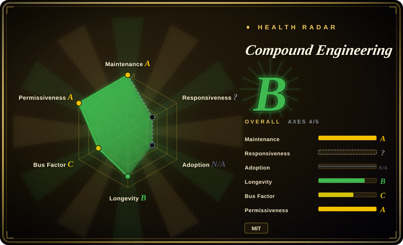
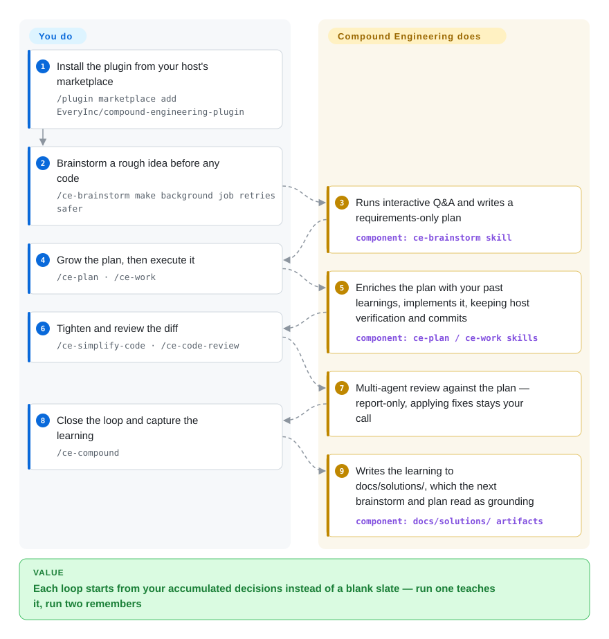

# Compound Engineering

Your agent sessions start from zero every time — the context you fought for dies with the session. This 36-skill plugin wires a six-step loop (brainstorm → plan → work → simplify → review → compound) into 14 coding-agent hosts, and its last step writes each loop's learnings into your repo so the next loop reads them first.

## When to use

You're a developer who lives inside a coding agent (Claude Code, Codex, Cursor, OpenCode…) and you've noticed your sessions are one-shot: you brainstorm a feature in chat, the agent codes it, you eyeball the diff, and the hard-won context — why you rejected approach A, the gotcha that cost you an hour — evaporates the moment the session ends. The next feature starts from zero. You want a *named, repeatable* workflow that front-loads planning and review (the project's bet: "80% is in planning and review, 20% is in execution") and, crucially, captures each loop's learnings somewhere the next loop will read them.

Compound Engineering installs as a plugin via your agent's marketplace (`/plugin marketplace add EveryInc/compound-engineering-plugin` for Claude Code) and gives you slash commands for each phase: `/ce-brainstorm`, `/ce-plan`, `/ce-work`, `/ce-simplify-code`, `/ce-code-review`, and `/ce-compound` — plus `/lfg` to run the whole pipeline autonomously. The `/ce-compound` step writes the loop's insights into `docs/solutions/` so the next `/ce-brainstorm` and `/ce-plan` start from your accumulated decisions instead of a blank slate. Reach for it when you want a turnkey, multi-host methodology you can drop in today, rather than hand-rolling your own slash-command discipline.

## How it works

The shipped payload is Markdown skill files — structured prompts that each host discovers as slash commands — plus per-host plugin manifests, so one repo installs across 14 hosts (Claude Code, Cursor, Codex app/CLI, and more; in Codex you invoke the same skills with `$ce-plan` instead of `/ce-plan`). You drive the loop: `/ce-brainstorm` interrogates you about a rough idea and writes a requirements-only plan; `/ce-plan` grows it into an implementation-ready plan; `/ce-work` executes it while keeping your host's own verification and commits in view; `/ce-simplify-code` and `/ce-code-review` tighten and check the diff. The payoff step is `/ce-compound`: it distills what this loop learned — rejected approaches, gotchas, conventions — into Markdown under `docs/solutions/` (the default artifact root, relocatable via the `docs_root` setting), which later `/ce-brainstorm` and `/ce-plan` runs read as grounding. What stays yours: committing those artifact files, running your real CI as the merge gate, and deciding when to hand work to `/lfg` — the autonomous pipeline that plans, works, reviews, tests, commits and opens a PR with a bounded CI-repair loop, but will not merge unless you grant that.

<!-- flow-steps:begin (generated from flows/compound-engineering.json by tools/flow_card.py — do not edit) -->

Text version of the flow

1. **You**: Install the plugin from your host's marketplace — `/plugin marketplace add EveryInc/compound-engineering-plugin`
2. **You**: Brainstorm a rough idea before any code — `/ce-brainstorm make background job retries safer`
3. **Compound Engineering**: Runs interactive Q&A and writes a requirements-only plan — component: `ce-brainstorm skill`
4. **You**: Grow the plan, then execute it — `/ce-plan · /ce-work`
5. **Compound Engineering**: Enriches the plan with your past learnings, implements it, keeping host verification and commits — component: `ce-plan / ce-work skills`
6. **You**: Tighten and review the diff — `/ce-simplify-code · /ce-code-review`
7. **Compound Engineering**: Multi-agent review against the plan — report-only, applying fixes stays your call
8. **You**: Close the loop and capture the learning — `/ce-compound`
9. **Compound Engineering**: Writes the learning to docs/solutions/, which the next brainstorm and plan read as grounding — component: `docs/solutions/ artifacts`

**Value**: Each loop starts from your accumulated decisions instead of a blank slate — run one teaches it, run two remembers

<!-- flow-steps:end -->

## When NOT to use

- **You already run a mature, custom workflow.** If you've built your own skills/commands and memory conventions (your own plan→TDD→review→retrospect chain), bolting on 36 opinionated `/ce-*` skills mostly adds surface area and a competing convention — the README states it's "opinionated by design" and won't bend to every workflow.
- **You don't want a `docs/solutions/` knowledge folder in your repo.** The "compound" payoff depends on committing learnings as files; `docs_root` can relocate CE's artifact folders under one repo-relative root, but it cannot remove the dependency on committing agent-generated docs — without that, the loop loses its compounding edge and you're left with ordinary plan/review prompts.
- **You need deterministic, audited gates (CI must-pass, schema review, security).** This is a set of prompt assets that *guide* an LLM through phases; the review/simplify steps are model judgment, not a linter, type-check, or test gate. Wire your real CI/guards separately — don't treat `/ce-code-review` as a merge gate.
- **You only need one capability, not a methodology.** If you just want a good plan command or a code-review prompt, adopting a full 6-phase, multi-host plugin is heavier than copying one skill.
- **Vendor / philosophy lock-in tolerance is low.** The phases, naming, and the "80/20 planning" thesis are Every's editorial line; you inherit their cadence and their right to decline contributions that don't fit the vision.

## Comparison

| Alternative | In index | Our verdict | Tradeoff |
|---|---|---|---|
| [Superpowers](superpowers.md) | ✅ | Choose Superpowers when you need a large general-purpose Claude Code skill library with broad capability surface. | Large general-purpose skill library for Claude Code (broad capability surface); Compound Engineering is a tighter, opinionated 6-step *loop* with an explicit knowledge-capture step. |
| [SuperClaude Framework](superclaude.md) | ✅ | Choose SuperClaude Framework when you need a Claude-centric persona/command framework with richer config and slash commands. | Persona/command framework with rich config and slash commands, primarily Claude-centric; CE is leaner, loop-shaped, and explicitly multi-host (Codex/Cursor/Kimi/Droid/…). |
| [get-shit-done](../spec-driven-development/get-shit-done.md) | ✅ | Choose get-shit-done when you want another opinionated agent workflow/skill-pack with a shipping-oriented phase loop. | Another opinionated agent workflow/skill-pack; overlapping plan-execute spirit — compare command granularity and whether it persists learnings like CE's `/ce-compound`. |
| [ECC](ecc.md) | ✅ | When you want one install to hand your agent a whole harness — hundreds of skills, Node hooks that persist session memory, a security scanner — pick ECC; pick Compound Engineering when you want the smaller six-step loop whose only persistence is committed `docs/solutions/` notes. | ECC trades simplicity for a runtime substrate (hooks, instincts, AgentShield) and now a paid Pro tier (hosted GitHub App, private repos from $19/seat/mo) alongside its MIT core; CE stays prompt-assets-only with no hosted tier. |
| [12-Factor Agents](../spec-driven-development/12-factor-agents.md) | ✅ | Choose 12-Factor Agents when you need design *principles* for building agents, not an installable per-session loop. | A set of design *principles* for building agents (a document/manifesto), not an installable per-session loop; CE is the runnable plugin you invoke during work. |
| [Spec Kit](../spec-driven-development/spec-kit.md) | ✅ | Choose Spec Kit when you need a spec-driven dev toolkit (spec→plan→tasks) with its own CLI. | Spec-driven dev toolkit (spec→plan→tasks) with its own CLI; comparable planning-first ethos, less about per-loop learning capture across many host agents. |

## Health & viability

- **Responsiveness**: Cannot be scored — type_na.
- **Maintenance (2026-09):** very actively maintained — last pushed 2026-09-25, latest release `v3.29.0` (2026-09-25). The line moved from v3.14.3 to v3.29.0 in about three months on semantic-release cadence — a live project, not a coasting one.
- **Governance & backing:** Organization-owned (EveryInc / "Every"), a media-and-software company's editorial product rather than a foundation or lone hobbyist; the README names two maintainers (Kieran Klaassen, Trevin Chow) plus community contributions. The roadmap is Every's opinionated line ("opinionated by design," declines off-vision contributions) — vendor-shaped governance with a real org and named owners behind it, but you inherit their cadence.
- **Age & Lindy (2026-09):** created 2025-10, ~11.5 months old. Still under a year; already on a v3 major implies fast iteration but also that the install model/command set keeps churning (the repo moved to a "root-native, skills-only" layout mid-2026 and re-pointed install docs). Lindy verdict: **unproven by age** — adopt for current value, expect API/command drift; don't assume long-term stability yet.
- **Risk flags:** MIT-licensed, no open-core gating or relicense history observed. The compounding payoff is coupled to committing `docs/solutions/` (or a `docs_root`-relocated equivalent) — a soft lock-in to its convention, reversible but real. Compound Packs (org-wide rule folders) is explicitly labeled experimental. [未验证] No CVEs or deprecation notices found in the material reviewed.

## Caveats (unverified)

- [未验证] gh metadata (2026-09-27): license MIT, primary language TypeScript, latest release `compound-engineering-v3.29.0` published 2026-09-25, not archived. Star count ~25.3k — GitHub stars are unreliable and date-sensitive; treat as indicative only.
- [推断] Classified as a **skill-pack**: per the README, "the Bun CLI remains for repository development and converter maintenance, not normal installation," and the shipped payload is the Markdown skills under `skills/` (TypeScript is dev-only converter tooling). The Tech stack / Dependencies / Ops sections are intentionally omitted. Re-verify if a runtime binary ever becomes part of the install path.
- [未验证] "36 skills" and "14 agent hosts" are the README's own badge/headline counts (2026-09-27); the named commands (`/ce-brainstorm`, `/ce-plan`, `/ce-work`, `/ce-simplify-code`, `/ce-code-review`, `/ce-compound`, `/lfg`) appear verbatim in the README's Try-it walkthrough, but the full skill roster shifts release-to-release — check `docs/guides/README.md` before relying on a specific skill.
- [未验证] The supported-host list (Claude Code, Cursor + Grok Bot, Codex App/CLI, Kimi Code CLI, Cline, Grok Build CLI, Devin CLI, GitHub Copilot, Factory Droid, Qwen Code, OpenCode, Pi, oh-my-pi, Antigravity CLI) and install syntax come from the README; per-host fidelity of the converted manifests is not independently verified.
- [推断] `/ce-compound` writing learnings to `docs/solutions/` is described in the README as the persistence mechanism (default, relocatable via `docs_root`); the actual on-disk path and format may differ per skill version.
- [未验证] Comparison rows for in-index substitutes reflect each page's/README's framing as of 2026-09-27, not a hands-on benchmark.
