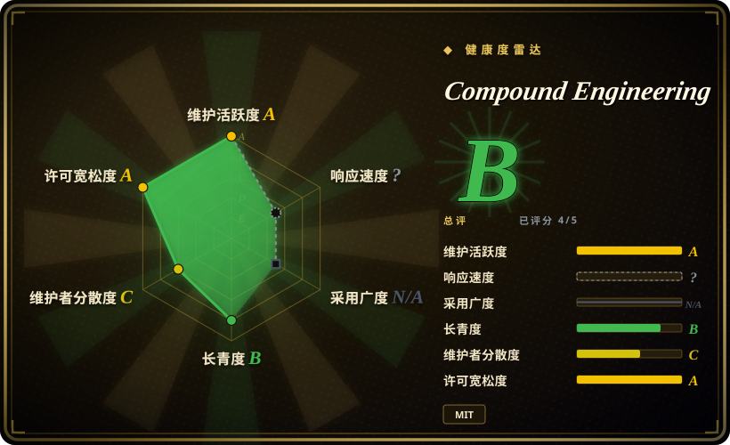
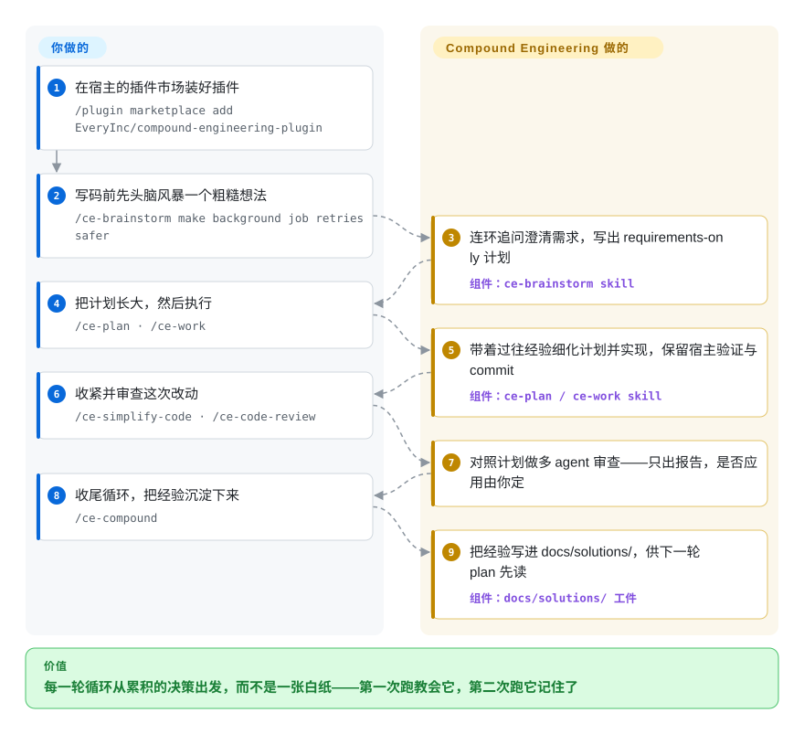

# Compound Engineering

你的 agent 会话每次都从零开始——好不容易挣来的上下文随会话一起死掉。这个 36 个 skill 的插件把一套六步循环（brainstorm → plan → work → simplify → review → compound）接进 14 个 coding agent 宿主，而最后一步把每轮经验写进你的仓库，让下一轮先读到它。

## 何时使用

你是一个整天泡在 coding agent 里（Claude Code、Codex、Cursor、OpenCode……）的开发者，你发现自己的会话都是一次性的：在对话里头脑风暴一个功能，agent 把它写出来，你扫一眼 diff，然后那些来之不易的上下文——你为什么否掉了方案 A、那个让你折腾一小时的坑——会在会话结束的一瞬间蒸发。下一个功能又从零开始。你想要一套*有名字、可重复*的工作流，把规划和审查前置（项目的赌注：“80% 在规划和审查，20% 在执行”），更关键的是，把每一轮循环的经验沉淀到下一轮会去读的地方。

Compound Engineering 通过你 agent 的插件市场安装（Claude Code 用 `/plugin marketplace add EveryInc/compound-engineering-plugin`），为每个阶段给你一个 slash 命令：`/ce-brainstorm`、`/ce-plan`、`/ce-work`、`/ce-simplify-code`、`/ce-code-review`、`/ce-compound`——外加 `/lfg` 自动跑完整条流水线。`/ce-compound` 这一步把本轮循环的洞见写进 `docs/solutions/`，这样下一次 `/ce-brainstorm` 和 `/ce-plan` 就是从你累积的决策出发，而不是一张白纸。当你想要一套今天就能即插即用、跨多宿主的方法论，而不是自己手搓一套 slash 命令纪律时，就用它。

## 怎么用起来

真正交付的载荷是 Markdown 的 skill 文件——各宿主把它发现为斜杠命令的结构化提示词——外加各宿主的插件清单，所以一个仓库能装进 14 个宿主（Claude Code、Cursor、Codex 应用/CLI 等；在 Codex 里用 `$ce-plan` 而非 `/ce-plan` 调用同一批 skill）。循环由你驱动：`/ce-brainstorm` 就一个粗糙想法连环追问，写出一份只含需求（requirements-only）的计划；`/ce-plan` 把它长成可实施的计划；`/ce-work` 按计划执行，同时保留宿主自己的验证与 commit；`/ce-simplify-code` 与 `/ce-code-review` 收紧并检查这次改动。收益落在最后一步 `/ce-compound`：它把这轮循环学到的东西——被否掉的方案、踩过的坑、约定——蒸馏成 Markdown 写进 `docs/solutions/`（默认工件根，可用 `docs_root` 设置挪位置），之后的 `/ce-brainstorm` 和 `/ce-plan` 会先把它们当作依据来读。仍然归你管的：把这些工件文件 commit 进去、用你真正的 CI 当合并闸门，以及决定什么时候把工作交给 `/lfg`——那条自动流水线会规划、实现、审查、测试、commit 并开 PR，带一个有预算上限的 CI 修复循环，但除非你授权，它不会合并。

<!-- flow-steps:begin (generated from flows/compound-engineering.json by tools/flow_card.py — do not edit) -->

流程文字版

1. **你**：在宿主的插件市场装好插件 — `/plugin marketplace add EveryInc/compound-engineering-plugin`
2. **你**：写码前先头脑风暴一个粗糙想法 — `/ce-brainstorm make background job retries safer`
3. **Compound Engineering**：连环追问澄清需求，写出 requirements-only 计划 — 组件：`ce-brainstorm skill`
4. **你**：把计划长大，然后执行 — `/ce-plan · /ce-work`
5. **Compound Engineering**：带着过往经验细化计划并实现，保留宿主验证与 commit — 组件：`ce-plan / ce-work skill`
6. **你**：收紧并审查这次改动 — `/ce-simplify-code · /ce-code-review`
7. **Compound Engineering**：对照计划做多 agent 审查——只出报告，是否应用由你定
8. **你**：收尾循环，把经验沉淀下来 — `/ce-compound`
9. **Compound Engineering**：把经验写进 docs/solutions/，供下一轮 plan 先读 — 组件：`docs/solutions/ 工件`

**价值**：每一轮循环从累积的决策出发，而不是一张白纸——第一次跑教会它，第二次跑它记住了

<!-- flow-steps:end -->

## 何时不用

- **你已经有一套成熟的自定义工作流。** 如果你已经搭好了自己的 skills/命令和 memory 约定（你自己的 plan→TDD→review→复盘链），再塞进 36 个有强主张的 `/ce-*` skill，基本只是增加面和一套竞争性约定——README 明说它“opinionated by design”，不会迁就每种工作流。
- **你不想在仓库里多一个 `docs/solutions/` 知识目录。** “compound”的收益依赖把经验作为文件 commit 进去；`docs_root` 能把 CE 的工件目录统一挪到一个仓库内根下，但挪不掉“必须 commit agent 生成文档”这个依赖——做不到这一点，这套循环就失去了复利优势，只剩下普通的 plan/review 提示词。
- **你需要确定性的、可审计的闸门（CI 必过、schema 审查、安全）。** 这是一组*引导* LLM 走完各阶段的提示词资产；review/simplify 步骤是模型判断，不是 linter、类型检查或测试闸门。把你真正的 CI/护栏单独接好——别把 `/ce-code-review` 当合并闸门。
- **你只需要单个能力，而非一整套方法论。** 如果你只是想要一个好用的 plan 命令或一个 code-review 提示词，引入一个完整的六阶段、多宿主插件，比抄一个 skill 重得多。
- **对厂商/理念锁定的容忍度低。** 这些阶段、命名和“80/20 规划”论点是 Every 的编辑主张；你继承的是他们的节奏，以及他们有权拒绝不符合其愿景的贡献。

## 横向对比

| 替代品 | 是否收录 | 我们的评价 | 取舍 |
|---|---|---|---|
| [Superpowers](superpowers.zh.md) | ✅ | 需要面向 Claude Code、能力面广的大型通用 skill 库时，选 Superpowers。 | 面向 Claude Code 的大型通用 skill 库（能力面广）；Compound Engineering 是更紧凑、有明确主张的六步*循环*，且带一个显式的知识沉淀步骤。 |
| [SuperClaude Framework](superclaude.zh.md) | ✅ | 需要主要面向 Claude、配置和 slash 命令更丰富的 persona/命令框架时，选 SuperClaude Framework。 | persona/命令框架，配置和 slash 命令丰富，主要面向 Claude；CE 更精简、呈循环形态，且明确多宿主（Codex/Cursor/Kimi/Droid/……）。 |
| [get-shit-done](../spec-driven-development/get-shit-done.zh.md) | ✅ | 需要另一套偏交付阶段循环的有主张 agent 工作流/skill-pack 时，选 get-shit-done。 | 另一个有主张的 agent 工作流/skill-pack；plan-execute 精神有重叠——对比命令粒度，以及它是否像 CE 的 `/ce-compound` 一样持久化经验。 |
| [ECC](ecc.zh.md) | ✅ | 想一次安装就把整套 harness 交给 agent——数百 skill、自动存取会话记忆的 Node hook、安全扫描器——选 ECC；只想要更小的六步循环、持久化仅限 commit 进仓库的 `docs/solutions/` 笔记，选 Compound Engineering。 | ECC 用简单性换一套运行时底座（hook、instinct、AgentShield），且如今在 MIT 核心之外新增了付费 Pro 层（托管 GitHub App，私有仓库 $19/席/月起）；CE 保持纯提示词资产、没有托管付费层。 |
| [12-Factor Agents](../spec-driven-development/12-factor-agents.zh.md) | ✅ | 需要构建 agent 的设计*原则*，而不是可安装的逐会话循环时，选 12-Factor Agents。 | 一套构建 agent 的设计*原则*（文档/宣言），不是可安装的逐会话循环；CE 是你在干活时调用的、可运行的插件。 |
| [Spec Kit](../spec-driven-development/spec-kit.zh.md) | ✅ | 需要 spec 驱动开发工具包（spec→plan→tasks）和自带 CLI 时，选 Spec Kit。 | spec 驱动开发工具包（spec→plan→tasks），自带 CLI；规划优先的气质相近，但较少涉及 CE 那种跨众多宿主的逐循环经验沉淀。 |

## 健康度与可持续性

- **响应速度**：无法计算——type_na。
- **维护（2026-09）：** 非常活跃——最后 push 在 2026-09-25，最新 release `v3.29.0`（2026-09-25）。约三个月内版本从 v3.14.3 走到 v3.29.0，semantic-release 节奏说明这是个活项目，而非 coasting。
- **治理与背书：** Organization 持有（EveryInc / 「Every」），即一家媒体+软件公司的编辑型产品，而非基金会或单干爱好者；README 点名两位维护者（Kieran Klaassen、Trevin Chow）加社区贡献。路线图是 Every 的强主张（「opinionated by design」，会拒绝不合愿景的贡献）——背后有真实组织和具名 owner 的厂商型治理，但你得继承他们的节奏。
- **年龄与 Lindy（2026-09）：** 创建于 2025-10，约 11.5 个月，仍不到一岁；已经到 v3 大版本，说明迭代飞快，也意味着安装模型/命令集仍在抖动（2026 年年中仓库迁到「root-native、纯 skills」布局，安装文档随之改向）。Lindy 裁决：**按年龄看属未经验证**——为当下价值采用，预期 API/命令漂移，别假定长期稳定。
- **风险标记：** MIT 许可，未见 open-core 闸门或 relicense 历史。复利收益与把 `docs/solutions/`（或 `docs_root` 迁移后的等价目录）commit 进仓库绑定——是对其约定的软锁定，可逆但真实。Compound Packs（组织级规则目录）被明确标注为实验性。[未验证] 所审材料中未发现 CVE 或弃用通知。

## 存疑（未验证）

- [未验证] gh 元数据（2026-09-27）：license MIT，主语言 TypeScript，最新 release `compound-engineering-v3.29.0` 发布于 2026-09-25，未归档。star 约 25.3k——GitHub star 不可靠且对时间敏感，仅供参考。
- [推断] 归类为 **skill-pack**：README 明说「the Bun CLI remains for repository development and converter maintenance, not normal installation」，交付载荷是 `skills/` 下的 Markdown skill（TypeScript 是纯开发期转换器工具）。技术栈/依赖/运维三节有意省略。若运行时二进制哪天进入安装链路，请重新核实。
- [未验证] 「36 个 skill」「14 个 agent 宿主」是 README 自己的徽章/标题数字（2026-09-27）；命名命令（`/ce-brainstorm`、`/ce-plan`、`/ce-work`、`/ce-simplify-code`、`/ce-code-review`、`/ce-compound`、`/lfg`）在 README 的 Try-it 走查里逐字出现，但完整 skill 名册随版本变动——依赖某个具体 skill 前请核对 `docs/guides/README.md`。
- [未验证] 支持宿主列表（Claude Code、Cursor + Grok Bot、Codex App/CLI、Kimi Code CLI、Cline、Grok Build CLI、Devin CLI、GitHub Copilot、Factory Droid、Qwen Code、OpenCode、Pi、oh-my-pi、Antigravity CLI）和安装语法来自 README；各宿主转换清单的保真度未经独立验证。
- [推断] `/ce-compound` 把经验写入 `docs/solutions/` 是 README 描述的持久化机制（默认根，可用 `docs_root` 迁移）；实际落盘路径和格式可能随 skill 版本不同而不同。
- [未验证] 对比表中已收录替代品的行，反映的是 2026-09-27 各页面/README 的框定，而非实测对比。
