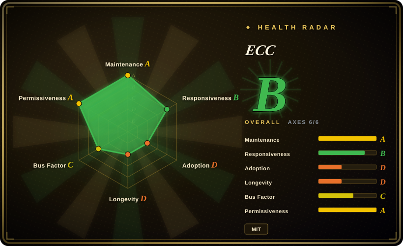
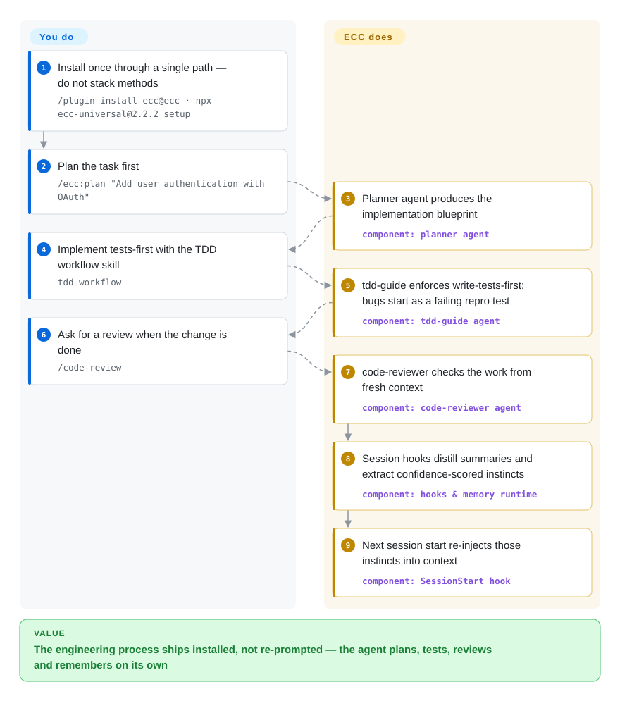

# ECC

Your agent can write code, but it plans nothing you didn't ask for, reviews itself only when told, and forgets the lesson by next session. ECC installs a coordinated engineering loop — plan → test → implement → review → verify → remember → improve — into Claude Code (with adapters for Codex/OpenCode/Cursor and more) from one repo: 68 agents, 292 skills, rules, Node hooks, instinct-based memory, and an AgentShield config scanner.

## When to use

You're running Claude Code (or several harnesses — Codex, OpenCode, Cursor) day to day, and you've outgrown a hand-rolled `~/.claude` directory. You keep re-writing the same TDD / code-review / security-review workflows per project, your context gets blown out at session start, and nothing carries learnings forward. ECC resolves this by shipping an opinionated, batteries-included substrate: the recommended path is now the guided universal installer (`npx ecc-universal@<version> setup`, Node.js ≥ 18), or the native plugin command `/plugin install ecc@ecc` on Claude Code 2.1+. Either way you get a large library of skills, specialized subagents (planner, architect, code-reviewer, language-specific reviewers), always-on rules, and Node-backed hooks that auto-save/load session context and extract "instincts" with confidence scoring. It's the right reach when you want a maintained, versioned harness stack instead of curating one yourself.

You're also a fit if you work across more than one agent runtime and want *one* source of truth: ECC works best on Claude Code today, has a supported Codex sync path, and ships capability-limited adapters for Cursor, OpenCode, Gemini, Zed, GitHub Copilot, Antigravity, Qwen, and Kimi Code, plus an `/security-scan` (AgentShield) pass that audits your agent config for injection risks, leaked secrets, and misconfigurations before you trust it.

## How it works

ECC drops four kinds of things into your harness. Markdown **skills/agents/rules** are the payload the agent discovers and loads; **Node hooks** fire on session events — session-start injects context and your most confident learned "instincts", stop-time distills the session into summaries instead of leaving you a giant transcript; a **local memory area** (under `ECC_AGENT_DATA_HOME`, default `~/.claude`, with continuous-learning v2 data in a separate `~/.local/share/ecc-homunculus` directory) stores what gets remembered; and **AgentShield** scans the harness itself — prompts, hooks, MCP configs, permissions, secrets — as an attack surface. Per task you still drive the workflow: `/ecc:plan "…"` gets a blueprint from the planner agent, the `tdd-workflow` skill enforces tests-first implementation, `/code-review` reviews from fresh context, and repeated wins can be clustered into new skills with `/evolve`. What stays yours: the merge gate — review steps are model judgment, not a linter — plus reconciling hooks that mutate local state, and the release rhythm of a self-described "single maintainer [shipping] weekly across 7 harnesses".

<!-- flow-steps:begin (generated from flows/ecc.json by tools/flow_card.py — do not edit) -->

Text version of the flow

1. **You**: Install once through a single path — do not stack methods — `/plugin install ecc@ecc · npx ecc-universal@2.2.2 setup`
2. **You**: Plan the task first — `/ecc:plan "Add user authentication with OAuth"`
3. **ECC**: Planner agent produces the implementation blueprint — component: `planner agent`
4. **You**: Implement tests-first with the TDD workflow skill — `tdd-workflow`
5. **ECC**: tdd-guide enforces write-tests-first; bugs start as a failing repro test — component: `tdd-guide agent`
6. **You**: Ask for a review when the change is done — `/code-review`
7. **ECC**: code-reviewer checks the work from fresh context — component: `code-reviewer agent`
8. **ECC**: Session hooks distill summaries and extract confidence-scored instincts — component: `hooks & memory runtime`
9. **ECC**: Next session start re-injects those instincts into context — component: `SessionStart hook`

**Value**: The engineering process ships installed, not re-prompted — the agent plans, tests, reviews and remembers on its own

<!-- flow-steps:end -->

## When NOT to use

- **You want a small, auditable, self-owned config.** ECC installs hundreds of skills/agents/rules and a hook runtime into `~/.claude`; if you prefer a handful of files you fully understand and version yourself, this is a large surface to inherit and reason about.
- **You're not on Claude Code / a supported harness.** The primary target is Claude Code (2.1+); the other harnesses are sync paths or capability-limited adapters of varying completeness, with an explicit feature-parity matrix. If your runtime isn't on the list, most value evaporates.
- **You distrust auto-loaded hooks / memory.** Hooks run Node on session events and persist data locally; the v2.0.0 notes themselves flag that "plugin hooks were silently no-ops on Node 21+" was a shipped bug — a reminder this is moving, behavior-bearing automation, not inert prompts.
- **You only need one workflow.** If you just want, say, a TDD loop or a security gate, lifting one pattern (or a single-purpose tool) beats adopting a whole operating-system layer and its update cadence.
- **Single-author velocity / lock-in risk.** The README markets exactly this: "a single maintainer ships weekly across 7 harnesses" — fast, but your whole agent harness rides one person's release rhythm and conventions. The funding model is GitHub Sponsors plus **ECC Pro**, a hosted GitHub App for private repos (from $19/seat/mo, per the README as of 2026-09); the MIT core "stays free forever", but team/hosted features live in the paid layer.
- **You need provider-neutral methodology, not Claude-centric config.** ECC is heavily Claude-Code-shaped; for vendor-agnostic *principles* rather than installed config, a doc-only methodology fits better.

## Comparison

| Alternative | In index | Our verdict | Tradeoff |
|---|---|---|---|
| [SuperClaude Framework](superclaude.md) | ✅ | Choose SuperClaude Framework when you want a lighter Claude-focused config framework for personas, commands, and MCP. | Also a Claude-focused config framework (personas, commands, MCP); narrower and lighter than ECC's hundreds-of-skills + hooks + security-scan + cross-harness substrate. |
| [Superpowers](superpowers.md) | ✅ | Choose Superpowers when you need a curated Claude Code skills/plugin collection without ECC's hook and memory substrate. | A curated skills/plugin collection for Claude Code; overlapping skill-library idea but without ECC's memory/instinct hooks, security scanner, and multi-harness adapters. |
| [Compound Engineering](compound-engineering.md) | ✅ | Choose Compound Engineering when you need a smaller plugin encoding a specific compounding-workflow methodology. | A plugin encoding a specific compounding-workflow methodology; far more opinionated-and-small vs ECC's broad OS-style bundle. |
| [get-shit-done](../spec-driven-development/get-shit-done.md) | ✅ | Choose get-shit-done when you need a lightweight task-execution workflow pack. | Lightweight task-execution workflow pack; single-philosophy vs ECC's everything-included surface. |
| [12-Factor Agents](../spec-driven-development/12-factor-agents.md) | ✅ | Choose 12-Factor Agents when you need provider-neutral *principles* for building agents, not installed config. | Provider-neutral *principles* for building agents (docs, not installed config); different layer than ECC's concrete Claude-Code harness. |
| dotfiles / hand-rolled `~/.claude` | 未收录 | Choose hand-rolled dotfiles when you need full control and a minimal surface you maintain yourself. | Full control and minimal surface; you maintain every skill/hook/rule yourself instead of inheriting and updating a curated stack. |

## Tech stack

- **Language:** JavaScript / Node.js (per repo primary language) for hooks, the `scripts/ecc.js` installer CLI, and setup scripts; large amounts of Markdown (skills/agents/rules with YAML frontmatter) as the actual payload; README badges additionally show Shell, TypeScript, Python, Go, Java, Perl.
- **Tooling:** the recommended path is the guided universal installer (`npx ecc-universal@<version> setup`); also `install.sh` / `install.ps1` for manual installs. npm packages `ecc-universal` (main, verified published, latest 2.2.1 as of 2026-09-27) and `ecc-agentshield` (security auditor, latest 1.6.0). Node's built-in test runner for the internal test suite.
- **Optional GUI:** a Python (Tkinter) dashboard (`ecc_dashboard.py`).
- **Integration surface:** Claude Code plugin format (`/plugin install ecc@ecc`), `hooks.json` + Node hook scripts, optional `ecc-memory-vault` MCP server (`ecc-memory-mcp`, exposing `memory_save/search/read/doctor`), and per-harness adapters (Codex plugin marketplace, OpenCode, Cursor `.cursor/agents/ecc-*.md`, GitHub Copilot instruction files, Zed, Qwen, Kimi Code…).

## Dependencies

- **Runtime:** Node.js ≥ 18 (required by the universal package) and Git; Claude Code 2.1+ for the plugin path (README states "Minimum version: v2.1.0 or later", citing plugin-hook handling changes [未验证]). v2.0.0 notes call out a Node 21+ hook regression that was fixed — version sensitivity is real.
- **Optional:** Python 3 for the dashboard GUI; PM2 for multi-agent orchestration (`/pm2` command); MCP servers (GitHub, Supabase, Vercel, Context7, Exa, Playwright, etc.) — plugin installs intentionally do not auto-enable ECC's MCP definitions; manual opt-in per harness.
- **Storage:** local only — session data, learned skills, and metrics persist under `$ECC_AGENT_DATA_HOME` (default `~/.claude`: `session-data/`, `skills/learned/`, `metrics/`); continuous-learning v2 instincts live separately under `CLV2_HOMUNCULUS_DIR` (default `~/.local/share/ecc-homunculus`). No external backend for the OSS core; ECC Pro is a hosted GitHub App add-on.
- **Install:** `npx ecc-universal@<version> setup` (guided, recommended), `/plugin install ecc@ecc` (Claude native), or `./install.sh --profile … --target …` (manual). The README's examples pin `ecc-universal@2.2.2` while npm's latest is 2.2.1 as of 2026-09-27 — pin an explicit version you've reviewed; and don't stack install methods into one harness.

## Ops difficulty

**Low to medium.** The guided/plugin install paths are one command and the system is purely client-side (no server to run for the OSS core), so getting started is easy. Difficulty rises because what you've installed is large and *active*: hundreds of skills/agents/rules plus Node hooks that fire on session events and mutate local memory. You inherit its update cadence, env-var tuning (`ECC_HOOK_PROFILE`, `ECC_SESSION_START_MAX_CHARS`, `ECC_AGENT_DATA_HOME`, `CLV2_HOMUNCULUS_DIR`), Node-version sensitivity (the v2.0.0 Node 21+ hook fix), and cross-harness adapter quirks. Recovery tooling exists (`ecc-universal doctor / repair / list-installed / uninstall`, and per-harness install-state), but debugging an unexpected behavior still means tracing through hook scripts and a big config tree rather than a few files you wrote.

## Health & viability

- **Responsiveness**: Grade B — median first-response 57.8 hours across 44 qualifying issues (measured 2026-09-27), a mild decay from the 2026-06 A as volume grew.
- **Maintenance (2026-09):** actively (fast) maintained — last pushed 2026-09-24, latest GitHub release v2.2.1 (2026-09-08), not archived; weekly-ish cadence (v2.1.0 → v2.2.x across the summer). The high open-issue count (~240) plus a self-disclosed "hooks were silent no-ops on Node 21+" regression in the v2.0.0 notes signals real velocity but also that behavior-bearing automation is still stabilizing.
- **Governance & bus factor:** the repo is **User-owned** (affaan-m) — the README itself markets "a single maintainer ships weekly across 7 harnesses". ~268k stars against a one-person core is a **bus-factor red flag**, not a safety signal, though a Discord community, GitHub Sponsors, and named commercial sponsors/partners (CodeRabbit, Greptile, Moonshot/Kimi…) now sit around it. [未验证] No foundation, company, or co-maintainer governance published.
- **Age & Lindy (2026-09):** created 2026-01, ~8 months old. Extremely young for something positioning itself as the harness stack you install into `~/.claude`. Lindy verdict: **fails the longevity prior** — no track record, breaking change cadence likely; treat as early-adopter tooling, pin versions, expect churn.
- **Risk flags:** MIT-licensed core (README: "MIT-licensed forever", no relicense seen), but a **paid layer now exists** — ECC Pro, a hosted GitHub App for private-repo analysis and PR-triggered audits (from $19/seat/mo per README, 2026-09); watch what future features get gated. Real risks remain **Node-version sensitivity** (the shipped Node 21+ hook bug), **auto-loaded hooks that mutate local state**, install-method stacking hazards, and abandonment exposure from the single-maintainer structure. The bundled `/security-scan` (AgentShield) audits *your* config, but does not de-risk ECC's own surface. The README's install examples pin a `2.2.2` package version that is not npm's latest (2.2.1, as of 2026-09-27) — pin what you've verified.

## Caveats (unverified)

- [未验证] GitHub's latest release is v2.2.1 (2026-09-08) and npm `ecc-universal` latest is 2.2.1, yet the README's install examples pin `ecc-universal@2.2.2` as "the published ECC 2.2.2 release" — a registry/README mismatch as of 2026-09-27; re-verify before copying an install command.
- [未验证] Skill/agent/command counts (README 2026-09: 292 skills / 68 agents / 94 legacy command shims) shift release-to-release; verify against the current repo.
- [未验证] GitHub stars (~268k as of 2026-09-27) — star counts in this ecosystem are unreliable and date-sensitive; indicative only.
- [未验证] npm package existence and latest versions (`ecc-universal` 2.2.1, `ecc-agentshield` 1.6.0) were confirmed against the registry on 2026-09-27; the Tkinter dashboard, PM2 orchestration, and AgentShield scan categories come from the README and were not run.
- [未验证] Claude Code CLI v2.1.0+ minimum, the Node ≥ 18 requirement, and the exact capability matrix of the non-Claude adapters are from project docs, not independently tested.
- [未验证] ECC Pro pricing ("private repos from $19/seat/mo") is the README's own marketing as of 2026-09-27; no pricing page audit performed.
- [推断] Typed as `framework` (not `skill-pack`) because, beyond its prompt/skill payload, it ships real runtime tooling (Node hooks, installers, version-gated behavior, env-var config, local state) — i.e. it has genuine tech-stack/deps/ops. A reader who only wants the markdown payload may reasonably regard the prompt collection alone as skill-pack-like.
