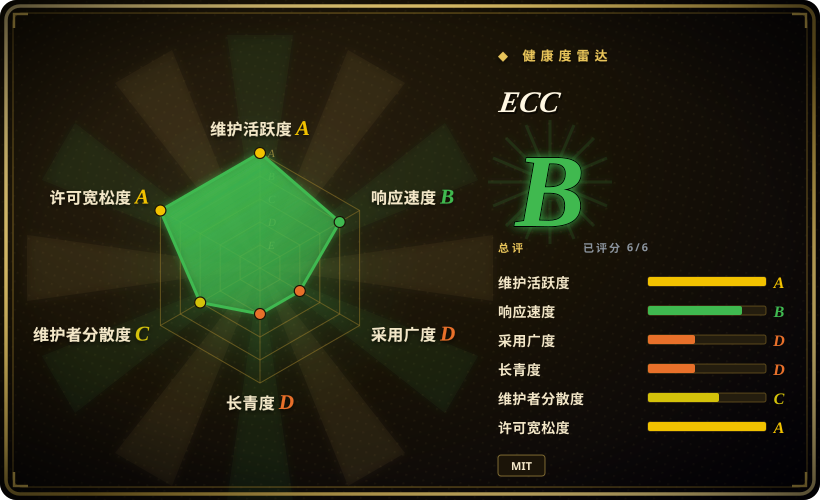
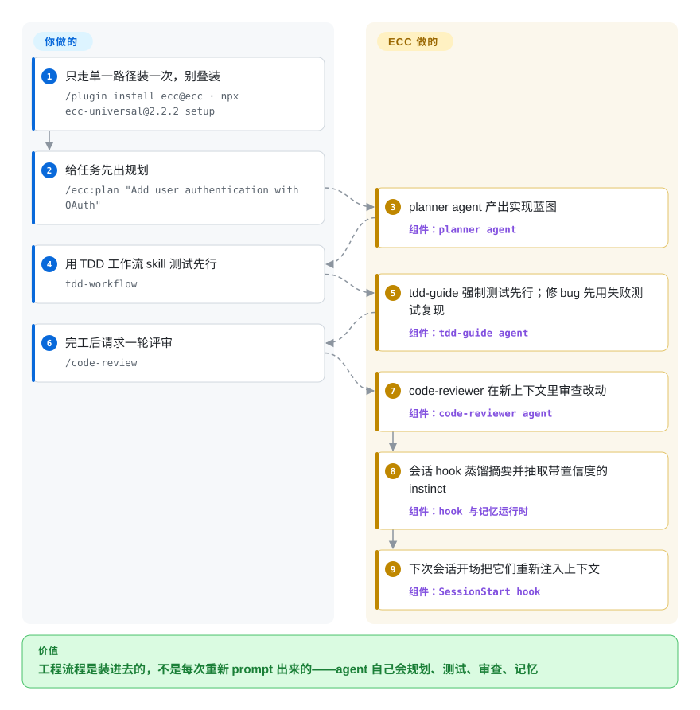

# ECC

你的 agent 会写代码，但你不要求它就不做规划、不自我 review，下个会话把学到的教训全忘掉。ECC 用一个仓库把一套有纪律的工程循环——plan → test → implement → review → verify → remember → improve——连同 68 个 agent、292 个 skill、rule、Node hook、instinct 记忆和 AgentShield 配置扫描器，装进 Claude Code（并提供 Codex/OpenCode/Cursor 等适配器）。

## 何时使用

你日常在跑 Claude Code（或同时用 Codex、OpenCode、Cursor 等多个 harness），手搓的 `~/.claude` 目录已经撑不住了。你在每个项目里反复重写同样的 TDD / code-review / security-review 流程，会话开场就把上下文撑爆，而且什么经验都没法往后带。ECC 用一套有主张、开箱即全的底座解决这个问题：当前推荐路径是 universal 安装器的引导式 setup（`npx ecc-universal@<version> setup`，需 Node.js ≥ 18），或在 Claude Code 2.1+ 上用原生插件命令 `/plugin install ecc@ecc`。无论哪条路，你都能拿到庞大的 skill 库、专门化的子 agent（planner、architect、code-reviewer、各语言专属 reviewer）、常驻 rule，以及 Node 实现的 hook——这些 hook 会自动存取会话上下文，并带置信度打分地抽取「instinct」。当你想要一套有人维护、有版本的 harness 栈、而不是自己一点点攒时，选它就对了。

如果你跨多个 agent runtime 工作、又想要*一个*事实源，它同样合适：ECC 今天在 Claude Code 上体验最完整，Codex 有受支持的 sync 路径，并为 Cursor、OpenCode、Gemini、Zed、GitHub Copilot、Antigravity、Qwen、Kimi Code 等提供能力受限的适配器（README 明说要先查 feature-parity 矩阵）；另带一个 `/security-scan`（AgentShield）流程，在你信任配置之前先审一遍注入风险、泄露的 secret 和错误配置。

## 怎么用起来

ECC 往你的 harness 里放四类东西。Markdown 的 **skill/agent/rule** 是 agent 发现并加载的载荷；**Node hook** 在会话事件上触发——会话开场注入上下文和你置信度最高的「instinct」，会话结束把整场蒸馏成摘要，而不是留给你一个巨大 transcript；**本地记忆区**保存会话摘要与带置信度的 instinct，continuous-learning v2 学到的经验另有一块独立数据；**AgentShield** 则把 harness 本身当作攻击面来检查——prompt、hook、MCP 配置、权限、secret 都在检查范围内。逐任务的工作流仍由你驱动：`/ecc:plan "…"` 让 planner agent 出蓝图，`tdd-workflow` skill 强制测试先行，`/code-review` 在新上下文里 review，反复出现的经验还能用 `/evolve` 聚合成新 skill。仍然归你管的：合并闸门——review 步骤是模型判断，不是 linter——外加调和会改写本地状态的 hook，以及一个 README 自称「单维护者每周跨 7 个 harness 发版」的节奏。

<!-- flow-steps:begin (generated from flows/ecc.json by tools/flow_card.py — do not edit) -->

流程文字版

1. **你**：只走单一路径装一次，别叠装 — `/plugin install ecc@ecc · npx ecc-universal@2.2.2 setup`
2. **你**：给任务先出规划 — `/ecc:plan "Add user authentication with OAuth"`
3. **ECC**：planner agent 产出实现蓝图 — 组件：`planner agent`
4. **你**：用 TDD 工作流 skill 测试先行 — `tdd-workflow`
5. **ECC**：tdd-guide 强制测试先行；修 bug 先用失败测试复现 — 组件：`tdd-guide agent`
6. **你**：完工后请求一轮评审 — `/code-review`
7. **ECC**：code-reviewer 在新上下文里审查改动 — 组件：`code-reviewer agent`
8. **ECC**：会话 hook 蒸馏摘要并抽取带置信度的 instinct — 组件：`hook 与记忆运行时`
9. **ECC**：下次会话开场把它们重新注入上下文 — 组件：`SessionStart hook`

**价值**：工程流程是装进去的，不是每次重新 prompt 出来的——agent 自己会规划、测试、审查、记忆

<!-- flow-steps:end -->

## 何时不用

- **你想要小而可审计、完全自己掌控的配置。** ECC 会把数百个 skill/agent/rule 和一套 hook 运行时装进 `~/.claude`；如果你更想要几个自己完全看得懂、自己版本管理的文件，这是一个很大的继承面和理解负担。
- **你不在 Claude Code / 受支持的 harness 上。** 主目标是 Claude Code（2.1+）；其余 harness 是 sync 路径或能力参差不齐的受限适配器，README 自己给了 feature-parity 矩阵。如果你的 runtime 不在列表里，大部分价值会蒸发。
- **你不放心自动加载的 hook / memory。** hook 会在会话事件上跑 Node 并把数据落到本地；v2.0.0 的发版说明自己就指出「plugin hook 在 Node 21+ 上静默成 no-op」是个已出过的 bug——提醒你这是会动、会改变行为的自动化，而非惰性 prompt。
- **你只需要一个工作流。** 如果你只想要比如一个 TDD 循环或一个安全闸门，把单个 pattern（或一个单一用途的工具）抠出来，比起采纳整层操作系统及其更新节奏要划算。
- **单作者推进速度 / 锁定风险。** README 卖的就是这一点：「a single maintainer ships weekly across 7 harnesses」——快，但你的整套 agent harness 押在一个人的发版节奏和约定上。资金模型是 GitHub Sponsors 加 **ECC Pro**——面向私有仓库的托管 GitHub App（README 称 $19/席/月起，2026-09）；MIT 核心「永久免费」，但团队/托管功能在付费层里。
- **你要的是 provider 中立的方法论，而非以 Claude 为中心的配置。** ECC 形态高度贴 Claude Code；若你想要厂商无关的*原则*而非装好的配置，纯文档型方法论更合适。

## 横向对比

| 替代品 | 是否收录 | 我们的评价 | 取舍 |
|---|---|---|---|
| [SuperClaude Framework](superclaude.zh.md) | ✅ | 需要更轻的 Claude 配置框架来管理 persona、command 和 MCP 时，选 SuperClaude Framework。 | 同为聚焦 Claude 的配置框架（persona、command、MCP）；比 ECC 数百 skill + hook + 安全扫描 + 跨 harness 底座更窄、更轻。 |
| [Superpowers](superpowers.zh.md) | ✅ | 需要精选 Claude Code skill/插件集合，但不需要 ECC 的 hook 和 memory 底座时，选 Superpowers。 | 面向 Claude Code 的精选 skill/插件集合；有重叠的 skill 库思路，但没有 ECC 的 memory/instinct hook、安全扫描器和多 harness 适配。 |
| [Compound Engineering](compound-engineering.zh.md) | ✅ | 需要更小、更聚焦的复利工作流方法论插件时，选 Compound Engineering。 | 把一套特定「复利工作流」方法论编码成插件；相比 ECC 的 OS 式大捆绑，更有主张也更小。 |
| [get-shit-done](../spec-driven-development/get-shit-done.zh.md) | ✅ | 需要轻量任务执行工作流包时，选 get-shit-done。 | 轻量的任务执行工作流包；单一哲学，而非 ECC 的全家桶面。 |
| [12-Factor Agents](../spec-driven-development/12-factor-agents.zh.md) | ✅ | 需要 provider 中立的 agent 构建*原则*，而不是装好的配置时，选 12-Factor Agents。 | provider 中立的 agent 构建*原则*（文档，而非装好的配置）；与 ECC 具体的 Claude Code harness 处于不同层。 |
| dotfiles / 手搓 `~/.claude` | 未收录 | 需要完全可控、面最小且自己维护的配置时，选手搓 dotfiles。 | 完全可控、面最小；代价是每个 skill/hook/rule 都得自己维护，而不是继承并更新一套精选栈。 |

## 技术栈

- **语言：** JavaScript / Node.js（仓库主语言）用于 hook、`scripts/ecc.js` 安装器 CLI 和 setup 脚本；大量 Markdown（带 YAML frontmatter 的 skill/agent/rule）是真正的载荷；README 徽章另列 Shell、TypeScript、Python、Go、Java、Perl。
- **工具：** 推荐路径是 universal 安装器的引导式 setup（`npx ecc-universal@<version> setup`）；手动安装另有 `install.sh` / `install.ps1`。npm 包 `ecc-universal`（主包，2026-09-27 已在 registry 核实，最新 2.2.1）与 `ecc-agentshield`（安全审计器，最新 1.6.0）；内部测试套件用 Node 内置 test runner。
- **可选 GUI：** 一个 Python（Tkinter）仪表盘（`ecc_dashboard.py`）。
- **集成面：** Claude Code 插件格式（`/plugin install ecc@ecc`）、`hooks.json` + Node hook 脚本、可选的 `ecc-memory-vault` MCP 服务（`ecc-memory-mcp`，只暴露 `memory_save/search/read/doctor`），以及各 harness 适配器（Codex 插件市场、OpenCode、Cursor `.cursor/agents/ecc-*.md`、GitHub Copilot 指令文件、Zed、Qwen、Kimi Code 等）。

## 依赖

- **运行时：** Node.js ≥ 18（universal 包的要求）与 Git；插件路径需 Claude Code 2.1+（README 明写「Minimum version: v2.1.0 or later」，理由是其插件系统处理 hook 的方式变了 [未验证]）。v2.0.0 说明点名修过 Node 21+ 的 hook 回归——版本敏感性是真实存在的。
- **可选：** 仪表盘 GUI 需 Python 3；多 agent 编排需 PM2（`/pm2` 命令）；MCP 特性需各自的外部 MCP 服务器（GitHub、Supabase、Vercel、Context7、Exa、Playwright 等）——插件安装有意不自动启用 ECC 自带的 MCP 定义，需按 harness 手动 opt-in。
- **存储：** 仅本地——memory/metrics 落在 `~/.claude/session-data/`、`~/.claude/skills/learned/`、`~/.claude/metrics/`（这些目录在 `ECC_AGENT_DATA_HOME` 指定的数据根下）；continuous-learning v2 学到的 instinct 数据独立存放；OSS 核心无外部后端，ECC Pro 是托管 GitHub App 附加层。
- **安装：** `npx ecc-universal@<version> setup`（引导式，推荐）、`/plugin install ecc@ecc`（Claude 原生），或 `./install.sh --profile … --target …`（手动）。README 的示例把版本钉在 `ecc-universal@2.2.2`，而 2026-09-27 npm 最新是 2.2.1——请 pin 你审过的明确版本；同一 harness 不要叠装多种安装方式。

## 运维难度

**低到中。** 引导式/插件安装一条命令搞定，OSS 核心纯客户端（无服务端可跑），上手很容易。难度上升，是因为你装进去的东西又大又*活*：数百个 skill/agent/rule，外加在会话事件上触发、并改写本地 memory 的 Node hook。你要继承它的更新节奏、env 变量调参（`ECC_HOOK_PROFILE`、`ECC_SESSION_START_MAX_CHARS`、`ECC_AGENT_DATA_HOME`、`CLV2_HOMUNCULUS_DIR`）、Node 版本敏感性（v2.0.0 那个 Node 21+ hook 修复）和跨 harness 适配器的各种坑。恢复工具有（`ecc-universal doctor / repair / list-installed / uninstall`，并记录各 harness 的安装状态），但排查一个意外行为，仍意味着要穿过 hook 脚本和一大棵配置树，而非翻几个你自己写的文件。

## 健康度与可持续性

- **响应速度**：Grade B——中位首次响应 57.8 小时，基于 44 个 qualifying issue（2026-09-27 测量）；随体量增长，较 2026-06 的 A 轻微回落。
- **维护（2026-09）：** 活跃（且快速）维护——最后 push 在 2026-09-24，最新 GitHub release v2.2.1（2026-09-08），未归档；整个夏天保持接近每周的发版节奏（v2.1.0 → v2.2.x）。较高的 open issue 数（约 240）加上 v2.0.0 说明里自曝的「hook 在 Node 21+ 上静默成 no-op」回归，既说明推进很快，也说明这些会改变行为的自动化仍在稳定中。
- **治理与 bus factor：** 仓库为 **User 持有**（affaan-m）——README 自己就在卖「单维护者每周跨 7 个 harness 发版」。约 268k star 对应一人核心，是 **bus-factor 红旗**，而非安全信号；不过如今外围有了 Discord 社区、GitHub Sponsors 和具名商业赞助商/伙伴（CodeRabbit、Greptile、Moonshot/Kimi 等）。[未验证] 未公布基金会、公司或共同维护者的治理结构。
- **年龄与 Lindy（2026-09）：** 创建于 2026-01，约 8 个月。对于一个自我定位为装进 `~/.claude` 的 harness 栈而言极其年轻。Lindy 裁决：**不满足寿命先验**——没有历史记录，破坏性改动节奏大概率高；当作早期采用者工具，pin 版本，预期抖动。
- **风险标记：** MIT 核心（README 称「MIT-licensed forever」，未见 relicense），但**付费层已经出现**——ECC Pro，面向私有仓库分析与 PR 触发审计的托管 GitHub App（README 称 $19/席/月起，2026-09）；留意后续哪些功能进闸门。真实风险仍是 **Node 版本敏感性**（已出过的 Node 21+ hook bug）、**自动加载并改写本地状态的 hook**、叠装方式的互踩风险，以及单维护者结构带来的弃坑暴露。内置的 `/security-scan`（AgentShield）审的是*你的*配置，并不能为 ECC 自身的面去风险。README 安装示例钉的 `2.2.2` 包版本并非 npm 最新（2026-09-27 为 2.2.1）——请 pin 你核过的版本。

## 存疑（未验证）

- [未验证] GitHub 最新 release 为 v2.2.1（2026-09-08），npm `ecc-universal` 最新亦为 2.2.1，而 README 安装示例却钉 `ecc-universal@2.2.2` 并称「the published ECC 2.2.2 release」——截至 2026-09-27 的 registry/README 不一致；照抄安装命令前先复核。
- [未验证] skill/agent/command 数量（README 2026-09：292 skill / 68 agent / 94 个 legacy command shim）逐版变化，请对照当前仓库核实。
- [未验证] GitHub star（截至 2026-09-27 约 268k）——本生态 star 不可靠且对时间敏感，仅供参考。
- [未验证] npm 包的存在与最新版（`ecc-universal` 2.2.1、`ecc-agentshield` 1.6.0）已于 2026-09-27 对 registry 核实；Tkinter 仪表盘、PM2 编排与 AgentShield 的扫描类别来自 README，未实际运行。
- [未验证] Claude Code CLI v2.1.0+ 最低版本、Node ≥ 18 要求，以及非 Claude 适配器的能力矩阵均来自项目文档，未独立测试。
- [未验证] ECC Pro 定价（「私有仓库 $19/席/月起」）是 README 截至 2026-09-27 的自我营销文案；未审计其定价页面。
- [推断] 定型为 `framework`（而非 `skill-pack`），因为除 prompt/skill 载荷外，它还附带真实运行时工具（Node hook、安装器、版本相关行为、env 变量配置、本地状态）——即确有技术栈/依赖/运维。若只取其 Markdown 载荷，把这堆 prompt 集合单独看作 skill-pack 也属合理。
