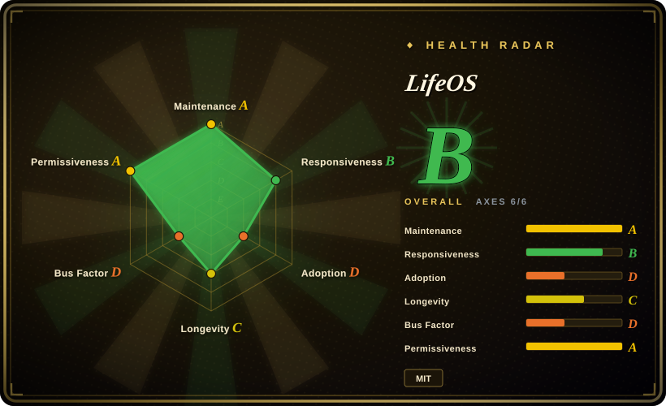
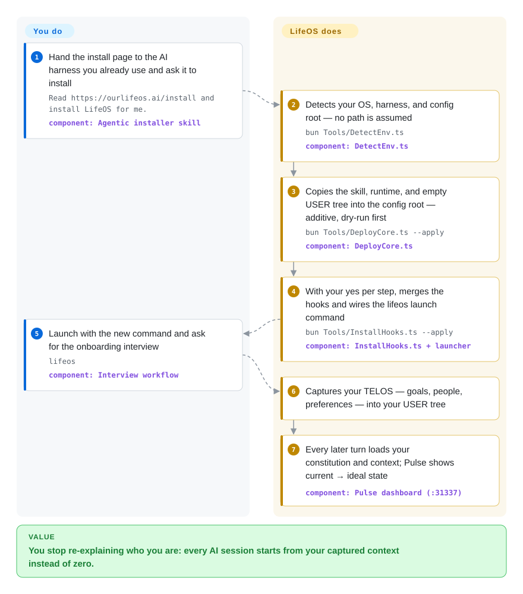

# LifeOS

Your coding agent doesn't know you: the goal you set last week, the people in your projects, the preferences you've re-explained ten times — every session starts from zero. LifeOS bolts a once-installed personal layer onto the harness — an AI-run interview captures your situation into a local config tree, and hooks plus a dedicated launch command inject it back into every turn — so the assistant always knows your current state and where you're trying to get to.

## When to use

You use Claude Code for everything — not just code: research threads, writing, security reviews, running a side business — and the friction isn't capability, it's cold start. You keep re-typing the same briefing ("my dashboard project — you know, the one with Cloudflare and the January deadline") because nothing carries your context or your past decisions forward. LifeOS is the layer that ends that: a setup interview captures your goals, people, and preferences into a `USER/` tree (its "TELOS" — a current-state → ideal-state profile), a constitutional system prompt plus per-turn hooks inject that context back on every session, a local Pulse dashboard shows where you stand against each goal, and optional background jobs keep work moving while you sleep. Reach for it over [ECC](ecc.md) or [Superpowers](superpowers.md) when the missing piece is *you* — persistent personal context shaping every task — rather than more coding workflows.

Second trigger: you already maintain a dotfiles-style agent setup of your own and want the most complete public reference implementation of "personal AI infrastructure" to compare against — ~50 skills, a router, a typed memory system, a self-diagnosing Doctor, all from a well-known security-community author (Daniel Miessler, of fabric). You don't have to adopt it whole to learn from how far one experienced person's harness was pushed.

## How it works

LifeOS ships as exactly one self-contained skill: the `LifeOS/` directory holds the installer orchestrator, and under `install/` the whole payload — constitution prompt, the versioned "Algorithm" loop document, ~50 skills, hooks, the Pulse app, and empty `USER/` templates. The install is agentic: you hand the install page to your AI, and it runs the TypeScript tools under bun — `DetectEnv` finds your OS/harness/config root, `DeployCore` copies the payload additively (every tool is dry-run without `--apply`), and with per-step permission it merges hooks into Claude Code's `settings.json` and wires a `lifeos` alias that launches the model with the constitution appended to its system prompt (plain `claude` stays vanilla). Then an Interview workflow fills your personal tree — the repo itself ships none of it. At runtime, the Algorithm (a Markdown problem-solving loop, v8.x: OBSERVE → THINK → PLAN → BUILD → EXECUTE → VERIFY → LEARN) drives each task, Cortex persists memory across sessions, and Pulse serves a dashboard on `:31337`. Degradation is designed to be loud, not silent: `Doctor.ts` reports each optional capability — `codex` for cross-vendor audits, a real Chrome for web verification, Cloudflare for scheduled flows, ElevenLabs for voice — as live/broken/declined, each with its own fix command.

<!-- flow-steps:begin (generated from flows/lifeos.json by tools/flow_card.py — do not edit) -->

Text version of the flow

1. **You**: Hand the install page to the AI harness you already use and ask it to install — `Read https://ourlifeos.ai/install and install LifeOS for me.` — component: `Agentic installer skill`
2. **LifeOS**: Detects your OS, harness, and config root — no path is assumed — `bun Tools/DetectEnv.ts` — component: `DetectEnv.ts`
3. **LifeOS**: Copies the skill, runtime, and empty USER tree into the config root — additive, dry-run first — `bun Tools/DeployCore.ts --apply` — component: `DeployCore.ts`
4. **LifeOS**: With your yes per step, merges the hooks and wires the lifeos launch command — `bun Tools/InstallHooks.ts --apply` — component: `InstallHooks.ts + launcher`
5. **You**: Launch with the new command and ask for the onboarding interview — `lifeos` — component: `Interview workflow`
6. **LifeOS**: Captures your TELOS — goals, people, preferences — into your USER tree
7. **LifeOS**: Every later turn loads your constitution and context; Pulse shows current → ideal state — component: `Pulse dashboard (:31337)`

**Value**: You stop re-explaining who you are: every AI session starts from your captured context instead of zero.

<!-- flow-steps:end -->

## When NOT to use

- **You only want better coding workflow.** Use [Superpowers](superpowers.md) or [ECC](ecc.md) instead — LifeOS's center of gravity is the life profile (TELOS, interview, dashboard); its coding loop is one generic seven-phase document, while ECC ships hundreds of engineering skills, reviewer agents, and a security scanner.
- **Your harness isn't Claude Code.** The project's own support table is honest: on Cursor/Cline/Codex/Gemini you get the skill, the data tree, and an `AGENTS.md` pointer, but the always-on hooks — the layer that makes it a "system" rather than a folder — are not wired yet. Use [ECC](ecc.md), which ships real per-harness adapters today.
- **You want a small, self-owned config.** Use your own dotfiles instead: LifeOS merges your `settings.json`, edits an rc file to add a launch alias, installs `launchd`/`systemd --user` services, and loads your personal tree into every AI turn. Permission prompts and dry-runs make it careful, but it is still a wide, behavior-bearing surface you don't fully control.
- **You can't absorb a one-person project's churn.** 663 of 717 commits (2026-09) are the author's; the public repo is generated from a private source tree, and community PRs are "ported with credit, not merged directly" (the README's own words). Breaking redesigns ship as named releases — v7.0 retired modes and tiers, v6.0 renamed the whole PAI tree. If your team needs org governance, none of the installed harnesses here has it; treat LifeOS as an experiment to pin, not a platform.
- **Your data can't live where an agent reads it.** The point of the system is writing your goals, relationships, and commitments to disk — and its Work System keeps its system of record in a private GitHub repo reached via `gh`, with no fallback, stated by the project. If policy or plain caution forbids that, use session-scoped tooling like [Superpowers](superpowers.md) that forgets between tasks.

## Comparison

| Alternative | In index | Our verdict | Tradeoff |
|---|---|---|---|
| [ECC](ecc.md) | ✅ | Pick LifeOS when what's missing is persistent *personal* context — goals, people, memory, a life dashboard — and you live in Claude Code; pick ECC when what's missing is engineering capability across several harnesses. | LifeOS is broad about *you*, ECC broad about *code*; ECC's cross-harness adapters work today, LifeOS's always-on layer is Claude Code only. |
| [Superpowers](superpowers.md) | ✅ | Pick Superpowers when you want opt-in SDLC discipline (brainstorm → plan → TDD → verify) per task with nothing resident between sessions; LifeOS only when you accept an always-on personal layer as the price. | Superpowers is opt-in and multi-harness; LifeOS is always-on, single-harness, and carries your life data. |
| [SuperClaude Framework](superclaude.md) | ✅ | Pick SuperClaude when the unit you want to manage is the session's persona, commands, and behavior modes; LifeOS when the unit is your whole state across sessions. | SuperClaude reshapes how a coding session behaves; LifeOS reshapes what the agent knows about you between sessions. |
| [Compound Engineering](compound-engineering.md) | ✅ | Pick Compound Engineering for a small plugin that compounds learnings from engineering work only; LifeOS is the bigger bet — a full personal-OS runtime with daemons and dashboards — so choose it when that ambition is the feature, not the overhead. | One loop vs an entire system: Compound persists coding learnings; LifeOS persists *you*, with proportionally more surface to trust and maintain. |
| [gstack](../../agent-skills/personal-collections/engineering-workflows/gstack.md) | ✅ | Both are one operator's whole harness made public: pick gstack for that operator's sprint ritual (role personas plus a driven browser) around engineering; pick LifeOS for a life-wide context layer with memory and a status dashboard. | gstack is deep on the engineering loop; LifeOS is broad across life and work — and ships daemons, a launcher, and a doctor CLI gstack doesn't have. |

## Tech stack

- **Language:** TypeScript ~77% of tracked bytes (6.87 MB of 8.87 MB, GitHub Languages 2026-09) — install tools, runtime CLIs, Pulse API, launcher; Swift for the macOS menu-bar app; HTML/CSS/Handlebars for the Life Dashboard; Shell/PowerShell for bootstrap.
- **Runtime:** Bun executes every TypeScript tool and is an install prerequisite.
- **Content layer:** Markdown is the real payload — the constitution system prompt, the versioned Algorithm loop document (v8.20.2 in the 2026-09 tree), and ~50 frontmattered skills.
- **Integration surface:** Claude Code hooks and `settings.json` merges, a launch alias appending `--append-system-prompt-file`, `AGENTS.md`/rules files on other harnesses; `launchd` plists and `systemd --user` units for Pulse, work sweeps, and the Atlas collectors.

## Dependencies

- **Required:** a coding harness with file+command access (full behavior on Claude Code), Bun, git (release fetch).
- **Work System:** `gh` CLI authenticated to a private GitHub repo — stated as the system of record with no fallback; without it, work capture fails rather than degrades.
- **Optional, each degrades honestly (Doctor-managed):** OpenAI `codex` CLI (cross-vendor audits), a real Chrome/Brave binary (Interceptor web verification), Cloudflare account + API token via wrangler (scheduled "runs while you sleep" flows), ElevenLabs API key (voice notifications).
- **Local state:** the dashboard daemon binds `:31337` under your user; all personal data is a local `USER/`/Cortex tree under the harness config root — no vendor backend of its own.

## Ops difficulty

**Medium.** The install is near-zero-friction — one prompt handed to your AI, dry-run by default, permission at each mutation — but the steady state is a running system: an always-on `:31337` dashboard daemon, per-turn hooks, background sweeps, and a custom launcher alias. Day-2 health is genuinely tooling-supported (`Doctor.ts` prints one line per capability with a copy-paste fix, and `decline` turns one off permanently and silently), and upgrades re-run the installer's settings merge without touching your `USER/` tree. The cost is churn: majors are breaking by design (v7.0 retired modes/tiers; the tree went v3 → v7.40 in about six months), and the README's own credits section lists "fresh-install forensics" bug reports as a recurring contribution category — installs do meet edge cases in the wild.

## Health & viability

- **Maintenance (2026-09):** hyper-active — last push 2026-09-04; ~717 commits in the repo's first year; v7.0.0 (2026-07-12) through v7.40.4 (2026-08-14) alone was 10+ releases in a month; 92 open issues.
- **Governance / bus factor:** a User-owned personal repo — the author holds 663 of 717 commits (~92%; the next contributor has 4) — and the public repo is generated from a private source tree, with community PRs "ported with credit, not merged directly." The roadmap is one person's, end to end.
- **Backing & Lindy:** created 2025-09, renamed from PAI on 2026-07-02 — about a year old and still active, so it **fails the age prior**: early-adopter territory, pin release tags. The mitigating signal is personal, not institutional: the author has a long public track record (fabric), which buys durability of the *person*, not of this repo. [推断]
- **Adoption:** ~19.2k stars / ~2.5k forks (2026-09), 28+ listed committers, active Discord and Discussions — real adoption, but high stars on a one-year-old repo is exactly the hype-risk pattern the Lindy prior warns about.
- **Risk flags:** MIT, no relicense history. The structural risks are churn (breaking redesigns shipped as named releases) and surface: always-on hooks mutate `settings.json`, system services run under your user, and your entire life profile sits in a Markdown tree the AI reads every turn — the Atlas collectors even include a file named `Secrets.ts` (what it reads and where it goes was not reviewed for this page).

## Caveats (unverified)

- [未验证] The cross-harness support table (Cursor/Cline/Codex/Gemini get context and data, no always-on hooks) is the project's own claim in `INSTALL.md`; not tested from this page.
- [未验证] "Context roughly two-thirds smaller, ~88KB to ~28KB" after v7.0 is an author-reported figure in the release notes; not independently measured.
- [未验证] Bundled skill count drifts by release — the README cites 49 at v6.0.0 while the `main` payload tree showed 50+ skill directories on 2026-09-28; count against the tag you pin.
- [未验证] "Release gates / security gates run before every publish" and the two-stage release process come from the README and release notes; no independent audit.
- [未验证] Whether the Pulse daemon on `:31337` binds localhost-only and what it exposes, and what the Atlas `Secrets.ts` collector reads.
- [推断] The bus-factor and governance judgment is derived from commit-count statistics and README statements; no published governance document exists.
