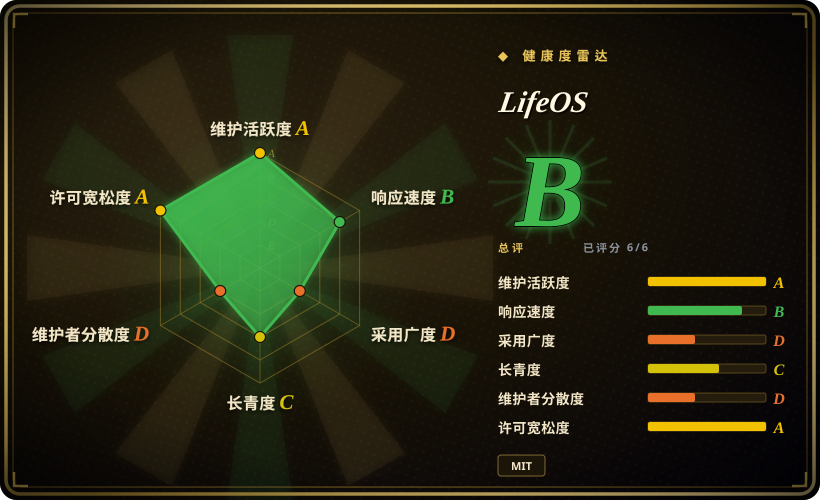
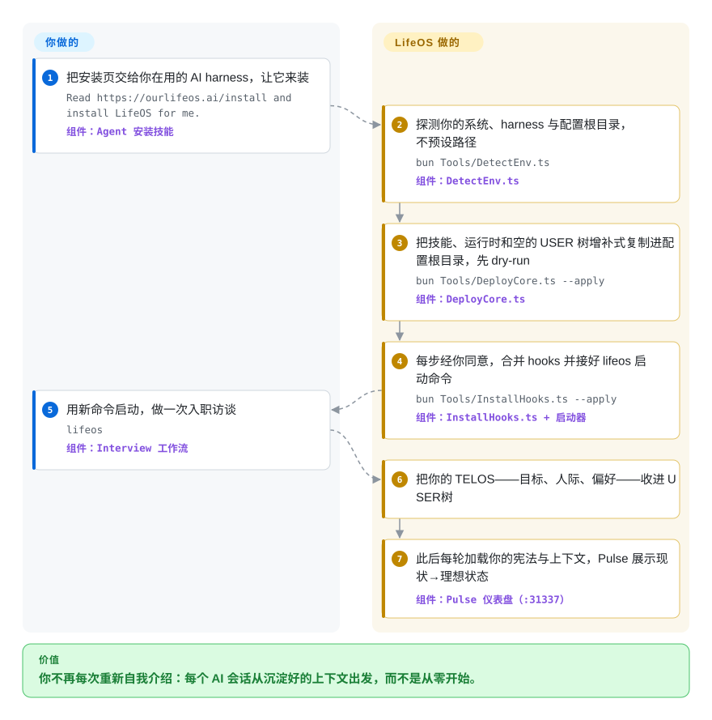

# LifeOS

你一打开 coding agent，它就不认识你——上周定的目标、项目里的人、你解释过十遍的偏好、以往每次会话做过的决定，全部归零，你只好重新自我介绍。LifeOS 是装一次就常驻在你 harness 上的私人层：一场由 AI 主持的入职访谈把你的现状写进本地配置树，之后 hook 和专用启动命令把这份上下文注回每一轮对话，让助手始终知道你的现状与理想状态之间还差什么。

## 何时使用

你把 Claude Code 什么都能拿来干——不只是写代码：调研、写作、安全评审、经营副业——卡住你的不是能力而是冷启动：每次都要重打同一份简报（“我那个看板项目——你知道的，用 Cloudflare、一月底截止的那个”），因为没有任何东西替你把上下文和过往决定带过来。LifeOS 就是终结这种重复的那一层：一次访谈把你的目标、人际、偏好收进 `USER/` 树（它的“TELOS”——一份现状→理想的档案），宪法式系统提示加每轮 hook 把这份上下文注回每个会话，本地 Pulse 仪表盘显示你离每个目标还差多远，选配的背景任务还在你睡觉时继续推进工作。当缺的那块是*你自己*——跨任务常驻的个人上下文——而不是更多编码工作流时，选它而不是 [ECC](ecc.zh.md) 或 [Superpowers](superpowers.zh.md)。

第二个触发条件：你自己维护着一套 dotfiles 式的 agent 配置，想要一份公开可见、完成度最高的“个人 AI 基础设施”参考实现来对照——约 50 个 skill、一个路由器、一套类型化记忆系统、一个会自我诊断的 Doctor，出自安全社区熟人（fabric 作者 Daniel Miessler）之手。就算不整体采纳，看一个人的 harness 能被推到多远也值回票价。

## 怎么用起来

LifeOS 的发行物就是恰好一个自包含 skill：`LifeOS/` 目录里装着安装编排器，`install/` 下是全部 payload——宪法提示词、带版本号的 Algorithm 循环文档、约 50 个 skill、hooks、Pulse 应用和空的 `USER/` 模板。安装是对话式的：你把安装页交给你的 AI，它在 bun 下依次运行那些 TypeScript 工具——`DetectEnv` 摸清你的系统、harness 和配置根目录，`DeployCore` 增补式复制 payload（每个工具不带 `--apply` 就只打印计划），并在逐步授权下把 hooks 合并进 Claude Code 的 `settings.json`、配好一条 `lifeos` 启动别名——用它在系统提示里追加宪法文件（裸 `claude` 保持原味）。随后由 Interview 工作流填充你的个人树——仓库本身不带任何个人内容。运行期，Algorithm（一份 Markdown 写成的解题循环，v8.x：OBSERVE → THINK → PLAN → BUILD → EXECUTE → VERIFY → LEARN）驱动每个任务，Cortex 跨会话沉淀记忆，Pulse 在 `:31337` 上供出仪表盘。降级是响亮而非沉默的：`Doctor.ts` 把每个选配能力——用 `codex` 做跨厂商审计、用真 Chrome 做网页验证、用 Cloudflare 跑定时流、用 ElevenLabs 出声——报成 live/broken/declined，每项自带修复命令。

<!-- flow-steps:begin (generated from flows/lifeos.json by tools/flow_card.py — do not edit) -->

流程文字版

1. **你**：把安装页交给你在用的 AI harness，让它来装 — `Read https://ourlifeos.ai/install and install LifeOS for me.` — 组件：`Agent 安装技能`
2. **LifeOS**：探测你的系统、harness 与配置根目录，不预设路径 — `bun Tools/DetectEnv.ts` — 组件：`DetectEnv.ts`
3. **LifeOS**：把技能、运行时和空的 USER 树增补式复制进配置根目录，先 dry-run — `bun Tools/DeployCore.ts --apply` — 组件：`DeployCore.ts`
4. **LifeOS**：每步经你同意，合并 hooks 并接好 lifeos 启动命令 — `bun Tools/InstallHooks.ts --apply` — 组件：`InstallHooks.ts + 启动器`
5. **你**：用新命令启动，做一次入职访谈 — `lifeos` — 组件：`Interview 工作流`
6. **LifeOS**：把你的 TELOS——目标、人际、偏好——收进 USER 树
7. **LifeOS**：此后每轮加载你的宪法与上下文，Pulse 展示现状→理想状态 — 组件：`Pulse 仪表盘（:31337）`

**价值**：你不再每次重新自我介绍：每个 AI 会话从沉淀好的上下文出发，而不是从零开始。

<!-- flow-steps:end -->

## 何时不用

- **你只想要更好的编码工作流。** 用 [Superpowers](superpowers.zh.md) 或 [ECC](ecc.zh.md)：LifeOS 的重心是人生档案（TELOS、访谈、仪表盘），编码循环只是一份通用的七阶段文档，而 ECC 带着几百个工程 skill、评审 agent 和安全扫描器。
- **你的 harness 不是 Claude Code。** 项目自己的支持表很诚实：Cursor/Cline/Codex/Gemini 拿到的是 skill、数据树和一个 `AGENTS.md` 指路牌，而让它成为“系统”而非“文件夹”的常驻 hook 尚未接线。今天就想要跨 harness 真适配的，选带各家适配器的 [ECC](ecc.zh.md)。
- **你想要小而完全自有的配置。** 用自己的 dotfiles：LifeOS 会合并你的 `settings.json`、往 rc 文件里写启动别名、装 `launchd`/`systemd --user` 服务，并把你的个人树喂进每一轮 AI 上下文。逐步授权和 dry-run 让它谨慎，但这仍是一大片你无法完全掌控的行为面。
- **你消化不了一人项目的变更冲击。** 717 次提交里 663 次是作者本人的（2026-09）；公开仓库由私有源码树生成，社区 PR 是“带着署名移植进去、而非直接合并”——README 原话。破坏性重设计按具名版本发布：v7.0 废掉了 modes 和 tiers，v6.0 把整棵 PAI 树改名。团队要的是组织级治理，这里已收录的每个 harness 都给不了；把 LifeOS 当作钉住版本试用的实验品，而不是平台。
- **你的数据不能让 agent 随手读到。** 这套系统的意义就是把你的目标、人际、承诺写到磁盘上——而它的 Work System 把记账系统放在一个经 `gh` 访问的私有 GitHub 仓库里，项目自述无兜底方案。若合规或单纯的小心禁止这一切，用会话级、任务之间不记事的工具，比如 [Superpowers](superpowers.zh.md)。

## 横向对比

| 替代品 | 是否收录 | 我们的评价 | 取舍 |
|---|---|---|---|
| [ECC](ecc.zh.md) | ✅ | 当缺的是跨多个 harness 的工程能力时选 ECC；当缺的是常驻的*个人*上下文——目标、人际、记忆、人生仪表盘——并且你住在 Claude Code 里时选 LifeOS。 | LifeOS 宽在*你*，ECC 宽在*代码*；ECC 的跨 harness 适配器今天就能用，LifeOS 的常驻层只到 Claude Code。 |
| [Superpowers](superpowers.zh.md) | ✅ | 想要按任务自选的 SDLC 纪律（头脑风暴→计划→TDD→验证）、会话之间什么都不常驻，选 Superpowers；只有当你接受“常驻个人层”这个代价时才选 LifeOS。 | Superpowers 是 opt-in、跨 harness；LifeOS 是 always-on、单 harness，还承载你的人生数据。 |
| [SuperClaude Framework](superclaude.zh.md) | ✅ | 你想管理的单元是会话里的人设、命令和行为模式时选 SuperClaude；想管理的单元是跨会话的自己时选 LifeOS。 | SuperClaude 重塑一次编码会话的行为；LifeOS 重塑会话之间 agent 对你的了解。 |
| [Compound Engineering](compound-engineering.zh.md) | ✅ | 只沉淀工程经验的小循环，选 Compound Engineering；LifeOS 是更大的赌注——带守护进程和仪表盘的个人 OS 全套 runtime——当这份雄心是特性而非负担时才选它。 | 一个循环 vs 一整套系统：前者记住编码教训，后者记住*你*，可信与维护面也按同比例放大。 |
| [gstack](../../agent-skills/personal-collections/engineering-workflows/gstack.zh.md) | ✅ | 两者都是把一位操盘手的完整 harness 公开化：要围绕工程的冲刺仪式（角色人设加被驱动的浏览器）选 gstack；要跨人生与工作的上下文层加记忆和状态仪表盘选 LifeOS。 | gstack 深在工程循环；LifeOS 宽在人生与工作——并且带着 gstack 没有的守护进程、启动器和 doctor CLI。 |

## 技术栈

- **语言：** TypeScript 约占仓库字节的 77%（6.87 MB / 8.87 MB，GitHub Languages 2026-09）——安装工具、runtime CLI、Pulse API、启动器；Swift 写 macOS 菜单栏应用；HTML/CSS/Handlebars 写 Life Dashboard；Shell/PowerShell 做引导脚本。
- **Runtime：** 每个 TypeScript 工具都在 Bun 下执行，Bun 是安装前置依赖。
- **内容层：** Markdown 才是真正的 payload——宪法系统提示词、带版本号的 Algorithm 循环文档（2026-09 树里是 v8.20.2）、约 50 个带 frontmatter 的 skill。
- **集成面：** Claude Code hooks 与 `settings.json` 合并、追加 `--append-system-prompt-file` 的启动别名、其他 harness 上的 `AGENTS.md`/rules 文件；Pulse、工作清扫和 Atlas 采集器以 `launchd` plist 与 `systemd --user` 单元驻留。

## 依赖

- **必需：** 一个有文件与命令访问权的 coding harness（完整行为要 Claude Code）、Bun、git（拉取 release）。
- **Work System：** 已登录的 `gh` CLI 加一个私有 GitHub 仓库——项目自述的系统记录之源、无兜底；没有它，工作捕捉是直接失败而非降级。
- **选配，每项都诚实降级（Doctor 管理）：** OpenAI `codex` CLI（跨厂商审计）、真实 Chrome/Brave 浏览器（Interceptor 网页验证）、Cloudflare 账号加 API token（借 wrangler 跑“睡觉时也推进”的定时流）、ElevenLabs API key（语音通知）。
- **本地状态：** 仪表盘守护进程在你的用户下监听 `:31337`；全部个人数据是 harness 配置根下的本地 `USER/`/Cortex 树——它自己没有后端服务。

## 运维难度

**中等。** 安装几乎零摩擦——一条 prompt 交给你的 AI，默认 dry-run，每步变更都要授权——但稳态是一个在运行的系统：常驻的 `:31337` 仪表盘守护进程、每轮触发的 hooks、背景清扫任务、专用启动别名。Day-2 健康确实有工具兜底（`Doctor.ts` 每个能力一行状态、自带可粘贴的修复命令，`decline` 能永久安静地关掉一项），升级是重跑安装器的设置合并、不碰你的 `USER/` 树。代价是变更冲击：大版本天生破坏性（v7.0 废除 modes/tiers；版本树约六个月内从 v3 走到 v7.40），且 README 的致谢页把“全新安装取证”列为一个反复出现的贡献类别——野外的安装确实会撞上边角案例。

## 健康度与可持续性

- **维护（2026-09）：** 极活跃——最后推送 2026-09-04；仓库第一年约 717 次提交；仅 v7.0.0（2026-07-12）到 v7.40.4（2026-08-14）一个月内就有 10+ 个 release；92 个 open issue。
- **治理与 bus factor：** User 型个人仓库——作者占 717 次提交中的 663 次（约 92%，第二贡献者只有 4 次）；公开仓库由私有源码树生成，社区 PR“带着署名移植、不直接合并”。路线图从头到尾是一个人。
- **背书与 Lindy：** 2025-09 创建，2026-07-02 从 PAI 改名而来——约一岁且仍活跃，因此**通不过年龄先验**：早期采用者领地，请钉住 release tag。缓释信号属于人不属于机构：作者有很长的公开履历（fabric），买到的是*人*的可持续性，不是这个仓库的。[推断]
- **采用度：** 约 19.2k star / 约 2.5k fork（2026-09），28+ 名列出的 committer，活跃的 Discord 与 Discussions——采用是真的，但一岁新仓库配高 star 恰是 Lindy 先验警告的炒作形态。
- **风险信号：** MIT，无再许可历史。结构性风险在变更冲击（破坏性重设计按具名版本发）和覆盖面：常驻 hook 会改写 `settings.json`、系统服务跑在你的用户下、你全部的人生档案躺在一个 AI 每轮都读的 Markdown 树里——Atlas 采集器里甚至有个文件就叫 `Secrets.ts`（它读什么、数据去哪，本页未审查）。

## 存疑（未验证）

- [未验证] 跨 harness 支持表（Cursor/Cline/Codex/Gemini 只有上下文和数据、无常驻 hook）是项目 `INSTALL.md` 的自述，本页未实测。
- [未验证] “v7.0 后上下文约三分之二变小、从约 88KB 到约 28KB”是 release notes 里的作者口径，未独立测量。
- [未验证] 捆绑 skill 数量随 release 漂移——README 在 v6.0.0 记 49 个，而 2026-09-28 的 `main` payload 树里有 50+ 个 skill 目录；以你钉住的 tag 为准点数。
- [未验证] “每次发布前跑 release gates / security gates”与两阶段发布流程出自 README 与 release notes，未经独立审计。
- [未验证] Pulse 守护进程在 `:31337` 上是否只绑 localhost、暴露什么，以及 Atlas 的 `Secrets.ts` 采集器读什么。
- [推断] bus factor 与治理判断由提交数统计和 README 陈述推出；不存在公开的治理文档可查。
