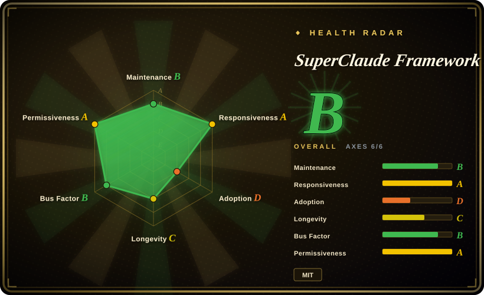
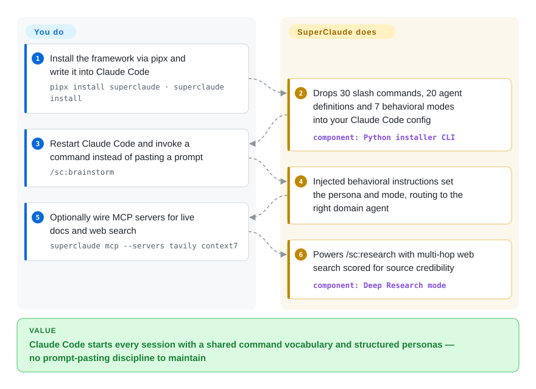

# SuperClaude Framework

You keep pasting the same paragraphs into Claude Code — "act as a security reviewer", "brainstorm before coding", "be token-efficient". SuperClaude turns that discipline into a one-word vocabulary: a Python installer drops 30 `/sc:` slash commands, 20 persona agents and 7 behavioral modes into your Claude Code config as Markdown, activated by injecting those instructions at command time.

## When to use

You're a developer who lives in Claude Code and keeps re-typing the same long prompts — "act as a security reviewer," "brainstorm before you implement," "be token-efficient" — and you want that structure to be a one-word command instead of a paragraph you paste every session. You run `pipx install superclaude && superclaude install`, and now you have `/sc:brainstorm`, `/sc:implement`, `/sc:troubleshoot`, `/sc:document` and ~26 more as first-class commands, plus 20 domain agents (security engineer, frontend architect, deep-research agent, PM agent) that the framework routes to based on context. The point is that you don't want to invent your own persona/command scaffolding from scratch — SuperClaude gives you an opinionated, ready-made one and an installer that drops the agent/command markdown into `~/.claude/`.

It also fits when you want behavioral *modes* layered on top of the raw model: a Brainstorming mode that interrogates requirements before coding, a Token-Efficiency mode for long sessions, an Introspection/Task-Management mode for multi-step work. You install once, get the whole battery of commands+agents+modes, and optionally bolt on 8 MCP servers (Context7, Serena, Playwright, Magic, Sequential-Thinking, etc.) through `superclaude mcp`. If your team standardizes on Claude Code and wants a shared command vocabulary, this is a packaged starting point rather than a DIY config repo.

## How it works

The payload is Markdown: command files, agent persona definitions, and behavioral instructions that the Python installer copies into your Claude Code config (agents into `~/.claude/agents/` and the related locations) — there is no separate runtime service. When you type `/sc:<command>`, the command file's injected behavioral instructions tell Claude Code which persona and mode to adopt, and can route the task to a specialized agent markdown (security engineer, frontend architect, deep-research); modes are overlays you can combine with any command, e.g. Brainstorming interrogates requirements before code, Token-Efficiency compresses output for long sessions. MCP integration is a separate opt-in: `superclaude mcp` wires up to 8 external servers (Tavily, Context7, Serena, Sequential-Thinking…), which is what powers `/sc:research`'s multi-hop web research with source-credibility scoring; the README's "2–3x faster / 30–50% fewer tokens" figures for that path are the project's own claims, not benchmarks. What stays yours: `superclaude doctor` and `superclaude install --list` verify and inspect the install; upgrades mean re-running the installer and reconciling whatever it rewrote in your config.

<!-- flow-steps:begin (generated from flows/superclaude.json by tools/flow_card.py — do not edit) -->

Text version of the flow

1. **You**: Install the framework via pipx and write it into Claude Code — `pipx install superclaude · superclaude install`
2. **SuperClaude Framework**: Drops 30 slash commands, 20 agent definitions and 7 behavioral modes into your Claude Code config — component: `Python installer CLI`
3. **You**: Restart Claude Code and invoke a command instead of pasting a prompt — `/sc:brainstorm`
4. **SuperClaude Framework**: Injected behavioral instructions set the persona and mode, routing to the right domain agent
5. **You**: Optionally wire MCP servers for live docs and web search — `superclaude mcp --servers tavily context7`
6. **SuperClaude Framework**: Powers /sc:research with multi-hop web search scored for source credibility — component: `Deep Research mode`

**Value**: Claude Code starts every session with a shared command vocabulary and structured personas — no prompt-pasting discipline to maintain

<!-- flow-steps:end -->

## When NOT to use

- **You don't use Claude Code.** SuperClaude itself targets Claude Code *only* — no Cursor / Codex / opencode / Droid path. The org now links sister projects (SuperGemini_Framework, SuperQwen_Framework) in the README for other hosts, but those are separate repos with their own maturity, not this package. If your harness is anything else, almost none of *this* applies. [推断]
- **You want a minimal, fully-owned config.** It injects a large surface (30 commands + 20 agents + 7 modes) into `~/.claude/`; if you prefer a handful of hand-written commands you fully understand, this is a lot of opaque scaffolding to audit and trim.
- **You distrust auto-routing / "automatic agent coordination."** Behavior is driven by the framework's own dispatch and behavioral-instruction injection; debugging *why* a given agent or mode fired means reading SuperClaude's markdown layer on top of Claude Code's native mechanics.
- **You want guaranteed performance wins.** Marketing cites "2-3x faster" and "30-50% fewer tokens" from optional MCPs — these are project claims, config-dependent, and not independently benchmarked here.
- **Churn / version coupling.** v4 is a recent rewrite and the v5 TypeScript plugin system is still "in development, no ETA" per the README (as of 2026-09); command names, agent rosters, and the `~/.claude/` install layout can shift, and the TS rewrite may change the install model entirely. Meanwhile the release line has sat at v4.3.0 since 2026-03-22 while commits to master keep landing — fixes ship unreleased.
- **You only need one capability.** If you just want, say, structured brainstorming or a research mode, installing the whole battery (and its MCP setup) is heavier than copying a single command.

## Comparison

| Alternative | In index | Our verdict | Tradeoff |
|---|---|---|---|
| [Superpowers](superpowers.md) | ✅ | Choose Superpowers when you need a Claude Code skill/plugin collection emphasizing reusable skills. | Claude Code skill/plugin collection emphasizing reusable "skills"; overlapping "battery of capabilities for Claude Code" goal, different packaging (plugin/skills vs installed command+persona framework). |
| [get-shit-done](../spec-driven-development/get-shit-done.md) | ✅ | Choose get-shit-done when you need an opinionated workflow/command pack for agent development. | Opinionated workflow/command pack for agent dev; narrower, workflow-first vs SuperClaude's broad command+agent+mode surface. |
| [Compound Engineering](compound-engineering.md) | ✅ | Choose Compound Engineering when you need methodology-plus-plugin tooling for compounding agent work. | Methodology-plus-plugin for compounding agent work; a development *philosophy* with tooling, vs SuperClaude's config-injection framework. |
| [ECC](ecc.md) | ✅ | When you want the maximal harness — hundreds of skills, memory hooks, a security scanner, multi-harness adapters — pick ECC; pick SuperClaude when a lighter, Claude-Code-only command+persona layer you can read file-by-file is enough. | ECC installs a runtime that acts on session events (and has a paid Pro tier atop its MIT core); SuperClaude stays static injected config — smaller surface, but nothing carries learnings forward. |
| [12-Factor Agents](../spec-driven-development/12-factor-agents.md) | ✅ | Choose 12-Factor Agents when you need principles for building reliable LLM agents. | Principles for building reliable LLM agents — a spec/manifesto you read, not software you install into Claude Code. |
| [claude-code-templates](claude-code-templates.md) / awesome-claude-code | 部分已收录 | Choose claude-code-templates when you want lighter, à-la-carte Claude Code config snippets you assemble yourself; choose SuperClaude when you want a coordinated framework installed as one set. | The catalog is a shelf of independently authored components with no coordination guarantee; SuperClaude trades that freedom for one designed, installed system. awesome-claude-code has no page. |

## Tech stack

- **Language:** Python (per repo `primaryLanguage`).
- **CLI / installer:** `click` (command-line interface), `rich` (terminal output), `pytest` (declared as a runtime dependency in `pyproject.toml`, unusual — normally a dev dep). [推断]
- **Distribution:** PyPI package `superclaude` (install via `pipx`); also published to npm as `@bifrost_inc/superclaude`; plus a `./install.sh` git path.
- **Payload:** markdown agent/command/mode definitions installed into `~/.claude/agents/` and related Claude Code config locations; behavioral-instruction injection is the core mechanism (no separate runtime service).
- **Optional integrations:** 8 MCP servers wired via `superclaude mcp` — Context7, Sequential-Thinking, Serena, Playwright, Magic, Morphllm-Fast-Apply, Chrome DevTools, Tavily.

## Dependencies

- **Runtime:** Python ≥ 3.10 (per `pyproject.toml` `requires-python`). A working Claude Code install is the real prerequisite — the framework is inert without it.
- **Python deps (v4.3.0):** `click` ≥ 8.0.0, `rich` ≥ 13.0.0, `pytest` ≥ 7.0.0.
- **Install:** `pipx install superclaude` then `superclaude install`; or clone + `./install.sh`; or `npm i -g @bifrost_inc/superclaude`.
- **Optional:** the 8 MCP servers each bring their own Node/Python runtimes and (some) API keys — installed separately via `superclaude mcp` or the airis-mcp-gateway the README links, not bundled.

## Ops difficulty

**Low.** This is a client-side dev-tool config, not a deployed service: `pipx install` + `superclaude install` writes files into `~/.claude/` and you're done — no server, no datastore, no orchestration to keep alive; `superclaude doctor` and `superclaude install --list` check the result. Maintenance burden comes from (a) re-running `superclaude install` after upgrades and reconciling changes to your `~/.claude/` config, (b) optional MCP servers, which add their own runtimes/keys and are the most likely thing to break, and (c) coupling to a project whose releases lag its commits (v4.3.0 since 2026-03, master active through 2026-09) and where a v5 TypeScript rewrite may change the install layout. There's nothing to scale or monitor in production.

## Health & viability

- **Responsiveness**: Grade A — median first response 45.2 hours (relaxed_solo band, 4 qualifying items); unchanged vs the 2026-09-22 measurement.
- **Maintenance (2026-09):** maintained by commit, coasting by release — latest release is still v4.3.0 (2026-03-22) and PyPI matches, but master receives fixes weekly (last pushed 2026-09-27). v5 (TypeScript plugin system) remains "in development, no ETA" per the README, so the install layout can shift across the transition.
- **Governance & backing:** Organization-owned (SuperClaude-Org) — a community/org structure rather than a lone account; `pyproject.toml` lists three authors (including Kazuki Nakai). The README runs an explicit funding pitch (Ko-fi/Patreon/GitHub Sponsors; cites a $100/month Claude Max testing cost) — volunteer economics, no foundation or vendor backing published. The org also ships sister frameworks (SuperGemini, SuperQwen) for other hosts, which spreads the maintainers' attention.
- **Age & Lindy (2026-09):** created 2025-06, ~15 months old, ~23.9k stars. Past the first year and still active — a modestly better Lindy signal than its younger siblings, but mid-rewrite (v4 fresh, v5 announced for over a year) means the contract you adopt today may not survive the next major. Lindy verdict: **young but survivor** — usable now, pin versions, expect command/agent-roster churn.
- **Risk flags:** MIT (no relicense). Lock-in is **Claude-Code-only** for this package [推断] — the sister repos are separate projects. Optional MCP servers (installed through the README's referenced airis-mcp-gateway path) are the most likely breakage surface (own runtimes/keys). Release lag means README fixes can be weeks ahead of the PyPI package. No CVEs were reviewed.

## Caveats (unverified)

- [未验证] Counts "30 commands / 20 agents / 7 modes / 8 MCP servers" come from the README's statistics table (2026-09-27); the exact rosters shift release-to-release — verify against the installed files for your version.
- [未验证] Star count ~23.9k as of 2026-09-27 — GitHub stars are unreliable and date-sensitive, treat as indicative only. Latest release v4.3.0 (2026-03-22) was confirmed against GitHub Releases and PyPI on 2026-09-27.
- [未验证] Performance claims ("2-3x faster", "30-50% fewer tokens") are the project's own framing for optional MCPs and are config-dependent; no independent benchmark.
- [推断] `pytest` appearing in runtime `dependencies` (vs dev-only) was re-confirmed from `pyproject.toml` and PyPI metadata on 2026-09-27; still unclear whether it is intentional (the package self-describes as a "pytest plugin") or a packaging quirk.
- [推断] "Claude Code only" is inferred from the README's framing and the `~/.claude/` install target; the README now links SuperGemini/SuperQwen sister repos, but nothing in this package claims Cursor/Codex/opencode support, and absence of mention is not proof.
- [未验证] The v5.0 TypeScript plugin system is still roadmap, not shipped ("no ETA has been set" per README, issue #419); whether it preserves the current install model is unconfirmed.
