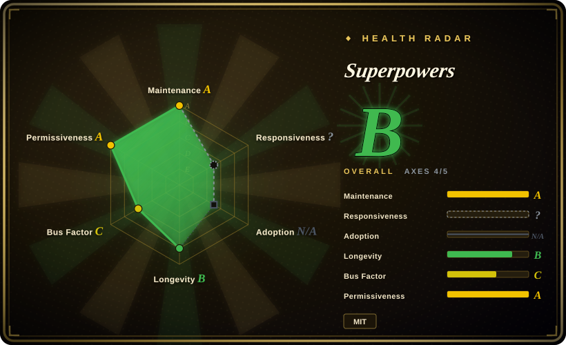
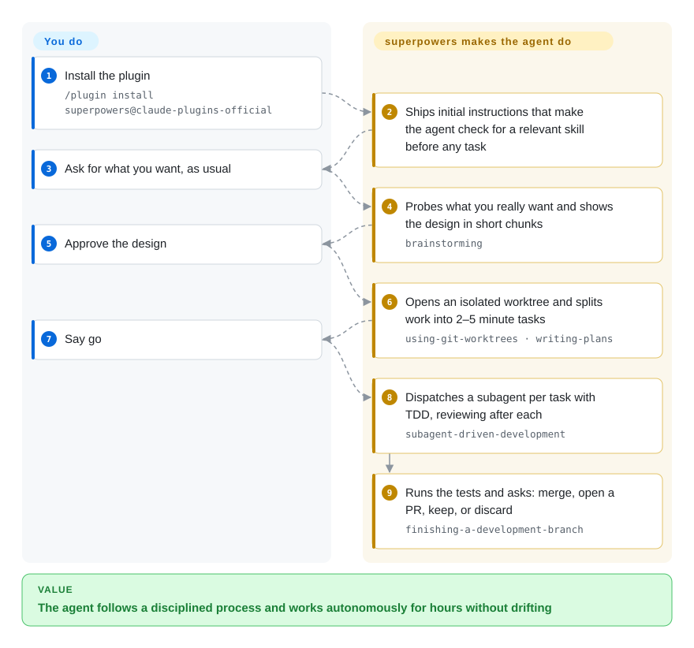

# Superpowers

Your coding agent jumps straight into code, skips the failing test, and declares done without checking. Superpowers installs a whole development methodology — brainstorm → plan → TDD → subagent-driven execution → verify — into your agent as a plugin of Markdown skills that fire before the work starts.

## When to use

You're a developer running Claude Code (or Codex, Cursor, Gemini CLI, OpenCode, Kimi, Droid, Qwen Code, Devin…) and you keep hitting the same failure mode: the agent jumps straight to code, skips writing a failing test first, "fixes" a bug by guessing, and declares victory without actually verifying anything. You want it to behave like a disciplined senior engineer — interrogate what you're really trying to build, write the plan down, do real red-green-refactor, isolate work on a git worktree, and run a verification pass before claiming done. Superpowers gives you exactly that as a drop-in plugin: a curated set of 15 skills (`brainstorming`, `writing-plans`, `test-driven-development`, `systematic-debugging`, `subagent-driven-development`, `verification-before-completion`, `using-git-worktrees`, and more) that the agent loads on demand and follows step by step.

You reach for it when you want an opinionated, battle-tested workflow rather than building your own skill stack from scratch — and especially when you want that same methodology to follow you across harnesses. As of v6.4.2 the README documents 16 install paths (Claude Code's official plugin marketplace, Antigravity, Codex App/CLI, Cursor, Devin CLI, Factory Droid, Gemini CLI, GitHub Copilot CLI, Grok Build CLI, Kimi Code, OpenCode, Pi, Qwen Code, Hermes Agent, Muse), so the brainstorm-plan-TDD-verify spine stays consistent whether today's task runs in Claude Code or Codex CLI. Install once via your agent's marketplace, and the methodology activates through the platform's native skill-loading mechanism.

## How it works

superpowers is essentially a set of working procedures written in Markdown (skills), plus initial instructions that make the agent **check for a relevant skill before any task**. So once it's installed you memorise no commands and just ask for what you want; the agent walks a fixed pipeline on its own: tease out what you actually want and write it up as a design → open an isolated git worktree → break the work into tasks of a few minutes each → dispatch a subagent per task that implements it test-first, reviewing each one (a cheaper `executing-plans` mode runs the tasks inline in the current session instead) → finally run the tests and ask whether to merge, open a PR, or discard. Your only job is to nod at two points: approving the design, and saying go. When a session misbehaves, a `diagnosing-superpowers` skill reads the transcript and reports what happened with line-level evidence.

<!-- flow-steps:begin (generated from flows/superpowers.json by tools/flow_card.py — do not edit) -->

Text version of the flow

1. **You**: Install the plugin — `/plugin install superpowers@claude-plugins-official`
2. **Superpowers**: Ships initial instructions that make the agent check for a relevant skill before any task
3. **You**: Ask for what you want, as usual
4. **Superpowers**: Probes what you really want and shows the design in short chunks — `brainstorming`
5. **You**: Approve the design
6. **Superpowers**: Opens an isolated worktree and splits work into 2–5 minute tasks — `using-git-worktrees · writing-plans`
7. **You**: Say go
8. **Superpowers**: Dispatches a subagent per task with TDD, reviewing after each — `subagent-driven-development`
9. **Superpowers**: Runs the tests and asks: merge, open a PR, keep, or discard — `finishing-a-development-branch`

**Value**: The agent follows a disciplined process and works autonomously for hours without drifting

<!-- flow-steps:end -->

## When NOT to use

- **You already have a curated skill/command system you trust.** Superpowers is opinionated and prescriptive (mandatory failing-test-first, brainstorm-before-code). Layering it on top of an existing methodology stack invites conflicting instructions and double-routing — pick one source of truth.
- **You're not on a supported agent harness.** It activates through each platform's skill-loading mechanism (Claude `Skill` tool, Codex/Cursor/Kimi/Gemini/OpenCode plugins, and the other marketplace paths in the README's install matrix). On an unsupported or bespoke agent there's no loader to invoke the skills, and the markdown alone won't auto-fire.
- **One-off scripts, throwaway spikes, non-code tasks.** The full brainstorm→plan→TDD→verify ceremony is overhead when you just want a quick shell one-liner or a config tweak; the methodology assumes a real software-change loop.
- **You want a runtime/library/CLI.** There's nothing to `import` or run standalone — no deps, no API, no service. It only shapes an agent's behavior; outside a supporting agent it does nothing.
- **Fast-moving, opinionated upstream with a closed skill set.** At v6.x with frequent releases (v6.0.3 → v6.4.2 in ~14 weeks) and behavior baked into prompts, a version bump can shift how skills route or what they enforce — pin a version if you need stability. And the README states new-skill contributions are generally not accepted, so this stays one team's curated methodology rather than a growing marketplace. [推断]

## Comparison

| Alternative | In index | Our verdict | Tradeoff |
|---|---|---|---|
| [SuperClaude Framework](superclaude.md) | ✅ | Choose SuperClaude Framework when you need a persona/command/MCP-oriented configuration framework for Claude Code. | Persona/command/MCP-oriented configuration framework for Claude Code; richer command + agent surface, heavier install. Superpowers is leaner and centers a TDD/SDLC discipline rather than a persona system. |
| [get-shit-done](../spec-driven-development/get-shit-done.md) | ✅ | The `gsd-build/get-shit-done` repo is archived (2026-09); pick its live successor `open-gsd/gsd-core` (`未收录`) when you want the shipping-oriented phase loop, and treat the linked page as a pattern source only. | Workflow/command pack aimed at shipping with an overlapping "drive the agent through a process" goal; its install channel now lives under a different org, so compared with Superpowers the choice is really successor-vs-successor, not page-vs-page. |
| [Compound Engineering](compound-engineering.md) | ✅ | Choose Compound Engineering when you need a methodology plugin built around compounding/automation patterns. | Methodology plugin built around compounding/automation patterns; sibling philosophy, different primitives. Pick by which workflow spine matches your team. |
| [ECC](ecc.md) | ✅ | Choose ECC when you want another agent-dev methodology in this category with different lifecycle enforcement. | Another agent-dev methodology in this category; compare on which lifecycle stages each actually enforces vs. suggests. |
| [12-Factor Agents](../spec-driven-development/12-factor-agents.md) | ✅ | Choose 12-Factor Agents when you need principles for building agent *applications*, not a plug-in skill pack. | Principles/methodology doc for building agent *applications*, not a plug-in skill pack you install into a coding agent — different unit of consumption. |
| [Anthropic Skills](../../agent-skills/vendor-collections/anthropic-skills.md) / built-in slash commands | 部分已收录 | Choose Anthropic Skills when you need the platform's own skill ecosystem rather than a third-party SDLC pack. | Anthropic Skills are the platform-side skill ecosystem; Superpowers is a third-party curated bundle layered on top, so it can conflict with or duplicate native skills. Built-in slash commands are not indexed as a separate repo. |

## Health & viability

- **Responsiveness**: Cannot be scored — type_na.
- **Maintenance (2026-09):** actively maintained — last pushed 2026-09-27, latest release v6.4.2 (2026-09-25), not archived. v6.0.3 (June) → v6.4.2 (September) is a fast, steady minor-release cadence on the v6.x line.
- **Governance & bus factor:** the repo is **User-owned** (obra / Jesse Vincent) and the scorer measures one author at ~74% of commits over 12 months (47 active committers total) — author concentration persists. The README now credits "Jesse Vincent and the rest of the folks at Prime Radiant" and advertises commercial support, so it reads as a small company behind a concentrated-author repo rather than pure spare-time solo work. [未验证] Prime Radiant's formal governance role is not documented in the repo.
- **Age & Lindy (2026-09):** created 2025-10, ~12 months old, already at v6.4.x — frequent minor bumps mean the skill set and routing keep changing release-to-release. Lindy verdict: **just past unproven, not yet seasoned** — high mindshare (~292k stars) is adoption, not longevity; adopt for current value, pin versions, re-check skill routing after upgrades.
- **Risk flags:** MIT (no relicense). Enforcement is **advisory** — behavior lives in prompt/markdown skills the agent can still deviate from, so "mandatory failing-test-first" is a prompt instruction, not a hard gate. New-skill contributions are generally not accepted upstream, so the methodology's shape is one team's call. Optional version-reporting telemetry (logo load from primeradiant.com) is disclosed in the README. Single-author concentration remains the main long-term exposure. [未验证] No CVEs reviewed.

## Caveats (unverified)

- [未验证] Latest release v6.4.2 (published 2026-09-25) with the repo last pushed 2026-09-27; license MIT and primary language Shell per GitHub metadata as of 2026-09-27 — re-verify before relying on a specific version's behavior.
- [未验证] Star count (~292k per GitHub on 2026-09-27) is unreliable and date-sensitive; treat as indicative only, not as a quality signal.
- [未验证] The supported-agent list (Claude Code, Antigravity, Codex App/CLI, Cursor, Devin CLI, Factory Droid, Gemini CLI, GitHub Copilot CLI, Grok Build CLI, Kimi Code, OpenCode, Pi, Qwen Code, Hermes Agent, Muse) is from the project README; actual activation fidelity varies per harness and is not independently confirmed here.
- [推断] Because behavior lives in prompt/markdown skills loaded by the agent, enforcement is advisory — the agent can still deviate; "mandatory" steps are prompt-level instructions, not hard guarantees.
- [推断] The skill set (15 skills in `skills/` as of 2026-09-27) and routing change release-to-release; verify the current directory rather than relying on this list.
- [未验证] The README discloses optional telemetry: the Prime Radiant logo on brainstorming's visual companion is loaded from their website and includes the Superpowers version; disable via `SUPERPOWERS_DISABLE_TELEMETRY`. Only the README's own description was checked, not the request itself.
- [未验证] The README says Superpowers is "built by Jesse Vincent and the rest of the folks at Prime Radiant" and advertises commercial support (sales@primeradiant.com); Prime Radiant's formal role in governance/roadmap is not documented in the repo.
