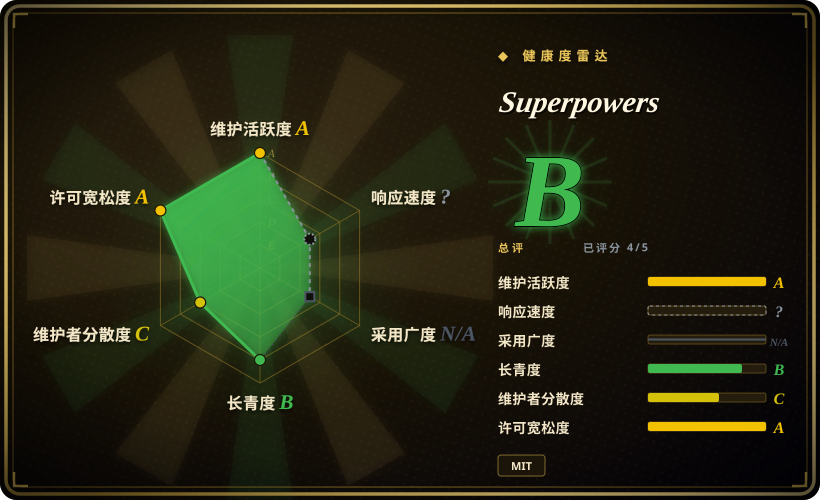
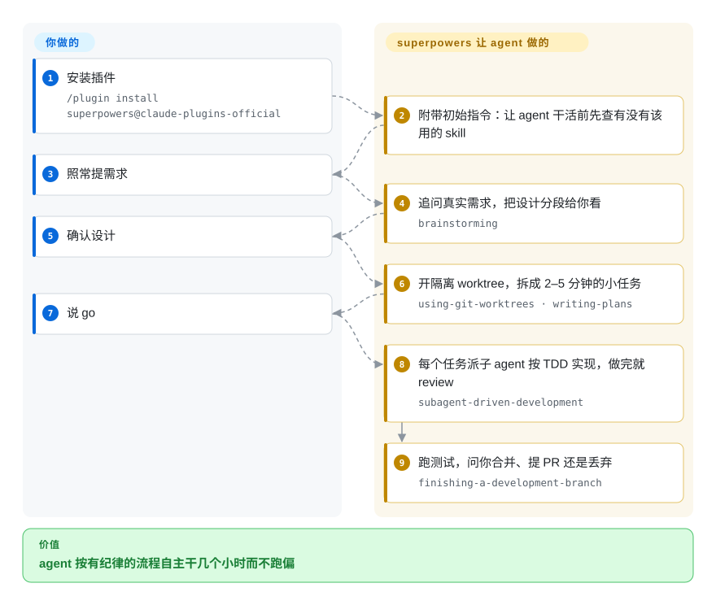

# Superpowers

一套可组合的 skills 库，以插件形式把完整的 SDLC 方法论——头脑风暴 → 写计划 → TDD → subagent 驱动执行 → 验证——装进你的编程 agent。

## 何时使用

你是一名开发者，在用 Claude Code（或 Codex、Cursor、Gemini CLI、OpenCode、Kimi、Droid…），反复撞上同一个失败模式：agent 上来就写代码，跳过先写失败测试，靠猜来“修” bug，然后没真正验证就宣布完成。你希望它像一名有纪律的资深工程师那样干活——先追问你到底想做什么、把计划写下来、做真正的 red-green-refactor、在 git worktree 上隔离改动、并在声称完成前跑一遍验证。Superpowers 正好把这些做成即插即用的插件：一组精心编排的 skills（`brainstorming`、`writing-plans`、`test-driven-development`、`systematic-debugging`、`subagent-driven-development`、`verification-before-completion`、`using-git-worktrees` 等）,agent 按需加载并逐步执行。

当你想要一套有主张、经实战检验的工作流，而不是从零搭自己的 skill 栈时，就该用它——尤其是当你希望同一套方法论能跨 harness 跟着你走。仓库自带各 agent 的插件清单（Claude `.claude-plugin`、Codex、Cursor、Kimi、OpenCode、Pi），因此无论今天的任务跑在 Claude Code 还是 Codex CLI，头脑风暴-计划-TDD-验证这条主轴都保持一致。通过你 agent 的 marketplace 安装一次，方法论就会经由各平台原生的 skill 加载机制激活。

## 怎么用起来

superpowers 本质是一组用 Markdown 写的「工作规程」（skill），再加一段初始指令，要求 agent **每次干活前先检查有没有该用的 skill**。所以装上之后你不用记任何命令，照常提需求；agent 会自己按一条固定流水线走：先问清楚你到底要什么并写成设计 → 开一个隔离的 git worktree → 把工作拆成几分钟一个的小任务 → 每个任务派一个子 agent 按「先写失败测试再写代码」实现，做完一个审一个 → 最后跑测试，问你合并、提 PR 还是丢弃。你负责的只是在两个节点点头：设计确认、开始执行。

<!-- flow-steps:begin (generated from flows/superpowers.json by tools/flow_card.py — do not edit) -->

流程文字版

1. **你**：安装插件 — `/plugin install superpowers@claude-plugins-official`
2. **Superpowers**：附带初始指令：让 agent 干活前先查有没有该用的 skill
3. **你**：照常提需求
4. **Superpowers**：追问真实需求，把设计分段给你看 — `brainstorming`
5. **你**：确认设计
6. **Superpowers**：开隔离 worktree，拆成 2–5 分钟的小任务 — `using-git-worktrees · writing-plans`
7. **你**：说 go
8. **Superpowers**：每个任务派子 agent 按 TDD 实现，做完就 review — `subagent-driven-development`
9. **Superpowers**：跑测试，问你合并、提 PR 还是丢弃 — `finishing-a-development-branch`

**价值**：agent 按有纪律的流程自主干几个小时而不跑偏

<!-- flow-steps:end -->

## 何时不用

- **你已经有一套自己信任的 skill/command 体系。** Superpowers 有强主张、强约束（强制先写失败测试、写代码前先 brainstorm）。把它叠在现有方法论栈之上，容易产生指令冲突和重复路由——只选一个事实源。
- **你不在受支持的 agent harness 上。** 它靠各平台的 skill 加载机制激活（Claude `Skill` 工具，Codex/Cursor/Kimi/Gemini/OpenCode 插件）。在不受支持或自研的 agent 上没有加载器去调用这些 skill，单凭 markdown 不会自动触发。
- **一次性脚本、抛弃式 spike、非代码任务。** 当你只想要一行 shell 或改个配置时，完整的 brainstorm→plan→TDD→verify 仪式就是负担；这套方法论假设的是真实的软件改动循环。
- **你想要的是运行时/库/CLI。** 这里没有可 `import` 或独立运行的东西——没有依赖、没有 API、没有服务。它只塑造 agent 的行为；离开支持它的 agent 就什么都不做。
- **上游迭代快、主张强。** 单维护者项目，已到 v6.x，发版频繁，行为固化在 prompt 里；一次版本升级就可能改变 skill 的路由方式或它强制的内容。需要稳定就锁版本，升级后重新核对。[推断]

## 横向对比

| 替代品 | 是否收录 | 我们的评价 | 取舍 |
|---|---|---|---|
| [SuperClaude Framework](superclaude.zh.md) | ✅ | 需要面向 persona、命令和 MCP 的 Claude Code 配置框架时，选 SuperClaude Framework。 | 面向 persona/命令/MCP 的 Claude Code 配置框架；命令和 agent 面更丰富，安装更重。Superpowers 更精简，主轴是 TDD/SDLC 纪律而非 persona 体系。 |
| [get-shit-done](../spec-driven-development/get-shit-done.zh.md) | ✅ | 需要面向交付的工作流/命令包时，选 get-shit-done。 | 面向交付的工作流/命令包；“驱动 agent 走流程”的目标有重叠，但流程形态不同。Superpowers 以 brainstorm-then-TDD 加 subagent 分派为主线。 |
| [Compound Engineering](compound-engineering.zh.md) | ✅ | 需要围绕复利/自动化模式构建的方法论插件时，选 Compound Engineering。 | 围绕复利/自动化模式构建的方法论插件；同源理念，基元不同。按哪条工作流主轴贴合你的团队来选。 |
| [ECC](ecc.zh.md) | ✅ | 需要本类目下另一套 agent 开发方法论，并对比生命周期约束时，选 ECC。 | 本类目下另一套 agent 开发方法论；对比点在于各自真正强制 vs 仅建议哪些生命周期阶段。 |
| [12-Factor Agents](../spec-driven-development/12-factor-agents.zh.md) | ✅ | 需要构建 agent *应用* 的原则，而不是装进编程 agent 的插件式 skill 包时，选 12-Factor Agents。 | 用于构建 agent *应用* 的原则/方法论文档，而非装进编程 agent 的插件式 skill 包——消费单位不同。 |
| [Anthropic Skills](../../agent-skills/vendor-collections/anthropic-skills.zh.md) / 内置 slash 命令 | 部分已收录 | 需要平台自带的 skill 生态，而不是第三方 SDLC 包时，选 Anthropic Skills。 | Anthropic Skills 是平台侧 skill 生态；Superpowers 是叠在其上的第三方精选包，因此可能与原生 skill 冲突或重复。内置 slash 命令未作为独立仓库收录。 |

## 健康度与可持续性

- **响应速度**：无法计算——type_na。
- **维护（2026-06）：** 活跃维护——最后 push 在 2026-06-25，最新 release v6.0.3（2026-06-18），未归档。v6.x 线上的频繁发版 = 活跃、快速迭代的项目（本页已标注「上游迭代快、主张强」）。
- **治理与 bus factor：** 仓库为 **User 持有**（obra / Jesse Vincent）——单维护者项目。约 240k star 的光环对应仅一人的托管，这是 **bus-factor 标记**，而非耐久信号；路线图与那些「强制」的 prompt 层规则都是一位作者的强主张。[未验证] 未公布共同维护者/基金会治理。
- **年龄与 Lindy（2026-06）：** 创建于 2025-10，约 8 个月，已到 v6.x——频繁的大版本跳跃意味着 skill 集合与路由逐版变动。Lindy 裁决：**按年龄看属未经验证**——高声量不等于寿命；为当下价值采用，pin 版本，升级后重新核对 skill 路由。
- **风险标记：** MIT（无 relicense）。约束是**建议性的**——行为存在于 agent 加载的 prompt/markdown skill 中，agent 仍可偏离，因此「强制先写失败测试」是 prompt 指令而非硬闸门。单维护者弃坑是主要的长期暴露。[未验证] 未审 CVE。

## 存疑（未验证）

- [未验证] 最新发布记为 v6.0.3（2026-06-18 发布），仓库最近 push 于 2026-06-25；截至 2026-06-26,GitHub 元数据显示 license 为 MIT、主语言为 Shell——依赖某具体版本行为前请重新核实。
- [未验证] star 数（2026-06-26 GitHub 显示约 23.9 万）不可靠且对时间敏感，仅供参考，不作为质量信号。
- [未验证] 受支持 agent 列表（Claude Code、Codex App/CLI、Cursor、Factory Droid、Gemini CLI、GitHub Copilot CLI、Kimi Code、OpenCode、Pi、Antigravity）来自项目 README；各 harness 实际激活的保真度不一，此处未独立确认。
- [推断] 因为行为存在于 agent 加载的 prompt/markdown skill 中，约束是建议性的——agent 仍可能偏离；“强制”步骤是 prompt 层指令，而非硬保证。
- [推断] skill 集合（本次核查为 13 个）和路由随版本变动；请核对当前 `skills/` 目录，而非依赖此列表。
