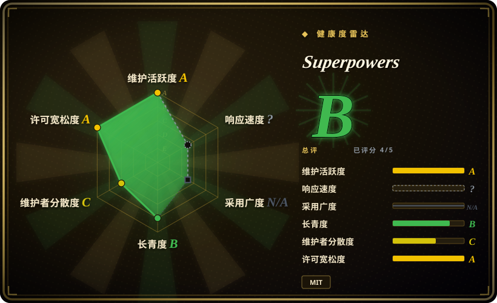
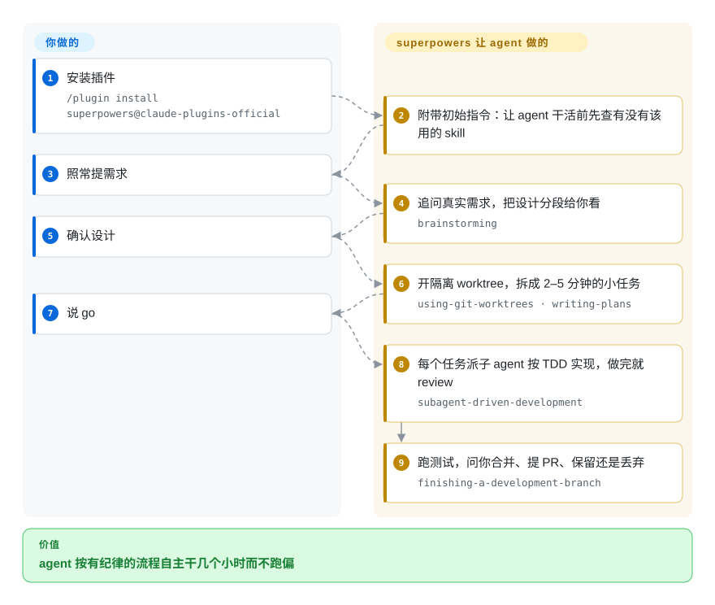

# Superpowers

你的编程 agent 上来就写代码、跳过失败测试、没验证就宣布收工。Superpowers 把一整套开发方法论——头脑风暴 → 写计划 → TDD → subagent 驱动执行 → 验证——以插件形式装进你的 agent：一组 Markdown 写的 skill，在动手之前自动触发。

## 何时使用

你是一名开发者，在用 Claude Code（或 Codex、Cursor、Gemini CLI、OpenCode、Kimi、Droid、Qwen Code、Devin……），反复撞上同一个失败模式：agent 上来就写代码，跳过先写失败测试，靠猜来“修” bug，然后没真正验证就宣布完成。你希望它像一名有纪律的资深工程师那样干活——先追问你到底想做什么、把计划写下来、做真正的 red-green-refactor、在 git worktree 上隔离改动、并在声称完成前跑一遍验证。Superpowers 正好把这些做成即插即用的插件：一组精心编排的 skills（共 15 个，含 `brainstorming`、`writing-plans`、`test-driven-development`、`systematic-debugging`、`subagent-driven-development`、`verification-before-completion`、`using-git-worktrees` 等），agent 按需加载并逐步执行。

当你想要一套有主张、经实战检验的工作流，而不是从零搭自己的 skill 栈时，就该用它——尤其是当你希望同一套方法论能跨 harness 跟着你走。截至 v6.4.2，README 列出了 16 条安装路径（Claude Code 官方插件市场、Antigravity、Codex App/CLI、Cursor、Devin CLI、Factory Droid、Gemini CLI、GitHub Copilot CLI、Grok Build CLI、Kimi Code、OpenCode、Pi、Qwen Code、Hermes Agent、Muse），因此无论今天的任务跑在 Claude Code 还是 Codex CLI，头脑风暴-计划-TDD-验证这条主轴都保持一致。通过你 agent 的 marketplace 安装一次，方法论就会经由各平台原生的 skill 加载机制激活。

## 怎么用起来

superpowers 本质是一组用 Markdown 写的「工作规程」（skill），再加一段初始指令，要求 agent **每次干活前先检查有没有该用的 skill**。所以装上之后你不用记任何命令，照常提需求；agent 会自己按一条固定流水线走：先问清楚你到底要什么并写成设计 → 开一个隔离的 git worktree → 把工作拆成几分钟一个的小任务 → 每个任务派一个子 agent 按「先写失败测试再写代码」实现，做完一个审一个（更省钱的 `executing-plans` 模式则改为在当前会话内逐任务执行）→ 最后跑测试，问你合并、提 PR 还是丢弃。你负责的只是在两个节点点头：设计确认、开始执行。要是某次会话不听话，还有个 `diagnosing-superpowers` skill 会去读会话记录，逐行报告哪里出了问题。

<!-- flow-steps:begin (generated from flows/superpowers.json by tools/flow_card.py — do not edit) -->

流程文字版

1. **你**：安装插件 — `/plugin install superpowers@claude-plugins-official`
2. **Superpowers**：附带初始指令：让 agent 干活前先查有没有该用的 skill
3. **你**：照常提需求
4. **Superpowers**：追问真实需求，把设计分段给你看 — `brainstorming`
5. **你**：确认设计
6. **Superpowers**：开隔离 worktree，拆成 2–5 分钟的小任务 — `using-git-worktrees · writing-plans`
7. **你**：说 go
8. **Superpowers**：每个任务派子 agent 按 TDD 实现，做完就 review — `subagent-driven-development`
9. **Superpowers**：跑测试，问你合并、提 PR、保留还是丢弃 — `finishing-a-development-branch`

**价值**：agent 按有纪律的流程自主干几个小时而不跑偏

<!-- flow-steps:end -->

## 何时不用

- **你已经有一套自己信任的 skill/command 体系。** Superpowers 有强主张、强约束（强制先写失败测试、写代码前先 brainstorm）。把它叠在现有方法论栈之上，容易产生指令冲突和重复路由——只选一个事实源。
- **你不在受支持的 agent harness 上。** 它靠各平台的 skill 加载机制激活（Claude `Skill` 工具、Codex/Cursor/Kimi/Gemini/OpenCode 插件，以及 README 安装矩阵里的其余 marketplace 路径）。在不受支持或自研的 agent 上没有加载器去调用这些 skill，单凭 markdown 不会自动触发。
- **一次性脚本、抛弃式 spike、非代码任务。** 当你只想要一行 shell 或改个配置时，完整的 brainstorm→plan→TDD→verify 仪式就是负担；这套方法论假设的是真实的软件改动循环。
- **你想要的是运行时/库/CLI。** 这里没有可 `import` 或独立运行的东西——没有依赖、没有 API、没有服务。它只塑造 agent 的行为；离开支持它的 agent 就什么都不做。
- **上游迭代快、主张强，且 skill 集合不对外扩容。** 已到 v6.x，发版频繁（约 14 周内 v6.0.3 → v6.4.2），行为固化在 prompt 里；一次版本升级就可能改变 skill 的路由方式或它强制的内容，需要稳定就锁版本。README 还声明一般不接受新增 skill 的贡献，所以它会一直是这支团队精选的方法论，而不是越长越大的市场。[推断]

## 横向对比

| 替代品 | 是否收录 | 我们的评价 | 取舍 |
|---|---|---|---|
| [SuperClaude Framework](superclaude.zh.md) | ✅ | 需要面向 persona、命令和 MCP 的 Claude Code 配置框架时，选 SuperClaude Framework。 | 面向 persona/命令/MCP 的 Claude Code 配置框架；命令和 agent 面更丰富，安装更重。Superpowers 更精简，主轴是 TDD/SDLC 纪律而非 persona 体系。 |
| [get-shit-done](../spec-driven-development/get-shit-done.zh.md) | ✅ | `gsd-build/get-shit-done` 仓库已归档（2026-09）；要面向交付的阶段循环，请选它仍在活跃的继任仓库 `open-gsd/gsd-core`（未收录），本页只作模式参考。 | 面向交付的工作流/命令包，“驱动 agent 走流程”的目标有重叠；它的安装渠道已迁到另一个 org，所以和 Superpowers 的真正对比其实是“继任者对继任者”，而非本页对彼页。 |
| [Compound Engineering](compound-engineering.zh.md) | ✅ | 需要围绕复利/自动化模式构建的方法论插件时，选 Compound Engineering。 | 围绕复利/自动化模式构建的方法论插件；同源理念，基元不同。按哪条工作流主轴贴合你的团队来选。 |
| [ECC](ecc.zh.md) | ✅ | 需要本类目下另一套 agent 开发方法论，并对比生命周期约束时，选 ECC。 | 本类目下另一套 agent 开发方法论；对比点在于各自真正强制 vs 仅建议哪些生命周期阶段。 |
| [12-Factor Agents](../spec-driven-development/12-factor-agents.zh.md) | ✅ | 需要构建 agent *应用* 的原则，而不是装进编程 agent 的插件式 skill 包时，选 12-Factor Agents。 | 用于构建 agent *应用* 的原则/方法论文档，而非装进编程 agent 的插件式 skill 包——消费单位不同。 |
| [Anthropic Skills](../../agent-skills/vendor-collections/anthropic-skills.zh.md) / 内置 slash 命令 | 部分已收录 | 需要平台自带的 skill 生态，而不是第三方 SDLC 包时，选 Anthropic Skills。 | Anthropic Skills 是平台侧 skill 生态；Superpowers 是叠在其上的第三方精选包，因此可能与原生 skill 冲突或重复。内置 slash 命令未作为独立仓库收录。 |

## 健康度与可持续性

- **响应速度**：无法计算——type_na。
- **维护（2026-09）：** 活跃维护——最后 push 在 2026-09-27，最新 release v6.4.2（2026-09-25），未归档。从 v6.0.3（6 月）到 v6.4.2（9 月）是 v6.x 线上快速而稳定的小版本节奏。
- **治理与 bus factor：** 仓库为 **User 持有**（obra / Jesse Vincent），评分器测得 12 个月内单一作者约占 74% 的提交（活跃贡献者共 47 人）——作者集中度依旧。README 如今写明由「Jesse Vincent 与 [Prime Radiant] 的其他成员」打造，并提供商业支持，因此读起来是「小公司背书 + 作者高度集中」而非纯业余单干。[未验证] Prime Radiant 在治理/路线图上的正式角色未在仓库内说明。
- **年龄与 Lindy（2026-09）：** 创建于 2025-10，约 12 个月，已到 v6.4.x——频繁的小版本意味着 skill 集合与路由逐版变动。Lindy 裁决：**刚过「未经验证」，远谈不上久经时间**——约 29.2 万 star 是高采用度，不是寿命；为当下价值采用，pin 版本，升级后重新核对 skill 路由。
- **风险标记：** MIT（无 relicense）。约束是**建议性的**——行为存在于 agent 加载的 prompt/markdown skill 中，agent 仍可偏离，因此「强制先写失败测试」是 prompt 指令而非硬闸门。上游一般不接受新增 skill 贡献，方法论的形态由一支团队说了算。README 披露了可选的版本上报 telemetry（logo 从 primeradiant.com 加载）。单一作者集中仍是主要的长期暴露。[未验证] 未审 CVE。

## 存疑（未验证）

- [未验证] 最新发布为 v6.4.2（2026-09-25 发布），仓库最近 push 于 2026-09-27；截至 2026-09-27，GitHub 元数据显示 license 为 MIT、主语言为 Shell——依赖某具体版本行为前请重新核实。
- [未验证] star 数（2026-09-27 GitHub 显示约 29.2 万）不可靠且对时间敏感，仅供参考，不作为质量信号。
- [未验证] 受支持 agent 列表（Claude Code、Antigravity、Codex App/CLI、Cursor、Devin CLI、Factory Droid、Gemini CLI、GitHub Copilot CLI、Grok Build CLI、Kimi Code、OpenCode、Pi、Qwen Code、Hermes Agent、Muse）来自项目 README；各 harness 实际激活的保真度不一，此处未独立确认。
- [推断] 因为行为存在于 agent 加载的 prompt/markdown skill 中，约束是建议性的——agent 仍可能偏离；“强制”步骤是 prompt 层指令，而非硬保证。
- [推断] skill 集合（2026-09-27 核查 `skills/` 目录为 15 个）和路由随版本变动，请核对当前目录而非依赖此列表。
- [未验证] README 披露了可选 telemetry：brainstorming 可视化伴侣上的 Prime Radiant logo 从其网站加载，请求中携带 Superpowers 版本号，可用 `SUPERPOWERS_DISABLE_TELEMETRY` 关闭；此处只核对了 README 自述，未实测请求本身。
- [未验证] README 写明项目由「Jesse Vincent 与 Prime Radiant 的其他成员」打造并提供商业支持（sales@primeradiant.com）；Prime Radiant 在治理与路线图上的正式角色仓库内无文档。
