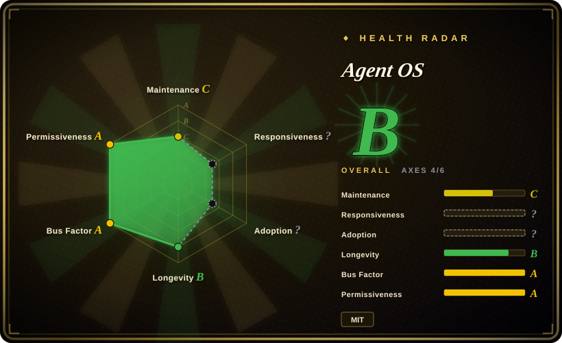
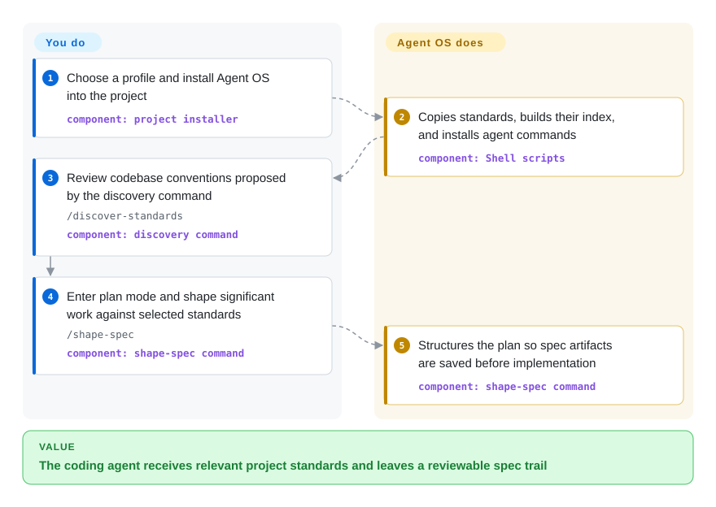

# Agent OS

A lightweight standards-and-spec layer for coding agents that installs project conventions, indexes them for selective injection, and shapes plans before implementation.

## When to use

You maintain several codebases or project profiles and want Claude Code, Cursor, or another plan-capable coding agent to build against the conventions your team already follows. Choose Agent OS when the deciding need is to discover those conventions, keep them as reviewable Markdown standards, inject only the relevant ones, and save shaped plans under the repository without replacing the host agent's own planning and implementation loop.

It is a better fit than an end-to-end harness when you deliberately want a thin layer around the coding tool you already use. The v3 design delegates task breakdown and implementation orchestration to that host tool; this keeps Agent OS focused, but it also means standards and specs guide the agent rather than mechanically enforcing the resulting code.

## How it works

You install a chosen Agent OS profile into a project; its Shell scripts copy standards, build `agent-os/standards/index.yml`, and install agent commands. The agent can then inspect the codebase with `/discover-standards`, propose documented conventions, and use the index to select relevant material. For significant work, you enter the host tool's plan mode and run `/shape-spec`; Agent OS gathers scope, references, product context, and standards, then structures a plan whose first task saves the spec artifacts under `agent-os/specs/`. You own the standards, approve the questions and plan, and run the implementation; Agent OS supplies the reusable command workflow and repository-local context.

<!-- flow-steps:begin (generated from flows/agent-os.json by tools/flow_card.py — do not edit) -->

Text version of the flow

1. **You**: Choose a profile and install Agent OS into the project — component: `project installer`
2. **Agent OS**: Copies standards, builds their index, and installs agent commands — component: `Shell scripts`
3. **You**: Review codebase conventions proposed by the discovery command — `/discover-standards` — component: `discovery command`
4. **You**: Enter plan mode and shape significant work against selected standards — `/shape-spec` — component: `shape-spec command`
5. **Agent OS**: Structures the plan so spec artifacts are saved before implementation — component: `shape-spec command`

**Value**: The coding agent receives relevant project standards and leaves a reviewable spec trail

<!-- flow-steps:end -->

## When NOT to use

- **You need the methodology to execute, delegate, verify, and checkpoint implementation phases.** Choose [Get Shit Done](get-shit-done.md) or [Superpowers](../coding-agent-harnesses/superpowers.md); Agent OS v3 explicitly retired its implementation and orchestration phases in favor of the host agent's capabilities.
- **You want a vendor-backed CLI that starts from constitutions, specifications, plans, and task lists.** Choose [Spec Kit](spec-kit.md); Agent OS centers codebase standards and lightweight spec shaping rather than a broader SDD artifact pipeline.
- **You need explicit analyst, product-manager, architect, developer, and QA roles.** Choose [BMAD Method](bmad-method.md); Agent OS v3 intentionally removed its own subagents and keeps the process surface smaller.
- **You need deterministic conformance, tests, or policy enforcement.** Use CI, linters, and policy-as-code alongside a specification system; Agent OS commands provide model-readable context and prompts, not a deterministic enforcement engine.
- **Your coding tool has no compatible command/skill surface or plan mode.** Choose plain repository instructions and conventional design documents; `/shape-spec` requires plan mode, and the included installer targets project-local command files.

## Comparison

| Alternative | In index | Our verdict | Tradeoff |
|---|---|---|---|
| [Spec Kit](spec-kit.md) | ✅ | Choose Agent OS when reusable codebase standards and selective context injection are the main problem; choose Spec Kit when a vendor-backed, artifact-rich SDD pipeline matters more. | Agent OS is thinner and standards-first; Spec Kit brings a broader CLI and specification workflow but asks the team to adopt more of its process vocabulary. |
| [Get Shit Done](get-shit-done.md) | ✅ | Choose Agent OS when the host coding agent should retain control of planning and implementation; choose GSD when fresh-context phases, subagent execution, checkpoints, and verification are the reason to adopt a method. | Agent OS adds less orchestration overhead, but GSD carries work further from idea through execution and review. |
| [Superpowers](../coding-agent-harnesses/superpowers.md) | ✅ | Choose Agent OS when project-specific standards and saved specs are the durable assets; choose Superpowers when a composable brainstorm-to-TDD-to-review skill workflow is the primary need. | Agent OS organizes standards and plan context; Superpowers supplies a wider development discipline but is less centered on a standards index and reusable profiles. |
| [BMAD Method](bmad-method.md) | ✅ | Choose Agent OS for a small standards-and-spec layer around an existing coding tool; choose BMAD Method when explicit product and engineering roles across a fuller delivery lifecycle justify heavier ceremony. | Agent OS is easier to adopt selectively; BMAD offers more role specialization and lifecycle coverage at the cost of a much larger process surface. |

## Health & viability

- **Maintenance:** Grade C — the latest commit was 24 days before scoring, but only 1 of the trailing 13 weeks was active. The latest tagged release is v3.0.0 from 2026-01-20; four maintenance commits landed on 2026-05-05 and the default branch moved again on 2026-08-29, but there has been no tagged release since January, so the release cadence is quiet rather than rapid.
- **Responsiveness:** Not scored — the health rubric treats issue responsiveness as not applicable to `skill-pack` entries.
- **Adoption:** Not scored — Agent OS has no canonical registry package. GitHub nevertheless reported 5,434 stars and 831 forks on 2026-09-22; those counters measure repository interest, not production use.
- **Longevity:** Grade B — the repository was 432 days old at scoring and its latest commit was 24 days old. That age-plus-recency is a limited positive Lindy signal for a young skill pack. [推断]
- **Governance:** Grade A — 11 maintainers were active in the measured 12-month window; the top contributor accounted for 23.5% and the top three for 52.9% of measured contributions.
- **Risk / License:** Grade A — GitHub and `LICENSE` identify permissive MIT terms, with no relicense detected in the measured 36-month window. The principal product risk is workflow churn: v3 retired the v2 implementation and orchestration phases and changed commands while preserving standards and spec content.

## Caveats (unverified)

- [推断] The thin v3 scope reduces process overhead relative to end-to-end harnesses, but actual overhead depends on how many standards and profiles a team maintains.
- [推断] A 432-day repository age plus a commit 24 days before scoring is a limited positive Lindy signal, not a prediction of future maintenance.
- [未验证] GitHub stars and forks show repository interest, not successful production use or spec quality.
