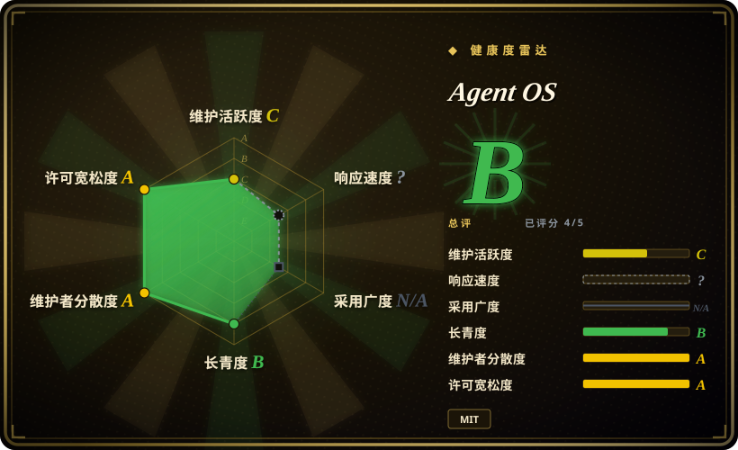
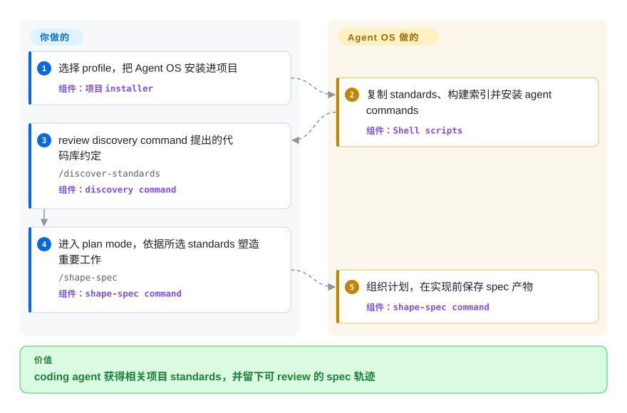

# Agent OS

一个面向 coding agent 的轻量 standards 与 spec 层：安装项目约定、为选择性注入建立索引，并在实现前塑造计划。

## 何时使用

你维护多个代码库或项目 profile，希望 Claude Code、Cursor 或其他支持 plan mode 的 coding agent 按团队既有约定构建。核心需求是发现这些约定、把它们保存为可 review 的 Markdown standards、只注入当前相关部分，并把塑造后的计划留在仓库中，同时不替换宿主 agent 自己的规划与实现循环，此时选 Agent OS。

如果你刻意想在现有 coding tool 外只加一层薄方法，它比端到端 harness 更合适。v3 把任务拆解与实现编排交给宿主工具，因此 Agent OS 更专注；代价是 standards 与 specs 只引导 agent，不会机械执行生成代码的合规性。

## 怎么用起来

你先把选定的 Agent OS profile 安装进项目；它的 Shell scripts 会复制 standards、构建 `agent-os/standards/index.yml`，并安装 agent commands。agent 随后可用 `/discover-standards` 检查代码库、提出应记录的约定，再借索引挑出相关材料。面对重要工作，你进入宿主工具的 plan mode 并运行 `/shape-spec`；Agent OS 收集范围、参考实现、产品上下文与 standards，然后组织计划，并把保存 spec 产物固定为第一项任务。standards、问答确认、计划批准与实现由你负责；Agent OS 提供可复用的 command workflow 和仓库内上下文。

<!-- flow-steps:begin (generated from flows/agent-os.json by tools/flow_card.py — do not edit) -->

流程文字版

1. **你**：选择 profile，把 Agent OS 安装进项目 — 组件：`项目 installer`
2. **Agent OS**：复制 standards、构建索引并安装 agent commands — 组件：`Shell scripts`
3. **你**：review discovery command 提出的代码库约定 — `/discover-standards` — 组件：`discovery command`
4. **你**：进入 plan mode，依据所选 standards 塑造重要工作 — `/shape-spec` — 组件：`shape-spec command`
5. **Agent OS**：组织计划，在实现前保存 spec 产物 — 组件：`shape-spec command`

**价值**：coding agent 获得相关项目 standards，并留下可 review 的 spec 轨迹

<!-- flow-steps:end -->

## 何时不用

- **你需要方法本身执行、委派、验证并为各实现阶段设置 checkpoint。** 选 [Get Shit Done](get-shit-done.zh.md) 或 [Superpowers](../coding-agent-harnesses/superpowers.zh.md)；Agent OS v3 明确退役了实现与编排阶段，改为依赖宿主 agent 的能力。
- **你想要由大厂支持，并从 constitution、specification、plan 一路生成 task list 的 CLI。** 选 [Spec Kit](spec-kit.zh.md)；Agent OS 围绕代码库 standards 与轻量 spec shaping，而不是更宽的 SDD 产物流水线。
- **你需要明确的 analyst、product manager、architect、developer 与 QA 角色。** 选 [BMAD Method](bmad-method.zh.md)；Agent OS v3 有意移除了自带 subagents，把流程面保持得更小。
- **你需要确定性的 conformance、测试或 policy enforcement。** 在 specification 系统旁使用 CI、linters 与 policy-as-code；Agent OS commands 提供模型可读上下文和 prompts，不是确定性 enforcement engine。
- **你的 coding tool 没有兼容的 command 或 skill 表面，也没有 plan mode。** 选普通仓库指令与传统设计文档；`/shape-spec` 要求 plan mode，自带 installer 也面向项目内 command files。

## 横向对比

| 替代品 | 是否收录 | 我们的评价 | 取舍 |
|---|---|---|---|
| [Spec Kit](spec-kit.zh.md) | ✅ | 主要问题是复用代码库 standards 与选择性注入上下文时选 Agent OS；更看重大厂支持、产物更丰富的 SDD 流水线时选 Spec Kit。 | Agent OS 更薄且 standards-first；Spec Kit 带来更宽的 CLI 与 specification workflow，但团队要采用更多专属流程词汇。 |
| [Get Shit Done](get-shit-done.zh.md) | ✅ | 希望宿主 coding agent 保留规划与实现控制权时选 Agent OS；采用方法的理由是 fresh-context phases、subagent execution、checkpoints 与 verification 时选 GSD。 | Agent OS 增加的编排负担更少；GSD 则把工作从想法继续带到执行与 review。 |
| [Superpowers](../coding-agent-harnesses/superpowers.zh.md) | ✅ | 把项目专属 standards 与留存 specs 当作长期资产时选 Agent OS；主要需要可组合的 brainstorm、TDD、review skill workflow 时选 Superpowers。 | Agent OS 组织 standards 与 plan context；Superpowers 给出更宽的开发纪律，但不以 standards index 和可复用 profiles 为中心。 |
| [BMAD Method](bmad-method.zh.md) | ✅ | 只想在现有 coding tool 外增加小型 standards 与 spec 层时选 Agent OS；显式产品和工程角色覆盖完整交付 lifecycle，并值得承担更重 ceremony 时选 BMAD Method。 | Agent OS 更容易选择性采用；BMAD 提供更多角色分工与 lifecycle 覆盖，代价是大得多的流程面。 |

## 健康度与可持续性

- **维护：** Grade C——评分时最近一次 commit 距今 24 天，但过去 13 周只有 1 周活跃。最新 tag release 是 2026-01-20 的 v3.0.0；2026-05-05 有四个 maintenance commits，default branch 又在 2026-08-29 前进，但一月以后没有新 tag release，因此 release cadence 安静，而非快速。
- **响应速度：** 不评分——health rubric 把 issue responsiveness 视为不适用于 `skill-pack` 条目。
- **采用：** 不评分——Agent OS 没有 canonical registry package。截至 2026-09-22，GitHub 仍显示 5,434 stars 与 831 forks；这些计数反映仓库关注度，而非生产使用。
- **长青度：** Grade B——评分时仓库已创建 432 天，最近一次 commit 距今 24 天。对年轻 skill pack 来说，年龄与 recency 的组合构成有限的正面 Lindy 信号。[推断]
- **治理：** Grade A——评分所测的 12 个月窗口内有 11 名活跃维护者；头部一人占贡献的 23.5%，前三人占 52.9%。
- **风险与许可：** Grade A——GitHub 与 `LICENSE` 都标明宽松的 MIT 条款，所测 36 个月窗口内未发现 relicense。主要产品风险是 workflow churn：v3 退役了 v2 的实现与编排 phases，并更换 commands，但保留 standards 与 spec 内容。

## 存疑（未验证）

- [推断] 相比端到端 harness，v3 的较薄范围会减少流程负担；实际负担仍取决于团队维护多少 standards 与 profiles。
- [推断] 432 天仓库年龄加上评分前 24 天的 commit，只构成有限的正面 Lindy 信号，并不是未来维护的预测。
- [未验证] GitHub stars 与 forks 只能说明仓库关注度，不能证明生产使用成功或 spec 质量。
