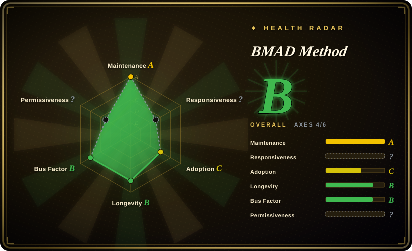
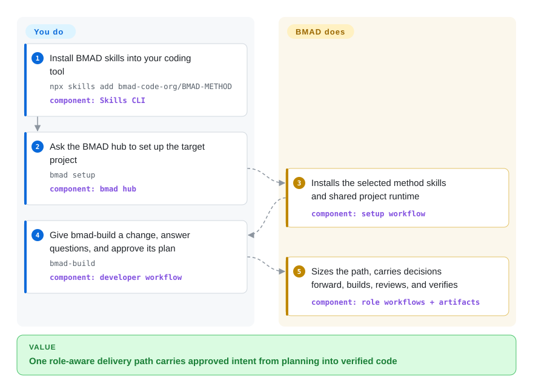

# BMAD Method

A role-driven, end-to-end method that gives coding agents analyst, product, architecture, UX, development, and review workflows sized to the change.

## When to use

You are taking a product idea or a substantial change through an AI coding tool, and the hard part is preserving decisions from discovery into implementation rather than merely producing code. Choose BMAD Method when you want named analyst, PM, architect, developer, and UX perspectives plus explicit briefs, PRDs, specs, architecture, stories, build, review, and retrospective workflows. It is a stronger fit than Spec Kit when role-separated product discovery and delivery matter more than a narrower specification pipeline, and stronger than GSD when you accept more process surface in exchange for broader lifecycle coverage.

For a small, already-clear change, the same installation can route directly to `bmad-build`; larger work can add only the planning artifacts it needs. That adaptive path is the deciding benefit if your portfolio spans quick fixes, epics, and multi-epic products but you still want one vocabulary for the handoffs.

## How it works

You install BMAD's skills into a supported coding tool and run `bmad setup` in the target project. You then invoke a workflow directly or ask the `bmad` hub what comes next; for a change, `bmad-build` clarifies intent, proposes a plan, and waits for your approval. BMAD carries approved decisions through generated artifacts and specialized role perspectives, while the coding agent edits, reviews, and verifies the code. You remain responsible for choosing the path, answering product and technical questions, approving decisions, supervising tool permissions, and accepting the result; BMAD supplies the prompts, handoffs, artifact structure, and workflow sequence.

<!-- flow-steps:begin (generated from flows/bmad-method.json by tools/flow_card.py — do not edit) -->

Text version of the flow

1. **You**: Install BMAD skills into your coding tool — `npx skills add bmad-code-org/BMAD-METHOD` — component: `Skills CLI`
2. **You**: Ask the BMAD hub to set up the target project — `bmad setup` — component: `bmad hub`
3. **BMAD Method**: Installs the selected method skills and shared project runtime — component: `setup workflow`
4. **You**: Give bmad-build a change, answer questions, and approve its plan — `bmad-build` — component: `developer workflow`
5. **BMAD Method**: Sizes the path, carries decisions forward, builds, reviews, and verifies — component: `role workflows + artifacts`

**Value**: One role-aware delivery path carries approved intent from planning into verified code

<!-- flow-steps:end -->

## When NOT to use

- **You only need a compact spec-to-plan-to-tasks pipeline.** Choose [Spec Kit](spec-kit.md) instead, because BMAD's named roles and wider product lifecycle add prompt and process surface that a focused specification workflow avoids.
- **Your main failure mode is context rot across many implementation phases.** Evaluate [Get Shit Done](get-shit-done.md) or its maintained successor rather than adopting BMAD primarily for fresh-context execution; GSD makes phase isolation its central design choice, while BMAD optimizes for broader lifecycle coverage.
- **You want a small set of editable methodology documents rather than an installed workflow system.** Choose [USDAD](usdad.md), whose four-persona prose source is easier to inspect and own, at the cost of BMAD's richer workflow and tool integration.
- **You need deterministic evidence that the method improves code quality.** Use conventional TDD, CI gates, and human review as the acceptance system; BMAD workflows are executed by an LLM-backed coding tool, so outcomes remain dependent on the model, context, permissions, and reviewer judgment.
- **Trademark constraints conflict with your redistribution or branding plan.** Use an MIT alternative such as [Spec Kit](spec-kit.md) under its own terms and review its branding rules; BMAD's software is MIT-licensed, but its license file separately states that BMad names and marks are not licensed for other purposes.

## Comparison

| Alternative | In index | Our verdict | Tradeoff |
|---|---|---|---|
| [Spec Kit](spec-kit.md) | ✅ | Choose BMAD when analyst, PM, architecture, UX, build, and retrospective roles must carry one initiative end to end; choose Spec Kit when a tighter specification workflow and GitHub backing matter more than role breadth. | BMAD gains broader discovery and delivery coverage but asks the team to learn more roles, skills, and artifacts. |
| [Get Shit Done](get-shit-done.md) | ✅ | Choose BMAD for adaptive planning across product discovery through delivery; choose GSD's maintained successor when fresh contexts and an opinionated phase-execution loop are the primary requirement. | BMAD covers more of the product lifecycle; GSD concentrates harder on context isolation, but this indexed GSD repository is archived and redirected. |
| [Agent OS](agent-os.md) | ✅ | Choose BMAD when explicit product and engineering roles should carry work through implementation and review; choose Agent OS when you only need a thin standards-and-spec layer around the host coding tool. | BMAD adds lifecycle orchestration and role specialization; Agent OS v3 is easier to adopt selectively but delegates implementation and verification to the host agent. |
| [USDAD](usdad.md) | ✅ | Choose BMAD when you want installable skills and richer lifecycle automation; choose USDAD when four explicit personas in editable prose are enough and auditability matters more than automation. | BMAD supplies more workflows and integrations; USDAD has a much smaller surface but is a one-commit methodology artifact. |
| [Spec-Anchored Agentic Development](spec-anchored-agentic-development.md) | ✅ | Choose BMAD for role-based product planning and delivery; choose Spec-Anchored Agentic Development when permanent capability specs and continuous spec-to-code conformance are the decisive controls. | BMAD broadens roles and artifact types; the alternative is narrower and easier to start from one capability spec, but is much younger and Claude Code-specific. |

## Health & viability

- **Maintenance:** Grade A — the default branch had a commit 4 days before scoring and was active in all 13 measured weeks; v6.12.0 was released on 2026-09-04 after regular 2026 releases.
- **Responsiveness:** Not scored — for a `skill-pack`, the health rubric does not treat repository issues as the applicable support channel.
- **Adoption:** Grade C — the measured npm package had 84,141 downloads in the preceding month and 0 dependent repositories in the dependency graph. The separate 53.3k GitHub-star count is unusually high for the project's age, so treat it as an attention signal and risk flag, not evidence of outcome quality or production adoption.
- **Longevity:** Grade B — the repository was 527 days old and still active at scoring time. That age-plus-activity is encouraging, but the project remains young by Lindy standards. [推断]
- **Governance:** Grade B — 78 active maintainers were measured over 12 months; the top contributor supplied 53.6% and the top three 81.8% of contributions.
- **Risk / License:** Not scored — GitHub reports `NOASSERTION`, while the repository's `LICENSE` contains the standard MIT grant and disclaimer plus a separate notice reserving BMad trademarks. Treat the code grant as MIT but review the trademark terms before branded redistribution.

## Caveats (unverified)

- [推断] BMAD's adaptive workflow can reduce unnecessary ceremony when users follow its routing guidance, but that operational effect has not been independently benchmarked.
- [未验证] No independent production-adoption dataset was found to explain how much of the repository's unusually high star count reflects sustained use rather than attention around AI development methods.
- [推断] The longevity verdict combines the repository's 527-day age with current activity; it is a selection prior, not a prediction of future maintenance.
- [推断] The LLM-backed workflows can make decisions and handoffs more explicit, but they do not make implementation or review outcomes deterministic; behavior varies with model, context, permissions, and user oversight.
