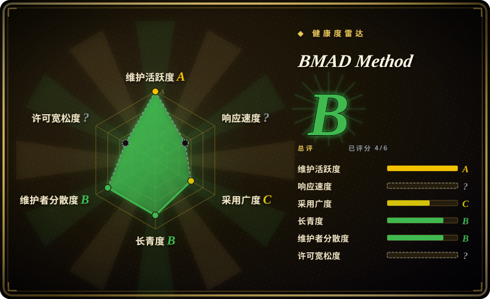
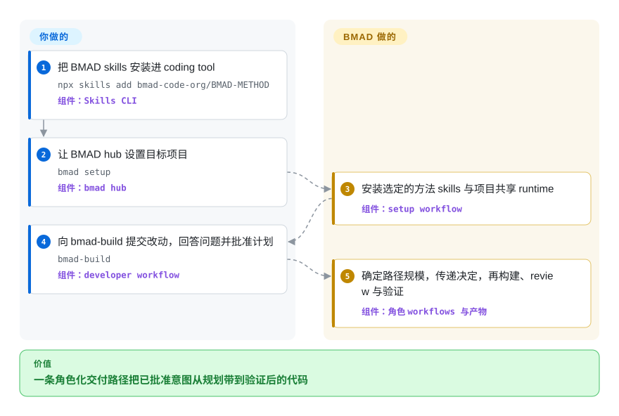

# BMAD Method

一套角色驱动的端到端方法：按改动规模，为 coding agent 配置 analyst、产品、架构、UX、开发与 review 工作流。

## 何时使用

你要用 AI coding tool 把产品想法或较大改动一路做到实现，难点不是产出代码，而是让 discovery 阶段的决定不在交接中丢失。当你需要具名的 analyst、PM、architect、developer 与 UX 视角，以及显式的 brief、PRD、spec、架构、story、build、review 和 retrospective 工作流时，选 BMAD Method。相较 Spec Kit，它更适合重视角色分工的产品 discovery 与交付；相较 GSD，它用更大的流程表面换取更广的生命周期覆盖。

对于已经明确的小改动，同一套安装可以直接进入 `bmad-build`；更大的工作再按需增加规划产物。如果你的工作同时包含 quick fix、epic 和 multi-epic 产品，又希望交接沿用同一套词汇，这种自适应路径就是主要优势。

## 怎么用起来

你先把 BMAD skills 安装进受支持的 coding tool，再在目标项目里运行 `bmad setup`。随后可以直接调用某个 workflow，也可以让 `bmad` hub 推荐下一步；处理改动时，`bmad-build` 会澄清意图、提出计划并等待你批准。BMAD 通过生成的产物与专业角色视角传递已批准的决定，coding agent 则修改、review 并验证代码。路径选择、产品与技术问题的回答、决定批准、工具权限监督和结果验收仍由你负责；BMAD 提供 prompts、交接、产物结构与 workflow 顺序。

<!-- flow-steps:begin (generated from flows/bmad-method.json by tools/flow_card.py — do not edit) -->

流程文字版

1. **你**：把 BMAD skills 安装进 coding tool — `npx skills add bmad-code-org/BMAD-METHOD` — 组件：`Skills CLI`
2. **你**：让 BMAD hub 设置目标项目 — `bmad setup` — 组件：`bmad hub`
3. **BMAD Method**：安装选定的方法 skills 与项目共享 runtime — 组件：`setup workflow`
4. **你**：向 bmad-build 提交改动，回答问题并批准计划 — `bmad-build` — 组件：`developer workflow`
5. **BMAD Method**：确定路径规模，传递决定，再构建、review 与验证 — 组件：`角色 workflows 与产物`

**价值**：一条角色化交付路径把已批准意图从规划带到验证后的代码

<!-- flow-steps:end -->

## 何时不用

- **你只需要紧凑的 spec 到 plan 再到 tasks 流水线。** 改选 [Spec Kit](spec-kit.zh.md)；BMAD 的具名角色与更宽产品生命周期会增加 prompt 和流程表面，而聚焦规格的 workflow 可以避开这些负担。
- **你的主要问题是多个实现阶段之间的 context rot。** 评估 [Get Shit Done](get-shit-done.zh.md) 或其仍维护的后继项目，不要仅为了 fresh-context 执行采用 BMAD；GSD 把阶段隔离放在设计中心，BMAD 则优化更广的生命周期覆盖。
- **你要的是少量可编辑方法文档，而不是安装式 workflow 系统。** 选 [USDAD](usdad.zh.md)；它的四 persona prose source 更容易检查与掌控，代价是没有 BMAD 那么丰富的 workflow 和工具集成。
- **你需要方法改善代码质量的确定性证据。** 用传统 TDD、CI gates 与人工 review 组成验收系统；BMAD workflow 由 LLM-backed coding tool 执行，结果仍取决于模型、context、权限和 reviewer 判断。
- **商标约束与你的再分发或品牌方案冲突。** 改用 [Spec Kit](spec-kit.zh.md) 等 MIT 替代品并检查其品牌规则；BMAD 软件采用 MIT，但许可证文件另行声明，BMad 名称与商标未授权用于其他目的。

## 横向对比

| 替代品 | 是否收录 | 我们的评价 | 取舍 |
|---|---|---|---|
| [Spec Kit](spec-kit.zh.md) | ✅ | analyst、PM、架构、UX、build 与 retrospective 角色需要端到端承接同一 initiative 时选 BMAD；更看重紧凑规格 workflow 与 GitHub 背书时选 Spec Kit。 | BMAD 获得更广的 discovery 与交付覆盖，但团队要学习更多角色、skills 与产物。 |
| [Get Shit Done](get-shit-done.zh.md) | ✅ | 需要从产品 discovery 到交付的自适应规划时选 BMAD；fresh context 和强约束阶段执行循环是首要需求时，选 GSD 仍维护的后继项目。 | BMAD 覆盖更多产品生命周期；GSD 更集中于 context 隔离，但本索引收录的 GSD 仓库已归档并重定向。 |
| [Agent OS](agent-os.zh.md) | ✅ | 需要显式产品与工程角色把工作带到实现和 review 时选 BMAD；只想在宿主 coding tool 外加一层轻量 standards 与 spec 时选 Agent OS。 | BMAD 增加 lifecycle orchestration 与角色分工；Agent OS v3 更容易选择性采用，但把实现与验证交给宿主 agent。 |
| [USDAD](usdad.zh.md) | ✅ | 需要可安装 skills 与更丰富生命周期自动化时选 BMAD；四个明确 persona 的可编辑 prose 已经足够，且可审计性比自动化更重要时选 USDAD。 | BMAD 提供更多 workflow 与集成；USDAD 表面小得多，但只是一个单提交方法产物。 |
| [Spec-Anchored Agentic Development](spec-anchored-agentic-development.zh.md) | ✅ | 要角色化产品规划与交付时选 BMAD；永久 capability specs 与持续 spec-to-code conformance 是决定性控制时，选 Spec-Anchored Agentic Development。 | BMAD 扩展角色与产物类型；后者更窄，可以从一份 capability spec 起步，但年轻得多且绑定 Claude Code。 |

## 健康度与可持续性

- **维护：** Grade A——评分时，默认分支最近一次提交距今 4 天，过去 13 个统计周全部活跃；v6.12.0 发布于 2026-09-04，且 2026 年持续发布版本。
- **响应速度：** 未评分——对于 `skill-pack`，健康度规则不把仓库 issues 当作适用的支持渠道。
- **采用广度：** Grade C——被测 npm 包过去一个月下载 84,141 次，依赖图中有 0 个 dependent repositories。另有 53.3k GitHub stars，相对项目年龄异常高，因此只能把它当作关注度信号与风险标记，不能当作结果质量或生产采用证据。
- **长青度：** Grade B——评分时仓库创建 527 天且仍活跃。年龄与活跃度的组合是积极信号，但按 Lindy 先验看仍是年轻项目。[推断]
- **治理集中度：** Grade B——过去 12 个月测得 78 名活跃维护者；头部一人贡献占 53.6%，前三人占 81.8%。
- **许可风险：** 未评分——GitHub 返回 `NOASSERTION`，仓库 `LICENSE` 则包含标准 MIT 授权与免责声明，并另附保留 BMad 商标的声明。代码授权可按 MIT 理解，但带品牌再分发前应审查商标条款。

## 存疑（未验证）

- [推断] 用户遵循路由建议时，BMAD 的自适应 workflow 可能减少不必要的仪式，但这一实际效果没有独立 benchmark。
- [未验证] 没有找到独立的生产采用数据集，无法说明该仓库异常高的 stars 中，有多少来自持续使用，而不是 AI 开发方法受到的关注。
- [推断] 长青度判断结合了仓库 527 天的年龄与当前活跃度；它是选型先验，不是对未来维护的预测。
- [推断] LLM-backed workflow 可以让决定与交接更显式，但不会让实现或 review 结果变得确定；行为仍会随模型、context、权限与用户监督而变化。
