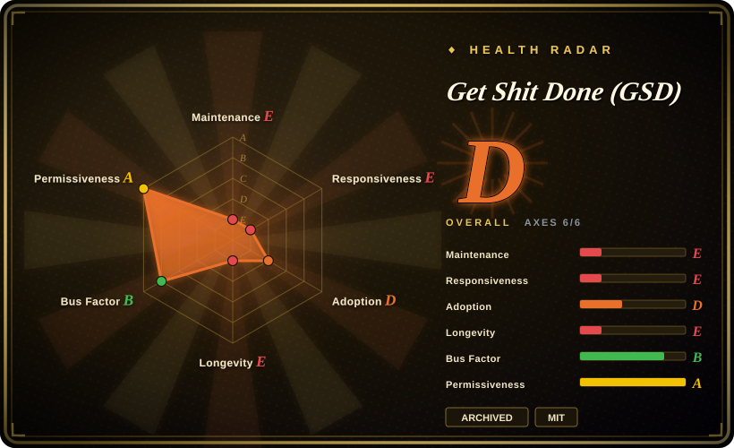
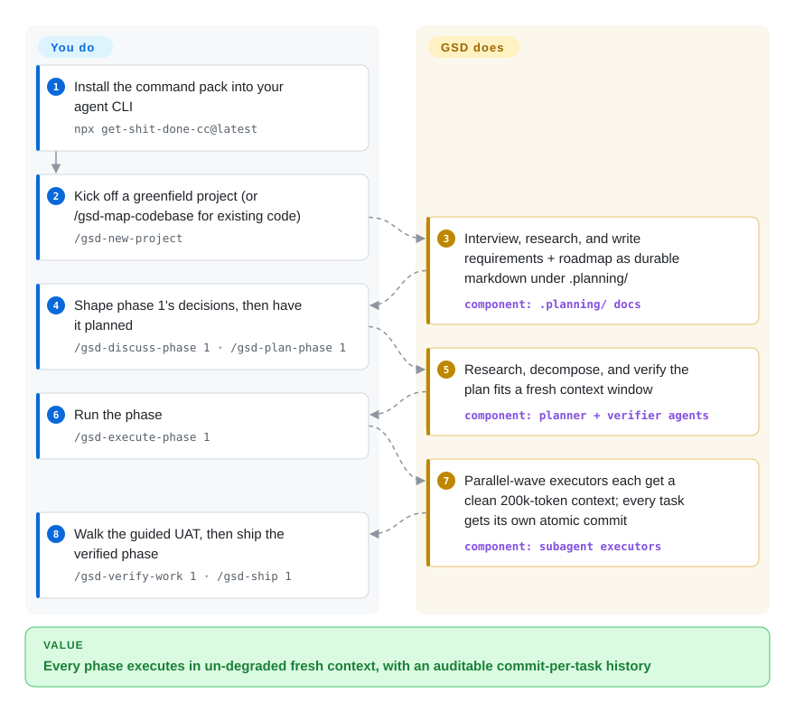

# Get Shit Done (GSD)

You describe a feature, the agent one-shots a wall of code, and quality rots as its context window fills with history. GSD fought that by driving each phase through markdown specs (PROJECT/ROADMAP/CONTEXT/PLAN) executed in fresh subagent contexts — but **this repo is archived (2026-09)**; development continues as `open-gsd/gsd-core`.

## When to use

You're a solo builder or small team who codes *through* an agent (Claude Code, OpenCode, Codex, Gemini, Cursor, and others) rather than by hand. You've felt the classic failure: you describe a feature, the agent one-shots a wall of code, quality holds for the first few turns, then degrades as the context window fills with history — by the end it's confidently producing slop that falls apart at scale. You don't want BMAD/SpecKit-style enterprise ceremony (sprints, story points, Jira), you just want the model to actually understand what you're building and ship it reliably. GSD installs a handful of slash commands (`/gsd-new-project`, `/gsd-discuss-phase`, `/gsd-plan-phase`, `/gsd-execute-phase`, `/gsd-verify-work`, `/gsd-ship`) that walk you from interview → research → roadmap → per-phase context → atomic plans → wave-parallel execution, persisting state in markdown (`PROJECT.md`, `ROADMAP.md`, `STATE.md`, `{phase}-CONTEXT.md`, `{phase}-PLAN.md`). Read this page for the *workflow pattern* — the repo itself is archived, and the commands above now ship live from the successor, `open-gsd/gsd-core`.

The core bet is structural: each atomic plan is small enough to run in its own clean 200k-token window, so implementation never inherits a degraded conversation, and each task gets its own commit so git history stays auditable. It's a good fit when you want a repeatable build loop with checkpoints you approve (you review the roadmap, you shape each phase's CONTEXT before any code is written, you do a guided UAT pass), and when you run the agent in skip-permissions / autonomous mode and want guardrails baked into the prompts rather than improvised per-task.

## How it works

GSD is a prompt-pack framework: the installer drops slash commands and dozens of subagent definition files (Markdown) into your agent CLI's config directory, and all project state persists as plain-markdown docs in a `.planning/` tree (`PROJECT.md`, `REQUIREMENTS.md`, `ROADMAP.md`, `STATE.md`, per-phase `CONTEXT/PLAN/SUMMARY/VERIFICATION/UAT`). You drive one phase at a time through a fixed loop — discuss the implementation decisions, then plan, and each plan is deliberately cut small enough to execute in a fresh context window. When you launch execution, parallel *waves* of fresh subagent executors each start with a clean 200k-token context and every task lands as its own atomic commit; built-in quality agents (research, plan-check, verifier) run alongside. What stays yours: the approvals (roadmap, each phase's CONTEXT before code, the guided UAT walkthrough), the agent CLI itself, and the `--dangerously-skip-permissions` blast-radius decision. The flow card below describes the frozen v1.42.3 usage; the live successor `open-gsd/gsd-core` installs via `npx @opengsd/gsd-core@latest` and keeps the same discuss → plan → execute → verify → ship loop.

<!-- flow-steps:begin (generated from flows/get-shit-done.json by tools/flow_card.py — do not edit) -->

Text version of the flow

1. **You**: Install the command pack into your agent CLI — `npx get-shit-done-cc@latest`
2. **You**: Kick off a greenfield project (or /gsd-map-codebase for existing code) — `/gsd-new-project`
3. **Get Shit Done (GSD)**: Interview, research, and write requirements + roadmap as durable markdown under .planning/ — component: `.planning/ docs`
4. **You**: Shape phase 1's decisions, then have it planned — `/gsd-discuss-phase 1 · /gsd-plan-phase 1`
5. **Get Shit Done (GSD)**: Research, decompose, and verify the plan fits a fresh context window — component: `planner + verifier agents`
6. **You**: Run the phase — `/gsd-execute-phase 1`
7. **Get Shit Done (GSD)**: Parallel-wave executors each get a clean 200k-token context; every task gets its own atomic commit — component: `subagent executors`
8. **You**: Walk the guided UAT, then ship the verified phase — `/gsd-verify-work 1 · /gsd-ship 1`

**Value**: Every phase executes in un-degraded fresh context, with an auditable commit-per-task history

<!-- flow-steps:end -->

<!-- flow-steps:begin (generated from flows/get-shit-done.json by tools/flow_card.py — do not edit) -->
<!-- flow-steps:end -->

## When NOT to use

- **Do not install from this repo — it is archived (ABANDONMENT).** GitHub reports `gsd-build/get-shit-done` as archived as of 2026-09-27; last push 2026-05-31, last stable release v1.42.3 (2026-05-16), and the `main` README is now only a redirect notice. Active development continues in **GSD Core** (`open-gsd/gsd-core`, npm `@opengsd/gsd-core`; v1.15.0 released 2026-09-26, default branch `next`, daily commits) — read this page as the frozen repo's record and evaluate the successor before depending on it.
- **You want a thin, fully-owned prompt setup.** GSD is a large, fast-moving system (dozens of subagents in `agents/`, a built TypeScript SDK, install logic across 15 runtimes per the frozen README). If you want to read and own every prompt, a small hand-rolled `CLAUDE.md` + a few commands is more legible.
- **The successor's continuity is the judgment you actually face now.** The split-brain resolved into a full relocation: new org (`open-gsd`), new npm scope (`@opengsd/gsd-core`), and the successor repo is young (created 2026-05). Whichever org owns the roadmap and where releases land is now settled — but that org's own durability is unproven, so assess `gsd-core` on its own rather than inheriting this page's history. [推断]
- **You need deterministic, non-LLM build orchestration.** GSD's "verification" and "wave execution" are agent-driven prompt workflows, not a CI/build engine. [未验证] Behavior is model- and runtime-dependent and not guaranteed reproducible run-to-run.
- **You're on a non-supported or older runtime / tiny context budget.** It targets specific agent CLIs; the default install carries a multi-thousand-token system-prompt overhead (there is a `--minimal` profile, but full power assumes a capable, large-context agent run in skip-permissions mode).
- **Crypto-adjacency is a dealbreaker.** The frozen repo's README prominently featured a `$GSD` Solana token badge. The successor's README carries no crypto branding, but the token still exists and its relationship to the project's governance or funding was never documented — if the association is disqualifying for your org, factor that in.

## Comparison

> **Note (2026-09):** this repo is archived; the live continuation of every "GSD vs X" row below is the successor `open-gsd/gsd-core` (not indexed). Weigh these choices as successor-vs-alternative, not against a frozen repo.

| Alternative | In index | Our verdict | Tradeoff |
|---|---|---|---|
| [SuperClaude Framework](../coding-agent-harnesses/superclaude.md) | ✅ | Choose SuperClaude Framework when you need a persona/command/MCP framework that reshapes one agent's behavior. | Persona/command/MCP framework that reshapes one agent's behavior; GSD is more of a linear phase pipeline (discuss→plan→execute→verify) with heavy subagent fan-out and persisted spec docs. |
| [Superpowers](../coding-agent-harnesses/superpowers.md) | ✅ | Choose Superpowers when you need a broad skills/plugin library you compose à la carte. | A broad skills/plugin library you compose à la carte; GSD is an opinionated end-to-end project loop rather than a grab-bag of capabilities. |
| [Compound Engineering](../coding-agent-harnesses/compound-engineering.md) | ✅ | Choose Compound Engineering when you need a plugin encoding a compounding "agents improve the system" philosophy. | Plugin encoding a compounding "agents improve the system" philosophy; overlapping spec-driven goals, lighter surface than GSD's full toolchain. |
| [12-Factor Agents](12-factor-agents.md) | ✅ | Choose 12-Factor Agents when you need principles for building reliable agents, not an installable command set. | Principles/methodology doc for building reliable agents, not an installable command set; read it for the *why*, use GSD for an executable *how*. |
| [ECC](../coding-agent-harnesses/ecc.md) | ✅ | Choose ECC when you need a sibling agent-dev methodology with a different orchestration model. | Sibling agent-dev methodology with a different orchestration model; compare phase/context handling directly. |
| [Spec Kit](spec-kit.md) | ✅ | Choose Spec Kit when you need a vendor-backed spec-driven toolkit (`/specify`, `/plan`, `/tasks`). | Vendor-backed spec-driven toolkit (`/specify`, `/plan`, `/tasks`); GSD positions itself as lighter and more context-engineering-focused, less ceremony. |
| [BMAD-METHOD](bmad-method.md) | ✅ | Choose BMAD-METHOD when you need an agile-agent framework with explicit PM/architect/dev/QA roles. | Agile-agent framework with explicit roles (PM/architect/dev/QA); heavier "run a software org" framing GSD deliberately rejects. |

## Tech stack

- **Language:** JavaScript (~73%) + TypeScript (~26%) + Shell (repo language stats, 2026-06).
- **Distribution:** npm package `get-shit-done-cc`; installer CLI `bin/install.js` (also exposes `gsd-sdk` / `gsd-tools` bins).
- **SDK:** a TypeScript `sdk/` package (built via `npm run build:sdk`) providing query/state tooling and freshness checks; hooks are generated via `scripts/build-hooks.js`.
- **Installed artifacts:** slash commands / skills (`commands/`, emitted as `skills/gsd-*/SKILL.md` on newer Claude Code & Codex), subagents (`agents/gsd-*.md`), hooks, and runtime-specific config (e.g. `.clinerules` for Cline).
- **Targets (frozen at v1.42.3):** Claude Code, OpenCode, Gemini CLI, Kilo, Codex, Copilot, Cursor, Windsurf, Antigravity, Augment, Trae, CodeBuddy, Cline and others — the README's install matrix covered 15 runtimes; the successor documents "Claude Code, OpenCode, Antigravity CLI, Kimi CLI, Kilo, Codex, Copilot, Cursor, Windsurf, and more".
- **State model:** plain-markdown SSOT docs (`PROJECT.md`, `REQUIREMENTS.md`, `ROADMAP.md`, `STATE.md`, per-phase `CONTEXT/RESEARCH/PLAN/SUMMARY/VERIFICATION/UAT`) under a `.planning/` tree.

## Dependencies

- **Runtime:** Node.js ≥ 22 (per `package.json` `engines`) to run the installer and SDK; Mac/Windows/Linux.
- **An agent CLI:** one of the supported coding agents above is required at run time — GSD is the prompt/orchestration layer, the agent does the work.
- **npm deps:** `@anthropic-ai/claude-agent-sdk`, `ws`; optional `fallow`; dev/test via `c8`/`vitest`.
- **Install:** `npx get-shit-done-cc@latest` — frozen at 1.42.3 on npm (last published 2026-05). The maintained install is the successor's `npx @opengsd/gsd-core@latest` (v1.15.0 as of 2026-09-26), which prompts for runtime + global/local like the old installer.
- **Recommended mode:** the docs intend Claude Code run with `--dangerously-skip-permissions` (or a curated `allow` list) for friction-free autonomy.

## Ops difficulty

**Low to medium.** Day-one install was a single `npx` command and the artifacts are just files dropped into your agent's config dir — no servers, no datastore. The medium comes from operating it well: running an agent in skip-permissions mode (a real blast-radius decision), the per-phase discipline (you must actually fill `CONTEXT.md` to get good output, not just defaults), and keeping up with the release cadence — now all of that happens in the successor repo, since this one is archived and its installer is frozen. [未验证] Token/system-prompt overhead and exact runtime behavior vary by agent and version.

## Health & viability

- **Responsiveness**: Grade E — zero qualifying issue/PR responses inside the scorer's window; the repo is closed to activity.
- **Maintenance (2026-09):** **archived, confirmed.** GitHub reports `gsd-build/get-shit-done` as archived (verified 2026-09-27), frozen at last push 2026-05-31 / release v1.42.3 (2026-05-16); npm `get-shit-done-cc` is correspondingly pinned at 1.42.3 while still pulling ~50k downloads/month off a dead source. Development lives in `open-gsd/gsd-core`: pushed daily, v1.15.0 released 2026-09-26, ~10k stars in ~4 months.
- **Governance & continuity:** the earlier redirect-plus-archive split has resolved into a completed relocation to the `open-gsd` org. Continuity exists — but it now sits with a young successor repo under an org whose track record is itself only months old; this URL owns none of it.
- **Age & Lindy (2026-09):** created 2025-12, archived within ~9 months of its first commit. Lindy verdict: **fails the prior on this URL** — the bet has moved entirely to `open-gsd/gsd-core` (created 2026-05), which is too young to be Lindy-either way and must be assessed on its own.
- **Risk flags:** installing from a dead source is the dominant risk (the old npm package still resolves — people will keep installing frozen, unpatched code). Secondary: the archived repo's `$GSD` Solana token branding — absent from the successor's README, with the token's governance/funding relationship never documented. No CVEs were reviewed.

## Caveats (unverified)

- [未验证] GitHub stargazer count (~64.4k per GitHub API on 2026-09-27) — star counts are unreliable and date-sensitive; treat as indicative only.
- [未验证] The last stable GitHub release on the archived repo is v1.42.3 (2026-05-16) while tags go to v1.50.0-canary.2 and `package.json` on `main` reads `1.50.0-canary.0` — canary versions never stabilized here; npm `get-shit-done-cc` latest is 1.42.3 (npm registry, 2026-09-27).
- [推断] The archived repo's metadata (single-commit-per-task behavior, 15-runtime install matrix, subagent roster) is read from the frozen v1.42.3 README; the successor may have changed any of it — verify against `open-gsd/gsd-core` for current behavior.
- [未验证] The successor `open-gsd/gsd-core` was only probed at README + release level (v1.15.0, default branch `next`, ~9.9k stars, npm `@opengsd/gsd-core` 1.15.0); its governance, maintainer base, and feature drift vs the archived repo were not reviewed — it needs its own page/assessment.
- [未验证] Claims that the fresh-context-per-plan design "fights context rot" and yields better results are the project's own framing plus third-party testimonials; no independent benchmark verified here. LLM behavior is not guaranteed.
- [未验证] The `$GSD` Solana token badge in the frozen v1.42.3 README (confirmed present 2026-09-27) is associated with the project's branding; its relationship to the MIT-licensed software (governance, funding) is not documented, and the successor README carries no crypto badge — whether the two are formally linked is unverified.
