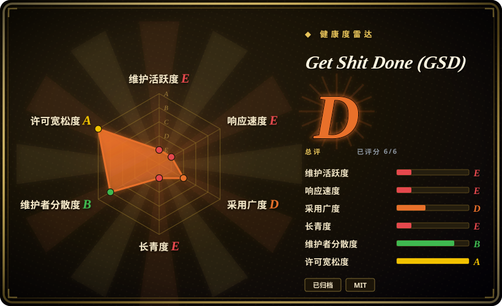
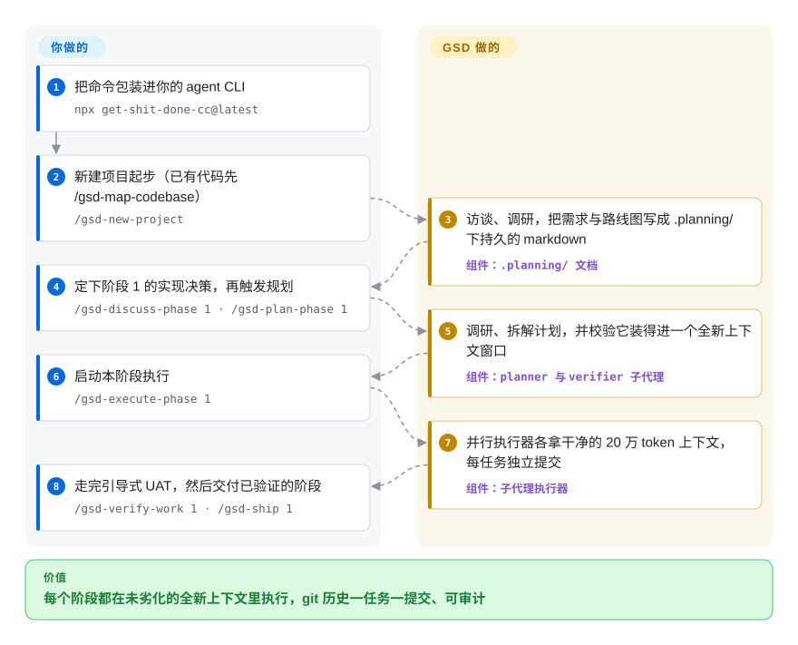

# Get Shit Done (GSD)

你描述一个功能，agent 一口气吐出一大坨代码，随着上下文被历史填满，质量一路劣化。GSD 曾用「每个阶段落在 PROJECT/ROADMAP/CONTEXT/PLAN 这些 markdown 规格里、在全新子代理上下文里执行」来对抗这种劣化——但**该仓库已归档（2026-09）**，开发已迁至 `open-gsd/gsd-core`。

## 何时使用

你是个独立开发者或小团队，靠 agent（Claude Code、OpenCode、Codex、Gemini、Cursor 等）写代码而不是亲手写。你大概率踩过那个经典坑：你描述一个功能，agent 一口气吐出一大坨代码，前几轮质量还行，随着上下文窗口被历史填满逐步劣化——到最后它一脸自信地产出规模一上来就散架的垃圾。你又不想要 BMAD/SpecKit 那种企业仪式（冲刺、故事点、Jira），只想让模型真的理解你在做什么并可靠地交付。GSD 给你装上几个 slash 命令（`/gsd-new-project`、`/gsd-discuss-phase`、`/gsd-plan-phase`、`/gsd-execute-phase`、`/gsd-verify-work`、`/gsd-ship`），带你从访谈 → 调研 → 路线图 → 每阶段上下文 → 原子化计划 → wave 并行执行一路走完，状态全部落在 markdown 里（`PROJECT.md`、`ROADMAP.md`、`STATE.md`、`{phase}-CONTEXT.md`、`{phase}-PLAN.md`）。请把本页读作一种*工作流模式*的记录——仓库本身已归档，上面这些命令如今是由继任仓库 `open-gsd/gsd-core` 发布的。

它的核心赌注是结构性的：每份原子计划都小到能在自己干净的 20 万 token 窗口里跑，因此实现阶段不会继承一段已经劣化的对话；每个任务单独提交，git 历史保持可审计。如果你想要一个有审批检查点的可复现构建循环（你审路线图、在写任何代码前先塑造每个阶段的 CONTEXT、再做一遍引导式 UAT），并且你以 skip-permissions / 自主模式跑 agent、希望护栏内建在提示里而不是每次临时发挥，那它很合适。

## 怎么用起来

GSD 是一套提示词包框架：安装器把 slash 命令和几十个用 Markdown 写的子代理定义文件放进你 agent CLI 的配置目录，所有项目状态都以纯 markdown 文档持久化在仓库里的 `.planning/` 目录树（`PROJECT.md`、`REQUIREMENTS.md`、`ROADMAP.md`、`STATE.md`，以及每阶段的 `CONTEXT/PLAN/SUMMARY/VERIFICATION/UAT`）。你一次只推进一个阶段，按固定循环走——先敲定实现决策，再规划，而每份计划都被刻意切到小到能在全新上下文窗口里执行。当你启动执行时，成批并行的全新子代理执行器各拿到一个干净的 20 万 token 上下文，每个任务落成自己的一条原子提交；内置的质量代理（research、plan-check、verifier）在旁边把关。留在你手里的：各个审批点（路线图、写代码前每阶段的 CONTEXT、引导式 UAT 走查）、agent CLI 本身，以及 `--dangerously-skip-permissions` 这个爆炸半径决策。下面这张流程卡描述的是已冻结的 v1.42.3 用法；活的继任仓库 `open-gsd/gsd-core` 用 `npx @opengsd/gsd-core@latest` 安装，循环保留同样的 discuss → plan → execute → verify → ship。

<!-- flow-steps:begin (generated from flows/get-shit-done.json by tools/flow_card.py — do not edit) -->

流程文字版

1. **你**：把命令包装进你的 agent CLI — `npx get-shit-done-cc@latest`
2. **你**：新建项目起步（已有代码先 /gsd-map-codebase） — `/gsd-new-project`
3. **Get Shit Done (GSD)**：访谈、调研，把需求与路线图写成 .planning/ 下持久的 markdown — 组件：`.planning/ 文档`
4. **你**：定下阶段 1 的实现决策，再触发规划 — `/gsd-discuss-phase 1 · /gsd-plan-phase 1`
5. **Get Shit Done (GSD)**：调研、拆解计划，并校验它装得进一个全新上下文窗口 — 组件：`planner 与 verifier 子代理`
6. **你**：启动本阶段执行 — `/gsd-execute-phase 1`
7. **Get Shit Done (GSD)**：并行执行器各拿干净的 20 万 token 上下文，每任务独立提交 — 组件：`子代理执行器`
8. **你**：走完引导式 UAT，然后交付已验证的阶段 — `/gsd-verify-work 1 · /gsd-ship 1`

**价值**：每个阶段都在未劣化的全新上下文里执行，git 历史一任务一提交、可审计

<!-- flow-steps:end -->

<!-- flow-steps:begin (generated from flows/get-shit-done.json by tools/flow_card.py — do not edit) -->
<!-- flow-steps:end -->

## 何时不用

- **别从这个仓库安装——它已归档（ABANDONMENT）。** 截至 2026-09-27，GitHub 已把 `gsd-build/get-shit-done` 标为 archived：最后 push 停在 2026-05-31，最后一个稳定 release 是 v1.42.3（2026-05-16），`main` 的 README 只剩一条重定向通知。活跃开发在 **GSD Core**（`open-gsd/gsd-core`，npm 包 `@opengsd/gsd-core`；v1.15.0 发布于 2026-09-26，默认分支 `next`，几乎每天有提交）——本页读作已冻结仓库的记录，采用前请先单独评估继任仓库。
- **你想要一套极薄、完全自己掌控的提示。** GSD 是个庞大的系统（`agents/` 里几十个子代理、一个会构建的 TypeScript SDK、按冻结版 README 覆盖 15 个运行时的安装逻辑）。如果你想读懂并掌控每一条提示，手写一份小巧的 `CLAUDE.md` 加几个命令更可读。
- **你真正要面对的延续性问题是继任仓库。** 此前的「重定向 + 归档」割裂已落定为一次完整搬迁：新 org（`open-gsd`）、新 npm scope（`@opengsd/gsd-core`），但继任仓库很年轻（2026-05 创建）。路线图归属和 release 落点如今是清楚的——可这个 org 自身的履历也只有几个月，请就 `gsd-core` 本身评估，而不是继承本页的历史判断。[推断]
- **你需要确定性的、非 LLM 的构建编排。** GSD 的“验证”和“wave 执行”是 agent 驱动的提示工作流，不是 CI/构建引擎。[未验证] 其行为随模型和运行时变化，不保证 run-to-run 可复现。
- **你在不受支持或较旧的运行时 / 极小上下文预算下工作。** 它面向特定的几款 agent CLI；默认安装会带来数千 token 的系统提示开销（有 `--minimal` 档，但满血用法假定你跑的是有大上下文、且以 skip-permissions 模式运行的 agent）。
- **加密货币关联对你是红线。** 归档仓库的 README 显眼地挂着一个 `$GSD` Solana 代币徽章。继任仓库的 README 已不带任何加密品牌，但代币仍然存在，且它与项目治理或资金的关系从未有文档说明——如果“和 memecoin 沾边”对你的组织是不可接受的，请把这点纳入考量。

## 横向对比

> **注（2026-09）：** 本仓库已归档；下面每一行“GSD 对 X”的真正活体延续都是继任仓库 `open-gsd/gsd-core`（未收录）。请按“继任者对替代品”来权衡，而不是对着一个冻结仓库比较。

| 替代品 | 是否收录 | 我们的评价 | 取舍 |
|---|---|---|---|
| [SuperClaude Framework](../coding-agent-harnesses/superclaude.zh.md) | ✅ | 需要 persona/命令/MCP 框架来重塑单个 agent 行为时，选 SuperClaude Framework。 | persona/命令/MCP 框架，重塑单个 agent 的行为；GSD 更像一条线性的阶段流水线（discuss→plan→execute→verify），配大量子代理 fan-out 和持久化的 spec 文档。 |
| [Superpowers](../coding-agent-harnesses/superpowers.zh.md) | ✅ | 需要广覆盖、可按需组合的 skills/plugin 库时，选 Superpowers。 | 一个广覆盖、可按需组合的 skills/plugin 库；GSD 是一条有主见的端到端项目循环，而非能力大杂烩。 |
| [Compound Engineering](../coding-agent-harnesses/compound-engineering.zh.md) | ✅ | 需要把“agent 反过来改进系统”的复利理念编码进 plugin 时，选 Compound Engineering。 | 把“agent 反过来改进系统”这一复利理念编码进 plugin；规格驱动目标有重叠，面比 GSD 的整条工具链更轻。 |
| [12-Factor Agents](12-factor-agents.zh.md) | ✅ | 需要构建可靠 agent 的原则，而不是可安装命令集时，选 12-Factor Agents。 | 关于如何构建可靠 agent 的原则/方法论文档，不是可安装的命令集；读它看*为什么*，用 GSD 拿可执行的*怎么做*。 |
| [ECC](../coding-agent-harnesses/ecc.zh.md) | ✅ | 需要同类 agent 开发方法论，但想对比另一种编排模型时，选 ECC。 | 同类的 agent 开发方法论，编排模型不同；可直接对比阶段/上下文的处理方式。 |
| [Spec Kit](spec-kit.zh.md) | ✅ | 需要厂商背书的规格驱动工具包（`/specify`、`/plan`、`/tasks`）时，选 Spec Kit。 | 厂商背书的规格驱动工具包（`/specify`、`/plan`、`/tasks`）；GSD 自我定位更轻、更聚焦上下文工程、仪式更少。 |
| [BMAD-METHOD](bmad-method.zh.md) | ✅ | 需要带显式 PM/架构/开发/QA 角色的敏捷 agent 框架时，选 BMAD-METHOD。 | 带显式角色（PM/架构/开发/QA）的敏捷 agent 框架；那种“运营一家软件公司”的更重框架，正是 GSD 刻意拒绝的。 |

## 技术栈

- **语言：** JavaScript（约 73%）+ TypeScript（约 26%）+ Shell（仓库语言统计，2026-06）。
- **分发：** npm 包 `get-shit-done-cc`；安装器 CLI `bin/install.js`（还暴露 `gsd-sdk` / `gsd-tools` 命令）。
- **SDK:** 一个 TypeScript `sdk/` 包（经 `npm run build:sdk` 构建），提供 query/state 工具与各类 freshness 检查；hooks 经 `scripts/build-hooks.js` 生成。
- **安装产物：** slash 命令 / skills（`commands/`，在较新 Claude Code 和 Codex 上以 `skills/gsd-*/SKILL.md` 形式发出）、子代理（`agents/gsd-*.md`）、hooks，以及运行时专属配置（如 Cline 的 `.clinerules`）。
- **目标运行时（冻结于 v1.42.3）：** Claude Code、OpenCode、Gemini CLI、Kilo、Codex、Copilot、Cursor、Windsurf、Antigravity、Augment、Trae、CodeBuddy、Cline 等——冻结版 README 的安装矩阵覆盖 15 个运行时；继任仓库的文档写的是“Claude Code、OpenCode、Antigravity CLI、Kimi CLI、Kilo、Codex、Copilot、Cursor、Windsurf 等”。
- **状态模型：** 纯 markdown SSOT 文档（`PROJECT.md`、`REQUIREMENTS.md`、`ROADMAP.md`、`STATE.md`，以及每阶段的 `CONTEXT/RESEARCH/PLAN/SUMMARY/VERIFICATION/UAT`），置于 `.planning/` 目录树下。

## 依赖

- **运行时：** Node.js ≥ 22（依 `package.json` `engines`）以运行安装器与 SDK；支持 Mac/Windows/Linux。
- **一个 agent CLI:** 运行期需要上面列出的某款受支持 coding agent——GSD 是提示/编排层，真正干活的是 agent。
- **npm 依赖：** `@anthropic-ai/claude-agent-sdk`、`ws`；可选 `fallow`；dev/测试用 `c8`/`vitest`。
- **安装：** `npx get-shit-done-cc@latest`——npm 上已冻结在 1.42.3（最后发布于 2026-05）。仍在维护的安装方式是继任仓库的 `npx @opengsd/gsd-core@latest`（截至 2026-09-26 为 v1.15.0），同样交互式询问运行时与全局/本地。
- **推荐模式：** 文档建议把 Claude Code 以 `--dangerously-skip-permissions` 运行（或配一份精挑的 `allow` 列表），以获得无摩擦的自主性。

## 运维难度

**低到中。** 首日安装就是一行 `npx`，产物只是丢进 agent 配置目录的文件——没有服务、没有数据库。“中”来自把它用好：以 skip-permissions 模式跑 agent（这是个真实的 blast-radius 决策）、每阶段的纪律（你得真的去填 `CONTEXT.md` 才能拿到好输出，而不是吃默认值），以及跟上发版节奏——而这一切如今都发生在继任仓库里，本仓库已归档、安装器已冻结。[未验证] token/系统提示开销和具体运行时行为随 agent 和版本而变。

## 健康度与可持续性

- **响应速度**：Grade E——评分窗口内没有任何可计数的 issue/PR 响应，仓库已停止活动。
- **维护（2026-09）：** **已归档，确认属实。** GitHub 于 2026-09-27 核验时将 `gsd-build/get-shit-done` 报为 archived，冻结在最后 push 2026-05-31 / release v1.42.3（2026-05-16）；npm 包 `get-shit-done-cc` 相应停在 1.42.3，却仍每月有约 5 万次下载落在一个已死的源上。开发活在 `open-gsd/gsd-core`：几乎每天有提交，v1.15.0 发布于 2026-09-26，约 1 万 star。
- **治理与延续性：** 早先「重定向 + 归档」的割裂已落定为一次完成式搬迁，落在 `open-gsd` org。延续性存在——但押在一个年轻继任仓库和一个履历只有几个月的 org 上；这个 URL 已不再拥有任何路线图。
- **年龄与 Lindy（2026-09）：** 创建于 2025-12，首次提交后约 9 个月即归档。Lindy 裁决：**在这个 URL 上不满足先验**——赌注已整体移到 `open-gsd/gsd-core`（2026-05 创建），它太年轻、谈不上任何一侧的 Lindy，需单独评估。
- **风险标记：** 从一个已死的源安装是首要风险（旧 npm 包仍可解析——人们会不停装上冻结、不再修补的代码）。其次：归档仓库的 `$GSD` Solana 代币品牌——继任 README 已无此徽章，但代币与治理/资金的关系从未有文档。未审 CVE。

## 存疑（未验证）

- [未验证] GitHub star 数（2026-09-27 GitHub API 显示约 6.44 万）——star 数不可靠且对时间敏感，仅供参考。
- [未验证] 归档仓库上最后一个稳定 release 是 v1.42.3（2026-05-16），而 tag 已到 v1.50.0-canary.2、`main` 上的 `package.json` 写着 `1.50.0-canary.0`——canary 版本在本仓库从未转正；npm `get-shit-done-cc` 的 latest 是 1.42.3（npm registry，2026-09-27）。
- [推断] 归档仓库的元信息（一任务一提交的行为、15 运行时安装矩阵、子代理清单）读自冻结的 v1.42.3 README；继任仓库可能已改动其中任何一项——就当前行为请对照 `open-gsd/gsd-core` 核实。
- [未验证] 继任仓库 `open-gsd/gsd-core` 本次只做了 README + release 级探查（v1.15.0、默认分支 `next`、约 9.9k star、npm `@opengsd/gsd-core` 1.15.0）；其治理、维护者盘子与相对归档仓库的功能漂移均未审——它需要自己的页面与评估。
- [未验证] “fresh-context-per-plan 设计能对抗 context rot 并产出更好结果”这一说法是项目自己的表述加第三方证言；此处未做独立基准验证。LLM 行为不作保证。
- [未验证] 冻结的 v1.42.3 README 中的 `$GSD` Solana 代币徽章（2026-09-27 确认存在）与项目品牌相关联；它与这套 MIT 许可软件的关系（治理、资金）没有文档，继任 README 已不带加密徽章——二者是否存在正式关联未经证实。
