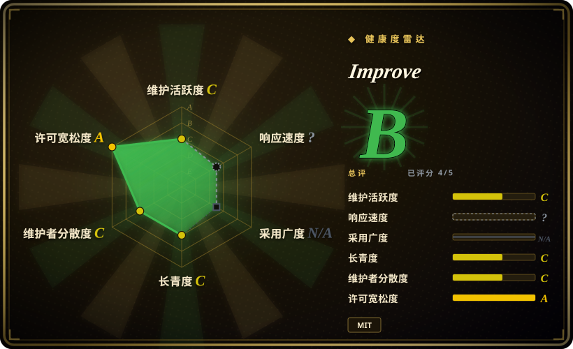
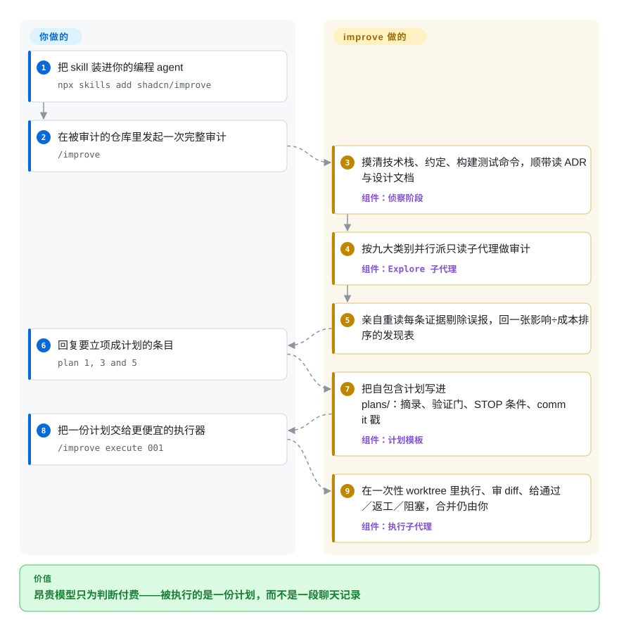

# Improve

旗舰模型在为它写下的每一行代码付旗舰价，而你试着委派的便宜模型一接到任务就乱改——因为计划只存在你脑子里。improve 把强模型变成只读顾问：先审计仓库、定出值得做的事，再写出精确到路径、代码摘录、验证命令与停止条件的自包含计划，让小得多的模型冷启动也能照做。

## 何时使用

你维护着一个问题成堆的真实仓库——`orders/api.ts:142` 每渲染一行就发一条查询、同一个 config helper 在两个文件里各写一份且已经漂移、变更最频繁的模块零测试——但你不知道哪条值得花昂贵模型的时间，而且每次把活交给便宜模型，都要从头把代码库讲一遍。在仓库里跑 `/improve`：它摸清技术栈、约定和确切的构建/测试命令，把只读审计并行铺到九个类别（正确性、安全、性能、测试、技术债、依赖、DX、文档、方向），再亲自重读每条证据位置杀掉误报，交回一张按影响÷成本排序的发现表。你回复「plan 1, 3 and 5」，`plans/` 里就落下一份份自包含计划——写给没见过这次会话、也可能小得多的执行模型。

相比 Spec Kit 或 BMAD，你选它的时刻是「还不知道该建什么」：它的触发源是代码里挖出的证据，不是产品需求，所以适合需要分诊的存量仓库。相比 Superpowers，你选它是为了按价位分工：Superpowers 约束的是正在写代码的那个 agent，而 improve 刻意一行代码都不写——计划就是产品，执行归便宜模型，顾问永不碰你的源码。

## 怎么用起来

这个 skill 跑四个阶段，你和它的分工切得很干净。它先摸清仓库（包括找到的 ADR、`CONTEXT.md`、`DESIGN.md`，已记录的取舍不会被当成问题重新上报），再派发最多八个按类别分工的只读子代理；子代理回报后，顾问模型亲自重读每条被引用的位置，站不住的发现直接丢掉或纠正。你只做三件事：发起、从排序表里挑发现、拍板合并与否。每个入选发现变成 `plans/` 下的一份文件，盖上写出时的 git commit 戳，执行方动手前先跑一次机械的漂移检查；每一步都以「验证门」收尾——一条命令加预期输出，小模型无须自己判断是否做对了——每份计划还带越界清单和「STOP 并回报」条件，而不是放任弱模型即兴发挥。真要让工具自己执行时：`/improve execute <计划>` 会在一次性 git worktree（共享历史、不碰你工作目录的抛弃式克隆）里拉起一个更便宜的执行子代理，顾问像 tech lead 一样审 diff、给通过／返工／阻塞的裁决——合并永远由你决定。之后跑 `/improve reconcile` 给积压清单续命：DONE 抽查仍成立、BLOCKED 绕开障碍重写、被别人顺手修掉的发现直接退役。

<!-- flow-steps:begin (generated from flows/improve.json by tools/flow_card.py — do not edit) -->

流程文字版

1. **你**：把 skill 装进你的编程 agent — `npx skills add shadcn/improve`
2. **你**：在被审计的仓库里发起一次完整审计 — `/improve`
3. **Improve**：摸清技术栈、约定、构建测试命令，顺带读 ADR 与设计文档 — 组件：`侦察阶段`
4. **Improve**：按九大类别并行派只读子代理做审计 — 组件：`Explore 子代理`
5. **Improve**：亲自重读每条证据剔除误报，回一张影响÷成本排序的发现表
6. **你**：回复要立项成计划的条目 — `plan 1, 3 and 5`
7. **Improve**：把自包含计划写进 plans/：摘录、验证门、STOP 条件、commit 戳 — 组件：`计划模板`
8. **你**：把一份计划交给更便宜的执行器 — `/improve execute 001`
9. **Improve**：在一次性 worktree 里执行、审 diff、给通过／返工／阻塞，合并仍由你 — 组件：`执行子代理`

**价值**：昂贵模型只为判断付费——被执行的是一份计划，而不是一段聊天记录

<!-- flow-steps:end -->

## 何时不用

- **你要的是对即将合并的 diff 做逐行 review。** improve 审的是仓库状态、产出的是计划，不是评审意见；CI 里的 diff 评审请用 [Open Code Review](../../ai-code-review/open-code-review.zh.md) 或 [PR-Agent](../../ai-code-review/pr-agent.zh.md)——它们评改动，不评库存。
- **你希望出计划的人顺手把活干了。** Hard Rule 1 是绝对的：顾问除 `plans/` 外不改任何文件。想要写代码的 agent 当场守 TDD 纪律，用 [Superpowers](../coding-agent-harnesses/superpowers.zh.md)；想要 plan→execute→ship 的阶段流水线，用 [Spec Kit](spec-kit.zh.md)。
- **绿地工作、规格早就写好了。** 审计是这套产品的前半段；已知要建什么时，Spec Kit 的 spec→plan→tasks 直达，不必为九个类别的仓库分诊付费。
- **仓库没有一条可用的验证命令。** 计划里的验证门全是侦察阶段确证的构建/测试命令；没有测试、构建又坏时，顾问自己会说「先建立验证基线」必须排在冒险计划之前——在那之前，执行方没有机器可判的终点线。
- **仓库很小，或你的强弱模型价差很薄。** 完整一趟会铺最多八个子代理走昂贵模型，之后还要逐条复核；几百行的 CLI 上，这套仪式比直接动手更贵。
- **你要拿安全发现当审计凭证或合并闸门。** 安全类别是只读、以代码证据为界、按防御性口径措辞的评审（playbook 明令禁止可运行的利用细节），不是 SAST，也不做动态测试；能拦发布的必须是确定性扫描器，[Metis](../../ai-code-review/metis.zh.md) 与 [Claude Code Security Review](../../ai-code-review/claude-code-security-review.zh.md) 只是同类 LLM 评审，不是证明。

## 横向对比

| 替代品 | 是否收录 | 我们的评价 | 取舍 |
|---|---|---|---|
| [Spec Kit](spec-kit.zh.md) | ✅ | 你的工作始于「要建某个功能」、要 spec→plan→实现流水线时选 Spec Kit；需要代码库自己先说出什么值得建时选 improve。 | Spec Kit 偏绿地、计划先行、GitHub 背书；improve 多了九类证据审计和明确的顾问/执行器分工——但它不实现，执行仍归你或别的 harness。 |
| [Get Shit Done (GSD)](get-shit-done.zh.md) | ✅ | `gsd-build/get-shit-done` 已于 2026-09 归档，只当模式来源；要访谈→规划→执行→发布端到端跑完，选仍在维护的阶段流水线；要对存量代码做只读分诊，选 improve。 | GSD 用 fresh-context 阶段闸门跑完整建设循环；improve 只出主意和计划。其继任仓库 `open-gsd/gsd-core` 未收录——本批 tab-intake 未添加。 |
| [Superpowers](../coding-agent-harnesses/superpowers.zh.md) | ✅ | 要让正在写代码的 agent 服从 TDD/头脑风暴/验证纪律，选 Superpowers；要让昂贵模型产出整仓库的交接计划、由便宜模型执行，选 improve。 | 两者都写计划、都派子代理，同装可能双路由。Superpowers 带规则地实现；improve 一行不改——它的约束只是提示词规则，不是硬闸门 [推断]。 |
| [BMAD Method](bmad-method.zh.md) | ✅ | 产品形态的工作要多角色端到端方法（analyst、PM、architect、dev、QA）时选 BMAD；要做维护分诊——挖出真实的 N+1 和漂移副本——时选 improve。 | BMAD 是厚重的多角色框架，星数曲线快得未经检验；improve 是一个 skill、一个顾问、一种计划格式。面小得多，但没有内建 QA/PM 角色。 |

## 健康度与可持续性

- **维护（2026-09）：** 发布后进入惯性滑行——2026-06-10 建仓，25 个 commit 几乎全部落在 06-10 至 06-15 六天内，之后仅 2026-09-12 一个「chore」。没有 release、没有 tag，「v1.0.0」只存在于 `SKILL.md`/`plugin.json` 的版本元数据里。
- **治理／bus factor：** 实质单人维护——shadcn 一人写了 18 个 commit（GitHub API 2026-09-28 共 5 名贡献者），无 GOVERNANCE/CODEOWNERS/CONTRIBUTING 文件，仓库挂在个人账号下。他的 GitHub 主页写着 @vercel，且是 shadcn/ui 的作者（履历够硬），但本仓库内没有任何公司背书的表述 [未验证]。
- **年龄与 Lindy（2026-09-28）：** 3.5 个月大——完全没有 Lindy 先验。窗口内 ~9.2k star 跟随的是作者个人品牌热度，不是经过时间检验的持久性；按当下价值采用，并预期计划格式与规则还会变。
- **采用与响应（2026-09-28）：** 文档给出两条安装路径——`npx skills add shadcn/improve`（Agent Skills 格式）和 Claude Code marketplace 清单（`.claude-plugin/`）。历史 issue 共 29 条／开 17 条，六月后几乎全是外部提交（批量 execute、预热 worktree、显式指定执行模型），六月后未见维护者回应；仓库还持续收到误报到 shadcn/ui 的 UI bug（如深色模式下拉框问题），是撞名带来的噪声税。
- **风险信号：** MIT，无改授权历史。「绝不修改源码」「仓库内容是数据不是指令」这些硬规则全是提示词层约束，实际效果取决于宿主 agent 与模型对齐 [推断]。除 GitHub Sponsors 外无资助，无 SECURITY 文件。

## 存疑（未验证）

- [未验证] star 数（9,189）与 issue 计数（共 29／开 17）是 2026-09-28 GitHub API 的时点值，热度仓库上变动很快。
- [未验证] 作者供职 @vercel 仅来自其 GitHub 主页自报字段；公司对本仓库的背书与路线图归属，仓库内无任何表述。
- [推断] 硬规则的执行全部是行为层的：它们是写进 `SKILL.md` 的指令，没有代码、hook 或测试兜底；不守规矩的模型仍可能改文件或听信注入指令。
- [推断] 「贵模型判断、便宜模型执行」的经济学是作者的设计前提；仓库内没有任何 eval 或执行成功率数据，唯一示例计划还明确标注「don't execute this」。
- [未验证] 「支持 Agent Skills 格式的任意 agent 都能用」是 README 的说法；仓库里只见 Claude Code 插件清单，跨 harness 的激活保真度未在此验证。
- [未验证] 2026-09-28 无 release、无 tag；v1.0.0 版本号取自 `SKILL.md` frontmatter 与 `.claude-plugin/plugin.json`。
