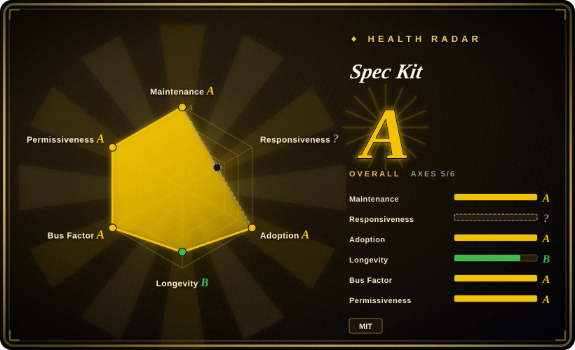
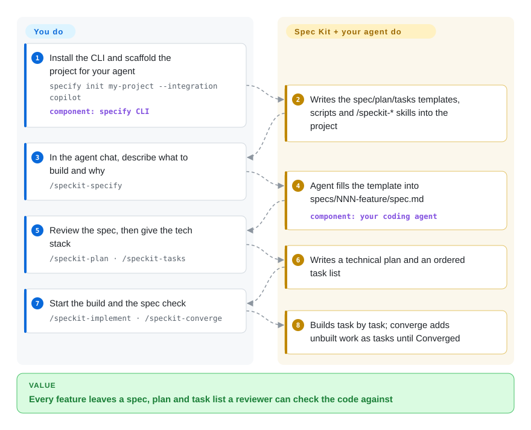

# Spec Kit

You ask a coding agent for "a photo organizer with albums" and get something that runs but quietly decided the storage, the grouping and half the scope for you — and nothing written down says what it was supposed to do. Spec Kit makes the agent write that down first: a spec, then a technical plan, then a task list, and only then code that is checked back against them.

## When to use

You lead a small product team that already lets Copilot, Claude Code, Codex or Cursor write most feature code. The pattern you keep seeing: a one-line prompt turns into a 900-line PR whose reviewer asks "where did we agree it should store metadata in SQLite?" — and the answer is "the agent picked it". You want every feature to leave a reviewable trail (what and why → how → task list → code) without hand-writing a process doc for each agent your team uses. You reach for Spec Kit because one `specify init` drops the same templates and `/speckit-*` skills into the project for any of ~40 agent integrations, and the core loop (constitution → specify → plan → tasks → implement → converge) makes the agent fill a spec template before it touches code, then re-check the code against that spec.

Pick it over [Superpowers](../coding-agent-harnesses/superpowers.md) or [get-shit-done](get-shit-done.md) when the deciding factor is written artifacts a human reviews (spec, plan, task list per feature) plus a vendor-maintained CLI with a versioned catalog of extensions and presets your whole team installs the same way, rather than a methodology that lives only inside the agent's behaviour. Pick it over [12-Factor Agents](12-factor-agents.md) when you need a day-to-day coding procedure, not design principles for building agents. Since v1.0 (2026-08) it also ships opt-in `bug` (assess → fix → test) and `assess` (go / clarify / kill an idea) extensions, so the same scaffolding covers bug repair and idea triage, not only greenfield features.

## How it works

Spec Kit is two things: a Python CLI (`specify`) that scaffolds a project, and a set of Markdown templates plus agent "skills" (slash-command prompts the agent reads and follows) that it installs into that project. **The CLI and templates are Spec Kit's job; the writing is done by your own coding agent following those skills, and the reviewing is yours** — Spec Kit itself never calls a model. You run `specify init` once with your agent's integration key, set project principles once with `/speckit-constitution`, then per feature walk the agent through `/speckit-specify` (fills `specs/NNN-<feature>/spec.md` from the template: what and why, no tech choices), `/speckit-plan` and `/speckit-tasks` (you supply the tech stack; it writes the plan and an ordered task list), and `/speckit-implement`. `/speckit-converge` then compares the code with spec, plan and tasks and appends whatever is still unbuilt as new tasks — you repeat implement → converge until it reports *Converged*. Think of it as a building permit process: the agent may not pour concrete until drawings exist, and an inspector walks the site against those drawings afterwards.

<!-- flow-steps:begin (generated from flows/spec-kit.json by tools/flow_card.py — do not edit) -->

Text version of the flow

1. **You**: Install the CLI and scaffold the project for your agent — `specify init my-project --integration copilot` — component: `specify CLI`
2. **Spec Kit**: Writes the spec/plan/tasks templates, scripts and /speckit-* skills into the project
3. **You**: In the agent chat, describe what to build and why — `/speckit-specify`
4. **Spec Kit**: Agent fills the template into specs/NNN-feature/spec.md — component: `your coding agent`
5. **You**: Review the spec, then give the tech stack — `/speckit-plan · /speckit-tasks`
6. **Spec Kit**: Writes a technical plan and an ordered task list
7. **You**: Start the build and the spec check — `/speckit-implement · /speckit-converge`
8. **Spec Kit**: Builds task by task; converge adds unbuilt work as tasks until Converged

**Value**: Every feature leaves a spec, plan and task list a reviewer can check the code against

<!-- flow-steps:end -->

## When NOT to use

- **You don't use AI coding agents.** Spec Kit's processes are skills an agent executes; without one there is nothing to run them. Use plain test-driven or behaviour-driven development practice instead.
- **The change is a one-off script or a 20-line fix.** Six skill invocations and three Markdown artifacts per feature cost more than they save. Prompt the agent directly; if you still want a light guard rail, a single-skill habit such as Superpowers' brainstorm-then-plan step is cheaper than a full spec directory.
- **You mostly change an existing codebase in small, overlapping increments.** Spec Kit's core artifact is a per-feature spec directory; evolving specs across many small brownfield changes is a separate guide, not the default loop. OpenSpec (not indexed) is built around change proposals with ADDED/MODIFIED requirement deltas that archive into a living spec, which fits that workflow more directly.
- **Your team cannot absorb tooling churn.** 1.0.0 shipped 2026-08-21 and 1.1.2 on 2026-10-07 — 16 releases in seven weeks — and earlier flags (`--ai`, `--no-git`) were deprecated along the way; invocation syntax also differs per agent integration. Pin a release (the install docs cover pinned versions) or use a slower-moving prompt-only methodology such as [Superpowers](../coding-agent-harnesses/superpowers.md).
- **You cannot install Python 3.11+ and `uv` on developer machines.** The CLI requires both. OpenSpec (not indexed) ships the same spec-first idea as an npm / Homebrew package on Node.js.
- **You need project management.** Sprints, backlogs and cross-team dependencies belong in an issue tracker (Jira, Linear, GitHub Projects); Spec Kit's `taskstoissues` only turns a feature's task list into GitHub issues, it does not manage the work.
- **You expect the spec to guarantee correct code.** Converge checks code against the spec using the same agent that wrote it; it is a structured self-review, not verification. Keep human review and real tests.

## Comparison

| Alternative | In index | Our verdict | Tradeoff |
| --- | --- | --- | --- |
| OpenSpec | not indexed | For incremental brownfield changes on a Node.js toolchain, pick OpenSpec; pick Spec Kit when each feature deserves its own full spec → plan → tasks trail and you want GitHub-backed upkeep. | OpenSpec's change-proposal folders and requirement deltas are lighter per change; Spec Kit's per-feature artifacts are heavier but give a fuller design record and a larger extension/preset catalog. |
| [Superpowers](../coding-agent-harnesses/superpowers.md) | ✅ | If you want the agent itself to brainstorm, plan, implement test-first through subagents and verify, with you only approving the design, pick Superpowers; pick Spec Kit when the spec, plan and task files are the record your reviewers need. | Superpowers installs as a plugin with no CLI and enforces test-first execution; Spec Kit adds a Python CLI, artifacts and a catalog but leaves test discipline to your constitution and extensions. |
| [get-shit-done](get-shit-done.md) | ✅ | When context rot across long sessions is the main pain, pick get-shit-done's fresh-context-per-phase pipeline; pick Spec Kit when the main pain is unreviewable decisions and you want spec documents as the record. | get-shit-done optimises the agent's working context; Spec Kit optimises the paper trail a human reviewer reads. |
| [BMAD Method](bmad-method.md) | ✅ | If you want role-played agile personas (analyst, PM, architect, scrum master) producing PRD and architecture docs, pick BMAD; pick Spec Kit for a shorter, single-role spec → plan → tasks loop. | BMAD covers more of the product lifecycle with more ceremony; Spec Kit is narrower and quicker to adopt per feature. |
| [12-Factor Agents](12-factor-agents.md) | ✅ | Read 12-Factor Agents when you are designing an LLM-powered product's architecture; use Spec Kit when you need a procedure for building any feature with a coding agent. | 12-Factor is principles with no tooling; Spec Kit is tooling with an opinionated procedure. |

## Tech stack

- **CLI:** Python 3.11+, packaged on PyPI as `specify-cli` (command `specify`), built with Typer, Click and Rich, plus Pydantic, PyYAML and json5; the `mcp` SDK backs an experimental, version-only `specify mcp` stdio server.
- **What it installs into your project:** Markdown templates (constitution, spec, plan, tasks, checklist), per-agent skill or command files under `.specify/` and the agent's own config folder, and helper scripts in Bash, PowerShell and Python that the agent runs while following a skill.
- **Bundled modules:** the wheel carries the core templates plus first-party extensions (`git`, `agent-context`, `bug`, `assess`, `github`), presets (`lean`, `constitution-sync`), workflows and offline catalog snapshots, so `specify init` works without network access.

## Dependencies

- **Python 3.11+ and `uv`** on each developer machine (the README's install is `uv tool install specify-cli`); a Homebrew formula and pinned-version installs are documented alternatives.
- **A supported AI coding agent** (Copilot, Claude Code, Codex, Cursor, Gemini CLI and ~40 others). It does all the writing; Spec Kit never calls a model and needs no API key of its own.
- **Git** if you keep the default `git` extension: its hooks initialize the repo and create a numbered feature branch before `/speckit-specify`.
- **Bash or PowerShell** to run the helper scripts the skills invoke. No server, database or background process.

## Ops difficulty

**Low to deploy, medium to keep current.** There is nothing to run: the CLI writes files once and the agent does the rest. The work is upgrades — 16 releases in the seven weeks after 1.0.0, with flags deprecated along the way — so a team should pin one version, re-run `specify init` or the upgrade path deliberately, and review the regenerated templates and skills in a pull request, because they change what every agent on the team is told to do.

## Health & viability

- **Maintenance (2026-10-08)**: very active — commits in every one of the last 13 weeks and a release roughly every few days (1.0.0 on 2026-08-21, 1.1.2 on 2026-10-07). The flip side is churn, covered under When NOT to use. Issues get answered fast: the radar measured a 4.9-hour median first response across 25 issues (2026-10-09).
- **Governance & backing**: owned by the `github` organization; 92 distinct contributors were active in the past 12 months and the top contributor accounts for about 23% of commits, so the project does not hinge on one person. The roadmap is still GitHub's, not a foundation's.
- **Age / Lindy**: created 2025-08-21, about 14 months old. Active and growing, but too young for the Lindy prior to say much (the radar grades longevity C against the tool age bars); treat long-term continuity as GitHub's product decision.
- **Adoption**: ~140.6k stars and ~12.6k forks (2026-10-08), a Homebrew formula with ~4.5k installs in 90 days, and a community catalog of extensions, presets and bundles. Star count is inflated by GitHub branding and should not be read as production adoption.
- **Risk flags**: MIT license, no relicense history. The main risk is breaking changes in a fast-moving 1.x CLI, not licensing.

## Caveats (unverified)

- [未验证] The integration catalog listed 42 agent keys on 2026-10-08; exact command spelling (`/speckit-specify` vs other forms) varies by integration and mode, so check the integrations reference for your agent.
- [推断] Star and fork counts are amplified by the GitHub brand and AI-tooling hype; they do not show how many teams run the full process in production.
- [推断] The claim that OpenSpec fits incremental brownfield changes better comes from OpenSpec's own README ("built for brownfield not just greenfield") and its change-proposal design, not from a side-by-side trial.
- [未验证] GitHub's long-term commitment to Spec Kit as a standalone open-source project, versus folding it into Copilot features, is not stated anywhere public.
- [推断] Converge's completion check is done by the same agent that wrote the code; how reliably it catches missed requirements depends on the model and has not been benchmarked here.
- [推断] Whether a spec-first loop actually reduces rework depends on the quality of the spec writer and reviewer; the project does not publish outcome data.
