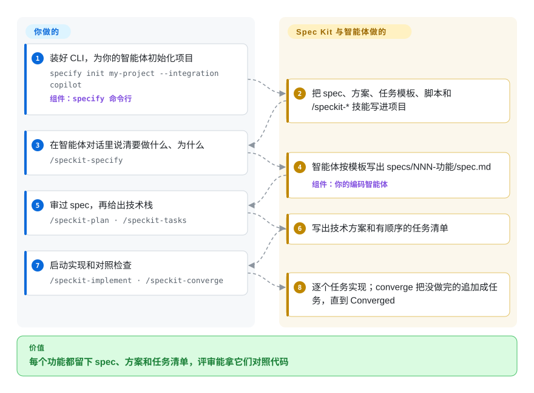

# Spec Kit

你跟编码智能体说“做个按日期分相册的照片管理器”，它交回来的东西能跑，却悄悄替你定了存储方式、分组规则和一半的范围，而且没有任何一份文字写着它本来该做成什么样。Spec Kit 逼智能体先把这些写下来：先写 spec，再写技术方案，再拆任务清单，最后才写代码，写完还要拿代码回头对照这几份文件。

## 何时使用

你带一个小产品团队，大部分功能代码已经交给 Copilot、Claude Code、Codex 或 Cursor 去写。你反复碰到同一种情况：一句话的提示变成一个 900 行的 PR，评审的人问“我们什么时候说好元数据存 SQLite 了？”，答案是“智能体自己选的”。你想让每个功能都留下一条能评审的线索（做什么、为什么 → 怎么做 → 任务清单 → 代码），又不想为团队里每种智能体各写一份流程文档。这时你会想到 Spec Kit：一条 `specify init` 就能把同一套模板和 `/speckit-*` 技能装进项目，支持约 40 种智能体集成；核心循环（constitution → specify → plan → tasks → implement → converge）让智能体先填完 spec 模板才动代码，写完再拿代码对照 spec 复查。

如果决定因素是“每个功能都要有人能评审的书面产物（spec、方案、任务清单），并且整个团队用同一个由厂商维护的 CLI、按版本安装同一批扩展和预设”，而不是一套只活在智能体行为里的方法论，就选它而不是 [Superpowers](../coding-agent-harnesses/superpowers.zh.md) 或 [get-shit-done](get-shit-done.zh.md)。如果你要的是日常写代码的具体步骤，而不是构建智能体产品的设计原则，就选它而不是 [12-Factor Agents](12-factor-agents.zh.md)。v1.0（2026-08）之后它还带了可选的 `bug` 扩展（评估 → 修复 → 验证）和 `assess` 扩展（对一个想法给出继续 / 待澄清 / 放弃的结论），所以同一套脚手架也能管修 bug 和评估点子，不只是从零做新功能。

## 怎么用起来

Spec Kit 由两部分组成：一个 Python 命令行工具 `specify`，负责给项目搭脚手架；以及一套 Markdown 模板加智能体“技能”（智能体读了就照做的斜杠命令提示词），由 CLI 装进项目。**CLI 和模板是 Spec Kit 的活；真正动笔写的是你自己的编码智能体（照着这些技能做），审的是你**，Spec Kit 本身从不调用模型。你先用智能体的集成标识跑一次 `specify init`，再用 `/speckit-constitution` 给项目定一次原则；之后每个功能依次让智能体跑 `/speckit-specify`（按模板写出 `specs/NNN-<功能名>/spec.md`：只写做什么、为什么，不写技术选型）、`/speckit-plan` 和 `/speckit-tasks`（你给出技术栈，它写技术方案和有顺序的任务清单），然后 `/speckit-implement`。最后 `/speckit-converge` 拿代码对照 spec、方案和任务清单，把还没做完的部分追加成新任务；你反复 implement → converge，直到它报告 *Converged*。可以把它想成盖房子的报建流程：图纸没出，施工队不许浇混凝土；完工后还有人拿着图纸到现场验收。

<!-- flow-steps:begin (generated from flows/spec-kit.json by tools/flow_card.py — do not edit) -->

流程文字版

1. **你**：装好 CLI，为你的智能体初始化项目 — `specify init my-project --integration copilot` — 组件：`specify 命令行`
2. **Spec Kit**：把 spec、方案、任务模板、脚本和 /speckit-* 技能写进项目
3. **你**：在智能体对话里说清要做什么、为什么 — `/speckit-specify`
4. **Spec Kit**：智能体按模板写出 specs/NNN-功能/spec.md — 组件：`你的编码智能体`
5. **你**：审过 spec，再给出技术栈 — `/speckit-plan · /speckit-tasks`
6. **Spec Kit**：写出技术方案和有顺序的任务清单
7. **你**：启动实现和对照检查 — `/speckit-implement · /speckit-converge`
8. **Spec Kit**：逐个任务实现；converge 把没做完的追加成任务，直到 Converged

**价值**：每个功能都留下 spec、方案和任务清单，评审能拿它们对照代码

<!-- flow-steps:end -->

## 何时不用

- **你不用 AI 编码智能体。** Spec Kit 的流程都是让智能体执行的技能，没有智能体就没人跑它们。改用普通的测试驱动或行为驱动开发实践。
- **改动只是一次性脚本或 20 行的小修。** 每个功能六次技能调用加三份 Markdown 产物，成本比收益高。直接给智能体下指令；如果还想要一点约束，用 Superpowers 那种先讨论、再写计划的习惯，比建一整个 spec 目录便宜。
- **你主要是在已有代码库上做小而互相重叠的增量改动。** Spec Kit 的核心产物是按功能划分的 spec 目录；在大量小的存量改动之间演进 spec 有单独的指南，但不是默认循环。OpenSpec（未收录）围绕“变更提案”设计，用 ADDED/MODIFIED 需求增量归档进一份持续更新的 spec，更贴合这种工作方式。
- **团队承受不了工具频繁变动。** 1.0.0 发布于 2026-08-21，1.1.2 发布于 2026-10-07，七周发了 16 个版本，期间 `--ai`、`--no-git` 等旧参数被弃用；不同智能体集成的调用写法也不一样。锁定一个版本（安装文档有固定版本的说明），或改用变化更慢、只靠提示词的方法论，比如 [Superpowers](../coding-agent-harnesses/superpowers.zh.md)。
- **开发机上装不了 Python 3.11+ 和 `uv`。** CLI 两者都需要。OpenSpec（未收录）把同样的“先写 spec”思路做成了基于 Node.js 的 npm / Homebrew 包。
- **你需要项目管理。** 迭代、待办池和跨团队依赖应该放在 Jira、Linear、GitHub Projects 这类工单系统里；Spec Kit 的 `taskstoissues` 只是把一个功能的任务清单转成 GitHub issue，并不管理工作本身。
- **你指望 spec 保证代码正确。** converge 是由写代码的同一个智能体拿代码对照 spec，属于结构化的自查，不是验证。人工评审和真实测试照样要留。

## 横向对比

| 替代品 | 是否收录 | 我们的评价 | 取舍 |
|---|---|---|---|
| OpenSpec | 未收录 | 在 Node.js 工具链上做存量代码的增量改动，选 OpenSpec；每个功能都值得一整条 spec → 方案 → 任务的记录、又想要 GitHub 维护保障时，选 Spec Kit。 | OpenSpec 的变更提案目录和需求增量让每次改动更轻；Spec Kit 每个功能的产物更重，但设计记录更完整，扩展和预设目录也更大。 |
| [Superpowers](../coding-agent-harnesses/superpowers.zh.md) | ✅ | 想让智能体自己完成讨论、计划、用子智能体测试先行地实现并验证，你只批准设计，选 Superpowers；评审者需要的是 spec、方案、任务这几份文件作为记录时，选 Spec Kit。 | Superpowers 以插件形式安装、没有 CLI，强制测试先行；Spec Kit 多了 Python CLI、书面产物和扩展目录，但测试纪律要靠你的 constitution 和扩展来定。 |
| [get-shit-done](get-shit-done.zh.md) | ✅ | 主要痛点是长会话里上下文变质时，选 get-shit-done 的“每阶段全新上下文”管线；主要痛点是决策没法评审、需要 spec 文档当记录时，选 Spec Kit。 | get-shit-done 优化的是智能体的工作上下文；Spec Kit 优化的是人类评审读的书面记录。 |
| [BMAD Method](bmad-method.zh.md) | ✅ | 想让分析师、产品经理、架构师、Scrum Master 等角色分工产出 PRD 和架构文档，选 BMAD；只要一条更短的单角色 spec → 方案 → 任务循环，选 Spec Kit。 | BMAD 覆盖更多产品生命周期，仪式也更多；Spec Kit 更窄，每个功能上手更快。 |
| [12-Factor Agents](12-factor-agents.zh.md) | ✅ | 在设计一个大模型驱动产品的架构时读 12-Factor Agents；需要一套用编码智能体做任意功能的流程时用 Spec Kit。 | 12-Factor 是原则、没有工具；Spec Kit 是工具，附带一套有主见的流程。 |

## 健康度与可持续性

- **维护（2026-10-08）**：非常活跃，最近 13 周每周都有提交，几天一个版本（1.0.0 于 2026-08-21，1.1.2 于 2026-10-07）。反面是变动频繁，见“何时不用”。
- **治理与背书**：仓库归 `github` 组织所有；过去 12 个月有 92 名贡献者活跃，头号贡献者约占 23% 的提交，项目不系于一个人。路线图仍由 GitHub 决定，没有基金会托管。
- **年龄 / Lindy**：创建于 2025-08-21，约 14 个月。活跃且在增长，但太年轻，Lindy 先验说明不了多少；长期是否延续取决于 GitHub 的产品决策。
- **采用度**：约 140.6k star、约 12.6k fork（2026-10-08），Homebrew 公式 90 天约 4.5k 次安装，社区有扩展、预设和 bundle 目录。star 数被 GitHub 品牌放大，不能当成生产采用量。
- **风险信号**：MIT 许可，没有改许可的历史。主要风险是快速迭代的 1.x CLI 带来的破坏性变更，而不是许可。

## 存疑（未验证）

- [未验证] 2026-10-08 集成目录列出 42 个智能体标识；斜杠命令的具体写法（`/speckit-specify` 还是别的形式）因集成和模式而异，用前查你那个智能体的集成说明。
- [推断] star 和 fork 数被 GitHub 品牌和 AI 工具热度放大，说明不了有多少团队在生产中跑完整流程。
- [推断] “OpenSpec 更适合存量代码的增量改动”来自 OpenSpec 自己的 README（“built for brownfield not just greenfield”）和它的变更提案设计，没有做过并排对比。
- [未验证] GitHub 是否会长期把 Spec Kit 作为独立开源项目维护，还是并入 Copilot 功能，公开资料里没有说明。
- [推断] converge 的完成度检查由写代码的同一个智能体执行，它能多可靠地抓出遗漏的需求取决于模型，本页没有做过基准测试。
- [推断] 先写 spec 的循环能否真正减少返工，取决于写 spec 和评审的人的水平；项目没有公布效果数据。
