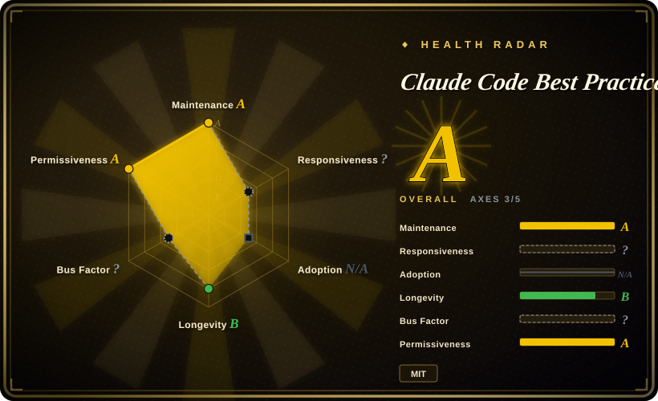
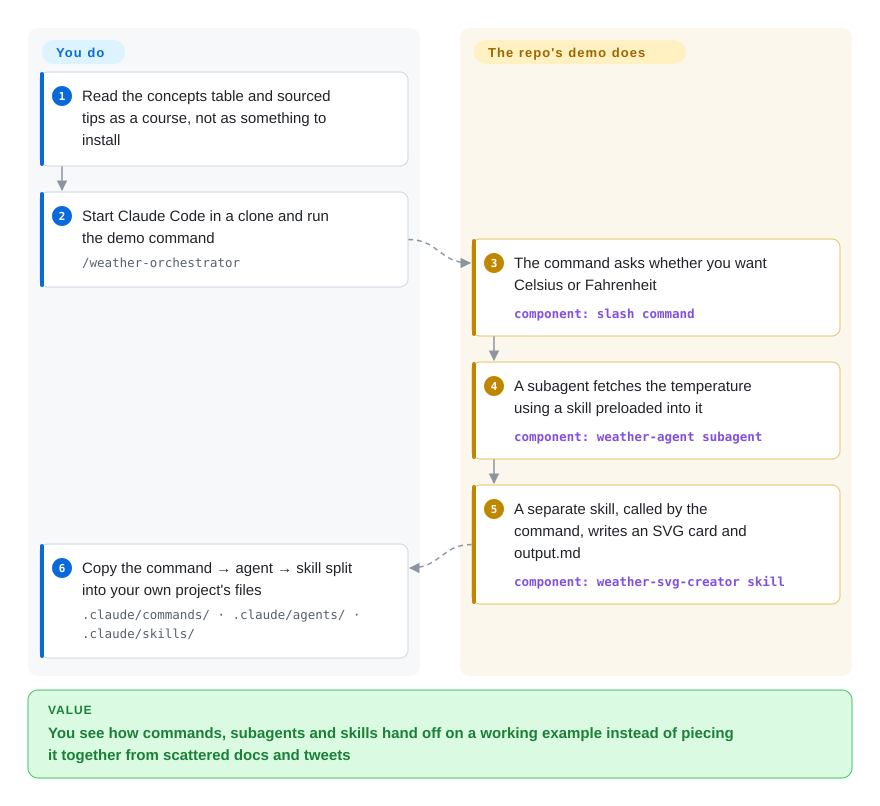

# Claude Code Best Practice

You have used Claude Code for a month, and what you know about subagents, skills, hooks and `settings.json` is a pile of bookmarked tweets and half-remembered docs pages — you still can't say when a task belongs in a command rather than a subagent. This repo is one person's running course on Claude Code: a feature map that links to the official docs, 83 tips each tagged with who said it, and a tiny weather demo that shows a command, a subagent and a skill handing work to one another.

## When to use

You're a developer or tech lead who has just made Claude Code part of your team's day, and you are about to write the first real `.claude/` folder: a `CLAUDE.md`, a couple of slash commands, maybe a subagent and a hook. The official docs explain each feature on its own page, but nobody has told you how they fit together — your first attempt is a 400-line `CLAUDE.md` with "NEVER add Co-Authored-By" in capitals, which the model ignores, when a one-line `attribution` key in `settings.json` would have enforced it. You want one place that lays the primitives out side by side, shows a working example of them handing off, and collects what the Claude Code team (Boris Cherny, Thariq and others) has said in public about how they use it.

That is the job this repo does. Its README is a map of Claude Code features (each row links to the official doc page, plus the author's own "best practice" write-up and a working example where one exists), a tips table where every tip is tagged with its source (Boris, Thariq, community, or the author himself), transcribed tip threads and podcast notes under `tips/` and `videos/`, and a `/weather-orchestrator` demo wired as command → subagent → skill. Pick it over an awesome-list when you want explanation and a runnable pattern rather than a directory of links; pick it over an installable harness such as [ECC](../coding-agent-harnesses/ecc.md) or [Superpowers](../coding-agent-harnesses/superpowers.md) when you want to understand the primitives and assemble your own workflow — the README's own first instruction is to "read this repo as a course, not as a workflow or skill."

## How it works

Nothing here installs into your agent: it is a Git repo of Markdown pages plus one working `.claude/` folder, and the value is reading it. Most pages are written and refreshed by Claude itself — the author runs slash commands (`/workflows:best-practice:workflow-claude-settings` and siblings) that re-check a guide against the latest official docs and changelog, then commit a dated changelog entry — so the text tracks Claude Code releases closely, but it is AI-maintained summary, not documentation from the vendor. The one hands-on piece is the weather demo: a slash command asks you a question, hands the fetching to a subagent that has a skill "preloaded" into it (the skill's instructions are pasted into the subagent's context when it starts, like a briefing sheet handed to a contractor), and then calls a second, independent skill to draw the result. What you do is read, run the demo once, and copy the split into your own project; the repo does not configure anything for you.

<!-- flow-steps:begin (generated from flows/claude-code-best-practice.json by tools/flow_card.py — do not edit) -->

Text version of the flow

1. **You**: Read the concepts table and sourced tips as a course, not as something to install
2. **You**: Start Claude Code in a clone and run the demo command — `/weather-orchestrator`
3. **Claude Code Best Practice**: The command asks whether you want Celsius or Fahrenheit — component: `slash command`
4. **Claude Code Best Practice**: A subagent fetches the temperature using a skill preloaded into it — component: `weather-agent subagent`
5. **Claude Code Best Practice**: A separate skill, called by the command, writes an SVG card and output.md — component: `weather-svg-creator skill`
6. **You**: Copy the command → agent → skill split into your own project's files — `.claude/commands/ · .claude/agents/ · .claude/skills/`

**Value**: You see how commands, subagents and skills hand off on a working example instead of piecing it together from scattered docs and tweets

<!-- flow-steps:end -->

## When NOT to use

- **As the authority on a setting, flag or field.** The guides are summaries regenerated by Claude against the official docs, and they lag: on 2026-09-29 `best-practice/claude-settings.md` on `main` still reads "v2.1.252" (last updated 2026-09-01) while 27 automated "daily settings drift check" PRs up to v2.1.283 sit unmerged. When a key's exact name, scope or default matters, read the official Claude Code docs (`code.claude.com/docs`) and the `CHANGELOG.md` in `anthropics/claude-code` instead, and use this repo only to find which doc page to open.
- **Copying its `.claude/settings.json` into your project.** It is a demo config for a personal repo: `permissions.allow` includes `Bash(*)`, `Edit(*)`, `Write(*)` and `WebFetch(domain:*)`, `enableAllProjectMcpServers` is `true` (so `.mcp.json` launches three `npx` MCP servers), and about 30 hook events each run `python3 .claude/hooks/scripts/hooks.py` to play sound files. In a team repo that is a wide-open permission grant plus hooks you did not audit; start from the official permissions doc and add only what you need. The same care applies to opening Claude Code inside a clone of this repo — you are trusting that folder's settings and hooks.
- **You want a methodology installed and enforced, not a course.** There is no plugin, no marketplace entry and no versioned release; nothing here changes how your agent behaves until you write your own files. If you want a drop-in brainstorm → plan → TDD → verify discipline, use [Superpowers](../coding-agent-harnesses/superpowers.md) or [ECC](../coding-agent-harnesses/ecc.md) instead.
- **You want to know how an agent harness works inside.** This repo teaches how to *configure and use* Claude Code, not how an agent loop, tool dispatch or context compaction is built. For the internals, use [Learn Claude Code](learn-claude-code.md), which rebuilds those mechanisms in runnable Python.
- **You want the widest catalog of community tools.** Its skill-collection, agent-collection and workflow tables are short curated lists (12 workflow rows, 10 skill collections and 2 agent collections on 2026-09-29). For breadth, `hesreallyhim/awesome-claude-code` is a larger link directory of commands, hooks, status lines and tools.
- **You need content you can redistribute or build on under a clean license.** The repo's MIT license is from the author, but parts of the corpus are other people's material: `tips/` pages transcribe X/Twitter threads and embed screenshots of them, `videos/` pages summarize podcasts, and `reports/claude-spinner-verbs-and-tips.md` lists strings the README says were "extracted from CLI binary v2.1.121" — Claude Code's own binary, which ships under Anthropic's commercial terms with "All rights reserved". [推断] The MIT grant cannot cover third-party tweets or strings taken from a proprietary binary; cite the original sources instead of copying these pages into your own docs or training data.

## Comparison

| Alternative | In index | Our verdict | Tradeoff |
|---|---|---|---|
| Official Claude Code docs (`code.claude.com/docs`) | not a repo | When a setting's exact name, default or scope decides your config, read the vendor docs; use this repo only as the map that tells you which doc page to open and how features combine. | Vendor docs are authoritative and current on release day but explain each feature in isolation; this repo adds cross-feature patterns and sourced tips, at the cost of lag and AI-written summaries. Docs site, not a repository. |
| `hesreallyhim/awesome-claude-code` | not indexed | When you want to find existing community commands, hooks, status lines or tools, browse that awesome-list; stay here when you want explanation and one runnable pattern rather than a directory. | Much wider catalog (~54.8k stars on 2026-09-29) with far less explanation per entry, and its license reads NOASSERTION on GitHub. Real repository, not added in this tab-intake batch. |
| `ykdojo/claude-code-tips` | not indexed | For a single author's tips with a working status-line script and container setup to copy, pick that repo; pick this one when you want tips attributed to the Claude Code team plus a feature map. | Narrower and more hands-on (~10.2k stars on 2026-09-29); fewer primary sources, less feature coverage. Real repository, not added in this tab-intake batch. |
| [Learn Claude Code](learn-claude-code.md) | ✅ | When your question is how an agent harness is built — the loop, tools, subagents, compaction — take that course; when it is how to configure and use Claude Code day to day, stay here. | Learn Claude Code has you rebuild the mechanisms in runnable Python; this repo explains the product's knobs and shows one `.claude/` example, with no code to study underneath. |
| [ECC](../coding-agent-harnesses/ecc.md) | ✅ | When you want a ready-made harness of agents, skills, hooks and rules installed into your agent today, pick ECC; pick this repo when you want to learn the primitives first and assemble a smaller setup of your own. | ECC changes agent behavior immediately but brings a large opinionated surface to adopt and keep updated; this repo changes nothing until you write your own files, so it costs reading time instead of lock-in. |

## Health & viability

- **Maintenance (2026-09-29):** very active on paper — pushed daily, not archived — but the activity is automated: between 2026-06-29 and 2026-09-29 the commit authors were `claude` 1068 times and `shanraisshan` 21 times, and the author's last merged PR was 2026-09-02. Guides whose refresh goes through a PR (the settings guide) now lag the product; guides committed directly (skills, subagents, commands) track v2.1.283. Treat each page's own "Last Updated / Claude Code version" badge as its freshness, not the repo's push date.
- **Governance & bus factor:** a single-person, User-owned repo. External PRs are not a channel — none of the 10 non-author PRs in the last 100 closed was merged, and 13 more are open. The author funds it through Polar and header sponsorships (Disrupt, ClaudeKit), which the README discloses; its tables of other people's workflows and tools therefore are not neutral rankings. [推断] If the author stops running the refresh commands, the pages freeze at whatever Claude Code version they last saw.
- **Age & Lindy (2026-09):** created 2025-10-31, about 11 months old, with ~66.5k stars and ~6.6k forks. Young, and its subject changes every few days (v2.1.252 → v2.1.283 in four weeks), so Lindy gives no comfort: the useful life of any given page is weeks. Its value is the living map, and that depends on one person keeping the automation running.
- **Risk flags:** MIT for the author's own text; third-party tweet transcriptions and screenshots, podcast summaries and one list of strings extracted from the proprietary Claude Code binary sit in the same tree (see When NOT to use). The committed `.claude/settings.json` grants broad permissions and hooks run a Python script on every event — fine for the author's sandbox, a hazard if copied. No releases or tags, so you cannot pin a version except by commit SHA.

## Caveats (unverified)

- [未验证] Star (~66.5k) and fork (~6.6k) counts are from the GitHub API on 2026-09-29; the README advertises GitHub Trending #1 of the day and trending in March 2026, which was not checked against a trending archive. Treat stars as reach, not quality.
- [推断] The `claude` commit author and the "Generated with Claude Code" PR bodies indicate that the refresh commands run as Claude Code sessions on a schedule; where they run (local cron, Claude Code routines on the web or elsewhere) is not documented in the repo, which has no `.github/workflows/`.
- [推断] The MIT license cannot grant rights to third-party tweets, screenshots, podcast content, or strings extracted from Claude Code's binary (distributed under Anthropic's commercial terms, "All rights reserved" per `anthropics/claude-code` LICENSE.md). This is a reading of licensing, not legal advice, and no takedown or complaint about the repo was found or searched for systematically.
- [未验证] The README's per-tip attributions (Boris, Thariq, Cat, Lydia and others) link to X/YouTube posts; the individual links were not opened to confirm each tip is a faithful paraphrase.
- [未验证] Accuracy of the individual best-practice guides against the official docs was not audited page by page; only the version badges on four guides (settings v2.1.252; skills, subagents and commands v2.1.283) were read on 2026-09-29.
- [未验证] Star counts quoted in the Comparison table (`awesome-claude-code` ~54.8k, `claude-code-tips` ~10.2k) are from the GitHub API on 2026-09-29; their content and licenses were not reviewed beyond repo metadata.
- [推断] GitHub reports the language as HTML because of the HTML slide decks under `presentation/` and a few HTML thumbnails/transcripts under `!/`; the corpus is overwhelmingly Markdown (122 `.md` files on 2026-09-29) plus one Python hook script.
