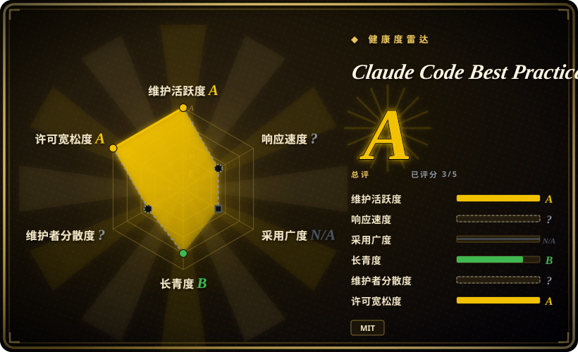
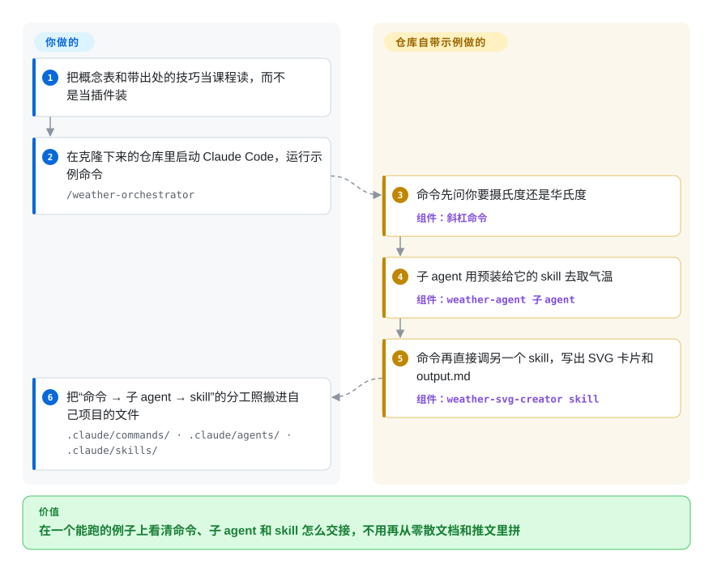

# Claude Code Best Practice

Claude Code 用了一个月，你对子 agent、skill、hook、`settings.json` 的了解还是一堆收藏的推文加几页记不全的文档，说不清一件事该写成命令还是交给子 agent。这个仓库是一个人持续更新的 Claude Code 课程：一张链到官方文档的功能地图，83 条标明出处的技巧，外加一个很小的天气示例，演示命令、子 agent 和 skill 怎么互相交接。

## 何时使用

你是开发者或技术负责人，团队刚把 Claude Code 用进日常，你正准备写第一个像样的 `.claude/` 目录：一份 `CLAUDE.md`、两三个斜杠命令，也许再加一个子 agent 和一个 hook。官方文档每个功能各讲各的，没人告诉你它们怎么拼到一起——你的第一版是 400 行的 `CLAUDE.md`，里面大写写着“NEVER add Co-Authored-By”，模型照样无视；其实 `settings.json` 里一行 `attribution` 配置就能强制做到。你想要一个地方，把这些原语并排摆出来，给一个它们互相交接的能跑的例子，再把 Claude Code 团队（Boris Cherny、Thariq 等人）公开讲过的用法收在一处。

这个仓库干的就是这件事。README 是一张 Claude Code 功能地图（每行链到官方文档页，再附作者自己写的 best practice 说明，有条件的还附一个能跑的实现），一张技巧表（每条都标了出处：Boris、Thariq、社区，或作者本人），`tips/` 和 `videos/` 下是推文串和播客的转写笔记，外加一个按“命令 → 子 agent → skill”接好的 `/weather-orchestrator` 示例。想要讲解加一个能跑的模式、而不是一页链接目录时，选它而不是 awesome-list；想先弄懂原语、再拼自己的工作流时，选它而不是 [ECC](../coding-agent-harnesses/ecc.zh.md)、[Superpowers](../coding-agent-harnesses/superpowers.zh.md) 这类装上就生效的 harness——README 给读者的第一条建议就是“把它当课程读，不要当工作流或 skill 用”。

## 怎么用起来

这里没有任何东西会装进你的 agent：它是一个 Git 仓库，装着 Markdown 页面和一套能用的 `.claude/` 目录，价值在于读。大部分页面由 Claude 自己撰写和刷新——作者运行一组斜杠命令（`/workflows:best-practice:workflow-claude-settings` 等），让它对照最新官方文档和更新日志重查某篇指南，再提交一条带日期的变更记录——所以内容紧跟 Claude Code 的版本，但它是 AI 维护的摘要，不是厂商文档。唯一动手的部分是天气示例：斜杠命令先问你一个问题，把取数交给一个子 agent，这个子 agent 启动时就“预装”了一个 skill（skill 的说明在它启动时被塞进它的上下文，好比给外包师傅递一张交底单），然后命令再调用另一个独立的 skill 把结果画出来。你要做的是读、跑一次示例、把这种分工抄进自己的项目；仓库不会替你配置任何东西。

<!-- flow-steps:begin (generated from flows/claude-code-best-practice.json by tools/flow_card.py — do not edit) -->

流程文字版

1. **你**：把概念表和带出处的技巧当课程读，而不是当插件装
2. **你**：在克隆下来的仓库里启动 Claude Code，运行示例命令 — `/weather-orchestrator`
3. **Claude Code Best Practice**：命令先问你要摄氏度还是华氏度 — 组件：`斜杠命令`
4. **Claude Code Best Practice**：子 agent 用预装给它的 skill 去取气温 — 组件：`weather-agent 子 agent`
5. **Claude Code Best Practice**：命令再直接调另一个 skill，写出 SVG 卡片和 output.md — 组件：`weather-svg-creator skill`
6. **你**：把“命令 → 子 agent → skill”的分工照搬进自己项目的文件 — `.claude/commands/ · .claude/agents/ · .claude/skills/`

**价值**：在一个能跑的例子上看清命令、子 agent 和 skill 怎么交接，不用再从零散文档和推文里拼

<!-- flow-steps:end -->

## 何时不用

- **把它当某个配置项、命令行参数或字段的权威来源。** 这些指南是 Claude 对照官方文档重新生成的摘要，而且会滞后：2026-09-29 时 `main` 上的 `best-practice/claude-settings.md` 仍标着“v2.1.252”（最后更新 2026-09-01），而 27 个自动生成的“每日 settings 漂移检查” PR（最新到 v2.1.283）一直没有合并。某个 key 的确切名字、作用域或默认值要紧时，去读官方 Claude Code 文档（`code.claude.com/docs`）和 `anthropics/claude-code` 里的 `CHANGELOG.md`，这个仓库只拿来找该打开哪一页文档。
- **把它的 `.claude/settings.json` 抄进你的项目。** 那是作者个人仓库的演示配置：`permissions.allow` 里有 `Bash(*)`、`Edit(*)`、`Write(*)` 和 `WebFetch(domain:*)`，`enableAllProjectMcpServers` 为 `true`（于是 `.mcp.json` 会用 `npx` 拉起三个 MCP 服务），约 30 个 hook 事件每次都执行 `python3 .claude/hooks/scripts/hooks.py` 来播放音效。放进团队仓库，这就是一份大开的权限授权加上一堆你没审过的 hook；应从官方权限文档出发，只加你需要的。在这个仓库的克隆里直接打开 Claude Code 也一样——你是在信任这个目录的设置和 hook。
- **你要的是装上就生效、能强制执行的方法论，而不是课程。** 这里没有插件、没有 marketplace 条目、也没有版本化发布；在你自己动手写文件之前，它不会改变 agent 的任何行为。想要即插即用的“头脑风暴 → 计划 → TDD → 验证”纪律，改用 [Superpowers](../coding-agent-harnesses/superpowers.zh.md) 或 [ECC](../coding-agent-harnesses/ecc.zh.md)。
- **你想搞懂 agent harness 内部是怎么造的。** 这个仓库教的是怎么*配置和使用* Claude Code，不讲 agent 循环、工具调度、上下文压缩是怎么实现的。要看内部原理，改用 [Learn Claude Code](learn-claude-code.zh.md)，它用可运行的 Python 把这些机制逐个重建一遍。
- **你想要最全的社区工具目录。** 它的 skill 合集、agent 合集和工作流表都是很短的精选清单（2026-09-29 时工作流 12 行、skill 合集 10 行、agent 合集 2 行）。要广度，`hesreallyhim/awesome-claude-code` 是覆盖命令、hook、状态栏和工具的更大链接目录。
- **你需要能在干净许可下转载或二次利用的内容。** 仓库的 MIT 许可来自作者本人，但语料里有一部分是别人的东西：`tips/` 页面转写了 X/Twitter 推文串并嵌入截图，`videos/` 页面是播客摘要，`reports/claude-spinner-verbs-and-tips.md` 列出的字符串按 README 所说是“从 CLI 二进制 v2.1.121 提取的”——那是 Claude Code 自己的二进制，按 Anthropic 商业条款分发，声明“All rights reserved”。[推断] MIT 授权覆盖不到第三方推文，也覆盖不到从专有二进制里取出的字符串；要引用就引原始出处，不要把这些页面搬进自己的文档或训练数据。

## 横向对比

| 替代品 | 是否收录 | 我们的评价 | 取舍 |
|---|---|---|---|
| Claude Code 官方文档（`code.claude.com/docs`） | 非仓库 | 当某个配置的确切名字、默认值或作用域决定你的配置时，读厂商文档；本仓库只当地图，用来找该打开哪一页、看功能怎么组合。 | 官方文档权威、发版当天就更新，但每个功能各讲各的；本仓库补上跨功能的模式和标了出处的技巧，代价是滞后和 AI 写的摘要。它是文档站，不是仓库。 |
| `hesreallyhim/awesome-claude-code` | 未收录 | 想找社区里现成的命令、hook、状态栏或工具时，去翻那个 awesome-list；想要讲解和一个能跑的模式、而不是一份目录时，留在这里。 | 目录广得多（2026-09-29 约 5.48 万星），但每条的讲解少得多，GitHub 上许可显示为 NOASSERTION。是真实仓库，本批次（标签页收录批）未添加。 |
| `ykdojo/claude-code-tips` | 未收录 | 想要单个作者的技巧、外加一个可直接抄的状态栏脚本和容器配置时，选那个仓库；想要归到 Claude Code 团队名下的技巧加一张功能地图时，选本仓库。 | 更窄、更偏动手（2026-09-29 约 1.02 万星）；一手出处更少，功能覆盖也更少。是真实仓库，本批次（标签页收录批）未添加。 |
| [Learn Claude Code](learn-claude-code.zh.md) | ✅ | 你的问题是 agent harness 怎么造（循环、工具、子 agent、压缩）时，去上那门课；问题是日常怎么配置和使用 Claude Code 时，留在这里。 | Learn Claude Code 让你用可运行的 Python 重建机制；本仓库讲的是产品上的各种开关，给一个 `.claude/` 示例，底下没有代码可研究。 |
| [ECC](../coding-agent-harnesses/ecc.zh.md) | ✅ | 想今天就把一整套现成的 agent、skill、hook 和规则装进 agent，选 ECC；想先学懂原语、再拼一套更小的自用配置，选本仓库。 | ECC 装上立刻改变 agent 行为，但要接受并持续跟进一大块有主见的配置；本仓库在你动手写文件前什么都不改，花的是阅读时间，不是被锁定。 |

## 健康度与可持续性

- **维护（2026-09-29）：** 表面上非常活跃——每天都有推送，未归档——但活动是自动化的：2026-06-29 到 2026-09-29 之间提交作者为 `claude` 的有 1068 次，`shanraisshan` 21 次，作者最后一次合并 PR 是 2026-09-02。需要走 PR 的指南（settings 指南）已经落后于产品；直接提交的指南（skills、subagents、commands）跟到了 v2.1.283。判断新鲜度看每页自己的“Last Updated / Claude Code 版本”徽章，不看仓库推送日期。
- **治理与巴士系数：** 个人账号下的单人仓库。外部 PR 不是一条可用的通道——最近 100 个已关闭 PR 里，10 个非作者 PR 一个都没合并，另有 13 个还开着。作者通过 Polar 和页眉赞助位（Disrupt、ClaudeKit）获得资助，README 里有披露；因此它对别人的工作流和工具做的排表不算中立排名。[推断] 作者一旦停掉刷新命令，页面就停在它们最后见到的那个 Claude Code 版本。
- **年龄与 Lindy（2026-09）：** 创建于 2025-10-31，约 11 个月，约 6.65 万星、6.6 千 fork。年轻，而且它讲的对象几天一变（四周内从 v2.1.252 到 v2.1.283），Lindy 帮不上忙：任何一页的有效期都以周计。它的价值在于这张持续更新的地图，而这取决于一个人一直开着那套自动化。
- **风险信号：** 作者本人的文字是 MIT；同一棵树里还放着第三方推文转写和截图、播客摘要，以及一份从专有 Claude Code 二进制中提取的字符串清单（见“何时不用”）。提交进仓库的 `.claude/settings.json` 放了很宽的权限，hook 在每个事件上都跑一个 Python 脚本——在作者自己的沙盒里没问题，抄走就是隐患。没有 release 也没有 tag，只能按 commit SHA 锁版本。

## 存疑（未验证）

- [未验证] 星数（约 6.65 万）和 fork 数（约 6.6 千）来自 2026-09-29 的 GitHub API；README 宣称曾登 GitHub 当日 Trending 第 1 并在 2026 年 3 月上榜，没有对照 Trending 存档核实。星数只代表传播面，不代表质量。
- [推断] 提交作者 `claude` 和 PR 正文里的“Generated with Claude Code”说明刷新命令是按计划以 Claude Code 会话运行的；具体跑在哪里（本地 cron、网页版 Claude Code 的 routines 或别处）仓库里没有写，仓库也没有 `.github/workflows/`。
- [推断] MIT 许可无法授予第三方推文、截图、播客内容，或从 Claude Code 二进制提取的字符串的权利（该二进制按 Anthropic 商业条款分发，`anthropics/claude-code` 的 LICENSE.md 写明“All rights reserved”）。这是对许可的理解，不是法律意见；也没有系统地查过是否有针对该仓库的下架或投诉。
- [未验证] README 里每条技巧的出处（Boris、Thariq、Cat、Lydia 等）都链到 X/YouTube 帖子；没有逐条打开链接核对技巧是否忠实转述。
- [未验证] 没有逐页核对各篇 best practice 指南与官方文档是否一致；2026-09-29 只读了四篇指南的版本徽章（settings 为 v2.1.252；skills、subagents、commands 为 v2.1.283）。
- [未验证] 横向对比表里的星数（`awesome-claude-code` 约 5.48 万、`claude-code-tips` 约 1.02 万）来自 2026-09-29 的 GitHub API；除仓库元数据外，没有审阅它们的内容和许可。
- [推断] GitHub 把语言判为 HTML，是因为 `presentation/` 下的 HTML 幻灯片和 `!/` 下的几份 HTML 缩略图/转写稿；语料绝大部分是 Markdown（2026-09-29 有 122 个 `.md` 文件），另有一个 Python hook 脚本。
