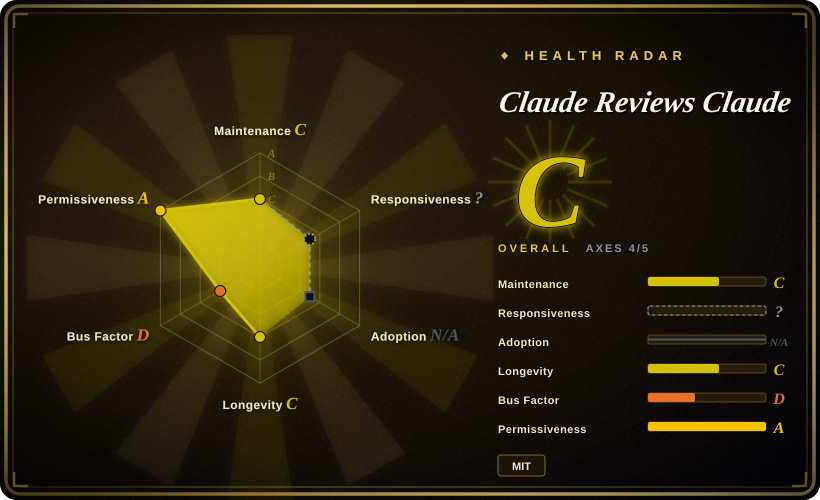
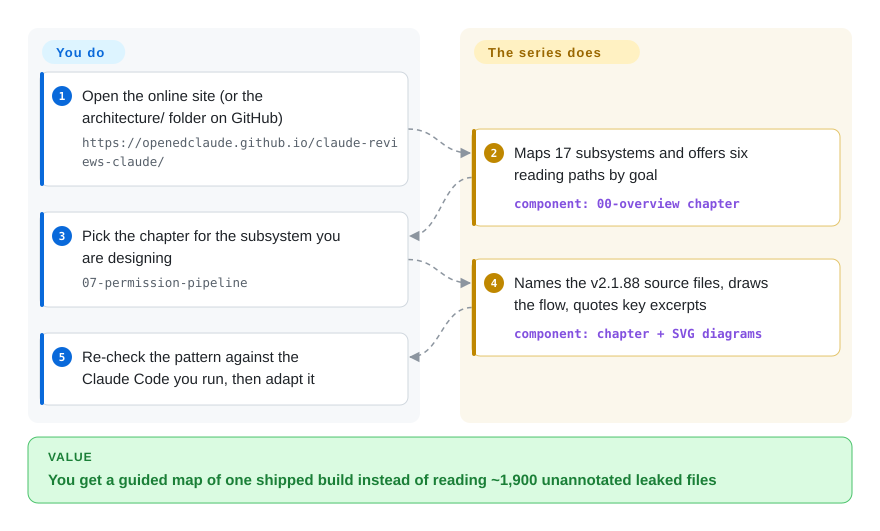

# Claude Reviews Claude

You want to know how a production coding agent actually wires its loop, permission checks, context compaction and subagents, but the only full source anyone has seen is half a million lines of TypeScript that leaked once through an npm debugging file. This is an 18-chapter EN/ZH essay series that walked through that one leaked build (Claude Code v2.1.88, March 2026) subsystem by subsystem, with diagrams and short code excerpts, so you read a map instead of the pile.

## When to use

You are designing your own agent harness — an internal coding CLI, a hook layer, a permission gate — and you keep asking "how does Claude Code handle this?" The public docs tell you what `PreToolUse` hooks or auto-compact do from the outside, not how they are sequenced inside: when a Bash command is parsed before the sandbox decides, what gets dropped first when the 200K-token window fills, how a coordinator hands a worker a self-contained prompt. Reading the leaked source dump yourself means opening a bundled `main.tsx` the README puts at 808 KB and ~1,900 files with no guide.

You open this series, start from the overview's six reading paths (Path A: 00 → 12 → 01 → 02 for the core loop; Path B for security and context), and read the chapter for the subsystem you are designing. Each one names the source files it covers, draws the flow as an SVG, and quotes the relevant excerpts. The deciding tradeoff against the substitutes: unlike [Learn Claude Code](learn-claude-code.md), which rebuilds *Claude Code–style* mechanisms in clean teaching Python, this describes what one real shipped build contained — including production-only concerns such as feature-flag dead-code elimination, telemetry sinks and remote killswitches — at the price of being a single frozen snapshot of a proprietary product, obtained from a leak.

## How it works

The repository is only prose and pictures: 19 Markdown files under `architecture/` (chapters 00–17, chapter 14 split in two), Chinese mirrors under `architecture/zh-CN/`, 27 SVG diagrams, and a near-identical copy of all of it under `docs/` that a VitePress site generator builds into the GitHub Pages site. Nothing runs and nothing installs into your agent — you read it, the way you would read a teardown article of a car you cannot buy the blueprints for. Its input was the TypeScript that Anthropic's `@anthropic-ai/claude-code@2.1.88` npm package accidentally exposed through a source map (a debugging file that maps minified code back to the original, here carrying the full original text); the repo's DISCLAIMER says it ships commentary plus brief excerpts, not the source itself, and points readers to two third-party repos for the raw code. The README states the analysis was written by Claude reading that source; the repo gives no way to check that or to see what human editing was done. All 42 commits landed between 2026-03-31 and 2026-04-01, so what you get is a map of that one build — you do the work of checking each pattern against the Claude Code you actually run.

<!-- flow-steps:begin (generated from flows/claude-reviews-claude.json by tools/flow_card.py — do not edit) -->

Text version of the flow

1. **You**: Open the online site (or the architecture/ folder on GitHub) — `https://openedclaude.github.io/claude-reviews-claude/`
2. **Claude Reviews Claude**: Maps 17 subsystems and offers six reading paths by goal — component: `00-overview chapter`
3. **You**: Pick the chapter for the subsystem you are designing — `07-permission-pipeline`
4. **Claude Reviews Claude**: Names the v2.1.88 source files, draws the flow, quotes key excerpts — component: `chapter + SVG diagrams`
5. **You**: Re-check the pattern against the Claude Code you run, then adapt it

**Value**: You get a guided map of one shipped build instead of reading ~1,900 unannotated leaked files

<!-- flow-steps:end -->

## When NOT to use

- **You need to know how Claude Code behaves *today*.** The analysis is pinned to v2.1.88; npm had shipped v2.1.284 by 2026-09-28 and the repo has not been touched since 2026-04-01. Prompts, flags, tools and the permission pipeline have moved on. For current behavior use Anthropic's official docs and the `CHANGELOG.md` in `anthropics/claude-code` (not indexed); for the current prompt text, Piebald-AI/claude-code-system-prompts (not indexed) re-extracts it within minutes of each release.
- **Your organisation cannot touch material derived from leaked proprietary code.** The source it analyses was never licensed for redistribution — v2.1.88 is no longer on npm (the version returns 404 as of 2026-09-29 while 2.1.87 and 2.1.89 remain), the repo's own DISCLAIMER calls the code "the property of Anthropic, PBC" and rests the excerpts on a fair-use argument, and the chapters sampled (01, 07, 17) carry 23–36 fenced code blocks each. The MIT license covers only the authors' commentary. If legal review would reject it, learn the same mechanisms from an open-source harness whose code you may read and reuse — [Codex](../../agent-frameworks/coding-agents/terminal-agents/codex.md) (Apache-2.0) or [OpenCode](../../agent-frameworks/coding-agents/terminal-agents/opencode.md) — or rebuild them with [Learn Claude Code](learn-claude-code.md).
- **You want runnable code to copy into your harness.** There is no code here to run, test or import; excerpts are condensed ("… 900+ lines of orchestration") and depend on internals you do not have. For working reference implementations use [Learn Claude Code](learn-claude-code.md) (standalone Python per mechanism) or read [Codex](../../agent-frameworks/coding-agents/terminal-agents/codex.md)'s source directly.
- **You need numbers you can cite.** The figures are the analysis's own counts and are not internally consistent — the README gives 477,439 lines of TypeScript in one place and 512,664 in another — and claims such as "7-layer defense" or "~108 missing modules" are the author's framing. Treat them as orientation; if you need to quote exact internals, cite a primary artifact such as ChinaSiro/claude-code-sourcemap (not indexed), with the legal exposure that implies.
- **You expect corrections or a living community resource.** One account wrote every commit; the only substantive open issue (#14, 2026-07-13, "which GitHub source does this analyse?") and the one real PR (#13, 2026-07-01) have no maintainer reply as of 2026-09-29, and most other issues are reaction posts. If you need an actively maintained learning resource, use [Learn Claude Code](learn-claude-code.md).

## Comparison

| Alternative | In index | Our verdict | Tradeoff |
|---|---|---|---|
| [Learn Claude Code](learn-claude-code.md) | ✅ | When you want to understand harness mechanisms well enough to build them, pick Learn Claude Code; pick this series only when you specifically need what the shipped v2.1.88 build did, because the course is a clean-room reimplementation you can legally run and extend. | Runnable, maintained, license-clean teaching code — but it describes Claude Code–*style* designs, not the product's actual internals or its production-only telemetry and flag machinery. |
| [Codex](../../agent-frameworks/coding-agents/terminal-agents/codex.md) | ✅ | When you want to study a real production coding-agent harness end to end, read Codex's Apache-2.0 source; pick this series only when the question is about Claude Code in particular, because Codex's code is current, complete and reusable. | You get the true, current implementation with no leak provenance — but a different product's design choices and no guided narrative; you do the mapping yourself. |
| Piebald-AI/claude-code-system-prompts | not indexed | When you need the exact current prompt and tool-description text Claude Code sends, pick Piebald's repo; pick this series when you need the surrounding control flow (loop, permissions, compaction) that prompts alone do not show. Not added in this tab-intake batch. | Updated within minutes of each release with a per-version changelog, but it is extracted Anthropic text ("© Anthropic PBC. All rights reserved" in its README) and covers prompts only, not architecture. |
| ChinaSiro/claude-code-sourcemap | not indexed | When you must verify a specific internal detail against the primary text, go to the extracted source itself; pick this series first to learn where to look, because 1,900 unannotated files are unreadable without a map. Not added in this tab-intake batch. | Primary evidence instead of someone's summary — but it is a redistribution of unlicensed proprietary code (no license file, single push on 2026-03-31), with the heaviest legal exposure of any option here. |
| Claude Code official docs | not a repo | When you need supported, current behavior and configuration (hooks, settings, permissions), use Anthropic's hosted docs; pick this series only to see the implementation behind them as it stood in March 2026. | Authoritative and kept current, but describes the interface from outside; closed product documentation, not a repository. |

## Health & viability

- **Maintenance (2026-09-29):** finished and frozen. All 42 commits fall inside 2026-03-31 12:58Z → 2026-04-01 19:52Z; there are no releases or tags, and the README declares "Season 1 complete". Nothing has been pushed in ~6 months while Claude Code's npm version climbed from 2.1.88 to 2.1.284, so every chapter is drifting further from the live product.
- **Governance / bus factor:** a single author (`neo1027144`) under a personal account, `openedclaude`, that was created on GitHub about 90 seconds before the repo (2026-03-31) and holds 2 public repos. No CONTRIBUTING, no co-maintainers; incoming issues and PRs since April have gone unanswered.
- **Age & Lindy (2026-09):** six months old, and the whole body of work was produced in about 31 hours. 1.6k stars and 709 forks came from the leak-news spike, not from sustained use — a young-and-inactive profile that gets no Lindy credit. What keeps value is the conceptual material (patterns that outlive the version), not the version-specific detail.
- **Adoption:** readers only; there is nothing to depend on. The companion GitHub Pages site was live on 2026-09-29.
- **Risk flags:** provenance is the dominant risk. The analysis exists because of an accidental source-map exposure in an npm version that is no longer published; it quotes proprietary code under a self-asserted fair-use claim and invites DMCA contact in its DISCLAIMER. The repo could be taken down or scrubbed at any time, and using its excerpts in your own work inherits that exposure. MIT applies to the authors' own text only.

## Caveats (unverified)

- [未验证] That the chapters were written by Claude, as the README claims; the repo holds no transcripts or prompts, and the human author's share of the writing and editing cannot be determined.
- [未验证] Accuracy of any individual chapter against the real v2.1.88 source; spot-checking requires the extracted source, which this page deliberately does not consult or redistribute.
- [未验证] Whether every quoted excerpt is short enough to be fair use; the repo's own claim is a legal position, not a ruling, and no takedown or response from Anthropic is visible in the repo as of 2026-09-29.
- [推断] Anthropic unpublished v2.1.88 because of the source-map exposure; npm confirms only that the version now returns 404 while 2.1.87 and 2.1.89 remain.
- [未验证] The DISCLAIMER's statement that the repo contains no complete source and no credentials beyond what was in the public npm package; it was not audited file by file.
- [推断] Codebase statistics (477,439 vs 512,664 lines, "42 tools", "108 missing modules") are the author's counts; the README itself gives two different line totals.
- [未验证] Star (1,622) and fork (709) counts as of 2026-09-29 are volatile and were not checked for inflation.
- [推断] `type: skill-pack` is the closest fit for a pure article collection; the repo has no tools, skills or runnable code.
