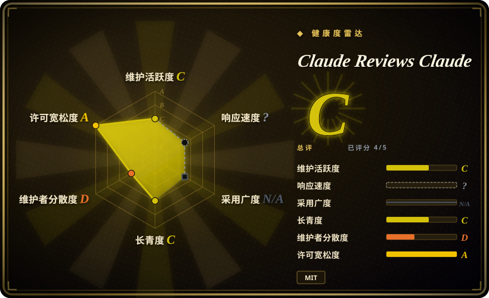
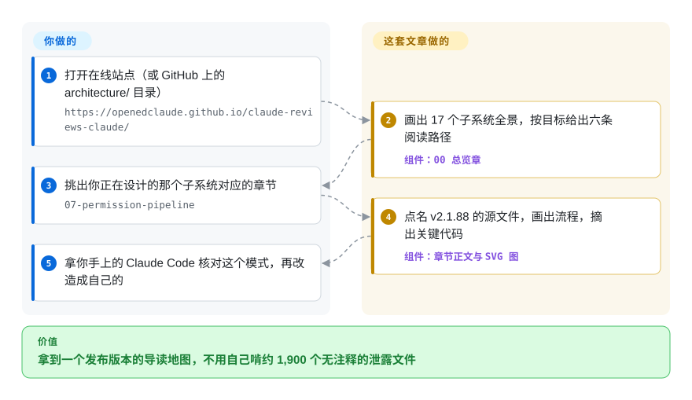

# Claude Reviews Claude

你想知道一个真在生产里跑的编码 agent 是怎么把主循环、权限检查、上下文压缩和子 agent 串起来的，可唯一见过全貌的源码，是某次从 npm 调试文件里漏出来的五十万行 TypeScript。这个仓库是一套中英双语、18 章的拆解文章：只针对那一个泄露版本（Claude Code v2.1.88，2026 年 3 月）逐个子系统画图、摘短代码，让你读地图而不是啃原始代码堆。

## 何时使用

你在设计自己的 agent harness——内部用的编码 CLI、一层 hook、一道权限闸——脑子里反复冒出“Claude Code 这里是怎么做的？”。官方文档只从外面告诉你 `PreToolUse` hook、自动压缩有什么效果，不告诉你里面的先后顺序：Bash 命令是先被解析还是先交给沙箱判断，200K token 的窗口塞满时先丢哪一块，协调者怎么给 worker 写一段自包含的提示。自己去翻泄露的源码，面对的是 README 里说的 808 KB 的打包入口 `main.tsx` 和约 1,900 个文件，没有任何导读。

你打开这套文章，从总览章的六条阅读路径开始（路径 A：00 → 12 → 01 → 02 讲核心循环；路径 B 讲安全与上下文），直接读你正在设计的那个子系统对应的章节。每章写明覆盖了哪些源文件，用 SVG 画出流程，并摘出相关代码片段。和替代品相比，决定性的取舍是：[Learn Claude Code](learn-claude-code.zh.md) 用干净的教学 Python 重写“Claude Code 式”的机制，而这里描述的是一个真实发布版本里实际有什么——包括只在生产里才出现的东西，比如靠特性开关在编译期删代码、遥测上报通道、远程紧急开关；代价是它只是一个专有产品的冻结快照，而且来自泄露。

## 怎么用起来

整个仓库只有文字和图：`architecture/` 下 19 个 Markdown（00–17 章，第 14 章拆成两篇），`architecture/zh-CN/` 下是中文版，27 张 SVG 图，另外 `docs/` 下有一份几乎相同的副本，由 VitePress（一个静态文档站生成器）构建成 GitHub Pages 网站。没有任何东西可以运行，也不会装进你的 agent——你只是读它，就像读一篇拆车评测：图纸买不到，只能看别人拆开后拍的照片。它的原料是 Anthropic 的 npm 包 `@anthropic-ai/claude-code@2.1.88` 意外随包发布的 source map（一种把压缩后的代码映射回原始代码的调试文件，这次里面带着完整原文）；仓库自己的 DISCLAIMER 说这里只放评论和简短摘录、不放源码本身，并给读者指了两个第三方仓库去看原始代码。README 声称这些分析是 Claude 读完源码后写的，仓库里没有任何办法核实这一点，也看不出人工改了多少。全部 42 个 commit 都落在 2026-03-31 到 2026-04-01 之间，所以你拿到的是那一个版本的地图——把每个模式拿去和你手上正在用的 Claude Code 对一遍，这活得你自己干。

<!-- flow-steps:begin (generated from flows/claude-reviews-claude.json by tools/flow_card.py — do not edit) -->

流程文字版

1. **你**：打开在线站点（或 GitHub 上的 architecture/ 目录） — `https://openedclaude.github.io/claude-reviews-claude/`
2. **Claude Reviews Claude**：画出 17 个子系统全景，按目标给出六条阅读路径 — 组件：`00 总览章`
3. **你**：挑出你正在设计的那个子系统对应的章节 — `07-permission-pipeline`
4. **Claude Reviews Claude**：点名 v2.1.88 的源文件，画出流程，摘出关键代码 — 组件：`章节正文与 SVG 图`
5. **你**：拿你手上的 Claude Code 核对这个模式，再改造成自己的

**价值**：拿到一个发布版本的导读地图，不用自己啃约 1,900 个无注释的泄露文件

<!-- flow-steps:end -->

## 何时不用

- **你要知道 Claude Code *现在* 的行为。** 分析钉死在 v2.1.88；到 2026-09-28，npm 上的版本已经到 v2.1.284，而这个仓库自 2026-04-01 起再没动过。提示词、特性开关、工具和权限流水线都已经变了。要看当前行为，用 Anthropic 官方文档和 `anthropics/claude-code` 仓库里的 `CHANGELOG.md`（未收录）；要看当前提示词原文，用 Piebald-AI/claude-code-system-prompts（未收录），它每次发版几分钟内就重新提取一遍。
- **你所在的组织不能碰由泄露的专有代码衍生出来的材料。** 它分析的源码从来没有被授权再分发——v2.1.88 已从 npm 下架（截至 2026-09-29 该版本返回 404，而 2.1.87 和 2.1.89 都还在），仓库自己的 DISCLAIMER 写明代码“归 Anthropic, PBC 所有”，摘录靠的是合理使用的主张；抽查的三章（01、07、17）每章有 23–36 个代码块。MIT 许可只覆盖作者自己写的评论。如果法务会否掉它，就从允许阅读和复用代码的开源 harness 学同样的机制——[Codex](../../agent-frameworks/coding-agents/terminal-agents/codex.zh.md)（Apache-2.0）或 [OpenCode](../../agent-frameworks/coding-agents/terminal-agents/opencode.zh.md)——或者用 [Learn Claude Code](learn-claude-code.zh.md) 自己重建一遍。
- **你想要能直接抄进自己 harness 的可运行代码。** 这里没有任何能运行、测试或 import 的代码；摘录都是删节过的（“… 900+ lines of orchestration”），还依赖你手上没有的内部模块。要可运行的参考实现，用 [Learn Claude Code](learn-claude-code.zh.md)（每个机制一份独立 Python），或者直接读 [Codex](../../agent-frameworks/coding-agents/terminal-agents/codex.zh.md) 的源码。
- **你需要能引用的数字。** 文中数字是作者自己数的，而且自相矛盾——README 一处说 477,439 行 TypeScript，另一处说 512,664 行——“七层防御”“约 108 个缺失模块”这类说法是作者的归纳框架。只把它们当方向感；真要引用精确的内部细节，得去查原始材料，比如 ChinaSiro/claude-code-sourcemap（未收录），并承担随之而来的法律风险。
- **你期待有人勘误、有社区持续维护。** 所有 commit 出自同一个账号；唯一一个实质性问题（#14，2026-07-13，“请问解析的是哪个开源 github？”）和唯一一个正经 PR（#13，2026-07-01）截至 2026-09-29 都没有维护者回复，其余 issue 大多是围观留言。要持续维护的学习材料，用 [Learn Claude Code](learn-claude-code.zh.md)。

## 横向对比

| 替代品 | 是否收录 | 我们的评价 | 取舍 |
|---|---|---|---|
| [Learn Claude Code](learn-claude-code.zh.md) | ✅ | 想把 harness 机制理解到能自己造出来，选 Learn Claude Code；只有当你明确需要知道 v2.1.88 发布版本里实际怎么做时才选本系列，因为那门课是可以合法运行和扩展的净室重写。 | 得到可运行、有人维护、许可干净的教学代码；代价是它讲的是“Claude Code 式”设计，不是产品真实的内部实现，也没有生产环境才有的遥测和特性开关机制。 |
| [Codex](../../agent-frameworks/coding-agents/terminal-agents/codex.zh.md) | ✅ | 想完整研究一个真实的生产级编码 agent harness，去读 Codex 的 Apache-2.0 源码；只有问题专门针对 Claude Code 时才选本系列，因为 Codex 的代码是最新的、完整的、可复用的。 | 得到真实、当前的实现，没有泄露来源的包袱；代价是它是另一个产品的设计取舍，也没有导读，映射工作要你自己做。 |
| Piebald-AI/claude-code-system-prompts | 未收录 | 需要 Claude Code 当前实际发出的提示词和工具描述原文，选 Piebald 的仓库；需要提示词之外的控制流（循环、权限、压缩）时选本系列，因为光看提示词看不到这些。本批 tab-intake 未添加。 | 每次发版几分钟内更新，带逐版本变更记录；但内容是提取出来的 Anthropic 文本（其 README 写着“© Anthropic PBC. All rights reserved”），而且只覆盖提示词，不讲架构。 |
| ChinaSiro/claude-code-sourcemap | 未收录 | 必须拿原文核对某个具体内部细节时，去看提取出来的源码本身；先用本系列弄清该看哪里，因为 1,900 个没有注释的文件不看地图读不下去。本批 tab-intake 未添加。 | 得到一手证据而不是别人的总结；代价是它是对未授权专有代码的再分发（没有许可证文件，2026-03-31 推送一次后再无更新），是这里所有选项里法律风险最重的。 |
| Claude Code 官方文档 | 非仓库 | 需要受支持的、当前的行为和配置（hook、设置、权限），用 Anthropic 托管的文档；只有想看它们背后在 2026 年 3 月时的实现，才选本系列。 | 权威且持续更新，但只从外部描述接口；它是闭源产品的文档，不是仓库。 |

## 健康度与可持续性

- **维护（2026-09-29）：** 已完结、已冻结。42 个 commit 全部落在 2026-03-31 12:58Z → 2026-04-01 19:52Z 之间；没有 release 或 tag，README 自称“Season 1 complete”。约 6 个月没有任何推送，而 Claude Code 的 npm 版本已从 2.1.88 涨到 2.1.284，每一章都离线上产品越来越远。
- **治理 / 巴士因子：** 单一作者（`neo1027144`），挂在个人账号 `openedclaude` 下——该账号在建仓前约 90 秒（2026-03-31）才注册，共 2 个公开仓库。没有 CONTRIBUTING，没有共同维护者；四月以后进来的 issue 和 PR 都没人回。
- **年龄与 Lindy（2026-09）：** 仅 6 个月大，全部内容在约 31 小时内产出。1.6k star、709 fork 来自泄露新闻那一波流量，不是持续使用积累的——年轻且停更，拿不到任何 Lindy 加分。能保值的是概念层面的内容（比版本活得久的设计模式），不是版本相关的细节。
- **采用：** 只有读者，没有可依赖的东西。配套的 GitHub Pages 站点在 2026-09-29 仍可访问。
- **风险信号：** 来源是压倒性的风险。这份分析之所以存在，是因为一次意外的 source map 暴露，涉及的 npm 版本已不再发布；它在自称合理使用的前提下引用专有代码，并在 DISCLAIMER 里主动留了 DMCA 联系口子。仓库随时可能被下架或清洗，你在自己的作品里用它的摘录，也会继承这份风险。MIT 只适用于作者自己写的文字。

## 存疑（未验证）

- [未验证] README 所说各章由 Claude 撰写；仓库里没有对话记录或提示词，人类作者在写作和编辑中占多少比重无从判断。
- [未验证] 任一章节相对真实 v2.1.88 源码的准确性；抽查需要提取出来的源码，本页刻意不查阅、不转载它。
- [未验证] 每段引用摘录是否都短到构成合理使用；仓库的说法是一种法律立场，不是裁定，截至 2026-09-29 仓库里看不到 Anthropic 的下架请求或回应。
- [推断] v2.1.88 是因为 source map 暴露才被下架；npm 只能证明该版本现在返回 404，而 2.1.87 和 2.1.89 仍在。
- [未验证] DISCLAIMER 所说仓库不含完整源码、也不含公开 npm 包之外的凭据；没有逐文件审计。
- [推断] 代码库统计（477,439 与 512,664 行、“42 个工具”、“108 个缺失模块”）是作者自己数的；README 本身就给了两个不同的总行数。
- [未验证] Star（1,622）和 fork（709）数为 2026-09-29 的时点值，易变，未检查是否有刷量。
- [推断] 对纯文章合集而言，`type: skill-pack` 是最接近的类型；仓库里没有工具、skill 或可运行代码。
