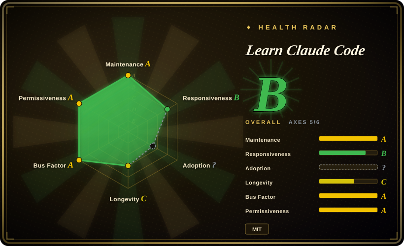

# Learn Claude Code

A 17-lesson build-along course (EN/ZH/JA) that re-implements a Claude Code–style agent harness from scratch in Python — one mechanism per chapter (agent loop, tools, permissions, hooks, memory, task system, agent teams, MCP), each with a standalone runnable `code.py`.

## When to use

You're an engineer who has used Claude Code (or a similar coding agent) daily and now needs to build or modify an agent harness yourself — for an internal tool, a custom coding agent, or a non-coding domain like ops or research. Reading a production agent's codebase (OpenHands, Aider) drowns you in unrelated machinery; framework docs teach you an API, not the design. You want to understand *why* the loop, the tool dispatch, the permission gate, context compaction, and subagent isolation are shaped the way they are — by building each one.

You reach for this repo and work through `s01_agent_loop` to `s17_goal_loop`: each chapter isolates exactly one harness mechanism around a constant `while True` agent loop, ships a single runnable `code.py` (small enough to read in one sitting), and states a design motto ("Hook around the loop, never rewrite the loop"). The deciding tradeoff vs alternatives: it teaches the *whole harness stack* (permissions, hooks, skills, memory, task graphs, team coordination, MCP) as composable mechanisms you rebuild yourself, where smolagents gives you a library to import and 12-Factor Agents gives you principles without runnable code.

## When NOT to use

- **You want a working coding-agent CLI today, not to learn internals.** The lessons are teaching-grade harness code — minimal permission checks, no hardened sandbox. Use Claude Code itself, or the same lab's production CLI Kode-CLI (未收录), because a course runtime trades robustness for readability.
- **You want an importable library or SDK for your application.** The chapters are standalone scripts, not a packaged dependency. Use [smolagents](../../agent-frameworks/agent-runtimes/agent-sdks/smolagents.md) for a minimal agent library, or the sibling kode-agent-sdk (未收录) for embedding, because copy-pasting lesson code into production inherits its intentional simplifications.
- **You want compact design principles, not a 17-chapter build-along.** Use [12-Factor Agents](../spec-driven-development/12-factor-agents.md) — a short methodology doc — when you need a shared vocabulary and checklist in an afternoon rather than a multi-day course.
- **You need authoritative Claude Code internals.** This is an independent reimplementation by shareAI-lab, not Anthropic's own material [未验证]. For vendor guidance, use Anthropic's official docs and cookbook (未收录), because Claude Code is closed-source and this course's mapping of its internals is the authors' interpretation [推断].
- **Your stack is not Python + Anthropic API.** The lessons are Python scripts built on the `anthropic` SDK; adapting to another model provider means rewriting the client layer yourself, so polyglot teams may prefer provider-agnostic reading like 12-Factor Agents.

## Comparison

| Alternative | In index | Our verdict | Tradeoff |
|---|---|---|---|
| [12-Factor Agents](../spec-driven-development/12-factor-agents.md) | ✅ | When you need a one-sitting principles checklist to review an existing agent design, pick 12-Factor Agents; pick this course when you need to *build* each mechanism with runnable code, because principles alone don't tell you how context compaction or permission pipelines actually interlock. | 12-factor is hours-to-read theory with nothing to run; this is days of hands-on work that produces working harness code. |
| [smolagents](../../agent-frameworks/agent-runtimes/agent-sdks/smolagents.md) | ✅ | When you want a maintained minimal library to import and ship agents with, pick smolagents; pick this course when the goal is understanding harness internals well enough to write your own, because an imported library hides exactly the mechanisms this course exposes. | smolagents saves build time but keeps you a consumer of its design choices; the course costs days and leaves you with your own implementation. |
| [OpenHands](../../agent-frameworks/coding-agents/orchestration-and-review/openhands.md) | ✅ | When you want to read or extend a production-grade open-source coding agent, pick OpenHands; pick this course when production codebases are too large to learn from, because OpenHands' real-world machinery (sandboxing, evaluation, integrations) obscures the core loop for a first-time harness builder. | OpenHands is the real thing with real complexity; the course is a deliberately simplified model you outgrow. |
| Anthropic Cookbook | 未收录 | When you want vendor-official API patterns (tool use, prompt caching, RAG) rather than a full harness build, pick the cookbook; pick this course when you need the agent *runtime* itself — loop, permissions, memory, teams — which vendor cookbooks deliberately leave to you. | Cookbook snippets are authoritative but mechanism-scattered; the course is unofficial but gives a coherent end-to-end runtime. |
| Kode-CLI | 未收录 | When you want a usable open-source coding CLI from the same lab (GLM/DeepSeek/MiniMax support), pick Kode-CLI; pick this course when your goal is learning to build rather than adopting a tool, because the CLI is the course author's production answer and hides the pedagogy. | Kode-CLI is the destination product; the course is the path that explains it. |

## Tech stack

- Python 3, no framework — each chapter is a standalone `code.py` built directly on the `anthropic` Python SDK (>= 0.25).
- Supporting deps: `python-dotenv`, `PyYAML` (skill files).
- Optional `web/` Next.js app rendering the course as an interactive site (reading, simulator views) [未验证].
- Content in three languages: English canonical, Chinese and Japanese mirrors per chapter.

## Dependencies

- Python 3.x and `pip install -r requirements.txt` (3 packages).
- An `ANTHROPIC_API_KEY` with pay-per-use API access — every lesson run costs model tokens.
- Node/npm only if you run the optional web platform.
- No database, no server, no external services beyond the model API.

## Ops difficulty

**Low.** There is nothing to deploy: clone, install three PyPI packages, set one env var, run `python s01_agent_loop/code.py`. The only real operational concerns are API cost control during experimentation and keeping up with `anthropic` SDK version drift; there are no tagged releases to pin to, so you track `main`.

## Health & viability

- **Maintenance (2026-09):** actively maintained — created 2025-06, ~233 commits, last push 2026-08-26; course content evolves in place with no tagged releases. The curriculum itself changed shape recently (a legacy 12-lesson track in `docs/`+`agents/` is being replaced by the root `s01`–`s17` track), so deep links and chapter numbers have churned once already.
- **Governance / bus factor:** Organization-owned (shareAI-lab) with ~30 contributors; the roadmap is one lab's editorial line and cross-promotes its sister products (Kode-CLI, claw0) — read it as a vendor-adjacent course, not a community curriculum.
- **Age & Lindy (2026-09):** ~15 months old with explosive adoption (76.8k stars / 12.4k forks) — a textbook young-and-hyped profile; age-based longevity is unproven. Mitigating factor: the content is conceptual (agent-loop mechanisms generalize), so value decays mainly by *curriculum drift* against Claude Code's moving feature set, not by abandonment alone.
- **Adoption & ecosystem:** 76.8k stars (2026-09), trilingual docs, dedicated web platform; no downstream dependents in the package sense — adoption is readers, not importers.
- **Risk flags:** MIT, no relicense history; no installable artifact means no supply-chain surface. Main risks are brand confusion with official Anthropic material (none is claimed [未验证]) and chapter-number churn during the ongoing track migration.

## Caveats (unverified)

- [未验证] Star/fork counts (76.8k / 12.4k, 2026-09) and contributor count (~30) are point-in-time GitHub figures; volatile.
- [未验证] No affiliation with or endorsement by Anthropic is stated in the repo; "learn-claude-code" is an independent third-party course despite the name.
- [未验证] Lesson compatibility with non-Anthropic model providers; the code targets the `anthropic` SDK and its tool-use message shape.
- [未验证] Completeness of the `web/` platform relative to the root `s01`–`s17` track; the README says s16/s17 have full views but "hero visualizations remain intentionally minimal".
- [未验证] Windows support of the lesson scripts; the lab's separate CLI product advertises Windows compatibility, the course repo does not.
- [推断] Classified here as `framework` (runnable reference harness code), though its own README frames it as course material — "grasp the key designs and build it yourself", not a library to depend on.
- [推断] Its description of Claude Code internals is the authors' interpretation of observable behavior; Claude Code is closed-source, so specific mechanism claims (e.g. its exact compaction steps) cannot be confirmed against the real implementation.
