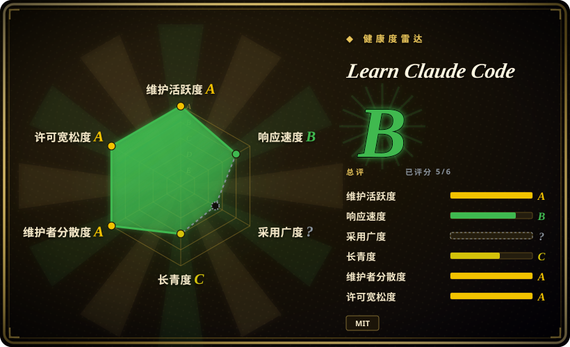

# Learn Claude Code

一套 17 章的动手课程（英／中／日三语），用 Python 从零复刻一个 Claude Code 风格的 agent harness——每章只加一个机制（agent loop、工具、权限、hooks、记忆、任务系统、agent 团队、MCP），并附一个可独立运行的 `code.py`。

## 何时使用

你是一名工程师，日常在用 Claude Code（或类似的编程 agent），现在需要自己动手构建或改造一个 agent harness——可能是内部工具、定制编程 agent，或者运维、研究这类非编程领域。直接读生产级 agent 的代码库（OpenHands、Aider）会被大量无关机制淹没；框架文档教你的是 API，不是设计。你想搞清楚 loop、工具分发、权限闸门、上下文压缩、subagent 隔离**为什么**长这样——靠亲手各造一遍。

这时你打开这个仓库，从 `s01_agent_loop` 学到 `s17_goal_loop`：每章围绕同一个恒定不变的 `while True` agent loop 只隔离讲一个 harness 机制，附一个单文件可运行的 `code.py`（小到一次能读完），并给出一句设计格言（比如「Hook around the loop, never rewrite the loop」）。相对替代品的决定性取舍：它把**整套 harness 栈**（权限、hooks、skill、记忆、任务图、团队协作、MCP）拆成可组合机制让你自己重造；smolagents 给你一个直接 import 的库，12-Factor Agents 给你没有可运行代码的原则清单。

## 何时不用

- **你今天就要一个能用的编程 agent CLI，而不是想学内部原理。** 课程代码是教学级 harness——权限检查极简、没有加固沙箱。请直接用 Claude Code 本体，或同一实验室的生产级 CLI Kode-CLI（未收录），因为课程 runtime 为了可读性牺牲了健壮性。
- **你想要一个能 import 进自己应用的库或 SDK。** 各章是独立脚本，不是可依赖的包。要极简 agent 库请用 [smolagents](../../agent-frameworks/agent-runtimes/smolagents.zh.md)，要嵌入式 SDK 请用同门的 kode-agent-sdk（未收录），因为把课程代码拷进生产会连它有意的简化一起继承。
- **你想要精炼的设计原则，而不是 17 章的动手课。** 请用 [12-Factor Agents](../spec-driven-development/12-factor-agents.zh.md)——一份短方法论文档；当你只需要一个下午建立共同词汇和检查清单，而不是花多天上一门课时选它。
- **你需要权威官方的 Claude Code 内部资料。** 本课程是 shareAI-lab 的独立复刻，不是 Anthropic 官方材料 [未验证]。要厂商指导请用 Anthropic 官方文档和 cookbook（未收录），因为 Claude Code 是闭源的，本课程对其内部机制的映射只是作者的解读 [推断]。
- **你的技术栈不是 Python + Anthropic API。** 课程代码是构建在 `anthropic` SDK 上的 Python 脚本；换模型供应商要自己重写客户端层，多语言团队更适合读 12-Factor Agents 这种供应商中立的材料。

## 横向对比

| 替代品 | 是否收录 | 我们的评价 | 取舍 |
|---|---|---|---|
| [12-Factor Agents](../spec-driven-development/12-factor-agents.zh.md) | ✅ | 如果你需要一份一次读完的原则清单来评审既有 agent 设计，选 12-Factor Agents；如果你需要动手把每个机制**造出来**并跑通，选本课程，因为原则本身不会告诉你上下文压缩和权限管线实际如何咬合。 | 12-factor 是几小时读完、没有代码可跑的理论；本课程是数天的动手量，产出可运行的 harness 代码。 |
| [smolagents](../../agent-frameworks/agent-runtimes/smolagents.zh.md) | ✅ | 如果你想要一个有人维护、可 import 直接交付 agent 的极简库，选 smolagents；如果目标是把 harness 内部机制吃透到自己能写，选本课程，因为 import 的库恰好把本课程要暴露的机制全藏了起来。 | smolagents 省掉构建时间，但你始终是其设计取舍的消费者；本课程花掉几天，留下的是你自己的实现。 |
| [OpenHands](../../agent-frameworks/coding-agents/orchestration-and-review/openhands.zh.md) | ✅ | 如果你想阅读或扩展一个生产级开源编程 agent，选 OpenHands；如果生产代码库对初学者太大、学不动，选本课程，因为 OpenHands 的真实机制（沙箱、评测、集成）会遮住核心 loop。 | OpenHands 是有真实复杂度的真家伙；本课程是刻意简化、迟早会毕业的模型。 |
| Anthropic Cookbook | 未收录 | 如果你想要厂商官方的 API 模式（tool use、prompt caching、RAG）而不是完整 harness 构建，选 cookbook；如果你需要的是 agent **runtime** 本身——loop、权限、记忆、团队——而这些恰是厂商 cookbook 刻意留给你的部分，选本课程。 | cookbook 片段权威但机制分散；本课程非官方但给出连贯的端到端 runtime。 |
| Kode-CLI | 未收录 | 如果你想要同一实验室出品的可用开源编程 CLI（支持 GLM／DeepSeek／MiniMax），选 Kode-CLI；如果目标是学会构建而不是采用工具，选本课程，因为 CLI 是课程作者的生产答案，把教学过程藏了起来。 | Kode-CLI 是终点产品；本课程是解释它由来的路径。 |

## 技术栈

- Python 3，无框架——每章是一个直接构建在 `anthropic` Python SDK（>= 0.25）上的独立 `code.py`。
- 辅助依赖：`python-dotenv`、`PyYAML`（skill 文件）。
- 可选的 `web/` Next.js 应用，把课程渲染成带阅读、模拟器视图的交互站点 [未验证]。
- 内容三语：英文为正本，每章附中、日译文。

## 依赖

- Python 3.x，跑 `pip install -r requirements.txt`（共 3 个包）。
- 一个 `ANTHROPIC_API_KEY`，按量付费——每次跑课程脚本都消耗模型 token。
- 仅在跑可选 web 平台时需要 Node／npm。
- 无数据库、无服务器；除模型 API 外无外部服务。

## 运维难度

**低。** 没有需要部署的东西：clone、装三个 PyPI 包、设一个环境变量、跑 `python s01_agent_loop/code.py`。真正要操心的只有实验时的 API 成本控制，以及跟上 `anthropic` SDK 的版本漂移；仓库没有打过 tag，只能跟踪 `main`。

## 健康度与可持续性

- **维护（2026-09）：** 维护活跃——2025-06 创建，约 233 个 commit，最近推送 2026-08-26；课程内容原地演进，没有 tagged release。课程结构本身最近刚变过（`docs/`+`agents/` 里的旧 12 课轨道正被根目录 `s01`–`s17` 新轨道取代），深链和章节编号已经变动过一次。
- **治理／bus factor：** 组织账号（shareAI-lab）持有，约 30 个贡献者；路线图是单一实验室的编辑路线，并交叉推广其姊妹产品（Kode-CLI、claw0）——按厂商关联课程读，别当中立社区课程。
- **年龄与 Lindy（2026-09）：** 约 15 个月，采用量爆发（76.8k stars／12.4k forks）——典型的年轻高热画像，按年龄的持续性未经验证。缓解因素：内容是概念性的（agent loop 机制可泛化），价值衰减主要来自**课程漂移**（跟不上 Claude Code 快速变化的特性），而不是单纯的停更。
- **采用与生态：** 76.8k stars（2026-09）、三语文档、专属 web 平台；没有包意义上的下游依赖者——采用者是读者，不是 import 者。
- **风险标记：** MIT，无改许可证历史；无可安装产物意味着没有供应链攻击面。主要风险是与 Anthropic 官方材料的品牌混淆（仓库未声称任何官方关联 [未验证]），以及轨道迁移期章节编号再次变动。

## 存疑（未验证）

- [未验证] star／fork 数（76.8k／12.4k，2026-09）与贡献者数（约 30）均为 GitHub 时点数据，易波动。
- [未验证] 仓库未声明与 Anthropic 的任何关联或背书；尽管名字相近，「learn-claude-code」是独立第三方课程。
- [未验证] 课程代码对非 Anthropic 模型供应商的兼容性；代码面向 `anthropic` SDK 及其 tool-use 消息结构。
- [未验证] `web/` 平台相对根目录 `s01`–`s17` 轨道的完整度；README 称 s16／s17 有完整视图，但「hero 可视化刻意保持极简」。
- [未验证] 课程脚本的 Windows 支持；该实验室单独的 CLI 产品宣称兼容 Windows，课程仓库没有。
- [推断] 本索引将其归类为 `framework`（可运行的参考 harness 代码），但其自述定位是课程材料——「领会关键设计、自己动手造」，而不是让人依赖的库。
- [推断] 课程对 Claude Code 内部机制的描述是作者对可观察行为的解读；Claude Code 闭源，具体机制断言（如其压缩步骤的确切划分）无法对照真实实现确认。
