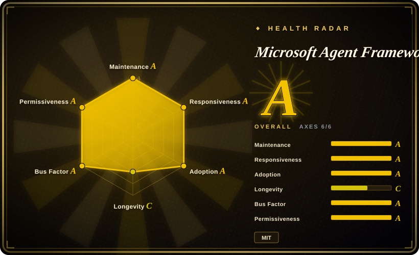
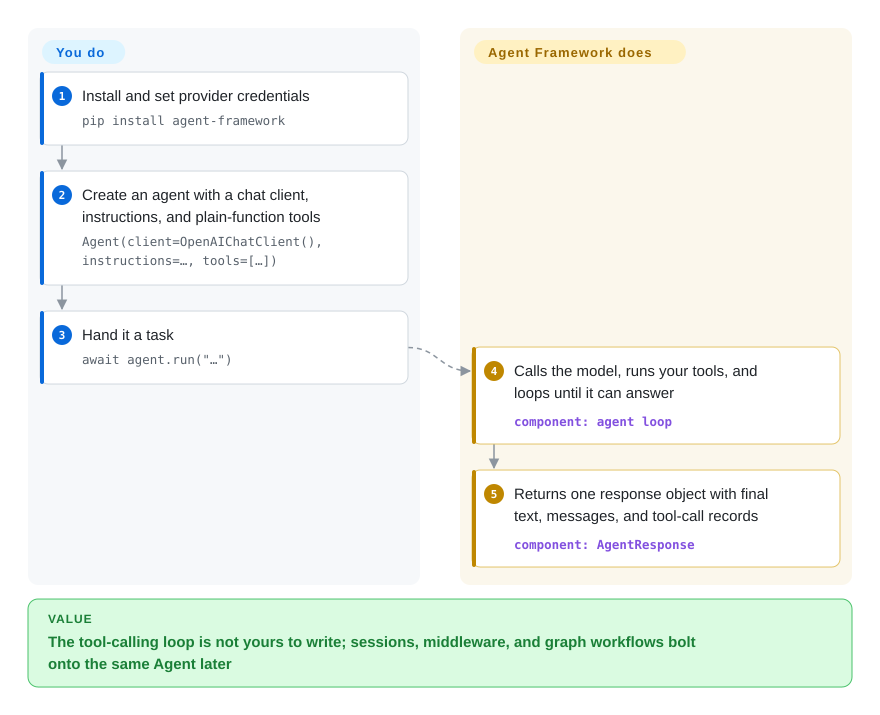

# Microsoft Agent Framework

A demo agent is one chat loop; production asks for tool retries, multi-agent coordination, checkpoints, and a human approval step, and the glue code quietly becomes the project. Microsoft Agent Framework starts you with a self-looping `Agent` object, then adds a typed graph workflow when coordination has to be explicit — the official successor to AutoGen and Semantic Kernel, in Python and .NET.

## When to use

You are shipping an agent inside a product or an internal platform: it calls tools, sometimes fans out to specialist agents, must survive a redeploy, and occasionally has to stop and wait for a person. The prototype is a chat loop with a `while` around tool calls; then someone asks for conversation state, retry policy, an audit trace, and "approve before it sends the email" — and you are now maintaining an orchestrator instead of a product. That is the trigger for this page.

Reach for it when that is the shape and your organization is anywhere near the Microsoft ecosystem. `Agent` is multi-turn and loops over tool calls by default; conversation state lives in an explicit `AgentSession` you create and pass; sequential / concurrent / handoff / group-chat patterns are drawn as a typed graph with `WorkflowBuilder`, with checkpointing and pause-for-a-human gates built in; OpenTelemetry tracing ships in the box. Choose it over LangGraph when .NET parity, an AutoGen/Semantic Kernel migration, or Foundry hosting decide the pick; over OpenAI Agents SDK when you need multi-provider breadth and explicit workflow graphs rather than a light single-vendor loop.

## Q&A

**Is this just LangGraph for .NET?**
No — both ship Python, so "different language" is the wrong axis. The real split is agent-first versus graph-first, plus which ecosystem you bind to: Foundry/Azure here, LangChain there.

**So it's only a different on-ramp?**
The on-ramp difference is real: here a minimal agent runs first and the graph is added later; in LangGraph the compiled graph is the program from step one. But for a single-agent app the deciding half is the ecosystem, not the on-ramp. [推断]

## How it works

The framework keeps a clean split between a model client and an agent: a client (OpenAI, Azure OpenAI, Foundry, Anthropic…) only knows how to call a model, while an `Agent` wraps that client with instructions and tools and owns the loop — call the model, execute the tool calls it returns, feed the results back, repeat until it can answer. You write plain Python functions or C# methods and pass them in; the tool-calling schema is generated for you. Conversation state lives in an `AgentSession` you create explicitly, so the agent object itself stays stateless. When one agent is not enough you do not learn a new abstraction: executors (agents, plain functions, sub-workflows) become nodes in a typed data-flow graph, edges route typed messages, and checkpointing — saving the workflow's state so it can resume after a restart — plus pause-for-human-input rides on the same model. What stays yours: the tools, the instructions, the provider account. What it takes over: the tool-calling loop, message normalization across providers, the streaming shape, and the orchestration machinery.

<!-- flow-steps:begin (generated from flows/agent-framework.json by tools/flow_card.py — do not edit) -->

Text version of the flow

1. **You**: Install and set provider credentials — `pip install agent-framework`
2. **You**: Create an agent with a chat client, instructions, and plain-function tools — `Agent(client=OpenAIChatClient(), instructions=…, tools=[…])`
3. **You**: Hand it a task — `await agent.run("…")`
4. **Microsoft Agent Framework**: Calls the model, runs your tools, and loops until it can answer — component: `agent loop`
5. **Microsoft Agent Framework**: Returns one response object with final text, messages, and tool-call records — component: `AgentResponse`

**Value**: The tool-calling loop is not yours to write; sessions, middleware, and graph workflows bolt onto the same Agent later

<!-- flow-steps:end -->

## When NOT to use

- **A function or a single prompt would do.** The official overview says it outright: if you can write a function to handle the task, do that instead of using an AI agent. Use the provider SDK directly, or [Pydantic AI](pydantic-ai.md) when you want a light typed wrapper, because MAF's value only appears once tools, state, and orchestration enter the picture.
- **You need an event-driven, distributed agent runtime today.** The AutoGen migration guide (updated 2026-08) states MAF focuses on single-process composition, with distributed execution planned. Use [AutoGen](autogen.md) instead of MAF if that runtime model is the hard requirement, because MAF's workflow graph runs in-process — but note AutoGen itself is coasting (last push 2026-04-15), so treat that as a holding pattern, not a destination.
- **You want a loop you can read end-to-end in an hour.** MAF is a ~40-package workspace with staged APIs. Use [smolagents](smolagents.md) instead of MAF when transparency and minimal surface beat production features.
- **Non-developers should assemble the flows.** MAF is code-first; its visual tooling is a developer debugging UI, not a product builder. Use [Langflow](../../workflow-builders/langflow.md) or [Dify](../../workflow-builders/dify.md) instead of MAF when drag-and-drop assembly is the requirement.
- **Your stack is TypeScript-first.** MAF ships Python and .NET, plus a preview Go SDK in a separate repo. Use LangGraph's JavaScript port instead of MAF when your code lives in the JS ecosystem.
- **Every dependency must be stable.** Only the core, OpenAI, Foundry, orchestrations and a few more Python packages are marked `released`; many integrations (anthropic, redis, postgres, bedrock…) are `beta`/`alpha` where breaking changes are still allowed (PACKAGE_STATUS.md, 2026-09). Use [LangGraph](langgraph.md) instead of MAF when a mature integration surface matters more than the Microsoft alignment.

## Comparison

| Alternative | In index | Our verdict | Tradeoff |
|---|---|---|---|
| [AutoGen](autogen.md) | ✅ | Do not start new work in AutoGen: the same teams built MAF as its successor, MAF ships roughly weekly, and AutoGen has not been pushed since 2026-04-15; stay on AutoGen only for its event-driven distributed runtime. | MAF gets you the maintenance cadence and Semantic Kernel's enterprise features; you give up the distributed runtime and AutoGen's larger community corpus. |
| [LangGraph](langgraph.md) | ✅ | Choose LangGraph when you are already in the LangChain ecosystem or want the largest third-party integration surface; choose MAF when .NET parity, an AutoGen/SK migration, or Foundry hosting decides it. | LangGraph's graph is the program from the start and its ecosystem is bigger; MAF's agent-first model is a gentler on-ramp, but its integration packages skew beta. |
| [OpenAI Agents SDK](openai-agents-sdk.md) | ✅ | Choose OpenAI Agents SDK for a light, OpenAI-shaped agent with minimal surface; choose MAF when graph workflows, checkpointing, and multi-provider breadth must coexist in one framework. | OpenAI's SDK is smaller and easier to read but follows one vendor's roadmap; MAF is provider-flexible at the cost of a much larger dependency surface. |
| [Pydantic AI](pydantic-ai.md) | ✅ | Choose Pydantic AI for a lean, type-safe single-agent loop you can read in an afternoon; choose MAF when multi-agent orchestration, middleware, and hosting are on the roadmap. | Pydantic AI is lighter; MAF buys orchestration depth with a ~40-package surface. |
| [CrewAI](crewai.md) | ✅ | Choose CrewAI to stand up a role-playing agent team with minimal wiring; choose MAF when you need explicit control over execution order, checkpointing, or .NET. | CrewAI reaches a demo team faster; MAF's typed graphs are easier to reason about at production scale. |

## Tech stack

- **Python 3.10+**: monorepo under `python/`; the meta package `agent-framework` pulls core plus the standard integrations. `agent-framework-core` 1.19.0 depends on msgspec, pydantic v2, python-dotenv, opentelemetry-api, pyyaml, regex (pyproject.toml, 2026-09).
- **.NET**: `Microsoft.Agents.AI` NuGet packages over `Microsoft.Extensions.AI` message types; SDK pinned at 10.0.401 (`dotnet/global.json`, 2026-09).
- **Go**: separate repo `microsoft/agent-framework-go`, public preview.
- **Orchestration**: typed data-flow `WorkflowBuilder`; Sequential/Concurrent/Magentic builders in `agent-framework-orchestrations`.
- **Observability**: built-in OpenTelemetry integration.

## Dependencies

- **A model provider account**: a Microsoft Foundry project + `az login` (the samples' default), an OpenAI API key, or another provider package; hosted tools (web search, code interpreter) need a model and account entitled to them.
- **Optional state stores**: Redis, Postgres, Cosmos DB, MongoDB, mem0, or Qdrant packages for sessions and memory — several are still alpha/beta.
- **Optional integrations**: MCP servers as tools; durable hosting via the separate `agent-framework-durable-extension` repo (Durable Task / Azure Functions).
- **Python note**: `.env` files are not auto-loaded — call `load_dotenv()` yourself (MS Learn overview).

## Ops difficulty

**Low as a library, medium once durability enters.** It is a pip/NuGet dependency — no server, no daemon; a single agent runs in-process. The operational weight arrives with the production features: checkpoint stores to provision, the durable-hosting extension (a separate repo) to deploy, Azure Functions/Durable Task patterns for hosted agents, and provider credentials to manage. Weekly releases and staged experimental/alpha APIs mean you pin versions and read changelogs.

## Health & viability

- **Maintenance (2026-09):** very active — last push 2026-09-22, ~3,265 commits, releases roughly weekly (`python-1.19.0` and `dotnet-1.22.0` both 2026-09-18). Breaking-change policy is enforced by tooling (Griffe for Python public API, package validation + PublicAPI analyzers for .NET).
- **Governance / bus factor:** Microsoft org repo; the top three contributors hold 378/314/298 commits against a long tail, so no single-author cliff. The roadmap follows Microsoft's product line, not a neutral foundation.
- **Backing & longevity (Lindy):** the repo is young (created 2025-04-28, ~17 months as of 2026-09) and fails the age prior on its own. The mitigant is institutional continuity: it is the stated successor to AutoGen and Semantic Kernel, built by the same teams (MS Learn overview). The cautionary precedent is the same fact: AutoGen, the predecessor, has not been pushed since 2026-04-15.
- **Adoption & ecosystem:** 13.7k stars / 2.4k forks (2026-09); ~40 Python packages plus the NuGet set; Discord, weekly office hours, MS Learn docs, and official migration guides. The star count partly reflects Microsoft's distribution power [推断].
- **Risk flags:** MIT license, no relicense history. The real risks are cadence and churn: weekly releases, many beta/alpha integration packages, an already-renamed package (`azure-ai` → `foundry`), and the Go SDK living in a separate preview repo.

## Caveats (unverified)

- [未验证] Whether distributed workflow execution has shipped since the AutoGen migration guide (updated 2026-08-25) called it planned.
- [未验证] .NET/Python feature parity details — only the Python `PACKAGE_STATUS.md` was read; .NET staging lives under `dotnet/`.
- [未验证] Real production adoption beyond stars; 13.7k stars in ~17 months is an attention signal that Microsoft's marketing amplifies.
- [推断] Survival is tied to Microsoft's Foundry product bet; the AutoGen predecessor pattern shows how fast a Microsoft agent framework can go quiet.
- [推断] The agent-first versus graph-first reading, and "the ecosystem decides for a single-agent app", are this page's judgment from each project's docs and samples — not a head-to-head evaluation.
- [未验证] Whether the weekly cadence stays non-breaking in practice for `released` packages — the Python Griffe compatibility check is advisory (non-blocking) per CONTRIBUTING.md.
- [未验证] DevUI, hosting-*, and declarative-agent maturity beyond their `beta`/`alpha` status labels in PACKAGE_STATUS.md.
