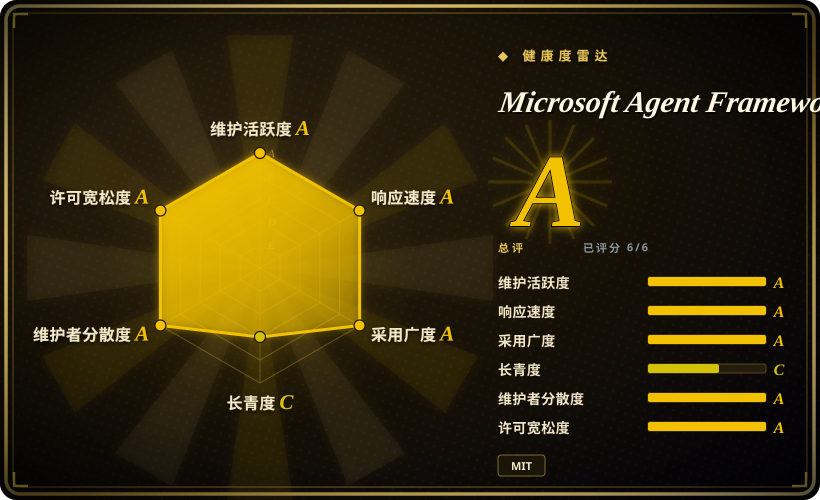
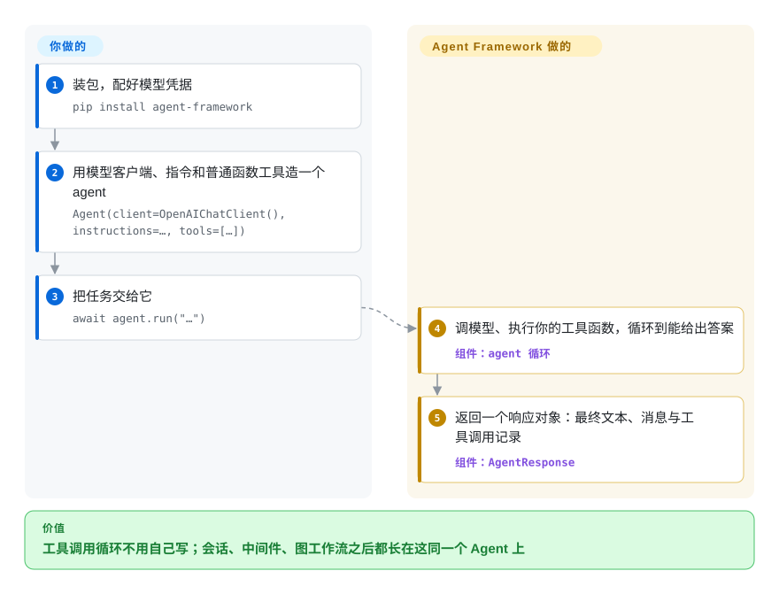

# Microsoft Agent Framework

agent 演示用一个对话循环就够了；一进生产，工具重试、多 agent 协作、断点续跑、人工审批全都变成你自己维护的胶水。Microsoft Agent Framework 先给你一个会自己循环调工具的 `Agent`，协作必须显式时再画出一张带类型的图工作流——它是 AutoGen 和 Semantic Kernel 的官方接班，覆盖 Python 和 .NET。

## 何时使用

你在把一个 agent 做进产品或内部平台：它要调工具、偶尔分发给专科 agent、发版重启后要能接着跑、有时还必须停下来等一个人点头。原型阶段是一个包了 `while` 的聊天循环；然后有人要会话状态、重试策略、审计轨迹，还有「发邮件前先让我确认」——你突然发现自己在维护一个编排器，而不是在做产品。这就是该想起它的时候。

当你的组织本来就挨着微软生态时，伸手拿它。`Agent` 默认就是多轮、会自动循环调工具；会话状态放在你显式创建并传入的 `AgentSession` 里；顺序、并发、移交、群聊这些协作模式用 `WorkflowBuilder` 画成带类型的图，断点续跑和「暂停等人回答」的闸门是内置的；OpenTelemetry 追踪开箱即有。和 LangGraph 之间选它，是 .NET 对等支持、AutoGen／Semantic Kernel 迁移或 Foundry 托管起了决定作用；和 OpenAI Agents SDK 之间选它，是你要多供应商广度和显式工作流图，而不是一个轻量的单供应商循环。

## 快问快答

**这不就是 .NET 版的 LangGraph 吗？**
不是，两边都发 Python，「换了语言」对错了轴。真正的分叉是 agent 优先还是图优先，再加上你会绑哪套生态：这边是 Foundry／Azure，那边是 LangChain。

**所以差别只是上手路径？**
路径差异是真的：这边先跑起一个最小 agent，图是后加的；LangGraph 从第一步就是一张编译好的图。但单 agent 应用里，真正决定选择的是生态，不是上手路径。[推断]

## 怎么用起来

框架把「模型客户端」和「agent」分得很开：客户端（OpenAI、Azure OpenAI、Foundry、Anthropic 等）只会调模型，`Agent` 在客户端外面包上指令和工具、并拥有那个循环——调模型、执行模型返回的工具调用、把结果喂回去、直到能给出最终答案。你写的是普通 Python 函数或 C# 方法，传进去即可，工具调用的 schema 自动生成。会话状态放进显式的 `AgentSession`，agent 对象本身保持无状态。一个 agent 不够时不用发明新概念：executor（agent、普通函数、子工作流）成为 `WorkflowBuilder` 图里的节点，边负责路由带类型的消息，断点续跑（把流程状态存下来、重启后接着走）和暂停等人输入用的是同一套模型。留在你手里的：工具、指令、供应商账号。它接手的：工具调用循环、跨供应商的消息归一化、流式输出的形状、以及整套编排机器。

<!-- flow-steps:begin (generated from flows/agent-framework.json by tools/flow_card.py — do not edit) -->

流程文字版

1. **你**：装包，配好模型凭据 — `pip install agent-framework`
2. **你**：用模型客户端、指令和普通函数工具造一个 agent — `Agent(client=OpenAIChatClient(), instructions=…, tools=[…])`
3. **你**：把任务交给它 — `await agent.run("…")`
4. **Microsoft Agent Framework**：调模型、执行你的工具函数，循环到能给出答案 — 组件：`agent 循环`
5. **Microsoft Agent Framework**：返回一个响应对象：最终文本、消息与工具调用记录 — 组件：`AgentResponse`

**价值**：工具调用循环不用自己写；会话、中间件、图工作流之后都长在这同一个 Agent 上

<!-- flow-steps:end -->

## 何时不用

- **一个函数或一次 prompt 就能解决。** 官方总览把话说得很直：能写成函数的任务就去写函数，别用 AI agent。直接用供应商 SDK，或想要轻量带类型封装时用 [Pydantic AI](pydantic-ai.zh.md)——工具、状态、编排还没登场时，MAF 的价值也不会登场。
- **你今天就要事件驱动的分布式 agent 运行时。** AutoGen 迁移指南（2026-08 更新）写明 MAF 目前聚焦单进程组合，分布式执行在计划中。那个运行时模型是硬需求时用 [AutoGen](autogen.zh.md) 而不是 MAF，因为 MAF 的工作流图跑在进程内——但注意 AutoGen 自己也在失速（最后一次 push 是 2026-04-15），这只是权宜之计，不是归宿。
- **你想一小时读完整个循环。** MAF 是一个约 40 个包、带分级 API 的工作区。透明和极小表面比生产特性重要时，用 [smolagents](smolagents.zh.md) 而不是 MAF。
- **画流程的不是开发者。** MAF 是代码优先；它的可视化是开发者调试 UI，不是给业务人员搭产品的。拖拽搭建是硬需求时，用 [Langflow](../../workflow-builders/langflow.zh.md) 或 [Dify](../../workflow-builders/dify.zh.md) 而不是 MAF。
- **你的技术栈以 TypeScript 为主。** MAF 只发 Python 和 .NET，Go SDK 在另一个仓库里还是预览。代码活在 JS 生态时，用 LangGraph 的 JavaScript 版本而不是 MAF。
- **每个依赖都必须稳定。** Python 侧只有 core、OpenAI、Foundry、orchestrations 等少数包标了 `released`；大量集成（anthropic、redis、postgres、bedrock 等）还是 `beta`／`alpha`，破坏性变更仍被允许（PACKAGE_STATUS.md，2026-09）。成熟的集成面比微软路线更重要时，用 [LangGraph](langgraph.zh.md) 而不是 MAF。

## 横向对比

| 替代品 | 是否收录 | 我们的评价 | 取舍 |
|---|---|---|---|
| [AutoGen](autogen.zh.md) | 已收录 | 新写的代码别再进 AutoGen：同一批人做的接班品就是这个，MAF 大致周更，AutoGen 自 2026-04-15 起没再 push；只有事件驱动分布式运行时这一个理由留在 AutoGen。 | MAF 换来维护节奏和 Semantic Kernel 的企业特性；让出分布式运行时和 AutoGen 更大的社区积累。 |
| [LangGraph](langgraph.zh.md) | 已收录 | 已经在 LangChain 生态、或要最大第三方集成面时选 LangGraph；.NET 对等、AutoGen／SK 迁移、Foundry 托管起决定作用时选 MAF。 | LangGraph 的图从头就是程序本身、生态更大；MAF 的 agent 优先上手更缓，但集成包偏 beta。 |
| [OpenAI Agents SDK](openai-agents-sdk.zh.md) | 已收录 | 要轻量、贴 OpenAI 的单供应商 agent 时选 OpenAI Agents SDK；要图工作流、断点续跑和多供应商广度齐备时选 MAF。 | OpenAI 的 SDK 更小更好读，但路线跟单一供应商走；MAF 供应商灵活，代价是大得多的依赖面。 |
| [Pydantic AI](pydantic-ai.zh.md) | 已收录 | 要一个苗条、类型安全、一下午读完的单 agent 循环时选 Pydantic AI；多 agent 编排、中间件、托管在路线图上时选 MAF。 | Pydantic AI 更轻；MAF 用约 40 个包的表面换来编排深度。 |
| [CrewAI](crewai.zh.md) | 已收录 | 最少接线攒一个角色扮演 agent 团队时选 CrewAI；要显式控制执行顺序、断点续跑或 .NET 时选 MAF。 | CrewAI 出演示团队更快；MAF 的带类型图在生产规模下更好推理。 |

## 技术栈

- **Python 3.10+**：monorepo 在 `python/` 下；元包 `agent-framework` 拉进核心和标准集成。`agent-framework-core` 1.19.0 依赖 msgspec、pydantic v2、python-dotenv、opentelemetry-api、pyyaml、regex（pyproject.toml，2026-09）。
- **.NET**：NuGet 包 `Microsoft.Agents.AI`，建立在 `Microsoft.Extensions.AI` 消息类型之上；SDK 钉在 10.0.401（`dotnet/global.json`，2026-09）。
- **Go**：独立仓库 `microsoft/agent-framework-go`，公开预览。
- **编排**：带类型的数据流 `WorkflowBuilder`；顺序／并发／Magentic 构建器在 `agent-framework-orchestrations` 里。
- **可观测性**：内置 OpenTelemetry 集成。

## 依赖

- **一个模型供应商账号**：Microsoft Foundry 项目 + `az login`（示例默认）、OpenAI API key，或其他供应商包；托管工具（联网搜索、代码解释器）需要模型和账号本身有权。
- **可选状态存储**：Redis、Postgres、Cosmos DB、MongoDB、mem0、Qdrant 包用于会话和记忆——其中几个还是 alpha／beta。
- **可选集成**：MCP 服务器作为工具；持久化托管走独立仓库 `agent-framework-durable-extension`（Durable Task／Azure Functions）。
- **Python 注意**：`.env` 不会自动加载——自己调 `load_dotenv()`（MS Learn 总览）。

## 运维难度

**当库用是低，引入持久化后是中。** 它就是 pip／NuGet 依赖——没有服务器、没有守护进程；单 agent 跑在进程内。运维重量随生产特性到来：要准备断点存储、部署持久化托管扩展（独立仓库）、托管 agent 走 Azure Functions／Durable Task 模式、管理供应商凭据。周更节奏加分级的 experimental／alpha API，意味着你要钉版本、读变更日志。

## 健康度与可持续性

- **维护（2026-09）：** 非常活跃——最后 push 2026-09-22，约 3,265 次提交，发布大致周更（`python-1.19.0` 和 `dotnet-1.22.0` 都在 2026-09-18）。破坏性变更由工具把守（Python 公共 API 用 Griffe，.NET 用包校验 + PublicAPI 分析器）。
- **治理／巴士因子：** 微软组织仓库；前三名贡献者各持 378／314／298 次提交、后面是长尾，没有单人悬崖。路线图跟着微软产品线走，不是中立基金会。
- **背书与寿命（Lindy）：** 仓库年轻（2025-04-28 创建，到 2026-09 约 17 个月），单看年龄不过关。缓冲是制度连续性：它是 AutoGen 和 Semantic Kernel 的官方接班，同一批团队在做（MS Learn 总览）。警示先例也是同一个事实：前任 AutoGen 自 2026-04-15 起没再 push。
- **采用与生态：** 13.7k 星／2.4k fork（2026-09）；约 40 个 Python 包加 NuGet 系列；Discord、每周公开答疑、MS Learn 文档、官方迁移指南。星数有一部分是微软分发能力的放大 [推断]。
- **风险信号：** MIT 许可，无改许可史。真正的风险在节奏与漂移：周更、大量 beta／alpha 集成包、已经改过名的包（`azure-ai` → `foundry`）、Go SDK 放在独立预览仓库。

## 存疑（未验证）

- [未验证] 分布式工作流执行是否已落地——AutoGen 迁移指南（2026-08-25 更新）当时写的是「计划中」。
- [未验证] .NET 与 Python 的特性对等细节——只读了 Python 的 `PACKAGE_STATUS.md`，.NET 的分级在 `dotnet/` 下。
- [未验证] 星数之外的真实生产采用；17 个月 1.37 万星是注意力信号，且被微软的市场渠道放大。
- [推断] 它的存续绑在微软的 Foundry 产品赌注上；AutoGen 这个前任展示了微软系 agent 框架能多快安静下来。
- [推断] 「agent 优先还是图优先」的读法，以及「单 agent 应用由生态决定」，是本文根据两边文档和示例得出的判断，不是对照实测。
- [未验证] 周更节奏对 `released` 包在实践中是否真的不破坏兼容——CONTRIBUTING.md 写明 Python 的 Griffe 兼容检查是建议性的（不阻断合并）。
- [未验证] DevUI、hosting-* 和声明式 agent 的成熟度，除了 PACKAGE_STATUS.md 里的 `beta`／`alpha` 标签外没有深读。
