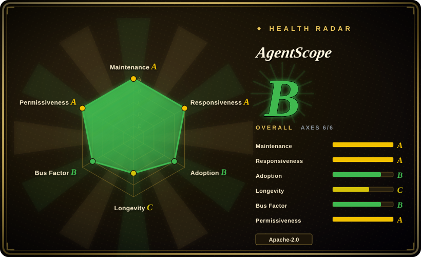
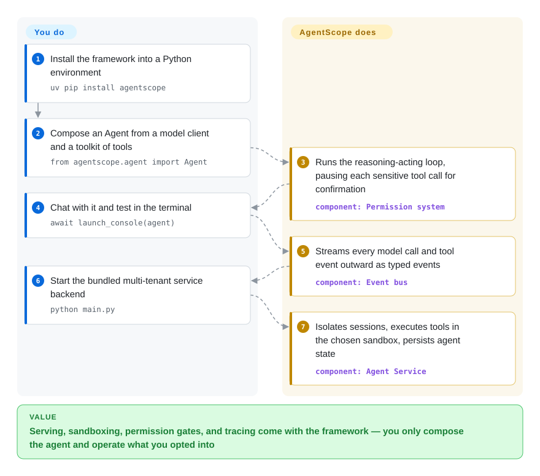

# AgentScope

Shipping an LLM agent hurts less in the prompt than around it: a user's `bash` call runs unsandboxed on your host, a dangerous action can't pause for a human, and no one can replay what the model did. AgentScope builds sandboxed tool execution, permission gates, and a streaming event bus into the Python agent loop itself, so that serving machinery ships with the framework instead of being hand-rolled around it.

## When to use

You're a backend or platform engineer tasked with shipping an LLM agent as a real service — not a notebook demo. You need more than a single ReAct loop: tools must run inside an isolated sandbox (a user's `bash` call shouldn't touch the host), every model call and tool invocation has to be traceable when something goes wrong in production, and a human reviewer must be able to approve or block a sensitive action mid-run. You also need the service to hold up under multiple tenants and concurrent sessions without their state bleeding into each other. AgentScope 2.x is built for exactly this lane: it ships a FastAPI-based agent service, a permission system that gates tools and resources, workspace backends for local/Docker/E2B/Daytona/K8s/OpenSandbox sandboxes, and OpenTelemetry tracing wired in as middleware, so the observability and isolation you'd otherwise hand-roll come with the framework.

The other moment AgentScope fits is when you want a composable, event-driven agent rather than a prompt-and-pray script. Its middleware system lets you hook into the reasoning-acting loop (context compression, tool-result compaction, custom guards, and since 2.0.8 a `ModelRouterMiddleware` that picks which chat model answers each reply), and a unified event bus streams `REPLY_START` / `MODEL_CALL_START` / `TEXT_BLOCK`-style events out to a frontend — there's a pre-built web UI under `examples/web_ui` for agent teams, task planning, and permission controls, plus IM channels (Feishu/Lark, DingTalk, Discord), a RAG service, and an MCP & skill hub layered on the same backend. If your end goal is an inspectable, human-in-the-loop agent app with a UI and multiple model backends (OpenAI, Anthropic, Gemini, DashScope, DeepSeek, Moonshot, Volcengine, xAI, Ollama), this is squarely in scope.

## How it works

AgentScope splits an agent app into an SDK loop and a serving layer, and you compose both in Python. You wire an `Agent` from building blocks — a model client (OpenAI/Anthropic/DashScope/…), a `Toolkit` of Python tools, MCP servers and skills, and middleware hooks — and the framework runs the reasoning-acting loop: the model picks which tool to call, the permission system either auto-approves that call or pauses the loop until a human confirms it, and the chosen workspace backend executes the tool inside a sandbox (a Docker container, a remote E2B/Daytona/K8s VM, or your local shell only if you allow it). What you no longer write: the streaming protocol from the loop to your UI — a unified event bus emits typed events (`REPLY_START`, `MODEL_CALL_START`, `TOOL_CALL_*`, …) outward; the per-session isolation and tenant state — the FastAPI-based agent service handles multi-tenant/multi-session with pluggable Redis/SQL/S3 storage; and the tracing scaffold — OpenTelemetry middleware is baked into the loop. What stays yours: the composition and prompts, the model-provider keys, and running the service, including whichever container runtime, storage backend, and OTLP collector you opted into.

<!-- flow-steps:begin (generated from flows/agentscope.json by tools/flow_card.py — do not edit) -->

Text version of the flow

1. **You**: Install the framework into a Python environment — `uv pip install agentscope`
2. **You**: Compose an Agent from a model client and a toolkit of tools — `from agentscope.agent import Agent`
3. **AgentScope**: Runs the reasoning-acting loop, pausing each sensitive tool call for confirmation — component: `Permission system`
4. **You**: Chat with it and test in the terminal — `await launch_console(agent)`
5. **AgentScope**: Streams every model call and tool event outward as typed events — component: `Event bus`
6. **You**: Start the bundled multi-tenant service backend — `python main.py`
7. **AgentScope**: Isolates sessions, executes tools in the chosen sandbox, persists agent state — component: `Agent Service`

**Value**: Serving, sandboxing, permission gates, and tracing come with the framework — you only compose the agent and operate what you opted into

<!-- flow-steps:end -->

<!-- flow-steps:begin (generated from flows/agentscope.json by tools/flow_card.py — do not edit) -->
<!-- flow-steps:end -->

## When NOT to use

- **You want a single-file, zero-infra agent.** AgentScope's value is the service/permission/observability/sandbox machinery. For a quick tool-using loop in a script, a thinner library (raw OpenAI SDK + a few tools, or a minimal ReAct helper) has far less surface to learn and deploy.
- **You're optimizing prompt *programs*, not orchestration.** If your problem is "compile and tune the prompts/pipeline" rather than "run and serve agents," a program-synthesis approach like [DSPy](../../workflow-builders/dspy.md) is a different tool entirely — AgentScope does not do prompt optimization.
- **You need a battle-tested, large-ecosystem framework with years of third-party integrations.** The 2.x line (v2.0.0, 2026-05-25) is only ~4 months old; its API surface is newer and smaller than long-standing alternatives, so community recipes, Stack Overflow coverage, and third-party plugins are thinner than the project's 2024 origin suggests.
- **API churn is a dealbreaker.** v2.0 was a substantial refactor of the `Msg` class, tool module, and middleware vs v1.x — code written against 1.x does not carry over cleanly — and the 2.x line keeps moving (v2.0.0 → v2.0.8 in ~15 weeks), with extras being renamed along the way (`storage` → `storage-redis`, a new `memory-*` family). Pin versions.
- **You're a non-Python shop.** It is Python-only (>=3.11). No first-class TypeScript/Go/Java SDK.
- **You just need a hosted agent product.** This is a framework you run and operate, not a managed SaaS — you own deployment, scaling, and the model API keys.

## Comparison

| Alternative | In index | Our verdict | Tradeoff |
|---|---|---|---|
| [DSPy](../../workflow-builders/dspy.md) | ✅ | Choose DSPy when you need declarative prompt/pipeline *optimization* rather than multi-agent serving. | Declarative prompt/pipeline *optimization* (compile + tune programs); not a multi-agent serving runtime. Reach for it to tune quality, not to orchestrate/serve agents. |
| [openfang](../agent-services/openfang.md) | ✅ | Choose openfang when you want another indexed agent framework with a more OS-shaped runtime. | Sibling agent framework in this index; different design point — compare scope/maturity before choosing. [未验证] |
| [Symphony](../agent-services/symphony.md) | ✅ | Choose Symphony when you need an indexed multi-agent framework focused on scheduling autonomous coding runs. | Sibling multi-agent framework in this index; overlapping "orchestrate multiple agents" goal, different ergonomics. [未验证] |
| [claude-octopus](../../coding-agents/orchestration-and-review/claude-octopus.md) | ✅ | Choose claude-octopus when you need a Claude-style multi-agent workflow sibling. | Sibling in this index, oriented around Claude-style multi-agent workflows; narrower model focus than AgentScope's multi-provider serving. |
| [LangGraph](langgraph.md) | ✅ | Choose LangGraph when you need graph/state-machine orchestration with a large ecosystem and explicit control flow. | Graph/state-machine orchestration with a large ecosystem and explicit control flow; heavier, more opinionated than AgentScope's "trust the model" loop. |
| [AutoGen](autogen.md) | ✅ | Choose AutoGen when you need a mature conversation-driven multi-agent framework. | Mature conversation-driven multi-agent framework; comparable multi-agent scope, different abstractions and a larger community footprint. |
| [CrewAI](crewai.md) | ✅ | Choose CrewAI when role/crew-based agent orchestration and strong DX matter more than AgentScope's serving stack. | Role/crew-based agent orchestration with strong DX; less emphasis on the service/permission/sandbox/observability stack AgentScope ships. |

## Tech stack

- **Language:** Python (>=3.11).
- **Core runtime:** `asyncio`-based; model SDKs for `openai`, `anthropic`, `dashscope` (and optional `google-genai`, `ollama`, `xai-sdk`).
- **Protocols/tools:** Model Context Protocol via `mcp` (unified `MCPClient`); `tree_sitter` / `tree_sitter_bash` for tool/code handling; `jsonschema`, `docstring_parser`, `json_repair`, `json5` for tool schemas and robust parsing.
- **Service layer:** FastAPI + Uvicorn agent service (optional `service` extra), `apscheduler`, `ag-ui-protocol`; Socket.IO (`python-socketio`) event bus to the frontend.
- **Observability:** OpenTelemetry (`opentelemetry-api/sdk/exporter-otlp`, semantic conventions) wired in as tracing middleware.
- **Workspace/sandbox:** local plus Docker (`aiodocker`), E2B (`e2b`), Daytona (`daytona`), Kubernetes (`kubernetes-asyncio`), and OpenSandbox backends (per-backend extras `workspace-*`, or `workspace` for all; the docs also list Apple Container and Bubblewrap as local flavors).
- **Storage/memory:** pluggable backends per `pyproject.toml` — Redis (`storage-redis`), async SQLAlchemy 2.0 + Alembic with the driver left to you (`storage-sql`), S3-compatible blob store (`storage-s3`); long-term memory via `memory-mem0` (`mem0ai>=2.0.0`) or `memory-reme` (`reme-ai`); optional vector stores (`vdb-qdrant`/`vdb-milvus`/`vdb-mongodb`/`vdb-elasticsearch`) and a `rag` extra for document parsers.
- **Channels & protocols:** IM channel extra (`lark-oapi`, `discord.py`, `dingtalk-stream`), A2A protocol via `a2a-sdk` (`a2a` extra), realtime voice via `websockets` + `sounddevice` (`realtime` extra, experimental).

## Dependencies

- **Runtime:** Python >= 3.11. `pip install agentscope` (or `uv pip install agentscope`).
- **Always-installed deps:** `openai`, `anthropic`, `dashscope`, `mcp<2.0.0`, `httpx`, `numpy`, `aioitertools`, `aiofiles`, `jinja2`, `jsonschema`, `docstring_parser`, `json_repair[schema]>=0.63.4`, `json5`, `filetype`, `python-datauri`, `python-socketio`, `python-frontmatter`, `shortuuid`, `tree_sitter`, `tree_sitter_bash`, `rich`, `pypdf`, `tzdata`, and the OpenTelemetry stack (`opentelemetry-api/sdk/exporter-otlp>=1.39.0`, semantic-conventions) — per `pyproject.toml` at tag v2.0.8.
- **Optional extras:** `service` (FastAPI/Uvicorn/apscheduler/ag-ui-protocol), `storage-redis`/`storage-sql`/`storage-s3`, `workspace` (Docker/E2B/Daytona/K8s/OpenSandbox), `model-gemini`/`model-ollama`/`model-xai` (or `models`), `channel` (Feishu/Discord/DingTalk SDKs), `tools` (ripgrep), `a2a`, `realtime`, `rag`, `vdb-*` (qdrant/milvus/mongodb/elasticsearch), `memory-mem0`/`memory-reme`; legacy short names (`storage`, `mem0`, …) are deprecated aliases. A `full` extra pulls them all.
- **External infra (only if you opt in):** a container/sandbox runtime (Docker daemon, E2B/Daytona account, or a K8s cluster) for isolated workspaces; Redis, an async-SQL database, or S3-compatible storage for durable sessions; an OTLP collector to receive traces; and at least one model provider API key.

## Ops difficulty

**Medium.** A bare in-process agent is easy — install, set a model key, run. Difficulty climbs as you turn on the parts that justify picking AgentScope: standing up the FastAPI service with multi-tenant/multi-session isolation, running the Docker/E2B sandbox backends (you now operate a container runtime), wiring an OTLP collector to actually consume the traces, and adding Redis for durable sessions. None of these are exotic, but each is a real moving piece to deploy and monitor, and a fast-evolving 2.x line means you should pin versions and budget for upgrade churn.

## Health & viability

- **Responsiveness**: Grade A — median first-response time 18.1 hours across 18 qualifying issues/PRs (scorer window, 2026-09).
- **Maintenance (2026-09):** actively maintained — default branch pushed 2026-09-24, latest release v2.0.8 (2026-09-08), not archived. v2.0.0 (2026-05-25) → v2.0.8 with roughly one patch release every two weeks reads as a steady, engaged cadence; the open-issue count (~477) against that cadence reads as a live project absorbing real usage, not a stalled one.
- **Governance & backing:** Organization-owned (`agentscope-ai`); the package's own metadata credits the "SysML team of Alibaba Tongyi Lab", and DashScope (Alibaba's model platform) stays a first-class backend — a real org with vendor adjacency behind it rather than a lone maintainer, a better bus-factor position than single-user repos (the scorer counts ~90 active committers/12mo with no single one above ~41%). It is not under a neutral foundation (Apache/LF/CNCF), so treat governance as vendor-adjacent stewardship (see Caveats for what is unconfirmed).
- **Age & Lindy (2026-09):** created 2024-01, ~2.7 years old and still actively shipping — an **age × still-active** combination the Lindy prior favors. The caveat is the recent **v2.0 rewrite** (2026-05): the *project* is Lindy-strong, but the *2.x API surface* is only ~4 months old, so community recipes and third-party integrations are still thinner than the project's age suggests.
- **Risk flags:** Apache-2.0 (permissive, no relicense/CLA concerns observed). Main risk is **2.x API churn** — v2.0 broke `Msg`/tool/middleware vs v1.x, extras are being renamed under deprecated aliases, and the line keeps moving, so pin versions and budget upgrade work. No CVEs were reviewed.

## Caveats (unverified)

- [未验证] Star count ~32.5k as of 2026-09-27 (GitHub API). GitHub stars in this ecosystem are unreliable and date-sensitive — treat as indicative only.
- [未验证] Latest release v2.0.8 published 2026-09-08; default branch last pushed 2026-09-24 (per GitHub API). Exact version/dates can shift; re-verify against the repo.
- [推断] v2.0 being a "substantial rewrite" with breaking `Msg`/tool/middleware changes vs v1.x is inferred from the release line's refactor language; the precise breaking-change list should be read from the official changelog before migrating. The v2.0.0 date itself (2026-05-25) is confirmed via the releases API.
- [未验证] Relative comparisons to siblings (openfang, Symphony, claude-octopus) are positioning sketches, not benchmarked head-to-heads; verify each sibling's current scope before deciding.
- [未验证] "Production-ready" / "production-grade serving" is the project's own framing from the README, not an independently validated claim; realtime voice is explicitly labeled *Experimental* by the README.
- [推断] The supported-provider list and extras reflect `pyproject.toml` + README at tag v2.0.8 (read 2026-09-27); DeepSeek/Moonshot/Volcengine adapters were not individually exercised, and extras keep shifting release-to-release.
