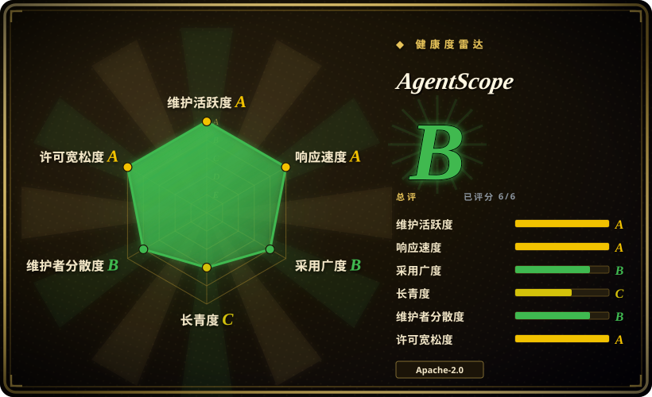
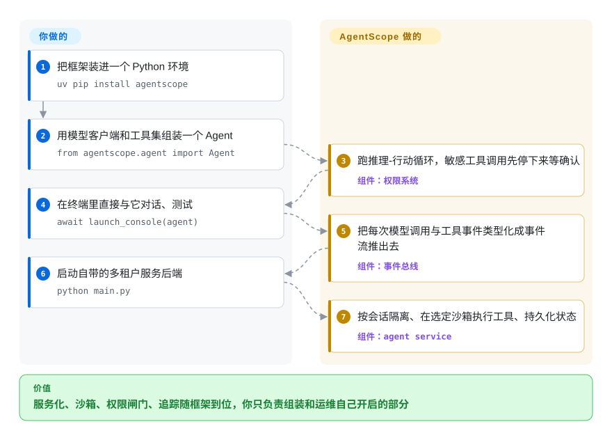

# AgentScope

把 LLM agent 推向线上，痛的往往不是提示词：用户的一条 `bash` 调用没隔离就落在你的宿主机上，危险动作没有闸门能暂停等人批，模型每一步干了什么也无从回放。AgentScope 把沙箱化的工具执行、权限闸门和全程流式的事件总线直接焊进 Python 的 agent 循环——这套服务机器是框架自带的，不用你在外面手搓。

## 何时使用

你是后端或平台工程师，任务是把一个 LLM agent 真正作为线上服务交付——不是 notebook 里的 demo。你需要的不只是一个 ReAct 循环：工具必须跑在隔离沙箱里（用户的 `bash` 调用不能碰到宿主机），线上出问题时每一次模型调用和工具调用都得能追踪，而且人工审核者要能在运行中途批准或拦截一个敏感动作。你还需要这个服务在多租户、多会话并发下稳得住，各自的状态不会互相串。AgentScope 2.x 正是为这条线设计的：它带了基于 FastAPI 的 agent service、对工具和资源做闸门的权限系统、支持 local/Docker/E2B/Daytona/K8s/OpenSandbox 的 workspace 沙箱后端，以及作为 middleware 接入的 OpenTelemetry tracing——那些你本来要自己手搓的可观测性和隔离，框架直接给你。

另一个适合 AgentScope 的时刻，是你想要一个可组合、事件驱动的 agent，而不是“拼好 prompt 然后祈祷”的脚本。它的 middleware 系统让你能 hook 进推理-行动循环（上下文压缩、工具结果压缩、自定义守卫，2.0.8 起还有一个按回复挑选对话模型的 `ModelRouterMiddleware`），统一事件总线把 `REPLY_START` / `MODEL_CALL_START` / `TEXT_BLOCK` 这类事件流式推给前端——`examples/web_ui` 下有一个预置 Web UI，支持 agent 团队、任务规划和权限控制，同一套后端上还叠着 IM 渠道（飞书/Lark、钉钉、Discord）、RAG 服务和 MCP 与 skill hub。如果你的终点是一个可检视、带人工介入、有 UI、可接多种模型后端（OpenAI、Anthropic、Gemini、DashScope、DeepSeek、Moonshot、火山引擎、xAI、Ollama）的 agent 应用，这正中靶心。

## 怎么用起来

AgentScope 把一个 agent 应用拆成 SDK 循环和服务层两层，两层都用 Python 组装。你用积木拼一个 `Agent`——一个模型客户端（OpenAI/Anthropic/DashScope/……）、一个装着 Python 工具、MCP server 和 skill 的 `Toolkit`、外加 middleware 钩子——然后框架替你跑推理-行动循环：模型挑要调的工具，权限系统要么自动放行，要么把循环暂停下来等人确认，选定的 workspace 后端再把工具执行关进沙箱（Docker 容器、远端 E2B/Daytona/K8s 环境，或只在你允许的本地 shell）。你不用再自己写：到前端的流式协议（统一事件总线把 `REPLY_START`、`MODEL_CALL_START`、`TOOL_CALL_*` 这类带类型的事件推出去）、按会话的隔离与租户状态（基于 FastAPI 的 agent service 管多租户多会话，存储可换 Redis/SQL/S3）、追踪脚手架（OpenTelemetry middleware 内建在循环里）。留在你手里的：组装和提示词、各家模型 provider 的 key，以及运维你选择开启的那些部件——容器运行时、存储后端、OTLP collector。

<!-- flow-steps:begin (generated from flows/agentscope.json by tools/flow_card.py — do not edit) -->

流程文字版

1. **你**：把框架装进一个 Python 环境 — `uv pip install agentscope`
2. **你**：用模型客户端和工具集组装一个 Agent — `from agentscope.agent import Agent`
3. **AgentScope**：跑推理-行动循环，敏感工具调用先停下来等确认 — 组件：`权限系统`
4. **你**：在终端里直接与它对话、测试 — `await launch_console(agent)`
5. **AgentScope**：把每次模型调用与工具事件类型化成事件流推出去 — 组件：`事件总线`
6. **你**：启动自带的多租户服务后端 — `python main.py`
7. **AgentScope**：按会话隔离、在选定沙箱执行工具、持久化状态 — 组件：`agent service`

**价值**：服务化、沙箱、权限闸门、追踪随框架到位，你只负责组装和运维自己开启的部分

<!-- flow-steps:end -->

<!-- flow-steps:begin (generated from flows/agentscope.json by tools/flow_card.py — do not edit) -->
<!-- flow-steps:end -->

## 何时不用

- **你想要单文件、零基础设施的 agent。** AgentScope 的价值在于那套 service/权限/可观测/沙箱机制。如果只是想在脚本里跑个用工具的循环，更薄的库（裸 OpenAI SDK 加几个工具，或一个极简 ReAct helper）要学和要部署的面小得多。
- **你优化的是 prompt *程序*，不是编排。** 如果你的问题是“编译并调优 prompt/流水线”而非“运行并服务 agent”，像 [DSPy](../../workflow-builders/dspy.zh.md) 这种程序综合路线是完全不同的工具——AgentScope 不做 prompt 优化。
- **你需要久经考验、生态庞大、有多年第三方集成的框架。** 2.x 线（v2.0.0，2026-05-25）只有约 4 个月历史；它的 API 面比老牌替代品更新、更小，社区配方、Stack Overflow 覆盖和第三方插件的密度还配不上项目本身的年龄。
- **API 抖动是你不能接受的。** v2.0 相对 v1.x 对 `Msg` 类、工具模块和 middleware 做了大幅重构——针对 1.x 写的代码无法干净迁移——而且 2.x 线还在快跑（约 15 周内 v2.0.0 → v2.0.8），extras 也在改名（`storage` → `storage-redis`，新增 `memory-*` 一族）。请 pin 版本。
- **你不是 Python 技术栈。** 它仅支持 Python(>=3.11)，没有一等公民的 TypeScript/Go/Java SDK。
- **你只想要一个托管的 agent 产品。** 这是一个你自己运行和运维的框架，不是托管 SaaS——部署、扩容、模型 API key 都得你自己管。

## 横向对比

| 替代品 | 是否收录 | 我们的评价 | 取舍 |
|---|---|---|---|
| [DSPy](../../workflow-builders/dspy.zh.md) | ✅ | 需要声明式 prompt/流水线*优化*，而不是多智能体服务运行时时，选 DSPy。 | 声明式的 prompt/流水线*优化*（编译 + 调优程序）；不是多智能体服务运行时。用它提质量，而不是用它编排/服务 agent。 |
| [openfang](../agent-services/openfang.zh.md) | ✅ | 想要另一个已收录、运行时更像 OS 的 agent 框架时，选 openfang。 | 本索引内的同类 agent 框架；设计取向不同——选型前对比 scope/成熟度。[未验证] |
| [Symphony](../agent-services/symphony.zh.md) | ✅ | 需要聚焦自治 coding agent 运行调度的同类框架时，选 Symphony。 | 本索引内的同类多智能体框架；“编排多个 agent”目标有重叠，工效学不同。[未验证] |
| [claude-octopus](../../coding-agents/orchestration-and-review/claude-octopus.zh.md) | ✅ | 需要围绕 Claude 式多智能体工作流的同类项目时，选 claude-octopus。 | 本索引内的同类项目，围绕 Claude 式多智能体工作流；模型聚焦比 AgentScope 的多 provider 服务更窄。 |
| [LangGraph](langgraph.zh.md) | ✅ | 需要生态庞大、控制流显式的图/状态机式编排时，选 LangGraph。 | 图/状态机式编排，生态庞大、控制流显式；比 AgentScope“信任模型”的循环更重、更有主张。 |
| [AutoGen](autogen.zh.md) | ✅ | 需要成熟的对话驱动多智能体框架时，选 AutoGen。 | 成熟的对话驱动多智能体框架；多智能体 scope 可比，抽象不同、社区盘子更大。 |
| [CrewAI](crewai.zh.md) | ✅ | 角色/crew 式 agent 编排和强 DX 比 AgentScope 的服务栈更重要时，选 CrewAI。 | 角色/crew 式 agent 编排，DX 很好；不像 AgentScope 那样强调 service/权限/沙箱/可观测这整套栈。 |

## 技术栈

- **语言：** Python(>=3.11)。
- **核心运行时：** 基于 `asyncio`；模型 SDK `openai`、`anthropic`、`dashscope`（以及可选 `google-genai`、`ollama`、`xai-sdk`）。
- **协议/工具：** 经 `mcp` 接入 Model Context Protocol（统一 `MCPClient`）;`tree_sitter` / `tree_sitter_bash` 做工具/代码处理；`jsonschema`、`docstring_parser`、`json_repair`、`json5` 做工具 schema 与稳健解析。
- **服务层：** FastAPI + Uvicorn agent service（可选 `service` extra）、`apscheduler`、`ag-ui-protocol`;Socket.IO（`python-socketio`）做到前端的事件总线。
- **可观测性：** OpenTelemetry（`opentelemetry-api/sdk/exporter-otlp`、语义约定）以 tracing middleware 形式接入。
- **Workspace/沙箱：** local 加 Docker（`aiodocker`）、E2B（`e2b`）、Daytona（`daytona`）、Kubernetes（`kubernetes-asyncio`）、OpenSandbox 后端（每后端一个 `workspace-*` extra，`workspace` 全装；文档另把 Apple Container 和 Bubblewrap 列为本地形态）。
- **存储/记忆：** 按 `pyproject.toml` 可换后端——Redis（`storage-redis`）、异步 SQLAlchemy 2.0 + Alembic 且驱动自选（`storage-sql`）、S3 兼容对象存储（`storage-s3`）；长期记忆走 `memory-mem0`（`mem0ai>=2.0.0`）或 `memory-reme`（`reme-ai`）；可选向量库（`vdb-qdrant`/`vdb-milvus`/`vdb-mongodb`/`vdb-elasticsearch`）与做文档解析的 `rag` extra。
- **渠道与协议：** IM 渠道 extra（`lark-oapi`、`discord.py`、`dingtalk-stream`）、经 `a2a-sdk` 的 A2A 协议（`a2a` extra）、经 `websockets` + `sounddevice` 的实时语音（`realtime` extra，实验性）。

## 依赖

- **运行时：** Python >= 3.11。`pip install agentscope`（或 `uv pip install agentscope`）。
- **始终安装的依赖：** `openai`、`anthropic`、`dashscope`、`mcp<2.0.0`、`httpx`、`numpy`、`aioitertools`、`aiofiles`、`jinja2`、`jsonschema`、`docstring_parser`、`json_repair[schema]>=0.63.4`、`json5`、`filetype`、`python-datauri`、`python-socketio`、`python-frontmatter`、`shortuuid`、`tree_sitter`、`tree_sitter_bash`、`rich`、`pypdf`、`tzdata`，以及 OpenTelemetry 栈（`opentelemetry-api/sdk/exporter-otlp>=1.39.0`、语义约定）——依据 tag v2.0.8 的 `pyproject.toml`。
- **可选 extras：** `service`（FastAPI/Uvicorn/apscheduler/ag-ui-protocol）、`storage-redis`/`storage-sql`/`storage-s3`、`workspace`（Docker/E2B/Daytona/K8s/OpenSandbox）、`model-gemini`/`model-ollama`/`model-xai`（或 `models`）、`channel`（飞书/Discord/钉钉 SDK）、`tools`（ripgrep）、`a2a`、`realtime`、`rag`、`vdb-*`（qdrant/milvus/mongodb/elasticsearch）、`memory-mem0`/`memory-reme`；旧的短名（`storage`、`mem0` 等）是已废弃别名。`full` extra 一次全装。
- **外部基础设施（只在你启用时才需要）：** 容器/沙箱运行时（Docker daemon、E2B/Daytona 账号或 K8s 集群）做隔离 workspace；Redis、异步 SQL 数据库或 S3 兼容存储做持久会话；OTLP collector 接收 trace；以及至少一个模型 provider 的 API key。

## 运维难度

**中。** 一个纯进程内的 agent 很简单——装上、设个模型 key、跑起来。难度随着你打开那些“当初选 AgentScope 的理由”而上升：把带多租户/多会话隔离的 FastAPI service 立起来、跑 Docker/E2B 沙箱后端（于是你现在要运维一个容器运行时）、接一个 OTLP collector 才能真正消费 trace、再加 Redis 做持久会话。这些都不算冷僻，但每一个都是要部署和监控的真实活动部件；而快速演进的 2.x 线意味着你应当 pin 版本，并为升级抖动预留预算。

## 健康度与可持续性

- **响应速度**：Grade A——中位首次响应时间 18.1 小时，基于 18 个 qualifying issues/PRs（评分器窗口，2026-09）。
- **维护（2026-09）：** 活跃维护——默认分支 push 于 2026-09-24，最新 release v2.0.8（2026-09-08），未归档。从 v2.0.0（2026-05-25）到 v2.0.8 大约每两周一个补丁 release，是稳定投入的节奏；约 477 个 open issue 配上这个发版节奏，读作一个在吸收真实用量的活项目，而非停滞。
- **治理与背书：** Organization 持有（`agentscope-ai`），包元数据自署「阿里巴巴通义实验室 SysML team」，DashScope（阿里巴巴的模型平台）仍是一等公民后端——背后是有厂商邻近性的真实组织，而非单一维护者，bus-factor 上比单用户仓库更稳（评分器计约 90 名 12 个月活跃提交者，最高单人占比约 41%）。它不在中立基金会（Apache/LF/CNCF）之下，故把治理当作贴近厂商的托管来看待（未经确认之处见存疑）。
- **年龄与 Lindy（2026-09）：** 创建于 2024-01，约 2.7 年且仍在持续发版——这是 Lindy 先验偏爱的**年龄 × 仍活跃**组合。需注意近期的 **v2.0 重写**（2026-05）：*项目*在 Lindy 上很强，但 *2.x API 面*只有约 4 个月，社区配方与第三方集成的密度还配不上项目的年龄。
- **风险标记：** Apache-2.0（宽松，未见 relicense/CLA 顾虑）。主要风险是 **2.x API 抖动**——v2.0 相对 v1.x 破坏了 `Msg`/工具/middleware，extras 正在改名且旧名只是废弃别名，该线仍在变，故请 pin 版本并为升级预留工作量。未审 CVE。

## 存疑（未验证）

- [未验证] 截至 2026-09-27，star 约 3.25 万（GitHub API）。本生态的 GitHub star 不可靠且对时间敏感——仅供参考。
- [未验证] 最新发布 v2.0.8 于 2026-09-08，默认分支最后 push 于 2026-09-24（据 GitHub API）。具体版本/日期会变，请对照仓库重新核实。
- [推断] “v2.0 是一次大重写、对 `Msg`/工具/middleware 有破坏性改动”是从 release 线的重构措辞推断而来；迁移前应读官方 changelog 确认确切的破坏性改动清单。v2.0.0 的日期本身（2026-05-25）已经 releases API 证实。
- [未验证] 与同类（openfang、Symphony、claude-octopus）的相对对比是定位草图，不是跑分过的正面对决；选型前请核实每个同类项目的当前 scope。
- [未验证] “production-ready”/“生产级服务”是项目自己在 README 里的说法，并非经独立验证的结论；实时语音被 README 明确标注为*实验性*。
- [推断] provider 列表与 extras 反映 tag v2.0.8 的 `pyproject.toml` + README（2026-09-27 阅读）；DeepSeek/Moonshot/火山引擎适配器未逐一实测，extras 仍会随版本变动。
