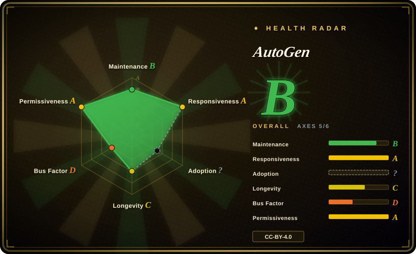
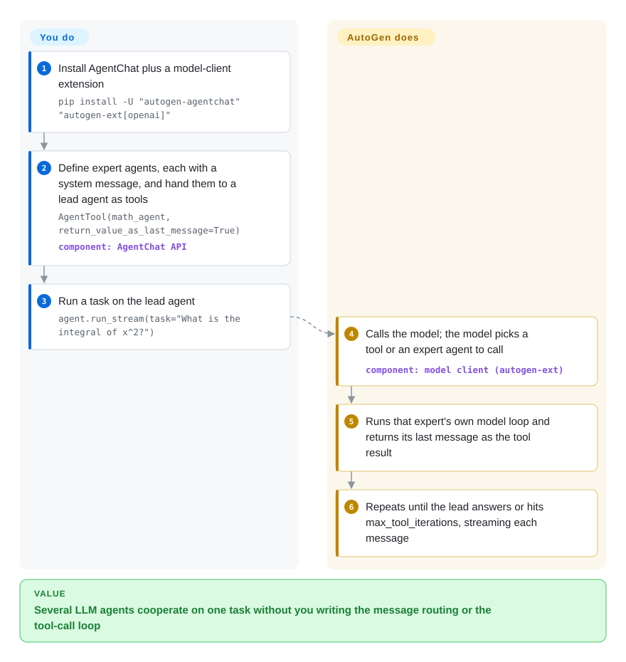

# AutoGen

You want a few LLM agents — a lead, a math expert, a web-browsing helper — to pass work to each other in Python until a task is done, without writing the turn-taking and tool-call plumbing yourself. AutoGen runs that conversation for you; Microsoft has since put it in maintenance mode, so today it is mainly the right call for code that already depends on it.

## When to use

You maintain a Python service that a research team prototyped on AutoGen in 2024–25: an `AssistantAgent` that hands questions to specialist agents, maybe a Magentic-One style team that browses the web and runs code. It works, and the question on your desk is not "which framework is best" but "do we keep shipping on this?". The README now opens with a banner — *"AutoGen is now in maintenance mode. It will not receive new features or enhancements and is community managed going forward."* — and the last release is python-v0.7.5 from 2025-09-30.

Keep AutoGen when rewriting is the bigger risk: your agents already run on its AgentChat API, or you depend on its Core layer — event-driven agents exchanging messages over a local or distributed runtime, with Python and .NET agents in one system — which its successor, [Microsoft Agent Framework](agent-framework.md), does not yet match (MAF's own migration guide calls distributed execution planned). Against CrewAI or LangGraph the deciding tradeoff is the same: AutoGen wins only on "no migration today", and you pay for it with a framework that will not gain new model features.

## How it works

AutoGen is a library you import, not a service you run. It comes in three layers: **Core** handles message passing between agents and the runtime they live in (in one process, or spread across machines over gRPC); **AgentChat**, built on Core, gives you ready-made agent types and common patterns such as two-agent chat and group chat; **Extensions** supply the model clients (adapters that speak one LLM provider's API — OpenAI, Azure OpenAI, Anthropic, Ollama…) and extras like code execution and MCP tools (MCP: a standard way to plug an external tool server into an agent). **You** write the agents — a model client, a system message (the standing instruction each agent gets), the tools it may call — and start a task; **AutoGen** runs the loop: call the model, execute whatever tool or sub-agent the model asks for, feed the result back, and repeat until there is an answer or the iteration cap is hit. Think of it as a meeting chair: you pick the attendees and the agenda, it decides who speaks next and keeps the minutes. A no-code path exists too — AutoGen Studio is a local GUI for prototyping teams — but the README says it is not meant for production.

<!-- flow-steps:begin (generated from flows/autogen.json by tools/flow_card.py — do not edit) -->

Text version of the flow

1. **You**: Install AgentChat plus a model-client extension — `pip install -U "autogen-agentchat" "autogen-ext[openai]"`
2. **You**: Define expert agents, each with a system message, and hand them to a lead agent as tools — `AgentTool(math_agent, return_value_as_last_message=True)` — component: `AgentChat API`
3. **You**: Run a task on the lead agent — `agent.run_stream(task="What is the integral of x^2?")`
4. **AutoGen**: Calls the model; the model picks a tool or an expert agent to call — component: `model client (autogen-ext)`
5. **AutoGen**: Runs that expert's own model loop and returns its last message as the tool result
6. **AutoGen**: Repeats until the lead answers or hits max_tool_iterations, streaming each message

**Value**: Several LLM agents cooperate on one task without you writing the message routing or the tool-call loop

<!-- flow-steps:end -->

## When NOT to use

- **You are starting a new project.** Upstream says it directly: new users should start with [Microsoft Agent Framework](agent-framework.md), the same teams' successor with stable APIs and long-term support. Use MAF instead of AutoGen, because AutoGen will receive bug and security fixes only.
- **You need new model or provider features as they ship.** Maintenance mode means no enhancements; the last release is 2025-09-30. Use [CrewAI](crewai.md), [LangGraph](langgraph.md), [OpenAI Agents SDK](openai-agents-sdk.md) or [Pydantic AI](pydantic-ai.md) instead, because they still release on a weeks-scale cadence.
- **You want the original AutoGen 0.2 conversational API, kept alive by a community.** AutoGen 0.4+ rewrote that API. AG2 (`ag2ai/ag2`, 未收录), which describes itself as "formerly AutoGen", was pushed as recently as 2026-10-08; prefer it over this repo if the 0.2 style is what your code speaks.
- **Non-developers must build the flows, in production.** AutoGen Studio is a prototyping GUI that the README says is "not meant to be a production-ready app". Use [Dify](../../workflow-builders/dify.md) or [Langflow](../../workflow-builders/langflow.md) instead.
- **You want a loop small enough to read in one sitting.** AutoGen is a multi-package workspace (core, agentchat, ext with dozens of optional extras, studio, bench). Use [smolagents](smolagents.md) when transparency beats breadth.

## Comparison

| Alternative | In index | Our verdict | Tradeoff |
|---|---|---|---|
| [Microsoft Agent Framework](agent-framework.md) | ✅ | For any new Microsoft-stack agent project, pick MAF; stay on AutoGen only while a migration is not yet affordable or you need its distributed Core runtime. | MAF is the supported successor with a release cadence; it gives up AutoGen's distributed, event-driven runtime (still planned in MAF) and AutoGen's larger body of examples. |
| [CrewAI](crewai.md) | ✅ | For new role-based multi-agent work, pick CrewAI over AutoGen because it still ships releases. | CrewAI's role/task model is opinionated and actively developed; AutoGen offers a lower-level Core layer but no new features. |
| [LangGraph](langgraph.md) | ✅ | When control flow must be an explicit, checkpointed graph, pick LangGraph; AutoGen fits only code already written as agent conversations. | LangGraph makes every transition explicit and durable; AutoGen lets the model drive turn-taking, which is quicker to prototype and harder to audit. |
| [AgentScope](agentscope.md) | ✅ | For a production multi-agent service that needs sandboxed tools and tracing today, pick AgentScope over a frozen AutoGen. | AgentScope is actively maintained with production features in scope; AutoGen has the bigger research-era corpus but no roadmap. |
| [OpenAI Agents SDK](openai-agents-sdk.md) | ✅ | For a small handoff-style agent team on OpenAI-compatible models, pick the Agents SDK; AutoGen only when its Core runtime or existing code decides it. | The Agents SDK is a thin, maintained primitive set; AutoGen is broader but frozen. |
| AG2 | 未收录 | If your codebase speaks the AutoGen 0.2 API and you want it to keep evolving, evaluate AG2 rather than this repo. | A community fork with active pushes; a different governance and API lineage from Microsoft's 0.4+ AutoGen. |

## Tech stack

- **Language:** Python ≥ 3.10, asyncio throughout; a .NET implementation lives in the same repo, and the Core API supports cross-language Python/.NET agents.
- **Packages (PyPI):** `autogen-core` (messaging + runtime; depends on pydantic 2, protobuf, opentelemetry-api, pillow), `autogen-agentchat` (high-level agents and teams, pinned to the same core version), `autogen-ext` (model clients and capabilities as optional extras: `openai`, `azure`, `anthropic`, `ollama`, `llama-cpp`, `docker`, `grpc`, `mcp`, `redis`, `chromadb`, Semantic Kernel adapters…).
- **Tools:** `autogenstudio` (no-code GUI, served locally), AgentBench (`agbench`, benchmarking), Magentic-One (a ready-made web/file/code team built on AgentChat + Extensions).
- **Observability:** OpenTelemetry API is a core dependency.

## Dependencies

- **A model provider:** an API key for a hosted model (the quickstart exports `OPENAI_API_KEY`), or a local model through the `ollama` / `llama-cpp` extras.
- **Code execution:** Docker if you use the Docker-based executors (`docker` / `docker-jupyter-executor` extras); running model-written code without a sandbox is your risk.
- **MCP tools:** whatever each MCP server needs — the README's browsing example runs `npx @playwright/mcp@latest`, so Node.js.
- **Distributed runtime:** gRPC (`grpc` extra) and a host process for the runtime when agents span machines.

## Ops difficulty

**Low to medium in-process, medium to high distributed — plus a migration you will eventually owe.** As a library inside one Python process it is pip-install-and-go; cost comes from pinning `autogen-core` / `autogen-agentchat` / `autogen-ext` to one version, sandboxing code execution, and the gRPC runtime if you distribute agents. The larger ops line item is time-based: with no new features coming, every new model capability or provider change becomes either a local patch or a reason to move to MAF.

## Health & viability

- **Maintenance (2026-10):** upstream declared maintenance mode — bug fixes, security patches and docs only, "community managed going forward". Last default-branch commit 2026-04-06 (a README banner update), last release python-v0.7.5 on 2025-09-30. The radar's maintenance B leans on a mature-library carve-out; read it as "stable and frozen", not "active".
- **Governance / bus factor:** only one active maintainer in the scorer's 12-month window (governance D); Microsoft moved the teams to Microsoft Agent Framework. Responsiveness is still A (median first response 28.4 h) [推断] on a shrinking group of people.
- **Backing & Lindy:** a Microsoft Research project, created 2023-08 (~3 years). Age does not rescue it here: the backer itself named a successor and stopped feature work, so the Lindy prior applies to MAF's continuity, not to AutoGen's code (longevity C).
- **Adoption:** ~61k stars and a large body of tutorials and papers; the adoption axis is measured from NuGet `autogen.core` downloads (224,307 last month), i.e. the .NET package, not PyPI.
- **Risk flags:** the risk is deprecation, not licensing — docs are CC-BY-4.0 and code is MIT (`LICENSE-CODE`). Plan the MAF migration; Microsoft publishes an AutoGen → MAF migration guide.

## Caveats (unverified)

- Repo license: GitHub's API reports CC-BY-4.0 because it reads the docs `LICENSE`; the code is MIT under `LICENSE-CODE` (read 2026-10-08), so the radar's license axis scores the docs license, not the code.
- [未验证] MAF's distributed execution status: as of the AutoGen → MAF migration guide (updated 2026-08) it was "planned"; it may have shipped since — re-check before using that as the reason to stay.
- [推断] Responsiveness A is measured on issue first-response time; with one active maintainer, how long that holds is a guess.
- [未验证] AG2's API lineage (continuing the 0.2 style) is from its self-description "formerly AutoGen"; this page did not read AG2's code.
- [未验证] The adoption axis uses NuGet `autogen.core` downloads; PyPI download volume for `autogen-agentchat` was not checked.
- [未验证] Star count ~61k as of 2026-10; stars are a noisy signal.
