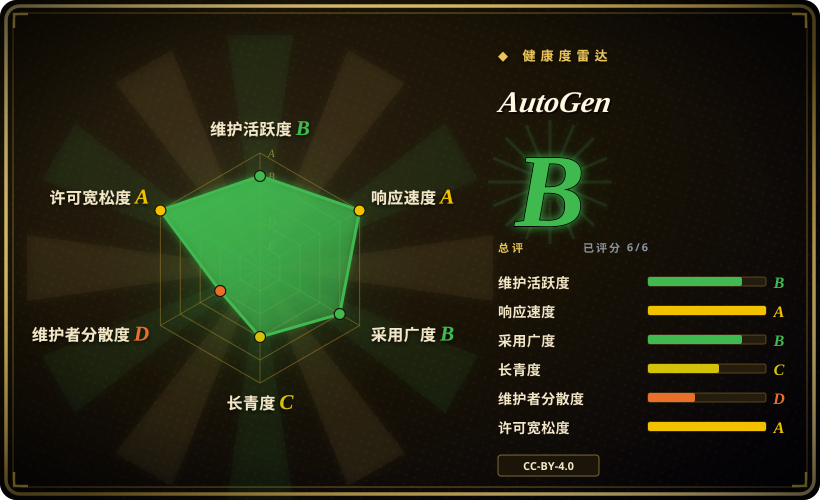
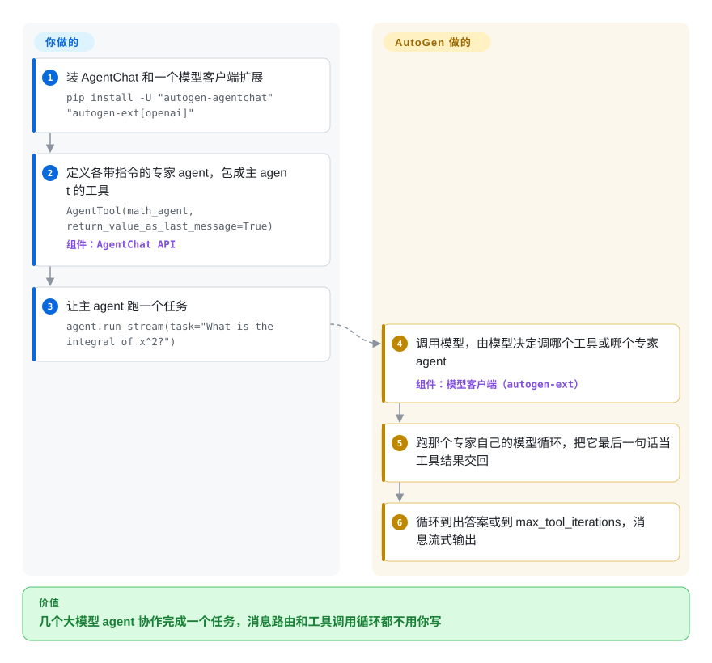

# AutoGen

你想让几个大模型 agent——一个牵头的、一个算数学的、一个上网查资料的——在 Python 里互相派活，直到把任务做完，但不想自己写轮流发言和工具调用那一套管道代码。AutoGen 替你把这场对话跑起来；不过微软已经让它进入维护模式，所以如今它主要适合本来就依赖它的代码。

## 何时使用

你维护着一个 Python 服务，是研究团队在 2024–25 年用 AutoGen 搭的原型：一个 `AssistantAgent` 把问题转给几个专家 agent，也许还有一支 Magentic-One 式的小队负责上网和跑代码。它能用，你桌上的问题不是“哪个框架最好”，而是“还要不要继续在它上面发版？”。README 开头现在挂着一条横幅——*“AutoGen is now in maintenance mode. It will not receive new features or enhancements and is community managed going forward.”*——最新版本是 2025-09-30 发布的 python-v0.7.5。

当重写的风险更大时，就留在 AutoGen：你的 agent 已经跑在它的 AgentChat API 上，或者你依赖它的 Core 层——事件驱动的 agent 通过本地或分布式运行时互发消息，Python 和 .NET 的 agent 可以在同一个系统里——而它的继任者 [Microsoft Agent Framework](agent-framework.zh.md) 目前还做不到这一点（MAF 自己的迁移指南把分布式执行写成“计划中”）。和 CrewAI、LangGraph 比，决定性的取舍也一样：AutoGen 只赢在“今天不用迁移”，代价是一个不会再长新模型功能的框架。

## 怎么用起来

AutoGen 是你 import 的库，不是要部署的服务。它分三层：**Core** 负责 agent 之间的消息传递和它们所在的运行时（可以在一个进程里，也可以通过 gRPC 分散到多台机器）；**AgentChat** 建在 Core 之上，提供现成的 agent 类型和双 agent 对话、群聊这类常见模式；**Extensions** 提供模型客户端（对接某一家大模型 API 的适配器——OpenAI、Azure OpenAI、Anthropic、Ollama 等）以及代码执行、MCP 工具这类附加能力（MCP：把外部工具服务器接进 agent 的一种标准接口）。**你**来写 agent——一个模型客户端、一段 system message（每个 agent 常驻的指令）、它可以调用的工具——然后发起任务；**AutoGen** 负责跑循环：调模型，执行模型点名的工具或子 agent，把结果喂回去，直到得出答案或碰到迭代上限。可以把它想成会议主持人：与会者和议程由你定，下一个谁发言、会议纪要由它管。另有一条免写代码的路——AutoGen Studio 是本地跑的图形界面，用来试搭团队——但 README 明说它不是给生产用的。

<!-- flow-steps:begin (generated from flows/autogen.json by tools/flow_card.py — do not edit) -->

流程文字版

1. **你**：装 AgentChat 和一个模型客户端扩展 — `pip install -U "autogen-agentchat" "autogen-ext[openai]"`
2. **你**：定义各带指令的专家 agent，包成主 agent 的工具 — `AgentTool(math_agent, return_value_as_last_message=True)` — 组件：`AgentChat API`
3. **你**：让主 agent 跑一个任务 — `agent.run_stream(task="What is the integral of x^2?")`
4. **AutoGen**：调用模型，由模型决定调哪个工具或哪个专家 agent — 组件：`模型客户端（autogen-ext）`
5. **AutoGen**：跑那个专家自己的模型循环，把它最后一句话当工具结果交回
6. **AutoGen**：循环到出答案或到 max_tool_iterations，消息流式输出

**价值**：几个大模型 agent 协作完成一个任务，消息路由和工具调用循环都不用你写

<!-- flow-steps:end -->

## 何时不用

- **你要开一个新项目。** 上游说得很直接：新用户应该从 [Microsoft Agent Framework](agent-framework.zh.md) 开始，那是同一批团队做的继任者，API 稳定、承诺长期支持。新项目用 MAF 而不是 AutoGen，因为 AutoGen 只会收到 bug 修复和安全补丁。
- **你需要第一时间用上新模型或新厂商的功能。** 维护模式意味着不再增强；最新版本停在 2025-09-30。改用 [CrewAI](crewai.zh.md)、[LangGraph](langgraph.zh.md)、[OpenAI Agents SDK](openai-agents-sdk.zh.md) 或 [Pydantic AI](pydantic-ai.zh.md)，它们仍按周级节奏发版。
- **你要的是最初 AutoGen 0.2 那套对话式 API，并且希望有社区接着维护。** AutoGen 0.4 之后重写了那套 API。AG2（`ag2ai/ag2`，未收录）自称“formerly AutoGen”，最近一次 push 就在 2026-10-08；如果你的代码说的是 0.2 那套写法，优先看它而不是本仓库。
- **要让非开发者在生产环境里搭流程。** AutoGen Studio 是原型界面，README 原话是“not meant to be a production-ready app”。改用 [Dify](../../workflow-builders/dify.zh.md) 或 [Langflow](../../workflow-builders/langflow.zh.md)。
- **你想要一个一口气就能读完的循环。** AutoGen 是多包工作区（core、agentchat、带几十个可选扩展的 ext、studio、bench）。看重透明胜过广度时，用 [smolagents](smolagents.zh.md)。

## 横向对比

| 替代品 | 是否收录 | 我们的评价 | 取舍 |
|---|---|---|---|
| [Microsoft Agent Framework](agent-framework.zh.md) | ✅ | 微软技术栈上的新 agent 项目一律选 MAF；只有迁移暂时付不起、或离不开它的分布式 Core 运行时，才留在 AutoGen。 | MAF 是有发版节奏、受支持的继任者；代价是放弃 AutoGen 的分布式事件驱动运行时（MAF 里仍是计划中）和更多现成示例。 |
| [CrewAI](crewai.zh.md) | ✅ | 新的角色分工式多 agent 项目，选 CrewAI 而不是 AutoGen，因为它还在发版。 | CrewAI 的角色/任务模型更有主见且在活跃开发；AutoGen 有更底层的 Core 层，但不会再有新功能。 |
| [LangGraph](langgraph.zh.md) | ✅ | 控制流必须是显式、可存档的图时选 LangGraph；AutoGen 只适合已经写成 agent 对话的既有代码。 | LangGraph 把每一步跳转都写明且可持久化；AutoGen 让模型决定轮到谁，原型更快，审计更难。 |
| [AgentScope](agentscope.zh.md) | ✅ | 今天就要上线、需要沙箱工具和链路追踪的多 agent 服务，选 AgentScope 而不是已冻结的 AutoGen。 | AgentScope 在积极维护，生产特性在其范围内；AutoGen 研究时代的资料更多，但没有路线图。 |
| [OpenAI Agents SDK](openai-agents-sdk.zh.md) | ✅ | 在 OpenAI 兼容模型上做一个小型交接式 agent 团队，选 Agents SDK；只有 Core 运行时或既有代码说了算时才选 AutoGen。 | Agents SDK 是一组薄而仍在维护的原语；AutoGen 更宽但已冻结。 |
| AG2 | 未收录 | 代码库用的是 AutoGen 0.2 API、又希望它继续演进时，评估 AG2 而不是本仓库。 | 社区分叉，仍在活跃 push；治理和 API 谱系都不同于微软的 0.4+ AutoGen。 |

## 技术栈

- **语言：** Python ≥ 3.10，全程 asyncio；同一仓库里还有 .NET 实现，Core API 支持 Python 和 .NET agent 跨语言协作。
- **包（PyPI）：** `autogen-core`（消息传递和运行时；依赖 pydantic 2、protobuf、opentelemetry-api、pillow）、`autogen-agentchat`（高层 agent 和团队，钉在同版本的 core 上）、`autogen-ext`（模型客户端和各项能力，做成可选 extra：`openai`、`azure`、`anthropic`、`ollama`、`llama-cpp`、`docker`、`grpc`、`mcp`、`redis`、`chromadb`、Semantic Kernel 适配等）。
- **工具：** `autogenstudio`（免写代码的图形界面，本地起服务）、AgentBench（`agbench`，评测）、Magentic-One（基于 AgentChat + Extensions 的现成小队，能浏览网页、处理文件、跑代码）。
- **可观测性：** OpenTelemetry API 是 core 的依赖。

## 依赖

- **一个模型来源：** 托管模型的 API key（快速上手示例里 export 的是 `OPENAI_API_KEY`），或者通过 `ollama` / `llama-cpp` extra 接本地模型。
- **代码执行：** 用基于 Docker 的执行器（`docker` / `docker-jupyter-executor` extra）就需要 Docker；不加沙箱直接跑模型写的代码，风险自负。
- **MCP 工具：** 每个 MCP 服务器各自的依赖——README 的浏览示例跑的是 `npx @playwright/mcp@latest`，所以要 Node.js。
- **分布式运行时：** agent 跨机器时需要 gRPC（`grpc` extra）和一个承载运行时的宿主进程。

## 运维难度

**单进程内低到中，分布式中到高——外加一笔迟早要还的迁移账。** 作为一个 Python 进程里的库，pip 装上就能用；成本在于把 `autogen-core` / `autogen-agentchat` / `autogen-ext` 钉在同一版本、给代码执行加沙箱，以及分布式部署时的 gRPC 运行时。更大的一笔是随时间增长的：既然不会再有新功能，每一个新的模型能力或厂商接口变化，要么自己打补丁，要么就是迁去 MAF 的理由。

## 健康度与可持续性

- **维护（2026-10）：** 上游已宣布进入维护模式——只做 bug 修复、安全补丁和文档，“community managed going forward”。默认分支最后一次提交在 2026-04-06（改 README 横幅），最新版本是 2025-09-30 的 python-v0.7.5。雷达上维护 B 靠的是成熟库豁免；应理解为“稳定且冻结”，而不是“活跃”。
- **治理与 bus factor：** 评分器的 12 个月窗口里只有一位活跃维护者（治理 D）；微软已把团队转去做 Microsoft Agent Framework。响应速度仍是 A（首次回复中位数 28.4 小时）[推断]，但撑着它的人在变少。
- **背书与 Lindy：** 出自微软研究院，创建于 2023-08（约 3 年）。年龄在这里救不了它：背书方自己指定了继任者并停止功能开发，所以 Lindy 先验落在 MAF 的延续性上，而不是 AutoGen 的代码上（寿命 C）。
- **采用度：** 约 61k star，教程和论文很多；雷达没给采用度打分（`?`，2026-10-09）：Python 包 `autogen-agentchat` / `autogen-core` 没有登记仓库链接，注册表索引没把它们挂到这个仓库，而挂上来的 .NET NuGet 包代表不了 Python 主线。
- **风险标记：** 风险在于停止演进，不在许可证——文档是 CC-BY-4.0，代码是 MIT（`LICENSE-CODE`）。请规划迁去 MAF；微软发布了 AutoGen → MAF 的迁移指南。

## 存疑（未验证）

- 仓库许可证：GitHub 接口报 CC-BY-4.0，因为它读的是文档的 `LICENSE`；代码在 `LICENSE-CODE` 下用 MIT（2026-10-08 已读原文），所以雷达的许可证轴评的是文档许可，不是代码许可。
- [未验证] MAF 分布式执行的状态：截至 AutoGen → MAF 迁移指南（2026-08 更新）仍是“计划中”，之后可能已经发布——拿它当留下来的理由之前请重查。
- [推断] 响应速度 A 是按 issue 首次回复时间算的；只剩一位活跃维护者时这个数还能保持多久，只能靠猜。
- [未验证] AG2 延续 0.2 API 谱系，依据只是它自称“formerly AutoGen”；本页没有读 AG2 的代码。
- [未验证] 采用度测不了（`?`）：评分器只统计注册表索引链接到本仓库的包，而 Python 包 `autogen-agentchat` / `autogen-core` 没有登记仓库链接；它们在 PyPI 的下载量也没有人工核对，所以本页没有采用数字。
- [未验证] Star 约 61k（截至 2026-10）；star 只是噪声很大的信号。
