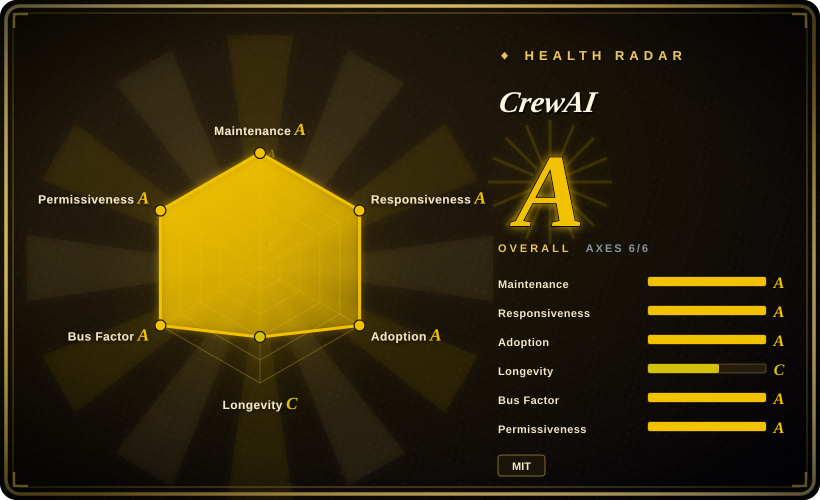
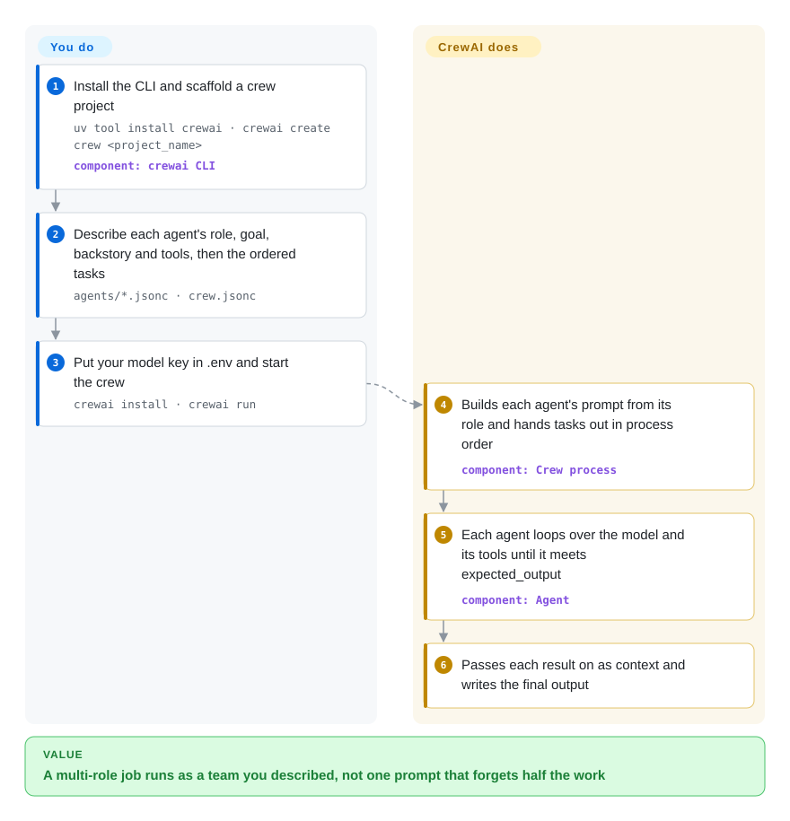

# CrewAI

You want a "researcher" that searches the web and a "writer" that turns the findings into a report, and the first version is one giant prompt that forgets half the research by the time it writes. CrewAI lets you describe each agent as a job posting (role, goal, backstory, tools), list the tasks in order, and it runs them as a team, handing each task's output to the next.

## When to use

You are a Python developer automating a knowledge-work job that a human team would split by role: research a market, analyse it, write the brief; or triage a ticket, look up the account, draft the reply. A single prompt does all of it badly — the "writer" half quotes facts the "researcher" half never found. You want separate agents with separate instructions and tools, and you want to get there by *describing* the team rather than wiring a state machine. You reach for CrewAI because `crewai create crew` gives you exactly that shape: each agent is a JSON file with `role`, `goal`, `backstory`, `llm` and `tools`, `crew.jsonc` lists the tasks with an `expected_output` and who does them, and `crewai run` executes the team, passing earlier task outputs as context to later ones.

Pick it over [LangGraph](langgraph.md) when you would rather declare roles and tasks than draw every node and edge yourself, and accept that agent-to-agent hand-offs inside a crew are steered by prompts rather than explicit transitions. When parts of the job must be deterministic (fetch data, branch on a score, call a crew only in one branch), CrewAI's **Flows** — a Python class whose methods are chained with `@start`, `@listen` and `@router` decorators over a typed state object — wrap crews in ordinary code, so you do not have to switch frameworks to add control. Pick it over [OpenAI Agents SDK](openai-agents-sdk.md) or [Pydantic AI](pydantic-ai.md) when the multi-role team, not a single well-typed agent, is the thing you are building.

## How it works

A **crew** is three things you declare: agents (each with a role, goal, backstory, model and tool list), tasks (each with a description, an `expected_output`, an assigned agent and optional `context` — earlier tasks whose output it should read), and a **process** — `sequential` runs the tasks in order, `hierarchical` adds a manager agent that plans, delegates and checks results for you. **CrewAI does the rest**: it turns role, goal and backstory into the agent's system prompt, runs each agent's tool-calling loop (ask the model, run the tool it requested, feed the result back, repeat until the expected output is produced), threads task outputs into the next task's context, and writes the final result. What stays yours is the team design, the tool choice, the model API keys, and checking whether "the analyst" actually did analysis. Think of it as staffing a small agency: you write the job descriptions and the work order, CrewAI runs the office. When you need hard control — branching, retries, state that must not be left to a model — you put crews inside a **Flow**, where plain Python methods decide what happens next and a crew is just one step.

<!-- flow-steps:begin (generated from flows/crewai.json by tools/flow_card.py — do not edit) -->

Text version of the flow

1. **You**: Install the CLI and scaffold a crew project — `uv tool install crewai · crewai create crew <project_name>` — component: `crewai CLI`
2. **You**: Describe each agent's role, goal, backstory and tools, then the ordered tasks — `agents/*.jsonc · crew.jsonc`
3. **You**: Put your model key in .env and start the crew — `crewai install · crewai run`
4. **CrewAI**: Builds each agent's prompt from its role and hands tasks out in process order — component: `Crew process`
5. **CrewAI**: Each agent loops over the model and its tools until it meets expected_output — component: `Agent`
6. **CrewAI**: Passes each result on as context and writes the final output

**Value**: A multi-role job runs as a team you described, not one prompt that forgets half the work

<!-- flow-steps:end -->

## When NOT to use

- **You need to see and control every transition.** Inside a crew, who talks to whom and when a task is "done" is decided by prompts; a hierarchical manager agent adds another model-driven layer. If you need each step to be an explicit, inspectable edge with resumable state, use [LangGraph](langgraph.md) instead, because there the graph *is* the program.
- **One agent with typed output would do.** Role, goal and backstory scaffolding costs tokens and latency on every call and buys nothing for a single extraction or tool-calling task. Use [Pydantic AI](pydantic-ai.md) or [OpenAI Agents SDK](openai-agents-sdk.md) instead, because their unit is one agent with a validated output type.
- **You want a small dependency footprint.** The core `crewai` package (1.15.25) pulls in `chromadb`, `lancedb`, `pdfplumber`, `openai`, `instructor`, `mcp` and the OpenTelemetry SDK before you add a single tool. Use [smolagents](smolagents.md) instead when a short, auditable install matters more than built-in memory and knowledge stores.
- **Your runtime is Python 3.14, or not Python at all.** CrewAI declares `requires-python >=3.10, <3.14`, and there is no official TypeScript port. Use [TanStack AI](tanstack-ai.md) or LangGraph's JavaScript port instead in a TypeScript codebase.
- **You need the hosted control plane but cannot buy it.** Managed deployment, the tracing UI and governance live in the commercial CrewAI AMP suite, not in this repo. Self-host tracing with [Langfuse](../../../llm-eval/langfuse.md), which documents a CrewAI integration, instead of relying on AMP.
- **You are in a Microsoft / .NET shop.** CrewAI is Python-only. Use [Microsoft Agent Framework](agent-framework.md) instead, because it ships the same multi-agent patterns in Python and .NET with Azure / Foundry hosting.
- **You cannot absorb frequent upgrades.** 27 releases shipped between 2026-07-08 and 2026-10-07, and the default `crewai create crew` scaffold moved to a JSON-first layout (the older Python/YAML one is now `--classic`). Pin the version and read the changelog on every bump; if that is unacceptable, a slower-moving library such as [Pydantic AI](pydantic-ai.md) is easier to keep current.

## Comparison

| Alternative | In index | Our verdict | Tradeoff |
| --- | --- | --- | --- |
| [LangGraph](langgraph.md) | ✅ | When the workflow must be explicit, resumable and debuggable step by step, pick LangGraph; pick CrewAI when declaring roles and tasks gets you to a working team faster and prompt-steered hand-offs are acceptable. | LangGraph gives full control and durable checkpoints but you draw every edge; CrewAI is quicker to describe but hides the agent-to-agent hand-offs inside prompts. |
| [Microsoft Agent Framework](agent-framework.md) | ✅ | In a .NET or Azure / Foundry environment, pick Microsoft Agent Framework; pick CrewAI for a Python-only team that wants role-based crews with minimal wiring. | MAF has .NET parity and typed workflow graphs at the cost of a larger package surface; CrewAI is Python-only but faster to a running crew. |
| [AutoGen](autogen.md) | ✅ | Do not start new multi-agent work on AutoGen; pick CrewAI (or Microsoft Agent Framework, AutoGen's stated successor) because CrewAI ships releases weekly while AutoGen is coasting. | AutoGen still has the larger research-era corpus of conversation patterns; CrewAI has the active maintenance and a scaffold CLI. |
| [OpenAI Agents SDK](openai-agents-sdk.md) | ✅ | For one agent or a few hand-offs on OpenAI models, pick the OpenAI Agents SDK; pick CrewAI when a role-separated team with task-level context passing is the core design. | The OpenAI SDK has fewer primitives and lighter dependencies; CrewAI adds roles, processes, memory and knowledge but with more tokens and more packages. |
| [Pydantic AI](pydantic-ai.md) | ✅ | When you want a single, type-safe agent whose output is validated against a Pydantic model, pick Pydantic AI; pick CrewAI when several agents with distinct roles must collaborate. | Pydantic AI is lean and strongly typed; CrewAI is broader and opinionated about multi-agent structure. |

## Tech stack

- **Language**: Python 3.10–3.13 (`requires-python >=3.10, <3.14`), packaged as a `uv` workspace under `lib/` (`crewai`, `crewai-core`, `crewai-cli`, `crewai-tools`, `crewai-files`).
- **Core primitives**: `Agent`, `Task`, `Crew` with `sequential` / `hierarchical` processes; `Flow` with `@start` / `@listen` / `@router` decorators and Pydantic state.
- **Model access**: OpenAI client and `instructor` in core; native Anthropic, Bedrock and LiteLLM support via extras; local models through Ollama / LM Studio.
- **Built-in stores**: ChromaDB and LanceDB for memory and knowledge; MCP client and A2A support.
- **Observability**: OpenTelemetry SDK (also used for CrewAI's own anonymous telemetry).

## Dependencies

- **A model provider**: an OpenAI key by default, or another provider configured per agent (`"llm": "openai/gpt-4o"` style), or a local model server.
- **Tool credentials**: web-search and other tools need their own keys (the README example uses a Serper.dev key).
- **`uv`**: the CLI is installed with `uv tool install crewai`, and generated projects use `uv` for dependencies.
- **Optional**: Qdrant, mem0, Docling, AWS, watsonx and other integrations as extras; CrewAI AMP if you want the commercial hosted control plane.

## Ops difficulty

**Low to start, medium in production.** It is a Python library plus CLI — no server to run; a crew executes in your process and writes its output locally. The production work is elsewhere: model and tool keys per environment, token cost (each agent call carries its role and backstory, and hierarchical crews add manager calls), local vector stores for memory/knowledge to keep on disk, turning off default anonymous telemetry with `OTEL_SDK_DISABLED=true` where policy requires, and pinning versions against a near-weekly release cadence.

## Health & viability

- **Maintenance (2026-10-08)**: very active — commits in every recent week and releases roughly weekly (1.15.24 and 1.15.25 both on 2026-10-07); 1.0.0 shipped 2025-10-20.
- **Responsiveness**: maintainers answered a typical new issue within a median of 8.8 hours (over a small sample of 9 issues), so bug reports are being looked at.
- **Governance & backing**: owned by CrewAI Inc. (`crewAIInc` org), which funds development through the commercial AMP suite; 31 contributors were active in the past 12 months and the top one (the founder) holds about 36% of commits. The roadmap is the company's, and open-source/commercial boundaries are its call.
- **Age / Lindy**: created 2023-10-27, about 3 years old and still shipping weekly — a moderate Lindy signal, typical of the 2023 agent-framework cohort rather than proof of decades ahead.
- **Adoption**: ~59.4k stars, ~8.7k forks, 2,442,764 PyPI downloads of `crewai` in the last month (2026-10-08), plus DeepLearning.AI courses — one of the most-used multi-agent frameworks.
- **Risk flags**: MIT license, no relicense history. Watch the open-core split (hosted tracing and deployment are paid), default-on anonymous telemetry, and upgrade churn.

## Caveats (unverified)

- [未验证] The "100,000+ certified developers" figure is from the upstream README and was not independently checked.
- [推断] That prompt-steered hand-offs are harder to debug than explicit graph edges is this page's judgment from the two frameworks' designs, not a measured comparison.
- [推断] Token overhead from role/backstory prompts and manager agents depends on model and crew size; no cost benchmark was run.
- [未验证] Responsiveness is a median over only 9 qualifying issues in the scorer's window and may not reflect how fast hard bugs get fixed.
- [未验证] Which features stay in the MIT repo versus move to AMP over time is a company decision with no published policy.
- [未验证] Langfuse's CrewAI integration was confirmed to exist in Langfuse's docs repository, not tested.
