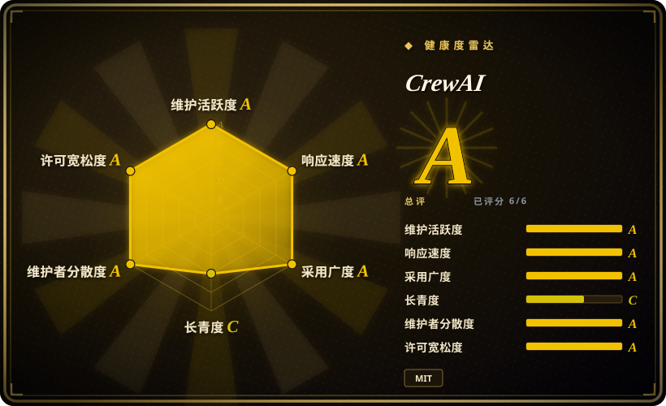
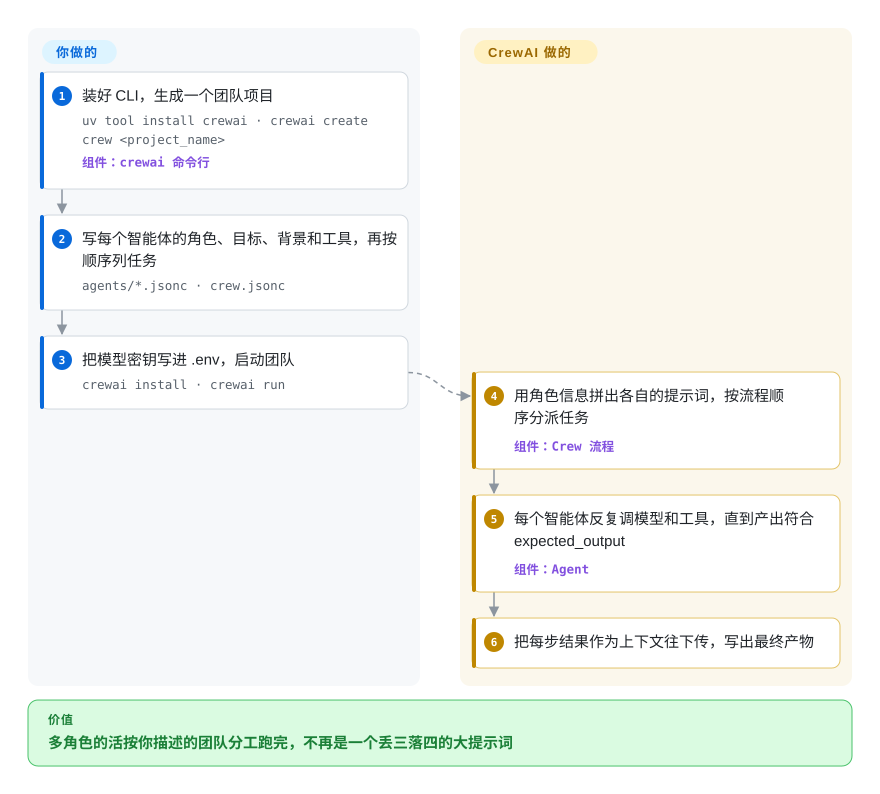

# CrewAI

你想要一个上网查资料的“研究员”和一个把结果写成报告的“写手”，第一版却是一个超长提示词，写到报告部分时早把一半资料忘了。CrewAI 让你像写招聘启事一样描述每个智能体（角色、目标、背景、可用工具），按顺序列出任务，再让它们组队干活，每个任务的产出自动交给下一个任务。

## 何时使用

你是 Python 开发者，要自动化一件人类团队会按角色分工的知识型工作：调研市场、分析、写简报；或者给工单分类、查客户档案、起草回复。一个提示词包办全部，效果很差：“写手”那一半引用了“研究员”那一半根本没查到的事实。你想要几个各有指令和工具的独立智能体，而且希望靠“描述团队”就能搭起来，而不是自己连状态机。这时你会想到 CrewAI：`crewai create crew` 直接给你这个形状，每个智能体是一个 JSON 文件，写着 `role`、`goal`、`backstory`、`llm` 和 `tools`；`crew.jsonc` 列出任务、每个任务的 `expected_output` 和负责人；`crewai run` 让整个团队跑起来，前面任务的产出作为上下文传给后面的任务。

如果你宁愿声明角色和任务、也不想亲手画每个节点和每条边，并且能接受团队内部的交接靠提示词引导而不是显式跳转，就选它而不是 [LangGraph](langgraph.zh.md)。当工作里有部分必须确定执行（取数据、按分数分支、只在某个分支里调用团队），CrewAI 的 **Flow**——一个 Python 类，方法之间用 `@start`、`@listen`、`@router` 装饰器串起来，共享一个有类型的状态对象——能把团队包进普通代码，加控制不用换框架。如果你要做的是多角色团队，而不是一个类型严谨的单智能体，就选它而不是 [OpenAI Agents SDK](openai-agents-sdk.zh.md) 或 [Pydantic AI](pydantic-ai.zh.md)。

## 怎么用起来

一个 **crew（团队）** 由你声明的三样东西组成：智能体（每个有角色、目标、背景、模型和工具列表）、任务（每个有描述、`expected_output`、指派的智能体，以及可选的 `context`——它要读哪些前序任务的产出），以及 **process（流程）**：`sequential` 按顺序执行任务，`hierarchical` 额外加一个经理智能体，替你做计划、分派和验收。**剩下的 CrewAI 来做**：把角色、目标、背景拼成智能体的系统提示词；跑每个智能体的工具调用循环（问模型、执行模型要求的工具、把结果喂回去，直到产出符合预期）；把任务产出接到下一个任务的上下文里；写出最终结果。留给你的是团队怎么设计、工具怎么选、模型密钥，以及检查“分析师”到底有没有真的在分析。可以把它想成开一家小代理公司：你写岗位说明和工单，CrewAI 负责办公室的日常运转。需要硬控制时（分支、重试、不能交给模型决定的状态），就把团队放进 **Flow**：由普通 Python 方法决定下一步，团队只是其中一步。

<!-- flow-steps:begin (generated from flows/crewai.json by tools/flow_card.py — do not edit) -->

流程文字版

1. **你**：装好 CLI，生成一个团队项目 — `uv tool install crewai · crewai create crew <project_name>` — 组件：`crewai 命令行`
2. **你**：写每个智能体的角色、目标、背景和工具，再按顺序列任务 — `agents/*.jsonc · crew.jsonc`
3. **你**：把模型密钥写进 .env，启动团队 — `crewai install · crewai run`
4. **CrewAI**：用角色信息拼出各自的提示词，按流程顺序分派任务 — 组件：`Crew 流程`
5. **CrewAI**：每个智能体反复调模型和工具，直到产出符合 expected_output — 组件：`Agent`
6. **CrewAI**：把每步结果作为上下文往下传，写出最终产物

**价值**：多角色的活按你描述的团队分工跑完，不再是一个丢三落四的大提示词

<!-- flow-steps:end -->

## 何时不用

- **你需要看清并控制每一次跳转。** 在团队内部，谁跟谁说话、任务什么时候算“完成”，是提示词决定的；层级模式的经理智能体又多加了一层由模型驱动的决策。如果每一步都要是显式、可检查、可恢复状态的边，改用 [LangGraph](langgraph.zh.md)，因为在那里图本身就是程序。
- **一个带类型输出的智能体就够了。** 角色、目标、背景这套脚手架每次调用都要花 token 和时延，对单次抽取或单个工具调用任务毫无帮助。改用 [Pydantic AI](pydantic-ai.zh.md) 或 [OpenAI Agents SDK](openai-agents-sdk.zh.md)，它们的基本单位是一个输出经过校验的智能体。
- **你要很小的依赖面。** 核心包 `crewai`（1.15.25）在你加任何工具之前就会拉进 `chromadb`、`lancedb`、`pdfplumber`、`openai`、`instructor`、`mcp` 和 OpenTelemetry SDK。如果一个短小、可审计的安装比内置记忆和知识库更重要，改用 [smolagents](smolagents.zh.md)。
- **你的运行时是 Python 3.14，或者根本不是 Python。** CrewAI 声明 `requires-python >=3.10, <3.14`，也没有官方 TypeScript 版。TypeScript 代码库改用 [TanStack AI](tanstack-ai.zh.md) 或 LangGraph 的 JavaScript 版。
- **你需要托管控制台，但买不了。** 托管部署、追踪界面和治理功能在商业版 CrewAI AMP 套件里，不在这个仓库。改用自托管的 [Langfuse](../../../llm-eval/langfuse.zh.md) 做追踪（它的文档里有 CrewAI 集成），不要依赖 AMP。
- **你在微软 / .NET 技术栈里。** CrewAI 只有 Python。改用 [Microsoft Agent Framework](agent-framework.zh.md)，它在 Python 和 .NET 里都提供同类多智能体模式，并支持 Azure / Foundry 托管。
- **你承受不了频繁升级。** 2026-07-08 到 2026-10-07 之间发了 27 个版本，`crewai create crew` 的默认脚手架也换成了 JSON 优先的布局（旧的 Python/YAML 布局现在要加 `--classic`）。锁定版本、每次升级都读更新日志；如果这不可接受，像 [Pydantic AI](pydantic-ai.zh.md) 这样变化更慢的库更容易跟上。

## 横向对比

| 替代品 | 是否收录 | 我们的评价 | 取舍 |
|---|---|---|---|
| [LangGraph](langgraph.zh.md) | ✅ | 工作流必须显式、可恢复、能一步步调试时，选 LangGraph；声明角色和任务能更快拿到可用团队、且能接受提示词引导的交接时，选 CrewAI。 | LangGraph 控制力完整、有持久化检查点，但每条边都要你画；CrewAI 描述起来更快，但智能体之间的交接藏在提示词里。 |
| [Microsoft Agent Framework](agent-framework.zh.md) | ✅ | 在 .NET 或 Azure / Foundry 环境里，选 Microsoft Agent Framework；纯 Python 团队、想用最少连线搭出按角色分工的团队，选 CrewAI。 | MAF 有 .NET 对等支持和有类型的工作流图，代价是包更多；CrewAI 只有 Python，但更快跑起一个团队。 |
| [AutoGen](autogen.zh.md) | ✅ | 不要在 AutoGen 上开新的多智能体项目；选 CrewAI（或 AutoGen 官方指定的继任者 Microsoft Agent Framework），因为 CrewAI 每周都在发版，而 AutoGen 已经停滞。 | AutoGen 仍有更多研究时期积累的对话模式资料；CrewAI 有活跃维护和脚手架 CLI。 |
| [OpenAI Agents SDK](openai-agents-sdk.zh.md) | ✅ | 在 OpenAI 模型上做一个智能体或几次交接，选 OpenAI Agents SDK；核心设计是按角色分工、按任务传上下文的团队时，选 CrewAI。 | OpenAI 的 SDK 原语更少、依赖更轻；CrewAI 多了角色、流程、记忆和知识库，但 token 更多、包也更多。 |
| [Pydantic AI](pydantic-ai.zh.md) | ✅ | 想要一个输出按 Pydantic 模型校验的单个类型安全智能体，选 Pydantic AI；几个不同角色的智能体必须协作时，选 CrewAI。 | Pydantic AI 精简且类型严格；CrewAI 覆盖面更广，对多智能体结构有自己的主张。 |

## 技术栈

- **语言**：Python 3.10–3.13（`requires-python >=3.10, <3.14`），以 `uv` 工作区组织在 `lib/` 下（`crewai`、`crewai-core`、`crewai-cli`、`crewai-tools`、`crewai-files`）。
- **核心原语**：`Agent`、`Task`、`Crew`，流程有 `sequential` / `hierarchical`；`Flow` 用 `@start` / `@listen` / `@router` 装饰器和 Pydantic 状态。
- **模型接入**：核心依赖 OpenAI 客户端和 `instructor`；Anthropic、Bedrock、LiteLLM 通过可选扩展原生支持；本地模型通过 Ollama / LM Studio。
- **内置存储**：ChromaDB 和 LanceDB 用于记忆和知识库；内置 MCP 客户端和 A2A 支持。
- **可观测性**：OpenTelemetry SDK（CrewAI 自己的匿名遥测也走它）。

## 依赖

- **模型服务**：默认用 OpenAI 密钥，也可以给每个智能体单独配置别的服务商（`"llm": "openai/gpt-4o"` 这种写法），或接本地模型服务。
- **工具凭据**：联网搜索等工具需要各自的密钥（README 示例用的是 Serper.dev 密钥）。
- **`uv`**：CLI 用 `uv tool install crewai` 安装，生成的项目也用 `uv` 管依赖。
- **可选**：Qdrant、mem0、Docling、AWS、watsonx 等集成作为扩展安装；想要商业托管控制台则需要 CrewAI AMP。

## 运维难度

**起步低，上生产中等。** 它是 Python 库加 CLI，不用跑服务器；团队在你的进程里执行，结果写在本地。生产上的活在别处：每个环境的模型和工具密钥；token 成本（每次调用都带着角色和背景，层级模式还多出经理调用）；记忆和知识库用的本地向量库要落盘；按合规要求用 `OTEL_SDK_DISABLED=true` 关掉默认开启的匿名遥测；以及面对几乎每周一次的发版，锁定版本。

## 健康度与可持续性

- **维护（2026-10-08）**：非常活跃，最近每周都有提交，大约每周发一版（1.15.24 和 1.15.25 都在 2026-10-07）；1.0.0 发布于 2025-10-20。
- **响应速度**：新 issue 收到维护者首次回复的中位时间是 8.8 小时（只有 9 个 issue 样本），问题报上去有人看。
- **治理与背书**：仓库归 CrewAI Inc.（`crewAIInc` 组织）所有，公司靠商业版 AMP 套件养开发；过去 12 个月有 31 名贡献者活跃，头号贡献者（创始人）约占 36% 的提交。路线图由公司决定，开源和商业的边界也由它划。
- **年龄 / Lindy**：创建于 2023-10-27，约 3 年，仍在每周发版。这是中等强度的 Lindy 信号，属于 2023 年那一批智能体框架的典型水平，说明不了还能活很多年。
- **采用度**：约 59.4k star、约 8.7k fork，`crewai` 上个月 PyPI 下载 2,442,764 次（2026-10-08），还有 DeepLearning.AI 课程，是使用最广的多智能体框架之一。
- **风险信号**：MIT 许可，没有改许可的历史。要留意开源核心与商业版的切分（托管追踪和部署收费）、默认开启的匿名遥测，以及升级频繁。

## 存疑（未验证）

- [未验证] “10 万以上认证开发者”来自上游 README，没有独立核实。
- [推断] “提示词引导的交接比显式图边更难调试”是本页根据两个框架的设计做出的判断，不是测量结果。
- [推断] 角色 / 背景提示词和经理智能体带来的 token 开销取决于模型和团队规模，没有跑过成本基准。
- [未验证] 响应速度是评分窗口里仅 9 个 issue 的中位数，不一定反映疑难 bug 的修复速度。
- [未验证] 哪些功能留在 MIT 仓库、哪些会挪进 AMP，是公司决策，没有公开政策。
- [未验证] Langfuse 的 CrewAI 集成只确认在 Langfuse 文档仓库里存在，没有实测。
