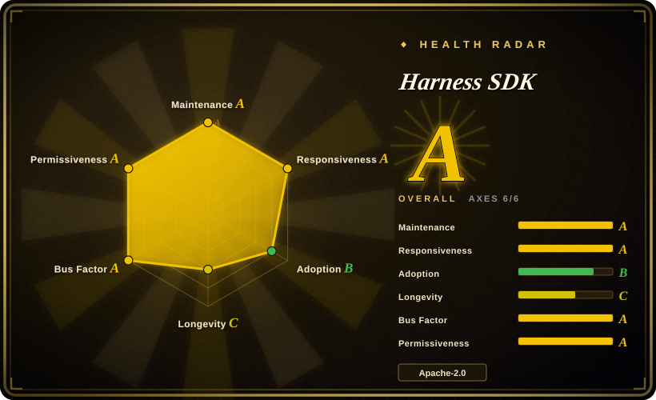
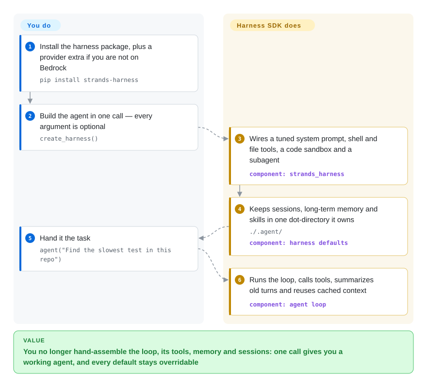

# Harness SDK

Your agent starts as forty lines of glue — call the model, parse the tool-call JSON, trim the history before the request errors out, remember what the user told you yesterday — and none of that is the product you set out to build. The Strands harness hands you a working agent in one call and leaves every default overridable.

## When to use

You are shipping a product that calls a model and uses tools, and you have already written the transport-dispatch-persist loop once. It went like this: the model asked for two tools in one turn, your parser handled one, and the run stopped mid-task; a few weeks later the transcript outgrew the window and every request started failing on context length. You want that layer to be someone else's maintained code, and you do not want to buy a hosted platform to get it.

Reach for the Strands harness when you want the loop and the scaffolding around it pre-assembled rather than minimal. One `create_harness()` call gives you a tuned system prompt (explore before editing, confirm before anything irreversible, verify before declaring done), shell and file tools, a web fetch that answers with a summary instead of dumping a page into context, a sandbox where the model writes code that chains its own tools, a subagent for delegated work, sessions on disk, long-term memory, and automatic context summarization. Choose it over [smolagents](smolagents.md) when you want those pieces configured instead of assembled by you, over [Pydantic AI](pydantic-ai.md) when the same library has to exist in TypeScript as well as Python, and over [LangGraph](langgraph.md) when you would rather not maintain a graph at all. The price of the defaults is that control flow belongs to the model — there is no state machine to inspect, and a compliance reviewer gets a trace, not a diagram.

## Q&A

**Can I use this on its own, or does it need other projects?**
On its own. `pip install strands-harness` pulls everything, the SDK included, and the built-in tools (files, shell, web, subagent, code sandbox) ship inside the package. The only thing you must supply is a model: Amazon Bedrock by default, so an AWS account with model access enabled, or another provider's extra plus an API key.

**Is it bound to a model?**
Not by architecture, only by default. The model layer is swappable across Bedrock, Anthropic, OpenAI, Gemini, Ollama and LiteLLM, or any `Model` instance you construct. What is nailed down is the default — Claude Opus 4.8 on Bedrock — and where the docs put their examples.

**Where are the extension points — hooks and skills like everything else?**
Yes, and a few more. The lower SDK tree carries hooks, plugins, interventions, multiagent, sandbox, session, memory, models and telemetry modules; the harness above it exposes one knob per `create_harness()` argument and returns a plain `strands.Agent` you keep editing afterwards. Two of those are rare next to the peers: a tool-call approval gate (per-call approval, an LLM risk classifier, or a Cedar policy file, inherited by subagents so a delegate cannot bypass it) and swappable context, session and memory managers.

**How is it different from Pydantic AI or LangGraph?**
It bets on better defaults, not a better abstraction. The same-shaped projects are OpenAI Agents SDK and smolagents' CodeAgent; LangGraph is a different tool (an explicit graph you maintain), not a substitute for what `create_harness()` does.

**Is it the same kind of thing as [Pi](../../coding-agents/terminal-agents/pi.md)?**
Same kind, opposite center of gravity. Both projects call themselves a harness; Pi's center of gravity is a finished terminal coding agent, the Strands harness is a library you embed. Pi's reusable library layer is `pi-agent-core`, and that layer — not the CLI — is what shares a cell with Strands.

**Should I worry that it is young?**
It has no Lindy advantage: about 16 months old, and the assembled harness layer is still 0.x while the SDK under it is at 1.57. Activity is high, not proven.

## How it works

`strands_harness` is a thin configuration layer over the SDK that lives in the same repository. `create_harness()` resolves each of its named arguments — model, tools, MCP servers, memory, sessions, skills, approval policy — into concrete SDK objects, then hands back a normal `strands.Agent`; anything the harness does not name passes straight through to `Agent`, and your explicit value always wins over the default. What it takes over: the system prompt, the default tool set, where state is written (`./.agent/sessions`, `./.agent/memory`, `./.agent/skills`), and the bookkeeping that keeps a long conversation inside the window — old turns get summarized and bulky tool results move out to storage behind a short reference. What stays yours: provider credentials, the process that hosts the agent, and every decision about what it may do without asking. The return value being an ordinary agent is the point — it is a starting configuration that already compiles, not a framework that owns your program. There is a second on-ramp, a `strands` CLI that wraps the same agent for terminal use, but the library path is the one that reaches the core value.

<!-- flow-steps:begin (generated from flows/harness-sdk.json by tools/flow_card.py — do not edit) -->

Text version of the flow

1. **You**: Install the harness package, plus a provider extra if you are not on Bedrock — `pip install strands-harness`
2. **You**: Build the agent in one call — every argument is optional — `create_harness()`
3. **Harness SDK**: Wires a tuned system prompt, shell and file tools, a code sandbox and a subagent — component: `strands_harness`
4. **Harness SDK**: Keeps sessions, long-term memory and skills in one dot-directory it owns — `./.agent/` — component: `harness defaults`
5. **You**: Hand it the task — `agent("Find the slowest test in this repo and explain why it's slow")`
6. **Harness SDK**: Runs the loop, calls tools, summarizes old turns and reuses cached context — component: `agent loop`

**Value**: You no longer hand-assemble the loop, its tools, memory and sessions: one call gives you a working agent, and every default stays overridable

<!-- flow-steps:end -->

## When NOT to use

- **You need a hosted runtime with a control plane.** The Strands harness runs inside your process: sessions go to disk, and concurrency and process lifetime are your problem. If what you want is someone else to operate the agent runtime, that is a hosted service (AWS Bedrock AgentCore and similar), not a project in this index, and it belongs in a different evaluation.
- **You need deterministic, inspectable control flow across many steps.** The model decides what happens next, so there is no graph to diff or review. Use [LangGraph](langgraph.md) instead of the Strands harness, because an explicit state machine is the artifact you need when a reviewer must approve the path a request takes.
- **Your compliance surface forbids the model's own queries leaving your environment.** On Bedrock Converse and similar, web search is off by default; turning it on routes through Exa, a third party that receives every search query the model writes. Use a provider with native search, or drop the tool, instead of shipping the Bedrock default, because the egress is the model's, not yours to filter.
- **You need web search on Bedrock and will not touch IAM.** Bedrock Web Search needs the `bedrock-websearch` actions; without them the request succeeds and each search fails, which is the worst failure shape to debug. Use [OpenAI Agents SDK](openai-agents-sdk.md) or another provider whose search needs no extra IAM, or grant the actions first.
- **You need API stability on the assembled layer.** The SDK is past 1.0, the harness is not, and its only published compatibility note enumerates what the SDK will *not* treat as breaking. Pick [Microsoft Agent Framework](agent-framework.md) or [LangGraph](langgraph.md) if a version guarantee on the whole stack is a purchase condition.
- **You want a batteries-included terminal coding agent.** The `strands` CLI chats with a harness agent; it is not a coding agent with a keyboard-driven TUI. Use [Pi](../../coding-agents/terminal-agents/pi.md) or [OpenCode](../../coding-agents/terminal-agents/opencode.md) instead, because pair-programming in a terminal is their whole product.

## Comparison

| Alternative | In index | Our verdict | Tradeoff |
|---|---|---|---|
| [OpenAI Agents SDK](openai-agents-sdk.md) | ✅ | Choose OpenAI Agents SDK when you are happy wiring tools, handoffs and guardrails yourself and want the vendor's own runtime; choose Harness SDK when you want a benchmarked default agent you then override. | Both are MIT/Apache-permissive loops in Python with a TypeScript sibling; Strands ships the assembled layer, OpenAI's stays closer to primitives and to its own models. |
| [smolagents](smolagents.md) | ✅ | Choose smolagents when the loop should stay small enough to read in one sitting, ideally with a code-writing agent at the centre; choose Harness SDK when the surrounding machinery (memory, sessions, context folding, approvals) is the part you do not want to write. | smolagents is the cheaper mental model and integrates through LiteLLM; Strands is heavier and Bedrock-flavoured by default. |
| [Pydantic AI](pydantic-ai.md) | ✅ | Choose Pydantic AI when static typing and dependency injection are the constraints your codebase already lives by, in Python only; choose Harness SDK when you need the same library in TypeScript, or a pre-assembled agent rather than a typed loop. | Pydantic AI trades breadth for type safety and reached a 1.0 stability promise; Strands trades some type discipline for two first-party languages and batteries. |
| [LangGraph](langgraph.md) | ✅ | Choose LangGraph when the workflow itself is the artifact you must control and version; choose Harness SDK when a model-driven loop with tool use is enough and a graph would be overhead. | LangGraph buys you durable, explicit orchestration and pays for it in concepts; Strands buys you speed to a working agent and pays in control. |
| [Microsoft Agent Framework](agent-framework.md) | ✅ | Choose Microsoft Agent Framework when you are on .NET or already inside Microsoft's agent stack and want typed graph workflows; choose Harness SDK when you are Python/TypeScript-first and want the model to own the loop. | Microsoft's is the vendor-lineage successor to AutoGen plus Semantic Kernel; Strands is single-vendor too, but AWS-shaped and thinner above the loop. |

## Tech stack

- **Python SDK** (`strands-py/`, hatch, `requires-python >= 3.10`) and a **TypeScript SDK** (`strands-ts/`, npm workspaces, Node.js 22+) in one repository, plus an Astro/Starlight docs site under `site/`.
- **Harness packages:** `strands-harness` on PyPI, `@strands-agents/harness` on npm, `@strands-agents/cli` for the terminal, sitting on top of `strands-agents` / `@strands-agents/sdk`.
- **Harness runtime dependencies:** `strands-agents[otel]`, `pydantic`, and `pydantic-monty` — the last is the sandbox `programmatic_tool_caller` runs model-authored code in, pinned to an exact version while it is pre-1.0.
- **Observability is OpenTelemetry**, switched on through the standard `OTEL_TRACES_EXPORTER` environment variable rather than code.
- **Governance lives in the repo:** `team/TENETS.md`, `team/DECISIONS.md`, `team/COMPATIBILITY.md` and numbered design proposals under `team/designs/`.

## Dependencies

- **Python 3.10+** for the Python path, or **Node.js 22+** for the TypeScript one.
- **A model provider with credentials.** Bedrock is the default, so AWS credentials (`aws configure`, `AWS_ACCESS_KEY_ID`/`AWS_SECRET_ACCESS_KEY`, IAM roles, or a Bedrock API key in `AWS_BEARER_TOKEN_BEDROCK`) plus model access enabled for the specific models in the Bedrock console. Other providers need their extra installed and their own API key.
- **Optional:** an `mcpServers` config when you want MCP tools; `EXA_API_KEY` to lift Exa's rate limit when web search falls back to it; `strands-agents[cedar]` when an approval policy is expressed as a Cedar file.
- **Nothing else to run.** No database, no queue, no sidecar — unless you choose a non-local session backend yourself.

## Ops difficulty

**Low to embed, medium to operate.** Installation is one pip or npm line, and there is no service to keep up. What you then own is the process and its state: session files and memory markdown live under `./.agent/` by default, so multi-host deployments mean supplying your own `SessionManager`, and a service that owns the agent's lifecycle should flush memory at shutdown so the last turns are not lost. Telemetry costs nothing until `OTEL_TRACES_EXPORTER` is set. Tool-call approvals use the SDK's interrupt/resume, so an async approval survives a restart when you pass a stable session id — that is a design decision you make, not a default you inherit.

## Health & viability

- **Maintenance:** Grade A — pushed within the last day, 13 of 13 active weeks, releases landing daily (`python/v1.57.0`, `typescript/v1.19.0`, `harness-python/v0.1.2` on 2026-09-22).
- **Responsiveness:** Grade A — median time to first response of 9.9h across 22 qualifying issues, which reads as a maintainer team working the queue rather than triaging it.
- **Adoption:** Grade B — measured on 2026-09-23, `@strands-agents/sdk` records 1,686,373 npm downloads in the last month while the new harness packages were at 128 (npm) and 897 (PyPI): ~7.6k stars and ~1.2k forks after 16 months, but the assembled layer has almost no users yet.
- **Longevity:** Grade C — 497 days old as of 2026-09-23, and all of it recent. No Lindy advantage: a fast release cadence, not a durable track record.
- **Governance:** Grade A — AWS-owned (`authors = AWS <opensource@amazon.com>`, a Strands team at Amazon Web Services) and genuinely distributed: 92 active maintainers over 12 months, top-1 contributor share 12.8% and top-3 29.3%, which is a team rather than a bus factor of one.
- **Risk / License:** Grade A — Apache-2.0, no relicense in 36 months. The risk here is churn, not the license: the repository was renamed from `strands-agents/sdk-python` to `harness-sdk`, sibling repos (`sdk-typescript`, `docs`, `mcp-server`, `agent-builder`) are archived as everything consolidates into the monorepo, the open queue sits at 518 issues and 286 pull requests (2026-09-23), and the harness layer carries no stability promise yet.

## Caveats (unverified)

- [未验证] Whether the 0.x harness carries any breaking-change policy of its own; `team/COMPATIBILITY.md` only enumerates what the SDK will not treat as breaking.
- [未验证] Whether there is an official relationship between this SDK and AWS Bedrock AgentCore beyond both being AWS properties.
- [推断] The low watcher count relative to stars (51 subscribers against 7,593 stars on 2026-09-23) may reflect topic-page exposure rather than a small real user base.
- [推断] The 286 open pull requests may indicate a review bottleneck; merge latency was not measured.
- [推断] PyPI and npm download counts for the harness packages mostly measure how recently they shipped, not adoption.
- [未验证] The exact date the repository was renamed from `sdk-python` to `harness-sdk`; only the redirect was observed.
- [未验证] Shutdown behaviour for long-term memory: the README says a short run can end before the latest turns are extracted and tells lifecycle owners to flush, but the implementation was not read.
- [未验证] Whether `programmatic_tool_caller`'s `pydantic-monty` sandbox is a security boundary or only an execution boundary; the dependency is described as where model-authored code runs, not as isolation.
