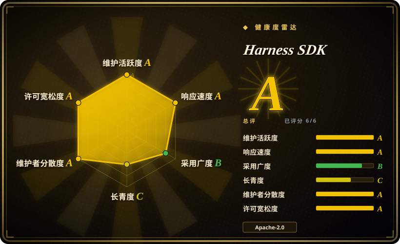
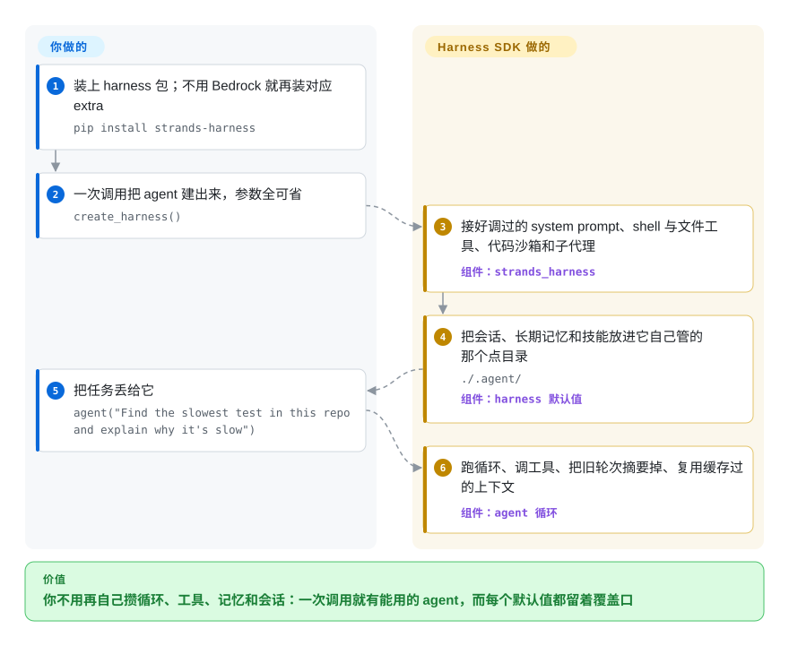

# Harness SDK

你自己写的 agent 一开始是四十行胶水代码——调模型、解析工具调用的 JSON、在请求报错之前把历史裁短、记住用户昨天说过什么——这些没一行是你真正要做的产品。Strands harness 一次调用就交给你一个能用的 agent，而且每个默认值都留着覆盖口。

## 何时使用

你在做一个要调模型、要用工具的产品，而“传输—分发—持久化”这套循环你已经手写过一遍了。当时的样子是这样的：模型一次要调两个工具，你的解析器只处理了一个，任务跑到一半就断了；几周后对话历史撑爆窗口，每个请求都开始报上下文超长。你想让这一层变成别人在维护的代码，又不想为此买一个托管平台。

想要循环和它周边的脚手架一次到位、而不是从最小件自己拼，就选 Strands harness。一次 `create_harness()` 给你调好的 system prompt（先探查再改、不可逆操作先确认、完工前先验证）、shell 与文件工具、把网页压成答案而不是把整页塞进上下文的 web 抓取、一个让模型写代码去串联自己工具的沙箱、一个可以派活的子代理、落盘的会话、长期记忆、以及自动的上下文摘要。相比 [smolagents](smolagents.zh.md)，它选的是“这些件都配好”而不是“尽量小”；相比 [Pydantic AI](pydantic-ai.zh.md)，当同一套库还得在 TypeScript 里也存在时选它；相比 [LangGraph](langgraph.zh.md)，当你压根不想维护一张图时选它。默认值的代价是控制流归模型：没有状态机可查，给合规同学看的是一份 trace，不是一张图。

## 快问快答

**能单独用吗，还是要配别的项目？**
能单独用。`pip install strands-harness` 会把 SDK 一起装上，内置工具（文件、shell、web、子代理、代码沙箱）都在包里。唯一必须自己出的是模型：默认走 Amazon Bedrock，所以要有开通了模型访问的 AWS 账号，或者换别家——装对应 extra 加一把 API key。

**它是绑死某个模型的框架吗？**
架构上不绑，只绑默认值。模型层可以在 Bedrock、Anthropic、OpenAI、Gemini、Ollama、LiteLLM 之间换，也可以传自己构造的 `Model` 实例。钉住的是默认那一个（Bedrock 上的 Claude Opus 4.8），以及文档把例子都写在哪一侧。

**扩展点在哪，也是 hooks 和 skills 那一套吗？**
是，而且更多。下面 SDK 的源码树里有 hooks、plugins、interventions、multiagent、sandbox、session、memory、models、telemetry；上面的 harness 把 `create_harness()` 每个参数做成一个旋钮，返回的还是普通 `strands.Agent`，构造完照样能改。其中两样在同层同类里少见：工具调用的审批门（逐次审批、LLM 风险分类、或 Cedar 策略文件三选一，子代理会继承策略、绕不过去），以及可替换的上下文、会话、记忆管理器。

**它和 Pydantic AI、LangGraph 比特殊在哪？**
它赌的是更好的默认值，不是更好的抽象。同形的是 OpenAI Agents SDK 和 smolagents 的 CodeAgent；LangGraph 是另一种工具（一张你自己维护的显式图），不是 `create_harness()` 这件事的替代品。

**它和 [Pi](../../coding-agents/terminal-agents/pi.zh.md) 是一类东西吗？**
同类，但重心相反。两个项目都自称 harness；Pi 的重心是成品的终端编码 agent，Strands harness 的重心是给你嵌进产品的库。Pi 能单独复用的库层是 `pi-agent-core`，跟 Strands 抢同一格的正是那一层，不是它的 CLI。

**它这么年轻，要担心吗？**
它没有 Lindy 优势：约 16 个月，而且组装层还在 0.x，底下 SDK 已经 1.57。活跃度高，但不等于久经考验。

## 怎么用起来

`strands_harness` 是薄薄一层配置，盖在同一个仓库里的 SDK 上。`create_harness()` 把它点过名的每个参数——模型、工具、MCP server、记忆、会话、技能、审批策略——解析成具体的 SDK 对象，然后交回一个普通的 `strands.Agent`；harness 没点名的关键字会直通 `Agent`，而且你显式给的值永远压过默认值。它接管的是：system prompt、默认工具集、状态写在哪（`./.agent/sessions`、`./.agent/memory`、`./.agent/skills`），以及让长对话留在窗口内那套记账——旧的轮次被摘要掉，体积大的工具结果搬去存储、只在上下文里留一个短引用。留在你手里的是：供应商凭证、承载它的进程、以及“什么操作可以不让它问就做”的每一个决定。返回值是个普通 agent 才是重点——它是一份已经能编译的起步配置，不是一个接管你程序的框架。还有第二条入口：`strands` 这个 CLI 把同一个 agent 包成终端可用的形态，但真正通向核心价值的还是库这条路。

<!-- flow-steps:begin (generated from flows/harness-sdk.json by tools/flow_card.py — do not edit) -->

流程文字版

1. **你**：装上 harness 包；不用 Bedrock 就再装对应 extra — `pip install strands-harness`
2. **你**：一次调用把 agent 建出来，参数全可省 — `create_harness()`
3. **Harness SDK**：接好调过的 system prompt、shell 与文件工具、代码沙箱和子代理 — 组件：`strands_harness`
4. **Harness SDK**：把会话、长期记忆和技能放进它自己管的那个点目录 — `./.agent/` — 组件：`harness 默认值`
5. **你**：把任务丢给它 — `agent("Find the slowest test in this repo and explain why it's slow")`
6. **Harness SDK**：跑循环、调工具、把旧轮次摘要掉、复用缓存过的上下文 — 组件：`agent 循环`

**价值**：你不用再自己攒循环、工具、记忆和会话：一次调用就有能用的 agent，而每个默认值都留着覆盖口

<!-- flow-steps:end -->

## 何时不用

- **你需要一个带控制面的托管运行时。** Strands harness 跑在你的进程里：会话落盘、并发和进程生命周期都归你管。如果你要的是“有人替我运维 agent 运行时”，那是托管服务（AWS Bedrock AgentCore 一类），不是本索引里的项目，应该在另一场评估里比。
- **你需要多步之间可审查、确定性的控制流。** 下一步做什么由模型决定，所以没有图可以 diff 或评审。这时候用 [LangGraph](langgraph.zh.md)，因为当“每一步走的路径都要被审批”时，那张显式状态机才是你要的交付物。
- **合规面不允许模型自己写的查询离开你的环境。** 在 Bedrock Converse 这类模型上，web 搜索默认是关的；打开就走 Exa 这个第三方，模型写的每一条搜索 query 都会发给它。这时候要么换成有原生搜索的供应商，要么干脆去掉这个工具，别走 Bedrock 那条默认路——出网的开关在模型那边，不在你手上。
- **你要在 Bedrock 上用 web 搜索，又不打算碰 IAM。** Bedrock Web Search 需要 `bedrock-websearch` 权限动作；没有它们，请求本身成功、每次搜索都失败，这是最难查的一种失败形态。这时用 [OpenAI Agents SDK](openai-agents-sdk.zh.md) 或别的不需要额外 IAM 的供应商，或者先把权限授好。
- **你需要组装层也有 API 稳定性承诺。** SDK 过了 1.0，harness 没有，而且它唯一公开的兼容性说明只列举了 SDK“不会”当成破坏性变更的几类改动。如果“整栈的版本保证”是采购条件，选 [Microsoft Agent Framework](agent-framework.zh.md) 或 [LangGraph](langgraph.zh.md)。
- **你要的是一个开箱即用的终端编码 agent。** `strands` CLI 是拿 harness agent 聊天，不是带键位设计 TUI 的编码 agent。这时候用 [Pi](../../coding-agents/terminal-agents/pi.zh.md) 或 [OpenCode](../../coding-agents/terminal-agents/opencode.zh.md)，因为在终端里结对编程就是它们的产品本身。

## 横向对比

| 替代品 | 是否收录 | 我们的评价 | 取舍 |
|---|---|---|---|
| [OpenAI Agents SDK](openai-agents-sdk.zh.md) | 已收录 | 你自己愿意把工具、handoff、guardrail 一个个接起来、并且想要厂商自家运行时，选 OpenAI Agents SDK；想要一个已经调过、之后随便覆盖的默认 agent，选 Harness SDK。 | 两者都是 Python 生态里宽松许可的循环，都配了 TypeScript 兄弟；Strands 把组装层一起给了，OpenAI 的更靠近原语，也更靠近自家模型。 |
| [smolagents](smolagents.zh.md) | 已收录 | 循环要小到能一口气读完、最好以写代码的 agent 为中心，选 smolagents；不想自己写记忆、会话、上下文折叠、审批这一整套周边机械，选 Harness SDK。 | smolagents 的心智模型更便宜、通过 LiteLLM 接各家；Strands 更重，默认还带着 Bedrock 味。 |
| [Pydantic AI](pydantic-ai.zh.md) | 已收录 | 静态类型和依赖注入是你代码库本来就遵守的约束、而且只用 Python，选 Pydantic AI；同一套库必须在 TypeScript 里也有、或者要的是现成 agent 而不是一个带类型的循环，选 Harness SDK。 | Pydantic AI 用广度换类型安全，且已给出 1.0 的稳定承诺；Strands 让出一点类型纪律，换来两门第一方语言和一堆电池。 |
| [LangGraph](langgraph.zh.md) | 已收录 | 工作流本身就是你要控制和版本化的交付物，选 LangGraph；模型驱动的循环加工具调用已经够用、再画一张图只是负担，选 Harness SDK。 | LangGraph 买到的是显式、可持久化的编排，代价是一堆概念；Strands 买到的是最快跑起来一个 agent，代价是控制力。 |
| [Microsoft Agent Framework](agent-framework.zh.md) | 已收录 | 你在 .NET 上、或者本来就在微软的 agent 栈里、要带类型的图工作流，选 Microsoft Agent Framework；你是 Python/TypeScript 优先、愿意让模型掌握循环，选 Harness SDK。 | 微软那套是 AutoGen 加 Semantic Kernel 的正统继任；Strands 同样是单一厂商，但偏 AWS，循环之上的层更薄。 |

## 技术栈

- **Python SDK**（`strands-py/`，hatch，`requires-python >= 3.10`）和 **TypeScript SDK**（`strands-ts/`，npm workspaces，Node.js 22 以上）在同一个仓库里，另有 Astro/Starlight 的文档站放在 `site/`。
- **harness 侧的包：** PyPI 上的 `strands-harness`、npm 上的 `@strands-agents/harness`、终端用的 `@strands-agents/cli`，都压在 `strands-agents` / `@strands-agents/sdk` 之上。
- **harness 的运行时依赖：** `strands-agents[otel]`、`pydantic`，以及 `pydantic-monty`——最后这个是 `programmatic_tool_caller` 跑模型写的代码用的沙箱，因为还在 pre-1.0 所以版本钉死。
- **可观测性走 OpenTelemetry**，靠标准的 `OTEL_TRACES_EXPORTER` 环境变量打开，不写代码。
- **治理文档就在仓库里：** `team/TENETS.md`、`team/DECISIONS.md`、`team/COMPATIBILITY.md`，以及 `team/designs/` 下编号的 RFC 式设计提案。

## 依赖

- **Python 3.10+**，或者走 TypeScript 侧的 **Node.js 22+**。
- **一个带凭证的模型供应商。** 默认 Bedrock，所以要有 AWS 凭证（`aws configure`、`AWS_ACCESS_KEY_ID`/`AWS_SECRET_ACCESS_KEY`、IAM role，或放在 `AWS_BEARER_TOKEN_BEDROCK` 里的 Bedrock API key），并且要在 Bedrock 控制台为具体模型开通访问。换别家则装对应 extra、配自己的 API key。
- **可选项：** 想要 MCP 工具就准备一份 `mcpServers` 配置；web 搜索回落到 Exa 时用 `EXA_API_KEY` 提高限额；审批策略写成 Cedar 文件时需要 `strands-agents[cedar]`。
- **没有别的要跑的东西。** 不要数据库、不要队列、不要 sidecar——除非你自己选了非本地的会话后端。

## 运维难度

**嵌入成本低，运营成本中等。** 安装是一行 pip 或 npm，没有服务要盯。接下来归你的是进程和它的状态：会话文件和记忆 markdown 默认落在 `./.agent/` 下，所以多机部署意味着要自己提供 `SessionManager`；自己掌管 agent 生命周期的服务，应该在退出时 flush 记忆，否则最后几轮会丢。遥测在没设 `OTEL_TRACES_EXPORTER` 之前不花成本。工具审批走 SDK 的中断/恢复，传了稳定的 session id 之后，异步审批能挺过进程重启——这是你做的设计决定，不是继承来的默认。

## 健康度与可持续性

- **维护：** 评级 A——一天内还有推送，13 周里 13 周活跃，发版按天算（2026-09-22 当天发布 `python/v1.57.0`、`typescript/v1.19.0`、`harness-python/v0.1.2`）。
- **响应：** 评级 A——22 个有效 issue 的首响应中位数 9.9 小时，读起来像团队真的在清队列，而不是走形式分诊。
- **采用：** 评级 B——2026-09-23 实测，`@strands-agents/sdk` 最近一个月 npm 下载 1,686,373 次；而新的 harness 包同期分别是 128 次（npm）和 897 次（PyPI）。16 个月约 7,600 星、约 1,200 fork，但组装层几乎没有用户。
- **寿命：** 评级 C——到 2026-09-23 为 497 天，而且全在近期。没有 Lindy 优势：这是发版快，不是被时间检验过。
- **治理：** 评级 A——AWS 拥有（`authors = AWS <opensource@amazon.com>`，Amazon Web Services 的 Strands 团队），而且确实分散：12 个月里 92 位活跃维护者，第一贡献者占 12.8%、前三占 29.3%，是一个团队而不是单点 bus factor。
- **风险与许可：** 评级 A——Apache-2.0，36 个月内没有换许可。这里的风险是变动而不是许可：仓库从 `strands-agents/sdk-python` 改名成 `harness-sdk`，兄弟仓库（`sdk-typescript`、`docs`、`mcp-server`、`agent-builder`）都已归档、一切在往单体仓收拢，未结队列 2026-09-23 有 518 个 issue 与 286 个 PR，而 harness 这一层还没有稳定性承诺。

## 存疑（未验证）

- [未验证] 0.x 的 harness 自己是否有破坏性变更政策；`team/COMPATIBILITY.md` 只列举了 SDK 不当成破坏性变更的那几类。
- [未验证] 这套 SDK 与 AWS Bedrock AgentCore 之间是否存在官方关系，而不只是同属 AWS。
- [推断] 相对星数偏低的关注者数（2026-09-23 为 51 个订阅者对 7,593 星）可能来自话题页曝光，而不是真实用户少。
- [推断] 286 个未合并 PR 可能意味着评审是瓶颈；合并延迟没有实测。
- [推断] harness 各包的 PyPI 和 npm 下载量主要反映发布时间有多近，不反映采用率。
- [未验证] 仓库从 `sdk-python` 改名为 `harness-sdk` 的确切时间；只观察到重定向。
- [未验证] 长期记忆在退出时的落盘行为：README 说短会话可能在最近几轮被抽取之前就结束、并提示生命周期所有者去 flush，但实现没有读。
- [未验证] `programmatic_tool_caller` 的 `pydantic-monty` 沙箱是安全边界还是仅执行边界；依赖注释只说它是模型写的代码运行的地方，没说它是隔离。
