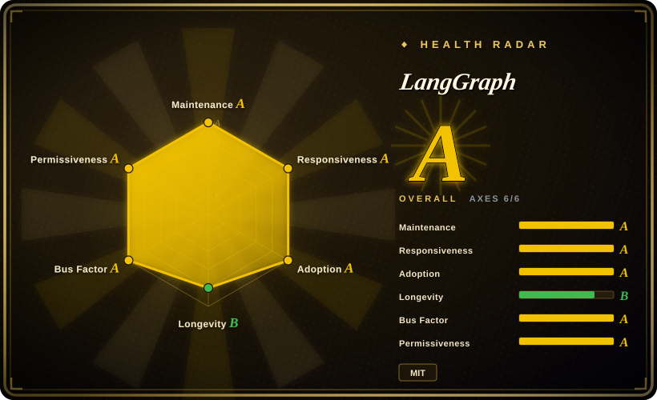
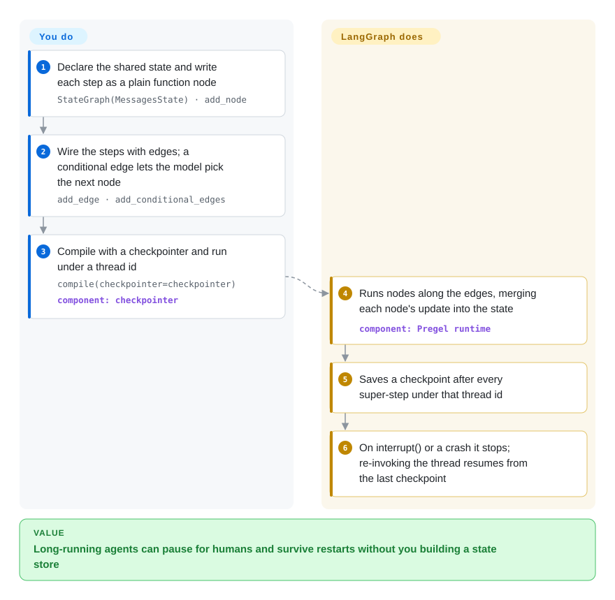

# LangGraph

Your agent is a `while` loop around model calls, and the day it has to wait two hours for a human to approve a refund — or survive a pod restart halfway through a 40-step task — the loop has nowhere to keep its place. LangGraph makes the agent an explicit graph of steps and saves its state after every step, so a run can pause, crash or be edited and then resume exactly where it stopped.

## When to use

You are building an agent that does real work over minutes or days: a support agent that drafts a refund and must wait for a manager's yes, a research agent that runs dozens of tool calls, a back-office flow where some steps must be plain code (validate, look up, write to the database) and only a few are left to the model. Your prototype loop works until someone asks "what happens if the server restarts between step 12 and step 13?" or "can a reviewer edit the draft before it is sent?" — and the honest answer is that the state lives in a Python variable. You reach for LangGraph because it turns that loop into a `StateGraph`: each step is a function node, the transitions are edges you can read (some fixed, some chosen by the model), and a **checkpointer** — a component that writes the graph's state to memory, SQLite or Postgres after every step — lets any run pause with `interrupt()` and resume later under the same `thread_id`.

Pick it over [CrewAI](crewai.md) when you need every transition to be explicit and auditable rather than steered by role prompts; over [OpenAI Agents SDK](openai-agents-sdk.md) or [Pydantic AI](pydantic-ai.md) when durable, resumable multi-step state is the requirement rather than a single agent loop. It is the low-level layer: LangChain's higher-level agent API and the Deep Agents harness are both built on it, so you can start there and drop down when you need control.

## How it works

LangGraph is a runtime for state machines whose steps may call a model. You declare a **state** (a typed dict or Pydantic model — for chat agents usually a message list), write each step as an ordinary Python function that reads the state and returns an update, and connect the steps with edges; a conditional edge is a function that looks at the state and names the next node, which is how "let the model decide whether to call a tool" is expressed. You then `compile()` the graph, optionally with a checkpointer. **LangGraph does the execution for you**: it runs nodes in "super-steps" (rounds in which every ready node runs, borrowed from Google's Pregel model), merges each node's update into the shared state, saves a checkpoint after each round, streams progress, and, when a node calls `interrupt()`, stops and waits until you invoke the same thread again with `Command(resume=...)`. **What stays yours**: the prompts, the model and tool calls inside each node, the graph shape, and the database behind the checkpointer — LangGraph does not abstract prompts or pick an architecture. Think of it as a board game: you design the board and the rules for each square, LangGraph moves the piece and photographs the board after every move so the game can resume from any photo.

<!-- flow-steps:begin (generated from flows/langgraph.json by tools/flow_card.py — do not edit) -->

Text version of the flow

1. **You**: Declare the shared state and write each step as a plain function node — `StateGraph(MessagesState) · add_node`
2. **You**: Wire the steps with edges; a conditional edge lets the model pick the next node — `add_edge · add_conditional_edges`
3. **You**: Compile with a checkpointer and run under a thread id — `compile(checkpointer=checkpointer)` — component: `checkpointer`
4. **LangGraph**: Runs nodes along the edges, merging each node's update into the state — component: `Pregel runtime`
5. **LangGraph**: Saves a checkpoint after every super-step under that thread id
6. **LangGraph**: On interrupt() or a crash it stops; re-invoking the thread resumes from the last checkpoint

**Value**: Long-running agents can pause for humans and survive restarts without you building a state store

<!-- flow-steps:end -->

## When NOT to use

- **You just want a working tool-calling agent today.** The LangGraph docs themselves point newcomers to a higher-level API, because LangGraph makes you assemble the loop node by node. Use [LangChain](../../workflow-builders/langchain.md)'s agent API (built on LangGraph) or [Pydantic AI](pydantic-ai.md) instead, and drop to LangGraph only when you need custom control flow or durability.
- **You would rather describe a team than draw a graph.** If the job maps naturally to roles and a task list, use [CrewAI](crewai.md) instead, because you declare agents and tasks and it wires the hand-offs; the price is less control over each transition.
- **You need a production server but cannot license LangSmith.** The MIT library gives you graphs and checkpointers, not a hosted API, task queue or UI. The official self-hosted Agent Server needs a LangSmith license key, Postgres, Redis and outbound access to `beacon.langchain.com` for license checks unless air-gapped. Wrap the graph in your own service with `PostgresSaver`, or try Aegra (not indexed), an Apache-2.0 FastAPI + Postgres replacement for that server.
- **You want no LangChain packages in your dependency tree.** `langgraph` 1.2.14 depends on `langchain-core`, `langgraph-checkpoint`, `langgraph-sdk` and `langgraph-prebuilt`, and most docs examples use LangChain model wrappers. Use [Pydantic AI](pydantic-ai.md) or [smolagents](smolagents.md) instead when a small dependency surface with no LangChain packages matters more than LangGraph's runtime features.
- **Non-developers must build and edit the flows.** LangGraph is code-only (Studio visualises and debugs graphs, it does not author them). Use [Langflow](../../workflow-builders/langflow.md) or [Dify](../../workflow-builders/dify.md) instead.
- **The long-running process is mostly not about a model.** For multi-day business workflows across services with retries, timers and versioned deploys, use [Temporal](../../../workflow-orchestration/temporal.md) instead, because its durable execution is built for any code, and call models from activities; LangGraph's checkpointing is designed around agent state.
- **Your platform is .NET.** LangGraph ships Python and JavaScript/TypeScript (LangGraph.js). Use [Microsoft Agent Framework](agent-framework.md) instead for .NET parity.

## Comparison

| Alternative | In index | Our verdict | Tradeoff |
| --- | --- | --- | --- |
| [CrewAI](crewai.md) | ✅ | When the work maps onto roles and a task list and speed to a working team matters most, pick CrewAI; pick LangGraph when each transition must be explicit, resumable and debuggable. | CrewAI is faster to describe but steers hand-offs through prompts; LangGraph makes you draw every edge and in return gives checkpoints and time-travel debugging. |
| [Microsoft Agent Framework](agent-framework.md) | ✅ | In a .NET or Azure / Foundry shop, or when migrating from AutoGen / Semantic Kernel, pick Microsoft Agent Framework; pick LangGraph for the largest Python/JS ecosystem and the most mature checkpointing. | MAF starts agent-first and adds typed graphs later, with many beta integrations; LangGraph is graph-first from step one with a bigger third-party surface. |
| [OpenAI Agents SDK](openai-agents-sdk.md) | ✅ | For a light agent with hand-offs and guardrails on OpenAI models, pick the OpenAI Agents SDK; pick LangGraph when runs must survive restarts and pause for humans across hours. | The OpenAI SDK has fewer primitives and less to learn; LangGraph has more machinery but owns persistence and human-in-the-loop natively. |
| [Pydantic AI](pydantic-ai.md) | ✅ | When the core need is one type-safe agent with validated outputs and minimal dependencies, pick Pydantic AI; pick LangGraph when orchestration and durable state are the hard part. | Pydantic AI is smaller and stricter about types; LangGraph brings LangChain-core dependencies and more concepts, but a stronger runtime. |
| [Temporal](../../../workflow-orchestration/temporal.md) | ✅ | For durable business workflows spanning services, where the model is one activity among many, pick Temporal; pick LangGraph when the agent's own reasoning loop is the thing that must pause and resume. | Temporal runs a server cluster and is model-agnostic; LangGraph is an in-process library whose state model is built around agent messages. |

## Tech stack

- **Language**: Python ≥3.10 (classifiers list 3.10–3.13); a separate JavaScript/TypeScript implementation lives in `langchain-ai/langgraphjs`.
- **Monorepo packages** (`libs/`): `langgraph` (graph runtime), `langgraph-prebuilt` (ready-made agent and tool nodes), `langgraph-checkpoint` plus `-sqlite` / `-postgres` backends, `langgraph-sdk` (Python client for Agent Server), `langgraph-cli` (local dev server and build tooling).
- **Execution model**: Pregel-style super-steps over a typed shared state; Graph API (`StateGraph`) and a Functional API (decorated functions) over the same runtime.
- **Core dependencies**: `langchain-core`, `pydantic`, `xxhash`.

## Dependencies

- **A model provider** of your choice, usually through a LangChain chat-model integration, plus API keys.
- **A checkpointer store** for anything beyond a demo: `InMemorySaver` loses state on restart; use `SqliteSaver` for local work or `PostgresSaver` (Postgres) in production.
- **Optional, commercial**: LangSmith for tracing (`LANGSMITH_TRACING=true` + API key) and LangSmith Deployment / self-hosted Agent Server (license key, Postgres, Redis) for a managed API.
- **Optional**: `langgraph-cli[inmem]` for `langgraph dev`, a local in-memory server that Studio connects to.

## Ops difficulty

**Low as a library, medium to high as a service.** Embedded in your own app it is a pip dependency plus whichever database backs the checkpointer — Postgres migrations via `checkpointer.setup()`, thread-ID hygiene (the docs warn about over-long IDs in Postgres), and checkpoint growth over time. Turning graphs into a multi-tenant service with background runs, streaming and cron is where the weight lands: either you build that layer yourself or run the licensed Agent Server with Postgres and Redis. Frequent minor releases (1.2.12 → 1.2.14 in two weeks) mean pinning and reading changelogs.

## Health & viability

- **Maintenance (2026-10-08)**: very active — commits every week of the last 13, releases every one to two weeks; 1.0.0 shipped 2025-10-17 and the package declares `Development Status :: 5 - Production/Stable`.
- **Responsiveness**: median first maintainer response of 7.3 hours on 17 qualifying issues — issues get triaged quickly.
- **Governance & backing**: built by LangChain Inc., which funds it through LangSmith (tracing, evaluation, deployment). 37 contributors were active in the past 12 months and no one holds more than about 17% of commits, so bus factor is low risk; the roadmap is the company's.
- **Age / Lindy**: created 2023-08-09, about 3 years old and still releasing weekly — a moderate Lindy signal, strengthened by being the runtime under LangChain's own agent API and Deep Agents.
- **Adoption**: ~42.9k stars, ~7.3k forks and 44,769,952 PyPI downloads in the last month (2026-10-08) — download volume an order of magnitude above most agent frameworks, partly because other LangChain packages pull it in.
- **Risk flags**: MIT library with no relicense history; the open-core line runs at the server — production hosting, Studio and tracing sit behind LangSmith licensing.

## Caveats (unverified)

- [未验证] The customer list (Klarna, Replit, Elastic, Uber, J.P. Morgan) comes from upstream README/docs and was not independently verified.
- [推断] Part of LangGraph's PyPI download volume is transitive installs pulled in by LangChain's agent API and Deep Agents, so it overstates direct adoption.
- [未验证] Aegra was only checked for existence, license and recent activity (Apache-2.0, pushed 2026-10-03); its feature parity with Agent Server was not tested.
- [推断] "Checkpoint storage grows over time" is inferred from the per-step checkpoint design; retention and pruning behaviour was not measured.
- [未验证] Whether a self-hosted Agent Server is usable without any paid LangSmith plan (e.g. a free developer license) was not confirmed from pricing pages.
