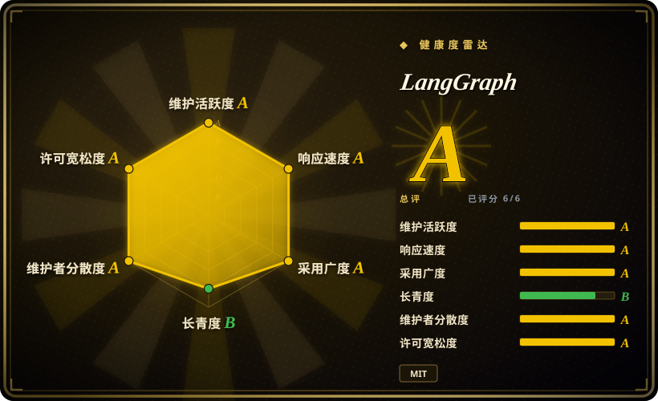
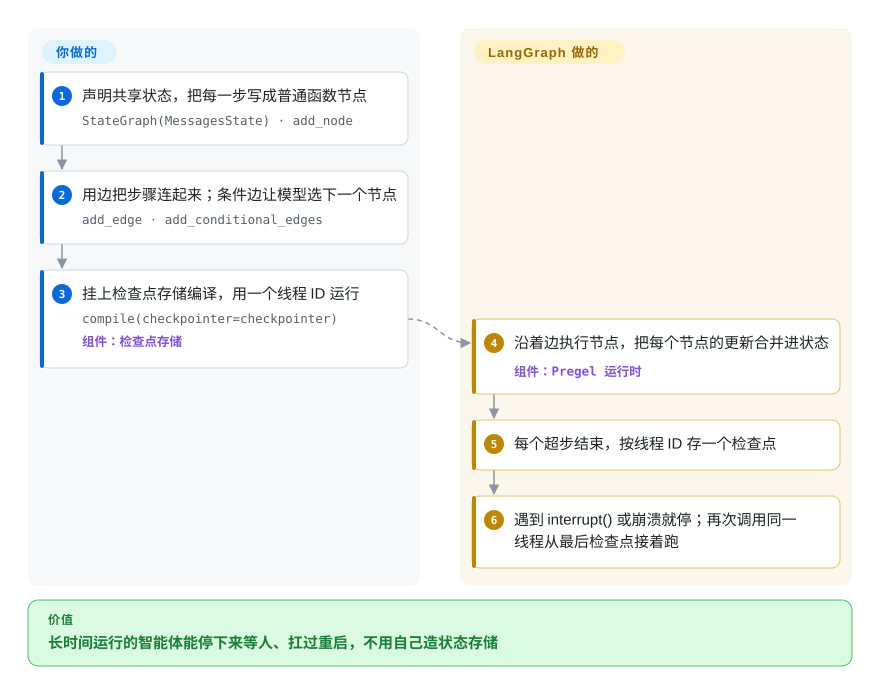

# LangGraph

你的智能体是一个包着模型调用的 `while` 循环；等到它得等经理两小时批准一笔退款，或者在 40 步任务做到一半时赶上容器重启，这个循环根本没地方记住自己做到哪了。LangGraph 把智能体写成一张显式的步骤图，每走一步就把状态存下来，所以一次运行可以暂停、崩溃、被人改过，然后从停下的地方原样接着跑。

## 何时使用

你在做一个要花几分钟甚至几天干正事的智能体：起草退款、必须等经理点头的客服智能体；要连续调用几十次工具的调研智能体；或者一条后台流程，其中有些步骤必须是普通代码（校验、查询、写库），只有少数几步交给模型。原型循环一直好用，直到有人问“服务器在第 12 步和第 13 步之间重启了怎么办？”或者“发出去之前能不能让审核的人改一下草稿？”，而老实的答案是：状态就放在一个 Python 变量里。这时你会想到 LangGraph：它把循环变成一个 `StateGraph`，每一步是一个函数节点，步骤之间的跳转是看得见的边（有的固定，有的由模型选）；再配一个 **checkpointer（检查点存储）**——每走一步就把图的状态写进内存、SQLite 或 Postgres 的组件——任何一次运行都能用 `interrupt()` 暂停，之后凭同一个 `thread_id` 接着跑。

如果你要的是每一次跳转都显式、可审计，而不是靠角色提示词引导，就选它而不是 [CrewAI](crewai.zh.md)；如果硬需求是可持久、可恢复的多步状态，而不是一个单智能体循环，就选它而不是 [OpenAI Agents SDK](openai-agents-sdk.zh.md) 或 [Pydantic AI](pydantic-ai.zh.md)。它是底层那一层：LangChain 的高层智能体 API 和 Deep Agents 都建在它之上，你可以先用上层，需要控制时再往下走。

## 怎么用起来

LangGraph 是一个运行“状态机”的运行时，状态机里的步骤可以调用模型。你先声明一个 **state（状态）**（一个有类型的字典或 Pydantic 模型，聊天智能体通常就是一串消息），把每一步写成普通的 Python 函数：读状态、返回要更新的部分；再用边把步骤连起来。条件边是一个看状态、返回下一个节点名字的函数，“让模型决定要不要调工具”就是这样表达的。然后 `compile()` 编译这张图，可以顺便挂上 checkpointer。**执行的事 LangGraph 来做**：它按“超步”（每一轮里所有就绪的节点一起跑，借自 Google 的 Pregel 模型）执行节点，把每个节点的更新合并进共享状态，每轮结束存一个检查点，边跑边推送进度；某个节点调用 `interrupt()` 时就停下来，等你用同一个线程加 `Command(resume=...)` 再次调用。**留给你的**：提示词、每个节点里的模型和工具调用、图的形状，以及 checkpointer 背后的数据库——LangGraph 不封装提示词，也不替你选架构。可以把它想成下棋：棋盘和每一格的规则由你设计，LangGraph 负责走子，并且每走一步都给棋盘拍张照，从任何一张照片都能接着下。

<!-- flow-steps:begin (generated from flows/langgraph.json by tools/flow_card.py — do not edit) -->

流程文字版

1. **你**：声明共享状态，把每一步写成普通函数节点 — `StateGraph(MessagesState) · add_node`
2. **你**：用边把步骤连起来；条件边让模型选下一个节点 — `add_edge · add_conditional_edges`
3. **你**：挂上检查点存储编译，用一个线程 ID 运行 — `compile(checkpointer=checkpointer)` — 组件：`检查点存储`
4. **LangGraph**：沿着边执行节点，把每个节点的更新合并进状态 — 组件：`Pregel 运行时`
5. **LangGraph**：每个超步结束，按线程 ID 存一个检查点
6. **LangGraph**：遇到 interrupt() 或崩溃就停；再次调用同一线程从最后检查点接着跑

**价值**：长时间运行的智能体能停下来等人、扛过重启，不用自己造状态存储

<!-- flow-steps:end -->

## 何时不用

- **你今天就想要一个能用的工具调用智能体。** LangGraph 自己的文档就建议新手先用更高层的 API，因为在 LangGraph 里你得一个节点一个节点地拼循环。改用 [LangChain](../../workflow-builders/langchain.zh.md) 的智能体 API（它就建在 LangGraph 上）或 [Pydantic AI](pydantic-ai.zh.md)，等需要自定义控制流或持久化时再下沉到 LangGraph。
- **你更想描述一个团队，而不是画一张图。** 如果工作天然能拆成角色和任务清单，改用 [CrewAI](crewai.zh.md)：你声明智能体和任务，交接由它连好；代价是对每次跳转的控制更少。
- **你需要生产服务器，却买不了 LangSmith 授权。** MIT 许可的库只给你图和检查点，不给托管 API、任务队列或界面。官方的自托管 Agent Server 需要 LangSmith 许可证密钥、Postgres、Redis，除非是隔离网络部署，还要能访问 `beacon.langchain.com` 做许可证校验。改为用 `PostgresSaver` 把图包进你自己的服务，或者试试 Aegra（未收录）——一个 Apache-2.0 许可、基于 FastAPI + Postgres 的替代服务器。
- **你不想让任何 LangChain 包进入依赖树。** `langgraph` 1.2.14 依赖 `langchain-core`、`langgraph-checkpoint`、`langgraph-sdk` 和 `langgraph-prebuilt`，文档里大多数例子也用 LangChain 的模型封装。如果更小、更中立的依赖面比 LangGraph 的运行时能力更重要，改用 [Pydantic AI](pydantic-ai.zh.md) 或 [smolagents](smolagents.zh.md)。
- **流程要由非开发人员搭建和修改。** LangGraph 只能写代码（Studio 用来可视化和调试图，不是用来搭图的）。改用 [Langflow](../../workflow-builders/langflow.zh.md) 或 [Dify](../../workflow-builders/dify.zh.md)。
- **这个长时间运行的流程主要跟模型无关。** 跨多个服务、带重试、定时器和版本化部署的多日业务流程，改用 [Temporal](../../../workflow-orchestration/temporal.zh.md)，因为它的持久执行是为任意代码设计的，模型调用放进 activity 里即可；LangGraph 的检查点机制是围绕智能体状态设计的。
- **你的平台是 .NET。** LangGraph 只有 Python 和 JavaScript/TypeScript（LangGraph.js）。需要 .NET 对等支持时改用 [Microsoft Agent Framework](agent-framework.zh.md)。

## 横向对比

| 替代品 | 是否收录 | 我们的评价 | 取舍 |
|---|---|---|---|
| [CrewAI](crewai.zh.md) | ✅ | 工作能拆成角色和任务清单、最看重尽快跑起一个团队时，选 CrewAI；每次跳转都必须显式、可恢复、可调试时，选 LangGraph。 | CrewAI 描述起来更快，但交接靠提示词引导；LangGraph 要你画出每条边，换来检查点和“时光回溯”调试。 |
| [Microsoft Agent Framework](agent-framework.zh.md) | ✅ | 在 .NET 或 Azure / Foundry 环境里，或者要从 AutoGen / Semantic Kernel 迁移时，选 Microsoft Agent Framework；要最大的 Python/JS 生态和最成熟的检查点机制，选 LangGraph。 | MAF 先从智能体起步、后加有类型的图，很多集成还是 beta；LangGraph 从第一步起就是图，第三方集成面更大。 |
| [OpenAI Agents SDK](openai-agents-sdk.zh.md) | ✅ | 在 OpenAI 模型上做一个带交接和护栏的轻量智能体，选 OpenAI Agents SDK；运行必须扛过重启、要跨几小时暂停等人时，选 LangGraph。 | OpenAI 的 SDK 原语更少、学得更快；LangGraph 机制更多，但原生自带持久化和人工介入。 |
| [Pydantic AI](pydantic-ai.zh.md) | ✅ | 核心需求是一个输出经过校验、依赖最少的类型安全智能体时，选 Pydantic AI；编排和持久状态才是难点时，选 LangGraph。 | Pydantic AI 更小、类型更严；LangGraph 带着 LangChain-core 依赖和更多概念，但运行时更强。 |
| [Temporal](../../../workflow-orchestration/temporal.zh.md) | ✅ | 跨服务的持久业务流程、模型只是众多活动之一时，选 Temporal；需要暂停和恢复的正是智能体自己的推理循环时，选 LangGraph。 | Temporal 要运行一个服务器集群，与模型无关；LangGraph 是进程内的库，状态模型围绕智能体消息设计。 |

## 技术栈

- **语言**：Python ≥3.10（分类器列出 3.10–3.13）；另有独立的 JavaScript/TypeScript 实现在 `langchain-ai/langgraphjs`。
- **单仓多包**（`libs/`）：`langgraph`（图运行时）、`langgraph-prebuilt`（现成的智能体和工具节点）、`langgraph-checkpoint` 及 `-sqlite` / `-postgres` 后端、`langgraph-sdk`（Agent Server 的 Python 客户端）、`langgraph-cli`（本地开发服务器和构建工具）。
- **执行模型**：在有类型的共享状态上按 Pregel 式超步执行；Graph API（`StateGraph`）和 Functional API（装饰器函数）共用同一个运行时。
- **核心依赖**：`langchain-core`、`pydantic`、`xxhash`。

## 依赖

- **模型服务**：任选，通常经由 LangChain 的聊天模型集成接入，外加 API 密钥。
- **检查点存储**：演示之外都需要。`InMemorySaver` 重启即丢；本地用 `SqliteSaver`，生产用 `PostgresSaver`（Postgres）。
- **可选、商业**：LangSmith 做追踪（`LANGSMITH_TRACING=true` 加 API 密钥）；LangSmith Deployment / 自托管 Agent Server（许可证密钥、Postgres、Redis）提供托管 API。
- **可选**：`langgraph-cli[inmem]` 提供 `langgraph dev`，一个供 Studio 连接的本地内存服务器。

## 运维难度

**作为库是低，作为服务是中到高。** 嵌进你自己的应用时，它只是一个 pip 依赖，外加 checkpointer 背后的数据库：用 `checkpointer.setup()` 建 Postgres 表、管好线程 ID（文档提醒 Postgres 里 ID 不能过长），以及检查点随时间增长。把图做成带后台运行、流式输出和定时任务的多租户服务才是重活：要么自己搭这一层，要么跑带许可证的 Agent Server 加 Postgres 和 Redis。小版本发得很勤（两周内 1.2.12 → 1.2.14），要锁版本、读更新日志。

## 健康度与可持续性

- **维护（2026-10-08）**：非常活跃，最近 13 周每周都有提交，每一到两周发一版；1.0.0 发布于 2025-10-17，包声明为 `Development Status :: 5 - Production/Stable`。
- **响应速度**：17 个 issue 样本里，维护者首次回复的中位时间是 7.3 小时，问题分拣很快。
- **治理与背书**：由 LangChain Inc. 开发，公司靠 LangSmith（追踪、评测、部署）赚钱养它。过去 12 个月有 37 名贡献者活跃，没有谁超过约 17% 的提交，人员集中风险低；路线图由公司定。
- **年龄 / Lindy**：创建于 2023-08-09，约 3 年，仍每周发版。这是中等强度的 Lindy 信号；它同时是 LangChain 自家智能体 API 和 Deep Agents 的底层运行时，这一点加强了延续性。
- **采用度**：约 42.9k star、约 7.3k fork，上个月 PyPI 下载 44,769,952 次（2026-10-08），比多数智能体框架高一个数量级，部分原因是其他 LangChain 包会把它一起装上。
- **风险信号**：库是 MIT 许可，没有改许可的历史；开源与商业的分界在服务器层——生产托管、Studio 和追踪都在 LangSmith 授权之后。

## 存疑（未验证）

- [未验证] 客户名单（Klarna、Replit、Elastic、Uber、J.P. Morgan）来自上游 README 和文档，没有独立核实。
- [推断] LangGraph 的 PyPI 下载量有一部分是 LangChain 智能体 API 和 Deep Agents 带进来的间接安装，会高估直接采用。
- [未验证] Aegra 只核对了存在性、许可和近期活跃度（Apache-2.0，2026-10-03 有推送），没有测试它与 Agent Server 的功能对等程度。
- [推断] “检查点随时间增长”是从“每步存检查点”的设计推出来的，没有测量保留和清理行为。
- [未验证] 不买任何 LangSmith 付费方案（例如有没有免费开发者许可证）能否用上自托管 Agent Server，没有从定价页面确认。
