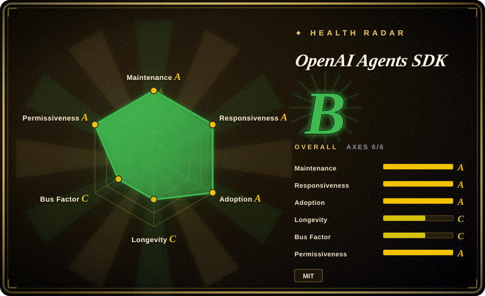
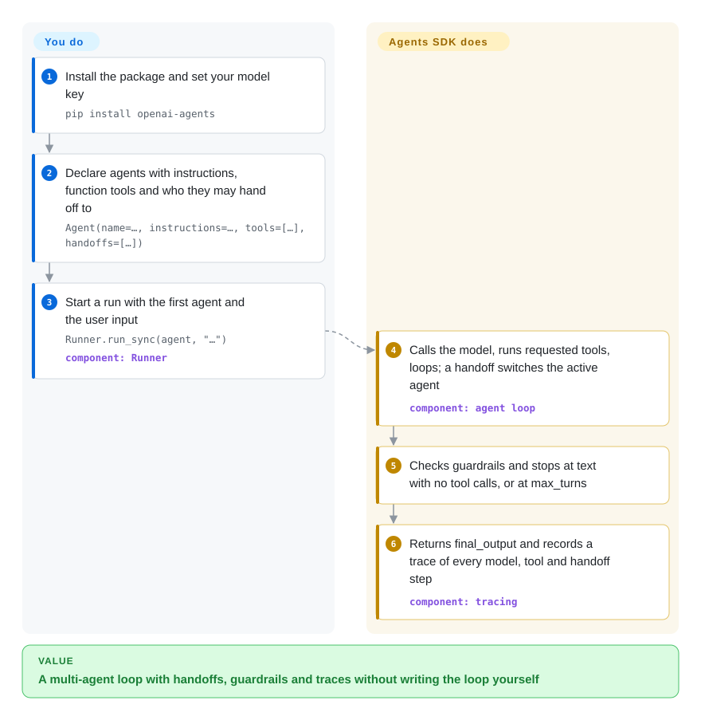

# OpenAI Agents SDK

You wrote the "call the model, run the tool it asked for, append the result, call again" loop by hand, then had to add a second specialist agent, a check that blocks off-topic input, and some way to see why a run went sideways — and the loop became the product. The OpenAI Agents SDK ships that loop as a small Python library: you declare agents with instructions, tools and hand-offs, call `Runner.run`, and it loops, switches agents, runs guardrails and records a trace of every step.

## When to use

You are adding an assistant to a product that already runs on OpenAI models — a support bot that should route billing questions to one agent and refunds to another, or an internal helper that calls a handful of your APIs. You want three things without building them: the tool-calling loop, a clean way for one agent to pass the conversation to another, and a trace you can open when a customer says "it gave me the wrong refund". You reach for the Agents SDK because its whole surface is a few primitives — `Agent` (instructions + tools + hand-offs + guardrails), `Runner` (the loop), sessions for conversation history, and tracing on by default — so a working multi-agent triage fits in one file, and newer OpenAI features (Responses API reasoning settings, hosted tools, realtime voice, sandboxed workspaces) arrive here first.

Pick it over [LangGraph](langgraph.md) when you do not need explicit graphs and durable checkpoints, only a loop with hand-offs; over [CrewAI](crewai.md) when you want a light, code-first agent rather than a role-playing team with its own scaffold and stores. Pick [Pydantic AI](pydantic-ai.md) instead if the deciding factor is equal first-class support for many model vendors rather than tracking OpenAI's newest APIs.

## How it works

You describe each agent as data: a name, `instructions` (its system prompt), a list of tools — ordinary Python functions marked with `@function_tool`, whose type hints become the tool schema — optional `handoffs` to other agents, and optional guardrails (checks that run on the input or the final output and can stop the run). **The SDK runs the loop for you**: `Runner` sends the conversation to the model; if the model asks for tools it runs them and loops again; if it picks a hand-off — which the model sees as just another tool, e.g. `transfer_to_refund_agent` — the runner switches the active agent and continues; when the model returns text with no tool calls, that is the final output (or the run stops at `max_turns`). Along the way it records a trace — a timeline of every model call, tool call and hand-off — and by default uploads it to OpenAI's trace viewer. **What stays yours**: the instructions, the tools, which agents can hand off to which, and anything that must survive a process restart — the loop lives in your process, so long-running durability comes from an external engine (Temporal, Dapr or Restate integrations). Think of a hospital reception desk: you write the job description for each desk and the transfer rules, and the SDK walks each patient from desk to desk and keeps the visit log.

<!-- flow-steps:begin (generated from flows/openai-agents-sdk.json by tools/flow_card.py — do not edit) -->

Text version of the flow

1. **You**: Install the package and set your model key — `pip install openai-agents`
2. **You**: Declare agents with instructions, function tools and who they may hand off to — `Agent(name=…, instructions=…, tools=[…], handoffs=[…])`
3. **You**: Start a run with the first agent and the user input — `Runner.run_sync(agent, "…")` — component: `Runner`
4. **OpenAI Agents SDK**: Calls the model, runs requested tools, loops; a handoff switches the active agent — component: `agent loop`
5. **OpenAI Agents SDK**: Checks guardrails and stops at text with no tool calls, or at max_turns
6. **OpenAI Agents SDK**: Returns final_output and records a trace of every model, tool and handoff step — component: `tracing`

**Value**: A multi-agent loop with handoffs, guardrails and traces without writing the loop yourself

<!-- flow-steps:end -->

## When NOT to use

- **Runs must survive crashes and pause for days.** Human-in-the-loop here means serialising a paused run (`RunState`) and resuming it yourself; crash recovery needs a separate Temporal, Dapr or Restate deployment. Use [LangGraph](langgraph.md) instead when you want checkpointed, resumable state inside the agent library, or [Temporal](../../../workflow-orchestration/temporal.md) when the agent is one step in a durable business workflow.
- **You run mainly non-OpenAI models.** The README says "provider-agnostic", but the docs recommend the OpenAI Responses path, and non-OpenAI providers go through Any-LLM / LiteLLM adapters marked beta and best-effort; Responses-only features (hosted tools, reasoning context) do not carry over. Use [Pydantic AI](pydantic-ai.md) instead, because multi-vendor model support is its core design.
- **Traces may not leave your network, or your org is under Zero Data Retention.** Tracing is on by default and exports to OpenAI; the docs state tracing is unavailable for ZDR organisations. Disable it with `OPENAI_AGENTS_DISABLE_TRACING=1` and send traces to a self-hosted [Langfuse](../../../llm-eval/langfuse.md) (it documents an OpenAI Agents integration) instead of the built-in viewer.
- **You need to land fixes upstream.** The contributing guide says pull requests are limited to repository collaborators and outside PRs are not accepted, even for docs. If patching the framework yourself matters, choose [Pydantic AI](pydantic-ai.md) or [LangGraph](langgraph.md), whose repos take community pull requests.
- **You want a stable 1.x API.** The package is still `0.Y.Z` (0.23.1 on 2026-10-02); the release policy allows breaking changes on every minor bump, and 17 releases shipped in the three months to 2026-10-08. Pin the minor version, or use [LangGraph](langgraph.md) (1.x since 2025-10) if API stability outweighs the lighter surface.
- **The job is a role-based team or a visual flow.** Use [CrewAI](crewai.md) to declare roles and tasks, or [Dify](../../workflow-builders/dify.md) when non-developers must assemble the flow, because this SDK is a code-only, agent-at-a-time library.
- **Your service is TypeScript.** This repo is Python only. Use OpenAI's separate JS/TS SDK, `openai-agents-js` (not indexed), or [TanStack AI](tanstack-ai.md) for a provider-neutral TypeScript layer.

## Comparison

| Alternative | In index | Our verdict | Tradeoff |
| --- | --- | --- | --- |
| [LangGraph](langgraph.md) | ✅ | When runs must checkpoint, pause for humans across hours and resume after restarts, pick LangGraph; pick the OpenAI Agents SDK when a loop with hand-offs and guardrails is enough and you want to be productive in an afternoon. | LangGraph owns durable state but makes you assemble a graph; the Agents SDK has a smaller surface and leaves durability to Temporal/Dapr/Restate. |
| [Pydantic AI](pydantic-ai.md) | ✅ | If you switch between OpenAI, Anthropic, Gemini and local models and want validated typed outputs, pick Pydantic AI; pick the Agents SDK when you are on OpenAI and want its newest APIs and built-in trace viewer first. | Pydantic AI treats every provider as first-class; the Agents SDK is best on the OpenAI Responses path and treats others as beta adapters. |
| [CrewAI](crewai.md) | ✅ | For a team of role-playing agents declared in config with built-in memory and knowledge stores, pick CrewAI; pick the Agents SDK for a lean, code-first agent with explicit hand-offs. | CrewAI is faster to a multi-role demo but heavier in dependencies and tokens; the Agents SDK keeps a small core and fewer abstractions. |
| [Microsoft Agent Framework](agent-framework.md) | ✅ | In Azure / Foundry or .NET environments, or when you need typed workflow graphs with checkpointing, pick Microsoft Agent Framework; pick the Agents SDK for a Python app on OpenAI with minimal surface. | MAF covers more providers and orchestration patterns with a ~40-package surface; the Agents SDK is smaller but follows one vendor's roadmap. |
| [smolagents](smolagents.md) | ✅ | When you want an agent that writes and executes Python code as its actions and a loop you can read end to end, pick smolagents; pick the Agents SDK for JSON tool calls, hand-offs and production tracing. | smolagents is tiny and transparent but leaves guardrails and tracing to you; the Agents SDK bundles them with OpenAI-leaning defaults. |

## Tech stack

- **Language**: Python ≥3.10 (classifiers list 3.10–3.14); package `openai-agents`, import name `agents`.
- **Core dependencies**: `openai` (≥3, <4), `pydantic` v2, `mcp`, `websockets`, `requests`, `griffelib` (reads docstrings for tool schemas).
- **Primitives**: `Agent`, `Runner`, `@function_tool`, handoffs, input/output guardrails, sessions, tracing; plus `SandboxAgent` (containerised workspace), `RealtimeAgent` (low-latency voice over WebSocket) and `VoicePipeline`.
- **Model access**: OpenAI Responses (recommended) and Chat Completions; other providers via optional `litellm` or `any-llm` extras.
- **Optional extras**: `voice`, `redis`, `sqlalchemy` (async Postgres sessions), `encrypt`, `dapr`, `viz` (graphviz).

## Dependencies

- **A model API key**: `OPENAI_API_KEY` for the default path; for other providers, their keys plus the LiteLLM / Any-LLM adapter.
- **Session storage (optional)**: in-process by default; SQLite, Redis or SQLAlchemy-backed sessions for persistent conversation history.
- **Tracing backend**: OpenAI's trace viewer by default (needs an OpenAI key even when the model is elsewhere); disable or replace with your own processor.
- **Durable execution (optional)**: a Temporal, Dapr or Restate deployment if runs must survive process crashes.
- **Sandbox agents (optional)**: a local Unix environment, Docker (`openai-agents[docker]`) or a hosted sandbox client.

## Ops difficulty

**Low.** It is a pip dependency with no server of its own; agents run inside your process. The real operational choices are around it: where traces go (default upload to OpenAI vs disabled vs your own processor), where sessions live once you need history across restarts, and whether to add a durable-execution engine. Fast 0.x releases mean pinning the minor version and reading the breaking-change changelog before every bump.

## Health & viability

- **Maintenance (2026-10-08)**: very active — commits in every one of the last 13 weeks; 0.23.0 and 0.23.1 both shipped on 2026-10-02 and 17 releases landed in the last three months.
- **Responsiveness**: median first maintainer response of 26.2 hours across 17 qualifying issues, and only 8 open issues — triage is fast and aggressive.
- **Governance & backing**: an `openai` organization repo; 72 contributors were active in the past 12 months, but one maintainer authored about 57% of commits and outside pull requests are not accepted, so the roadmap and most of the code sit with a small OpenAI team.
- **Age / Lindy**: created 2025-03-11, about 19 months old and still 0.x — too young for the Lindy prior; continuity depends on OpenAI keeping this as its agent framework (the Swarm repo now says it is replaced by this SDK).
- **Adoption**: ~29.9k stars, ~4.9k forks and 12,449,784 PyPI downloads of `openai-agents` in the last month (2026-10-08); integrations from Langfuse, Temporal, Dapr and Restate show an ecosystem forming around it.
- **Risk flags**: MIT license, no relicense history. Risks are vendor gravity (features optimised for OpenAI APIs, tracing to OpenAI by default) and 0.x breaking changes.

## Caveats (unverified)

- [推断] "Only 8 open issues" alongside a 26-hour median first response suggests aggressive closing; whether hard bugs get fixed rather than closed was not audited.
- [未验证] Quality of non-OpenAI models through the LiteLLM / Any-LLM adapters is labelled beta and best-effort by the docs and was not tested here.
- [推断] Part of the download volume is likely CI and transitive installs from tools built on the SDK; it overstates direct production use.
- [未验证] The Langfuse, Temporal, Dapr and Restate integrations were confirmed only from documentation, not by running them.
