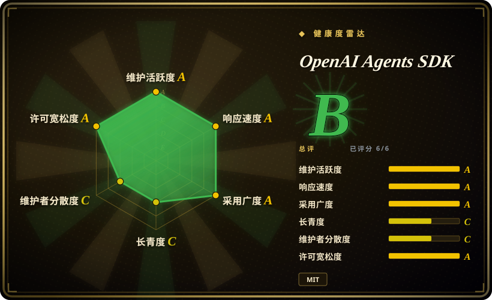
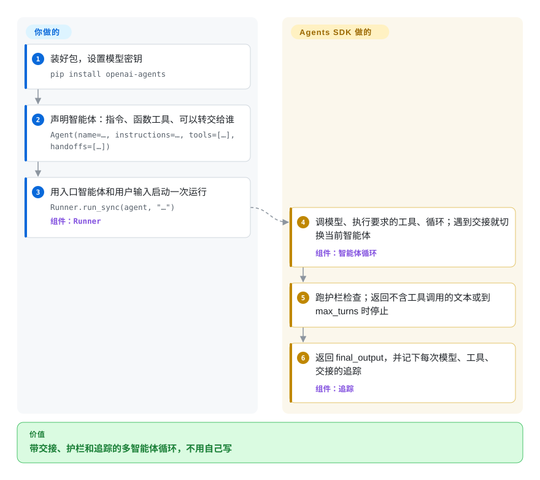

# OpenAI Agents SDK

你手写了“调模型、执行它要的工具、把结果追加进去、再调一次”的循环，接着又要加第二个专职智能体、一道拦住跑题输入的检查，还得有办法看清某次运行为什么跑偏——结果这个循环本身成了产品。OpenAI Agents SDK 把这套循环做成一个小 Python 库：你声明带指令、工具和交接对象的智能体，调用 `Runner.run`，它负责循环、切换智能体、跑护栏，并把每一步记成追踪记录。

## 何时使用

你要给一个已经跑在 OpenAI 模型上的产品加助手：一个客服机器人，账单问题转给一个智能体、退款转给另一个；或者一个调用几个内部 API 的内部助手。你想要三样东西，但不想自己造：工具调用循环；一个智能体把对话干净地转给另一个的办法；以及客户说“它给我退错钱了”时能打开查看的追踪记录。这时你会想到 Agents SDK：它的全部表面就几个原语——`Agent`（指令 + 工具 + 交接 + 护栏）、`Runner`（循环）、管理对话历史的 session，以及默认开启的追踪——所以一个能用的多智能体分诊一个文件就写得下；OpenAI 的新功能（Responses API 的推理设置、托管工具、实时语音、沙箱工作区）也最先出现在这里。

如果你不需要显式的图和持久化检查点，只要一个带交接的循环，就选它而不是 [LangGraph](langgraph.zh.md)；如果你要的是轻量、代码优先的智能体，而不是一个带自己脚手架和存储的角色扮演团队，就选它而不是 [CrewAI](crewai.zh.md)。如果决定因素是对多家模型厂商一视同仁的一等支持，而不是紧跟 OpenAI 最新 API，改选 [Pydantic AI](pydantic-ai.zh.md)。

## 怎么用起来

你把每个智能体写成数据：名字、`instructions`（它的系统提示词）、工具列表（用 `@function_tool` 标记的普通 Python 函数，类型注解会自动变成工具的参数说明）、可选的 `handoffs`（可以转交给哪些智能体），以及可选的护栏（在输入或最终输出上运行、能叫停整次运行的检查）。**循环由 SDK 来跑**：`Runner` 把对话发给模型；模型要调工具，它就执行工具再循环；模型选择交接——在模型眼里交接就是另一个工具，比如 `transfer_to_refund_agent`——它就切换当前智能体继续跑；模型返回不含工具调用的文本，就算最终输出（或者到 `max_turns` 上限停止）。一路上它记下一条追踪记录（每次模型调用、工具调用和交接的时间线），默认上传到 OpenAI 的追踪查看器。**留给你的**：指令、工具、谁能转给谁，以及所有必须扛过进程重启的东西——循环活在你的进程里，长时间运行的持久性要靠外部引擎（Temporal、Dapr 或 Restate 集成）。可以把它想成医院的分诊台：每个窗口的岗位说明和转诊规则由你写，SDK 负责领着病人从一个窗口走到下一个窗口，并记好就诊记录。

<!-- flow-steps:begin (generated from flows/openai-agents-sdk.json by tools/flow_card.py — do not edit) -->

流程文字版

1. **你**：装好包，设置模型密钥 — `pip install openai-agents`
2. **你**：声明智能体：指令、函数工具、可以转交给谁 — `Agent(name=…, instructions=…, tools=[…], handoffs=[…])`
3. **你**：用入口智能体和用户输入启动一次运行 — `Runner.run_sync(agent, "…")` — 组件：`Runner`
4. **OpenAI Agents SDK**：调模型、执行要求的工具、循环；遇到交接就切换当前智能体 — 组件：`智能体循环`
5. **OpenAI Agents SDK**：跑护栏检查；返回不含工具调用的文本或到 max_turns 时停止
6. **OpenAI Agents SDK**：返回 final_output，并记下每次模型、工具、交接的追踪 — 组件：`追踪`

**价值**：带交接、护栏和追踪的多智能体循环，不用自己写

<!-- flow-steps:end -->

## 何时不用

- **运行必须扛过崩溃、能暂停好几天。** 这里的人工介入是把暂停的运行序列化（`RunState`），之后由你自己恢复；崩溃恢复需要另外部署 Temporal、Dapr 或 Restate。想在智能体库内部就拿到带检查点、可恢复的状态，改用 [LangGraph](langgraph.zh.md)；智能体只是持久业务流程中的一步时，改用 [Temporal](../../../workflow-orchestration/temporal.zh.md)。
- **你主要用非 OpenAI 的模型。** README 说“与厂商无关”，但文档推荐走 OpenAI Responses 路径，非 OpenAI 厂商要经过标为 beta、尽力而为的 Any-LLM / LiteLLM 适配器；只有 Responses 才有的功能（托管工具、推理上下文）带不过去。改用 [Pydantic AI](pydantic-ai.zh.md)，多厂商模型支持是它的核心设计。
- **追踪数据不能出你的网络，或者你的组织签了零数据保留（ZDR）。** 追踪默认开启并导出到 OpenAI；文档写明 ZDR 组织用不了追踪。用 `OPENAI_AGENTS_DISABLE_TRACING=1` 关掉它，改把追踪发到自托管的 [Langfuse](../../../llm-eval/langfuse.zh.md)（它有 OpenAI Agents 集成文档），不要用内置查看器。
- **你需要把修复合回上游。** 贡献指南写明 PR 只接受仓库协作者，外部 PR 一律不收，连文档也不行。如果自己给框架打补丁很重要，选 [Pydantic AI](pydantic-ai.zh.md) 或 [LangGraph](langgraph.zh.md)，它们的仓库接受社区 PR。
- **你要稳定的 1.x API。** 包还是 `0.Y.Z`（2026-10-02 发布 0.23.1）；发布策略允许每次次版本号升级都有破坏性变更，截至 2026-10-08 的三个月里发了 17 个版本。锁定次版本，或者在 API 稳定比表面轻量更重要时改用 [LangGraph](langgraph.zh.md)（2025-10 起已是 1.x）。
- **要做的是按角色分工的团队或可视化流程。** 声明角色和任务用 [CrewAI](crewai.zh.md)；非开发人员要搭流程用 [Dify](../../workflow-builders/dify.zh.md)，因为这个 SDK 是只能写代码、一次一个智能体的库。
- **你的服务是 TypeScript。** 这个仓库只有 Python。改用 OpenAI 单独的 JS/TS SDK `openai-agents-js`（未收录），或用 [TanStack AI](tanstack-ai.zh.md) 做与厂商无关的 TypeScript 层。

## 横向对比

| 替代品 | 是否收录 | 我们的评价 | 取舍 |
|---|---|---|---|
| [LangGraph](langgraph.zh.md) | ✅ | 运行必须存检查点、跨几小时停下等人、重启后能恢复时，选 LangGraph；一个带交接和护栏的循环就够、想一个下午就上手时，选 OpenAI Agents SDK。 | LangGraph 自带持久状态，但要你拼一张图；Agents SDK 表面更小，持久性交给 Temporal/Dapr/Restate。 |
| [Pydantic AI](pydantic-ai.zh.md) | ✅ | 要在 OpenAI、Anthropic、Gemini 和本地模型之间切换、并要求输出有类型校验时，选 Pydantic AI；用的是 OpenAI、想最先用上它的新 API 和内置追踪查看器时，选 Agents SDK。 | Pydantic AI 把每家厂商都当一等公民；Agents SDK 在 OpenAI Responses 路径上最好用，其他厂商只是 beta 适配器。 |
| [CrewAI](crewai.zh.md) | ✅ | 想用配置声明一个角色扮演团队、自带记忆和知识库时，选 CrewAI；想要精简、代码优先、交接显式的智能体时，选 Agents SDK。 | CrewAI 更快做出多角色演示，但依赖和 token 都更重；Agents SDK 核心小、抽象少。 |
| [Microsoft Agent Framework](agent-framework.zh.md) | ✅ | 在 Azure / Foundry 或 .NET 环境里，或需要带检查点的有类型工作流图时，选 Microsoft Agent Framework；在 OpenAI 上做 Python 应用、想要最小表面时，选 Agents SDK。 | MAF 覆盖更多厂商和编排模式，但有约 40 个包；Agents SDK 更小，但跟着一家厂商的路线图走。 |
| [smolagents](smolagents.zh.md) | ✅ | 想让智能体以“写 Python 代码并执行”作为动作、并且循环能从头读到尾时，选 smolagents；要 JSON 工具调用、交接和生产级追踪时，选 Agents SDK。 | smolagents 小而透明，但护栏和追踪要自己补；Agents SDK 把它们打包好了，默认值偏向 OpenAI。 |

## 技术栈

- **语言**：Python ≥3.10（分类器列出 3.10–3.14）；包名 `openai-agents`，导入名 `agents`。
- **核心依赖**：`openai`（≥3、<4）、`pydantic` v2、`mcp`、`websockets`、`requests`、`griffelib`（解析 docstring 生成工具说明）。
- **原语**：`Agent`、`Runner`、`@function_tool`、交接、输入 / 输出护栏、session、追踪；另有 `SandboxAgent`（容器化工作区）、`RealtimeAgent`（基于 WebSocket 的低延迟语音）和 `VoicePipeline`。
- **模型接入**：OpenAI Responses（推荐）和 Chat Completions；其他厂商经可选的 `litellm` 或 `any-llm` 扩展接入。
- **可选扩展**：`voice`、`redis`、`sqlalchemy`（异步 Postgres session）、`encrypt`、`dapr`、`viz`（graphviz）。

## 依赖

- **模型 API 密钥**：默认路径用 `OPENAI_API_KEY`；用其他厂商则需要它们的密钥加 LiteLLM / Any-LLM 适配器。
- **session 存储（可选）**：默认在进程内；要跨重启保留对话历史，可用 SQLite、Redis 或基于 SQLAlchemy 的 session。
- **追踪后端**：默认是 OpenAI 的追踪查看器（即使模型在别家也需要 OpenAI 密钥）；可以关掉，或换成你自己的处理器。
- **持久执行（可选）**：运行必须扛过进程崩溃时，需要部署 Temporal、Dapr 或 Restate。
- **沙箱智能体（可选）**：本地 Unix 环境、Docker（`openai-agents[docker]`）或托管沙箱客户端。

## 运维难度

**低。** 它是一个 pip 依赖，自己不带服务器，智能体在你的进程里运行。真正的运维选择在它周围：追踪发到哪（默认上传 OpenAI、关闭，还是你自己的处理器）；需要跨重启保留历史时 session 放在哪；要不要加一个持久执行引擎。0.x 版本发得快，意味着要锁定次版本，每次升级前读破坏性变更日志。

## 健康度与可持续性

- **维护（2026-10-08）**：非常活跃，最近 13 周每周都有提交；0.23.0 和 0.23.1 都在 2026-10-02 发布，最近三个月发了 17 个版本。
- **响应速度**：17 个 issue 样本里维护者首次回复的中位时间是 26.2 小时，开着的 issue 只有 8 个，分拣又快又狠。
- **治理与背书**：仓库归 `openai` 组织；过去 12 个月有 72 名贡献者活跃，但一位维护者写了约 57% 的提交，外部 PR 也不收，路线图和大部分代码都在一个小的 OpenAI 团队手里。
- **年龄 / Lindy**：创建于 2025-03-11，约 19 个月，仍是 0.x，太年轻，Lindy 先验说明不了什么；能否延续取决于 OpenAI 是否一直把它当作自家的智能体框架（Swarm 仓库现在写明已被这个 SDK 取代）。
- **采用度**：约 29.9k star、约 4.9k fork，`openai-agents` 上个月 PyPI 下载 12,449,784 次（2026-10-08）；Langfuse、Temporal、Dapr、Restate 都做了集成，周边生态正在形成。
- **风险信号**：MIT 许可，没有改许可的历史。风险在于厂商引力（功能围绕 OpenAI API 优化，追踪默认发往 OpenAI）和 0.x 的破坏性变更。

## 存疑（未验证）

- [推断] 开着的 issue 只有 8 个、首次回复中位时间却有 26 小时，说明关单很积极；疑难 bug 是被修好还是被关掉，没有审计。
- [未验证] 经 LiteLLM / Any-LLM 适配器使用非 OpenAI 模型的效果，文档标为 beta、尽力而为，本页没有实测。
- [推断] 下载量里有一部分可能来自 CI 和基于该 SDK 的工具带来的间接安装，会高估直接的生产使用。
- [未验证] Langfuse、Temporal、Dapr、Restate 的集成只从文档确认，没有实际运行过。
