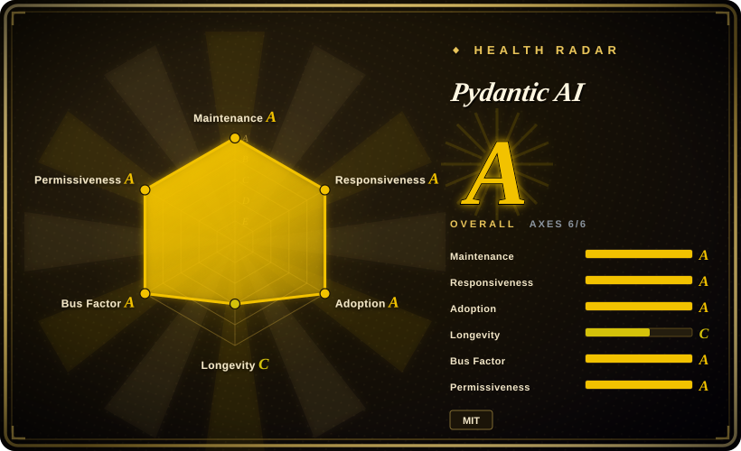
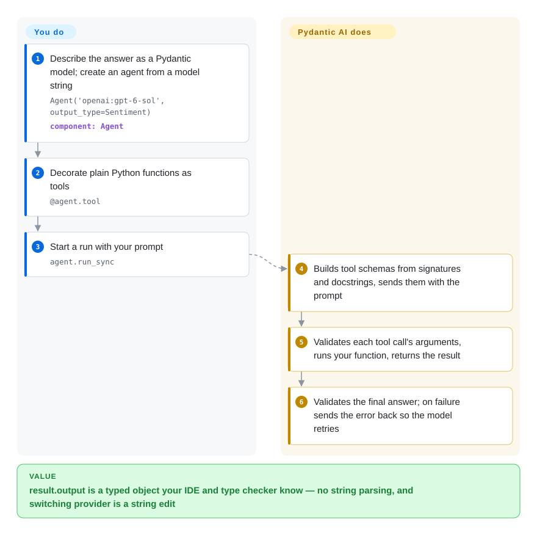

# Pydantic AI

You ask a model for a refund decision and get back a paragraph, or JSON with `"risk": "high-ish"` where your code expected an integer, and you only find out when a `KeyError` fires in production. Pydantic AI makes the agent's tools and final answer ordinary Python types: arguments and output are validated by Pydantic before your code sees them, a bad answer is sent back to the model to fix, and the provider is a string you can swap.

## When to use

You're a Python backend engineer adding an LLM step to a service that already speaks Pydantic — a FastAPI app, a data pipeline, a support tool. The step must return something your code can trust: a `SupportOutput(block_card: bool, risk: int)`, not prose. Today you call the OpenAI SDK, `json.loads` the reply, and write defensive `if "risk" in data` checks; the day you try Anthropic or Gemini instead, half that glue is rewritten. You reach for Pydantic AI because the contract lives in the type: declare `output_type=SupportOutput`, write tools as typed functions that receive your DB pool through dependency injection (a typed `deps` object passed into every tool), and every run returns a validated `SupportOutput` whichever provider string you pass.

Pick it over the [OpenAI Agents SDK](openai-agents-sdk.md) when model-neutrality and static typing matter more than staying inside one vendor's primitives, and over [LangGraph](langgraph.md) when your control flow is mostly plain Python and you would rather not model it as a graph up front (Pydantic AI has `pydantic-graph` for the cases that really are state machines). It also covers the less common paths from the same `Agent` object — durable runs on Temporal/DBOS/Prefect, realtime voice, a terminal CLI — so you do not switch frameworks when the prototype grows.

## How it works

Pydantic AI is a library, not a service: you `uv add pydantic-ai` (Python 3.11+) and everything runs inside your process. **You** write the types (the output model, the dependencies object) and the tool functions; **it** turns each function's signature and docstring into the tool schema the model sees, validates every argument the model sends before your function runs, and validates the final answer against your output type — when validation fails, the error goes back to the model as a retry (a fresh attempt with the complaint attached) instead of reaching your code. The model is named by a string like `'anthropic:…'` or `'openai:…'`, and the provider adapter underneath translates between that vendor's API and the common message format. Extra behaviour — MCP servers, web search, memory, durable execution — is attached as a *capability*, a reusable bundle of tools, instructions and hooks you add to `capabilities=[…]`; the separate `pydantic-ai-harness` package ships ready-made ones, including a complete terminal coding agent.

<!-- flow-steps:begin (generated from flows/pydantic-ai.json by tools/flow_card.py — do not edit) -->

Text version of the flow

1. **You**: Describe the answer as a Pydantic model; create an agent from a model string — `Agent('openai:gpt-6-sol', output_type=Sentiment)` — component: `Agent`
2. **You**: Decorate plain Python functions as tools — `@agent.tool`
3. **You**: Start a run with your prompt — `agent.run_sync`
4. **Pydantic AI**: Builds tool schemas from signatures and docstrings, sends them with the prompt
5. **Pydantic AI**: Validates each tool call's arguments, runs your function, returns the result
6. **Pydantic AI**: Validates the final answer; on failure sends the error back so the model retries

**Value**: result.output is a typed object your IDE and type checker know — no string parsing, and switching provider is a string edit

<!-- flow-steps:end -->

## When NOT to use

- **Your stack is TypeScript/JavaScript.** Pydantic AI is Python-only; use [TanStack AI](tanstack-ai.md) or the Vercel AI SDK (not indexed) for a typed agent loop in a Node/edge runtime.
- **You want a ready-made assistant, not a library.** Pydantic AI gives you an `Agent` object to embed; if you want something that already runs on Telegram, remembers you and schedules jobs, use [Hermes Agent](../personal-assistants/hermes-agent.md) or [OpenClaw](../personal-assistants/openclaw.md) instead.
- **Your workflow is an explicit multi-step graph with checkpoints and human approval at many nodes.** Pydantic AI can do it (`pydantic-graph`, deferred tools), but [LangGraph](langgraph.md) makes the graph, its persisted state and time-travel debugging the primary abstraction; pick it when the graph *is* the design.
- **You need role-based multi-agent "crews" configured mostly in YAML.** [CrewAI](crewai.md) is built around agents-with-roles collaborating; Pydantic AI's multi-agent story is delegation and sub-agents written in code.
- **You cannot absorb API churn.** V2 went stable on 2026-06-23 and shipped 50+ minor releases in the following 3½ months; the version policy promises no intentional breaking changes in minors, but beta modules are exempt and a V3 is allowed any time after 2026-09-23. V1 gets security fixes only for at least 6 months after V2. If you need a slow-moving API, pin hard or choose [smolagents](smolagents.md), whose small core changes less.
- **You only need one structured-output call, no tools or loop.** The provider's own structured-output mode, or Instructor (not indexed), is less surface than an agent framework.

## Comparison

| Alternative | In index | Our verdict | Tradeoff |
|---|---|---|---|
| [OpenAI Agents SDK](openai-agents-sdk.md) | ✅ | Pick OpenAI Agents SDK when you are committed to OpenAI models and want its handoff and hosted-tool primitives; pick Pydantic AI when the agent must stay provider-neutral and fully typed. | OpenAI's SDK is thinner and closest to that vendor's newest features; Pydantic AI adds typed deps/output and many providers at the cost of a larger API surface that moves fast. |
| [LangGraph](langgraph.md) | ✅ | Pick LangGraph when the workflow is a long-running, checkpointed graph and you want the graph to be the primary abstraction; pick Pydantic AI when plain Python control flow plus typed outputs covers it. | LangGraph gives first-class persisted state and graph debugging inside the LangChain ecosystem; Pydantic AI keeps code shorter and type-checked but treats graphs as an add-on package. |
| [smolagents](smolagents.md) | ✅ | Pick smolagents for a small, readable loop where the model writes Python actions; pick Pydantic AI when tool arguments and final answers must be validated types. | smolagents is easier to audit end to end and flexible in what the model can compose; Pydantic AI trades that for validation, DI and production integrations (OTel, durable execution). |
| [CrewAI](crewai.md) | ✅ | Pick CrewAI when the problem is naturally a team of role-playing agents configured declaratively; pick Pydantic AI when one typed agent (plus sub-agents) embedded in your service is enough. | CrewAI gets a multi-agent process running with little code; Pydantic AI gives tighter control over types and each call but you write the orchestration yourself. |
| Google ADK | not indexed | Pick ADK when you deploy on Google Cloud / Vertex and want its agent runtime and evaluation tooling; pick Pydantic AI for a cloud-neutral, Pydantic-typed library. | ADK integrates deeply with Gemini and Google's deployment path; Pydantic AI is lighter to embed anywhere but leaves hosting to you. |

## Tech stack

- **Language:** Python ≥ 3.11 (classifiers list 3.11–3.14); MIT-licensed; built by the Pydantic team.
- **Packaging:** `pydantic-ai` is a meta-package over `pydantic-ai-slim` with common extras (OpenAI, Anthropic, Google, CLI, MCP, evals, web, Logfire); `pydantic-ai-slim[...]` lets you install only the providers you use.
- **Core libraries:** Pydantic ≥ 2.12 for validation, `pydantic-graph` (same repo), `anyio`, an HTTP client, `opentelemetry-api` for tracing, `genai-prices` for cost data.
- **Integrations (optional extras):** MCP client, AG-UI / Vercel AI UI streams, Temporal / DBOS / Prefect durable execution, realtime voice (OpenAI Realtime, Gemini Live and others), Pydantic Evals.

## Dependencies

- **Runtime:** a Python 3.11+ process; nothing else to deploy — no server, database or queue is required for basic use.
- **Model access:** an API key for at least one provider (OpenAI, Anthropic, Google, Bedrock, Groq, Mistral, Ollama for local models, …), or the commercial Pydantic AI Gateway. A built-in `'test'` model lets you write unit tests without any key.
- **Optional infrastructure:** a Temporal/DBOS/Prefect deployment if you use durable execution; any OpenTelemetry backend (or the commercial Logfire SaaS) for traces.

## Ops difficulty

**Low** for the library itself: it is a pip/uv dependency inside your service, so the ops burden is whatever your service already has, plus provider keys and rate limits. The real cost is **upgrade discipline** — with near-daily minor releases you need pinned versions and a habit of reading release notes for "compatibility impact" warnings. Durable execution moves the burden onto the engine you choose (running Temporal is its own medium-to-high ops job).

## Health & viability

- **Maintenance (2026-10-08):** very active — releases every few days (v2.54.0 on 2026-10-03), with the V1 line still receiving patch releases (v1.107.7 on 2026-09-30) during its security-fix window.
- **Governance & backing:** owned by Pydantic Services Inc., the company behind Pydantic itself; the core team are company employees and the bus factor is healthy (governance grade A, top-3 contributors under 70% of commits). The company's revenue comes from Logfire and the AI Gateway, which the README promotes, but both are optional and instrumentation is plain OpenTelemetry.
- **Age / Lindy:** about 2⅓ years old (839 days; repo created 2024-06), so longevity is only grade C on its own; the parent project Pydantic is long-lived and is a dependency of most of the Python AI ecosystem, which is a stronger prior than this repo's age.
- **Adoption:** ~20.5k stars and 5,383,780 monthly PyPI downloads of the `pydantic-ai` meta-package on the scorer's 2026-10-09 reading (adoption grade A); the `pydantic-ai-slim` core it wraps is downloaded several times more.
- **Risk flags:** MIT with no relicense history; fast API evolution (V1→V2 in 9 months) is the main risk, not abandonment.

## Caveats (unverified)

- [推断] PyPI downloads of `pydantic-ai-slim` (the previous reading was 23,908,854 a month) likely include transitive installs pulled in by other frameworks; the `pydantic-ai` meta-package count the radar now uses is the closer measure of direct adoption.
- [未验证] The comparison judgments against Google ADK and the OpenAI Agents SDK draw partly on Pydantic's own comparison docs, which are written by an interested party.
- [未验证] Whether every provider adapter supports every feature (native structured output, realtime, image generation) was not checked; the README marks support per provider in the docs.
- [推断] "Production/Stable" is the package classifier; how large production deployments behave under V2's capability model was not independently verified.
