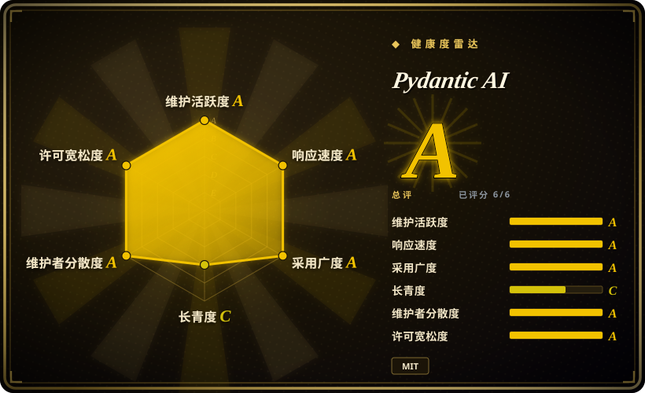
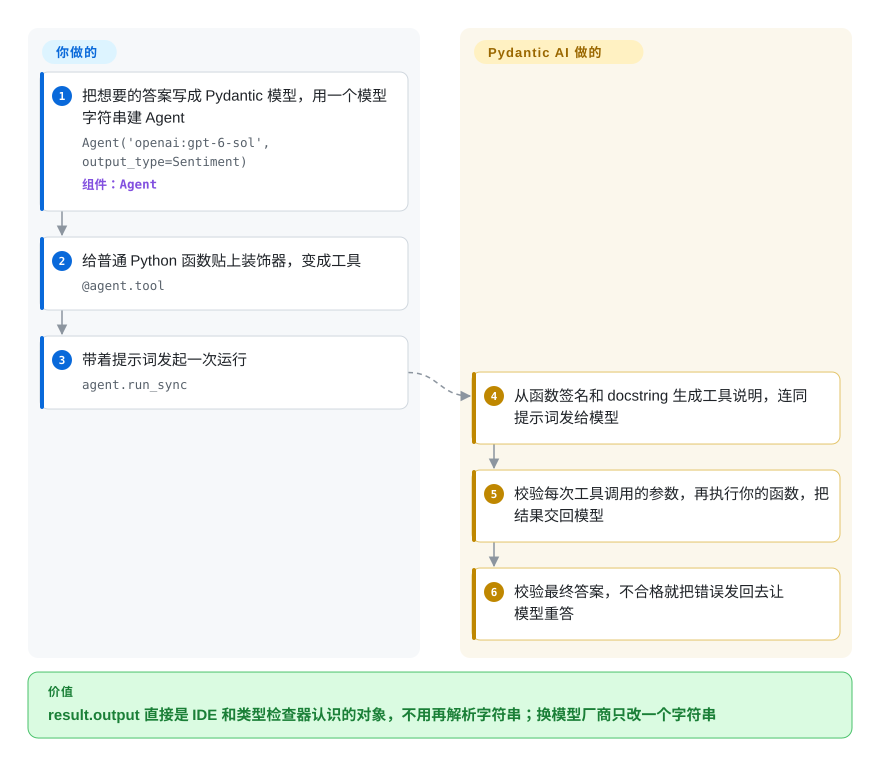

# Pydantic AI

你让模型判断要不要给客户退款，它回你一段散文，或者一段 JSON 里写着 `"risk": "偏高"`，而你的代码等的是整数——直到线上抛出 `KeyError` 你才发现。Pydantic AI 把智能体的工具参数和最终答案都变成普通的 Python 类型：先由 Pydantic 校验再交给你的代码，不合格的答案退回给模型重答，模型厂商只是一个可以随手替换的字符串。

## 何时使用

你是 Python 后端工程师，要在一个本来就用 Pydantic 的服务里加一步大模型调用——FastAPI 应用、数据管道、客服工具都算。这一步必须返回代码能直接信任的东西：一个 `SupportOutput(block_card: bool, risk: int)`，而不是一段话。现在你的做法是调 OpenAI SDK、`json.loads` 回复、再写一堆 `if "risk" in data` 的防御判断；哪天想换成 Anthropic 或 Gemini，这堆胶水代码要重写一半。你选 Pydantic AI，是因为约定写在类型里：声明 `output_type=SupportOutput`，把工具写成带类型的函数，通过依赖注入（每次调用工具时传进去的一个带类型的 `deps` 对象）拿到数据库连接池，不管传哪个厂商字符串，每次运行都返回一个校验过的 `SupportOutput`。

和 [OpenAI Agents SDK](openai-agents-sdk.zh.md) 比，当你更看重不绑定厂商和静态类型、而不是留在单一厂商的原语里时选它；和 [LangGraph](langgraph.zh.md) 比，当你的控制流基本是普通 Python、不想一开始就把它建模成图时选它（真正是状态机的场景，它也有 `pydantic-graph`）。同一个 `Agent` 对象还能走那些不那么常见的路——在 Temporal/DBOS/Prefect 上做持久化运行、实时语音、终端 CLI——原型长大时不用换框架。

## 怎么用起来

Pydantic AI 是一个库，不是一个服务：`uv add pydantic-ai`（需要 Python 3.11+）之后，一切都在你自己的进程里跑。**你**负责写类型（输出模型、依赖对象）和工具函数；**它**负责把每个函数的签名和 docstring 变成模型看得到的工具说明，在你的函数执行前校验模型传来的每个参数，并按你的输出类型校验最终答案——校验不通过时，错误会作为一次重试（带着报错信息让模型再答一次）发回模型，而不是流进你的代码。模型用 `'anthropic:…'`、`'openai:…'` 这样的字符串指定，底下的厂商适配层负责在各家 API 和统一的消息格式之间翻译。额外能力——MCP 服务器、网页搜索、记忆、持久化执行——以“能力”（capability，把工具、指令和钩子打成的一个可复用包）的形式挂到 `capabilities=[…]` 上；单独的 `pydantic-ai-harness` 包提供现成的能力，包括一个完整的终端编码智能体。

<!-- flow-steps:begin (generated from flows/pydantic-ai.json by tools/flow_card.py — do not edit) -->

流程文字版

1. **你**：把想要的答案写成 Pydantic 模型，用一个模型字符串建 Agent — `Agent('openai:gpt-6-sol', output_type=Sentiment)` — 组件：`Agent`
2. **你**：给普通 Python 函数贴上装饰器，变成工具 — `@agent.tool`
3. **你**：带着提示词发起一次运行 — `agent.run_sync`
4. **Pydantic AI**：从函数签名和 docstring 生成工具说明，连同提示词发给模型
5. **Pydantic AI**：校验每次工具调用的参数，再执行你的函数，把结果交回模型
6. **Pydantic AI**：校验最终答案，不合格就把错误发回去让模型重答

**价值**：result.output 直接是 IDE 和类型检查器认识的对象，不用再解析字符串；换模型厂商只改一个字符串

<!-- flow-steps:end -->

## 何时不用

- **你的技术栈是 TypeScript/JavaScript。** Pydantic AI 只支持 Python；要在 Node 或边缘运行时里用带类型的智能体循环，选 [TanStack AI](tanstack-ai.zh.md) 或 Vercel AI SDK（未收录）。
- **你要的是现成助手，不是库。** Pydantic AI 给你的是一个要嵌进自己代码的 `Agent` 对象；如果你想要一个已经能在 Telegram 上应答、记得你是谁、会定时跑任务的东西，改用 [Hermes Agent](../personal-assistants/hermes-agent.zh.md) 或 [OpenClaw](../personal-assistants/openclaw.zh.md)。
- **你的流程是显式的多步图，很多节点要存检查点、等人工审批。** Pydantic AI 也能做（`pydantic-graph`、延迟工具），但 [LangGraph](langgraph.zh.md) 把图、持久化状态和回溯调试当作头等抽象；当图本身就是设计时选它。
- **你要的是主要用 YAML 配置、按角色分工的多智能体“团队”。** [CrewAI](crewai.zh.md) 围绕“带角色的智能体协作”构建；Pydantic AI 的多智能体方案是用代码写委派和子智能体。
- **你扛不住 API 频繁变动。** V2 在 2026-06-23 转正，之后三个半月发了 50 多个小版本；版本策略承诺小版本不会故意引入破坏性变更，但 beta 模块不受约束，而且 2026-09-23 之后随时可以发 V3。V1 只在 V2 发布后至少 6 个月内收安全修复。如果你需要慢速演进的 API，就锁死版本，或者选核心更小、变动更少的 [smolagents](smolagents.zh.md)。
- **你只需要一次结构化输出调用，不需要工具和循环。** 直接用厂商自带的结构化输出模式，或 Instructor（未收录），比引入一个智能体框架的面更小。

## 横向对比

| 替代品 | 是否收录 | 我们的评价 | 取舍 |
|---|---|---|---|
| [OpenAI Agents SDK](openai-agents-sdk.zh.md) | ✅ | 已经认定只用 OpenAI 模型、想用它的 handoff 和托管工具原语，选 OpenAI Agents SDK；智能体必须不绑定厂商、全程带类型，选 Pydantic AI。 | OpenAI 的 SDK 更薄，最贴近该厂商的新功能；Pydantic AI 多了带类型的依赖与输出和多厂商支持，代价是 API 面更大、变得更快。 |
| [LangGraph](langgraph.zh.md) | ✅ | 流程是长时间运行、需要检查点的图，并且希望图本身是主要抽象，选 LangGraph；普通 Python 控制流加带类型的输出就够用，选 Pydantic AI。 | LangGraph 在 LangChain 生态里提供一等的持久化状态和图调试；Pydantic AI 代码更短、能过类型检查，但图只是附加包。 |
| [smolagents](smolagents.zh.md) | ✅ | 想要一个小而可读、让模型直接写 Python 动作的循环，选 smolagents；工具参数和最终答案必须是校验过的类型，选 Pydantic AI。 | smolagents 更容易从头读到尾，模型能自由组合动作；Pydantic AI 用这份灵活换来校验、依赖注入和生产集成（OTel、持久化执行）。 |
| [CrewAI](crewai.zh.md) | ✅ | 问题天然是一组按角色声明式配置的智能体，选 CrewAI；一个嵌在服务里的带类型智能体（加子智能体）就够，选 Pydantic AI。 | CrewAI 用很少代码就能跑起多智能体流程；Pydantic AI 对类型和每次调用控制更细，但编排要你自己写。 |
| Google ADK | 未收录 | 部署在 Google Cloud / Vertex、想用它的智能体运行时和评测工具，选 ADK；要不绑定云、用 Pydantic 类型的库，选 Pydantic AI。 | ADK 和 Gemini 及 Google 的部署路径集成很深；Pydantic AI 更容易嵌到任何地方，但托管要你自己解决。 |

## 技术栈

- **语言：** Python ≥ 3.11（分类器列出 3.11–3.14）；MIT 许可；由 Pydantic 团队开发。
- **打包：** `pydantic-ai` 是 `pydantic-ai-slim` 加常用 extras（OpenAI、Anthropic、Google、CLI、MCP、evals、web、Logfire）的元包；用 `pydantic-ai-slim[...]` 可以只装你用到的厂商。
- **核心库：** Pydantic ≥ 2.12 负责校验，`pydantic-graph`（同仓库），`anyio`，一个 HTTP 客户端，`opentelemetry-api` 负责链路追踪，`genai-prices` 提供计价数据。
- **集成（可选 extras）：** MCP 客户端、AG-UI / Vercel AI 的 UI 事件流、Temporal / DBOS / Prefect 持久化执行、实时语音（OpenAI Realtime、Gemini Live 等）、Pydantic Evals。

## 依赖

- **运行时：** 一个 Python 3.11+ 进程；基础用法不需要额外部署服务器、数据库或队列。
- **模型访问：** 至少一个厂商的 API key（OpenAI、Anthropic、Google、Bedrock、Groq、Mistral、本地模型用 Ollama 等），或商业版 Pydantic AI Gateway。内置的 `'test'` 模型让你不需要任何 key 就能写单元测试。
- **可选基础设施：** 用持久化执行就需要一套 Temporal/DBOS/Prefect；要看链路就需要任一 OpenTelemetry 后端（或商业 SaaS Logfire）。

## 运维难度

库本身**低**：它只是你服务里的一个 pip/uv 依赖，运维负担就是你服务本来就有的那些，再加上厂商 key 和限流。真正的成本是**升级纪律**——小版本几乎天天发，你需要锁版本，并养成看发布说明里“compatibility impact”警告的习惯。用了持久化执行，负担就转到你选的引擎上（自己运维 Temporal 本身就是中到高难度的活）。

## 健康度与可持续性

- **维护（2026-10-08）：** 非常活跃——几天一个版本（v2.54.0 发布于 2026-10-03），V1 分支在安全修复窗口内仍在出补丁版本（v1.107.7 发布于 2026-09-30）。
- **治理与背书：** 归 Pydantic Services Inc. 所有，也就是 Pydantic 本身背后的公司；核心团队是公司员工，巴士因子健康（治理集中度 A，前三位贡献者占提交不到 70%）。公司收入来自 README 里推广的 Logfire 和 AI Gateway，但两者都是可选的，埋点用的是标准 OpenTelemetry。
- **年龄 / Lindy：** 仓库约 2 年 4 个月（839 天，2024-06 创建），单看自身长青度只有 C；但母项目 Pydantic 历史长、被大半个 Python AI 生态依赖，这个先验比本仓库的年龄更有分量。
- **采用：** 约 2.05 万 star，`pydantic-ai-slim` 每月 PyPI 下载量 23,908,854（采用广度 A）。
- **风险信号：** MIT，无改许可历史；主要风险是 API 演进快（V1 到 V2 只隔 9 个月），而不是被弃置。

## 存疑（未验证）

- [推断] `pydantic-ai-slim` 的 PyPI 下载量很可能包含被其他框架间接拉进来的安装，会高估直接采用。
- [未验证] 对 Google ADK 和 OpenAI Agents SDK 的对比判断部分参考了 Pydantic 自己写的对比文档，作者是利益相关方。
- [未验证] 没有逐一核对每个厂商适配器是否支持全部功能（原生结构化输出、实时语音、图像生成）；README 说明各厂商的支持情况写在文档里。
- [推断] “Production/Stable”只是包的分类器标注；V2 能力模型在大规模生产中的表现没有独立核实。
