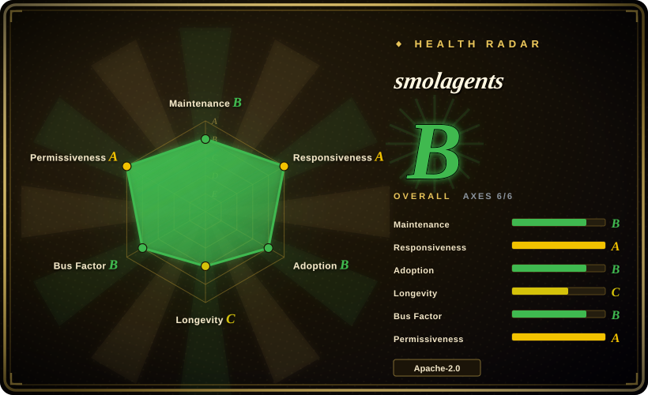
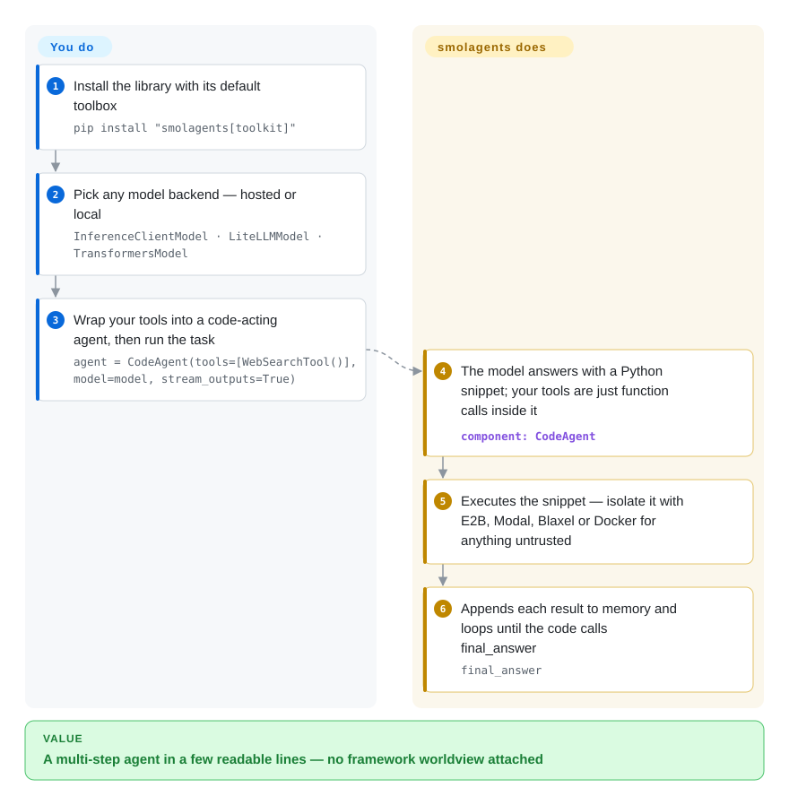

# smolagents

You want an AI agent that actually uses tools, but every framework you tried buries the simple loop — model proposes an action, you run it, the result goes back into the conversation — under graphs, registries and callbacks you never asked for. smolagents keeps that loop in ~1,000 readable lines and has the model write each action as Python code instead of a JSON tool call, so multi-step work composes like ordinary code.

## When to use

You're an engineer or researcher who wants an agent loop you can read end-to-end in an afternoon. You've looked at the heavier frameworks and bounced off the abstraction tax — graph builders, node registries, callback managers — when all you actually want is "LLM proposes an action, we run it, feed back the result, repeat." You reach for smolagents because its core is a few hundred lines you can step through in a debugger, and its distinctive bet is that the agent *writes Python* as its action (`CodeAgent`) rather than filling JSON tool schemas — which composes naturally (loops, conditionals, intermediate variables) and tends to need fewer steps for multi-tool tasks. You define a couple of `@tool` functions, point it at any model through LiteLLM or the HF Inference API, and you have a working code-acting agent without adopting a framework's worldview.

It's also a good fit when you're model-shopping or staying close to the Hugging Face ecosystem: the same agent runs across hosted and local models, and tools/agents can be pushed to and pulled from the Hub. If your value is in a *small, transparent, hackable* loop you can fork and own — not a managed platform — that's smolagents' sweet spot.

## How it works

smolagents runs a ReAct loop — the model proposes an action, the library executes it, the output is appended back to the conversation as memory, repeat — and its twist is the shape of the action: `CodeAgent` asks the model to answer with a Python snippet, so a "tool call" is just an ordinary function call to your `@tool` functions inside generated code (searching three sites becomes a `for` loop, not three round-trips). You wire in a model backend (`InferenceClientModel` for Hugging Face inference providers, `LiteLLMModel` for 100+ others, `OpenAIModel`/Azure/Bedrock, or a local `transformers`/`ollama` model), hand it tools, and call `agent.run(task)`; the library owns the system prompt, the code parser, step limits and streamed logs. The loop ends when the generated code calls `final_answer(...)`, whose argument becomes the result. Because generated Python is arbitrary code, isolation is your half of the bargain: the built-in `LocalPythonExecutor` is explicitly "not a security boundary" (best-effort restrictions that can be bypassed), so anything untrusted means wiring E2B, Modal, Blaxel or Docker. If you'd rather use your provider's native JSON tool-calling, `ToolCallingAgent` ships alongside.

<!-- flow-steps:begin (generated from flows/smolagents.json by tools/flow_card.py — do not edit) -->

Text version of the flow

1. **You**: Install the library with its default toolbox — `pip install "smolagents[toolkit]"`
2. **You**: Pick any model backend — hosted or local — `InferenceClientModel · LiteLLMModel · TransformersModel`
3. **You**: Wrap your tools into a code-acting agent, then run the task — `agent = CodeAgent(tools=[WebSearchTool()], model=model, stream_outputs=True)`
4. **smolagents**: The model answers with a Python snippet; your tools are just function calls inside it — component: `CodeAgent`
5. **smolagents**: Executes the snippet — isolate it with E2B, Modal, Blaxel or Docker for anything untrusted
6. **smolagents**: Appends each result to memory and loops until the code calls final_answer — `final_answer`

**Value**: A multi-step agent in a few readable lines — no framework worldview attached

<!-- flow-steps:end -->

## When NOT to use

- **You need complex, stateful orchestration — graphs, branches, durable state, human-in-the-loop checkpoints.** smolagents is minimal *by design*; it gives you a loop, not a workflow engine. For explicit graphs, conditional edges, and persistence, LangGraph is the better-fit tool, and you'll fight smolagents trying to bolt that on.
- **You can't take on the code-execution security burden.** The agent's whole premise is *running model-generated Python*. The built-in `LocalPythonExecutor` is explicitly **not a security boundary** — safe use means wiring up sandboxing (E2B, Modal, Docker, etc.), which is real operational work you must not skip in any untrusted or production context.
- **You need a guaranteed-stable API.** It's young (created 2024-12) and its surfaces moved release-to-release through 2025–2026 [推断]; note too that the last tagged release is v1.26.0 (2026-05) while commits kept landing into 2026-09 — fixes you need may only exist on `main`. Pin a version and expect occasional migration on upgrade.
- **You want a batteries-included production agent OS** — multi-agent runtime, message passing, observability, deployment story out of the box. smolagents is a library, not a platform; for that, look at a heavier runtime like [AgentScope](agentscope.md).
- **You're optimizing prompts/programs against a metric, not just running a loop.** If the goal is compiled, measurable LM programs rather than a hand-written action loop, that's [DSPy](../../workflow-builders/dspy.md)'s job, not this.

## Comparison

| Alternative | In index | Our verdict | Tradeoff |
|---|---|---|---|
| [LangGraph](langgraph.md) | ✅ | Choose LangGraph when you need graph-based orchestration with durable state, checkpoints, and human-in-the-loop. | Graph-based orchestration (nodes/edges, durable state, checkpoints, human-in-the-loop); far more powerful for complex stateful workflows, but heavier and more abstraction to learn. smolagents trades all of that away for a tiny readable loop. |
| [AgentScope](agentscope.md) | ✅ | Choose AgentScope when you need a multi-agent runtime/platform with message passing, observability, and deployment. | Multi-agent runtime/platform (message passing, observability, deployment); a production "agent OS" where smolagents is a single-loop library you embed and own. |
| [DSPy](../../workflow-builders/dspy.md) | ✅ | Choose DSPy when you need to compile/optimize LM programs against a metric. | *Compiles/optimizes* LM programs against a metric; different paradigm — smolagents just runs a code-acting loop, it doesn't optimize prompts or weights. |
| [CrewAI](crewai.md) | ✅ | Choose CrewAI when you need role/crew-based multi-agent orchestration with a higher-level team model. | Role/crew-based multi-agent orchestration with a higher-level "team of agents" model; more structure and opinion, less minimal than smolagents' single transparent loop. |
| [Pydantic AI](pydantic-ai.md) | ✅ | Choose Pydantic AI when you need a type-safe, Pydantic-centric framework for structured outputs. | Type-safe, Pydantic-centric agent framework emphasizing structured/validated outputs; smolagents leans into code-as-action instead of schema-validated tool calls. |

## Tech stack

- **Language:** Python.
- **Core abstraction:** a ReAct-style agent loop; the headline variant is `CodeAgent`, where the model's action is a Python snippet that's executed, with `ToolCallingAgent` as the JSON-tool-call alternative. Tools are plain Python functions (`@tool`) or `Tool` subclasses.
- **Code execution:** a built-in `LocalPythonExecutor` (sandboxed-ish, but explicitly *not* a security boundary) plus integrations for remote/managed sandboxes (E2B, Modal, Docker, Blaxel).
- **Model gateway:** model-agnostic — `InferenceClientModel` as a gateway to the inference providers supported on HF, `LiteLLMModel` for 100+ LLMs (OpenAI, Anthropic, …), plain OpenAI-compatible servers via `OpenAIModel`, plus `AzureOpenAIModel`, `AmazonBedrockModel`, and local `transformers`/`ollama` models.
- **Agent variants & inputs:** `CodeAgent` (actions are Python snippets) and `ToolCallingAgent` (native JSON tool calls); multi-agent hierarchies are supported; inputs are modality-agnostic (text, vision, video, audio).
- **CLI:** `smolagent` (generalist `CodeAgent` run, with an interactive setup wizard) and `webagent` (a web-browsing vision agent) drive agents from the shell.
- **Ecosystem hooks:** Hugging Face Hub (push/pull tools and agents, e.g. `agent.push_to_hub(...)`), MCP tool servers, LangChain tool interop, and Hub Spaces usable as tools. (Exact integration/version support per the docs — see Caveats.)

## Dependencies

- **Runtime:** Python ≥3.10 (PyPI `requires_python`, 2026-09). No GPU required for the framework itself when you call hosted models; running models locally pulls in `transformers`/`torch` and whatever hardware that implies.
- **Models:** at least one LM backend — an HF Inference endpoint or API key, a LiteLLM-supported provider, or a local model.
- **Sandboxing (for any untrusted use):** an external sandbox — E2B / Modal (cloud) or Docker (self-hosted) — which is its own dependency and operational surface, not bundled.
- **Install:** `pip install "smolagents[toolkit]"` is the README's recommended default (library + a default toolbox); bare `pip install smolagents` plus per-integration extras also works.

## Ops difficulty

**Low for prototyping, medium once it's real.** As a library it's `pip install` and a few lines to a working loop — no servers, no datastore, no cluster. The difficulty is concentrated in two places, both downstream of "the agent runs generated code": first, **sandboxing** — the moment inputs aren't fully trusted you must stand up E2B/Modal/Docker isolation and treat the local executor as unsafe; second, the usual agent-ops concerns (token cost, loop/step limits, retries, observability) are yours to add since this is a thin loop, not a managed platform. Pin your version to insulate against the fast-moving API.

## Health & viability

- **Responsiveness**: Grade A — median first-response time 33.0 hours across 26 qualifying issues/PRs.
- **Maintenance — development active, releases quiet since May (as of 2026-09).** Commits landed on `main` through 2026-09-23, but the newest GitHub release and PyPI version is still v1.26.0 (2026-05-29) — a ~4-month gap. Actively developed, not coasting; not archived. If you need a fix newer than v1.26.0, you may have to run from source. [推断：节奏观察自 tag/PyPI，非维护者声明]
- **Governance & backing — Hugging Face (strong signal).** Owned by the `huggingface` org, not a lone maintainer. HF backing is a meaningful durability signal: a well-resourced, central player in the open-model ecosystem with a track record of sustaining tooling — which materially offsets the project's youth. [推断]
- **Age & Lindy — young, Lindy-unproven, but offset by the backer.** Created 2024-12-05 (GitHub API), ~1.8 years old (as of 2026-09). By age × still-active alone it does **not** clear the Lindy bar that older frameworks like [DSPy](../../workflow-builders/dspy.md) do — there's no long track record yet — but the HF backing + fast adoption substantially de-risks the "will it still be here" question relative to a hyped solo project. [推断]
- **Adoption & ecosystem — still growing.** ~29.5k stars and ~3.0k forks (GitHub API, 2026-09) and broad mindshare for the "code agent" idea; integrates with the HF Hub, LiteLLM, and MCP. Stars are noisy, but the adoption trajectory and ecosystem hooks are healthy.
- **Risk flags — standing code-execution security risk + API churn, not licensing.** Apache-2.0, no relicense history found. The durable risk is intrinsic: the agent executes model-generated code, so unsafe deployment (no sandbox) is a real attack surface — that's a property of the design, not a bug to wait out. Secondary risk is migration cost across a churning young API.

## Caveats (unverified)

- [未验证] ~29.5k stars, ~3.0k forks, last commit 2026-09-23, latest release v1.26.0 (2026-05-29) — point-in-time figures from GitHub/PyPI on 2026-09-28; a newer release may exist by the time you read this.
- [推断] The ~4-month release pause since v1.26.0 is observed from GitHub tags + PyPI; no maintainer statement explains it, so whether it is deliberate stabilization or a slowdown is unknown.
- [未验证] "~1,000 lines of core agent logic" is the project's own framing — the README (2026-09) still claims `agents.py` has <1,000 lines; not independently measured.
- [未验证] The sandbox integrations (Blaxel, E2B, Modal, Docker) and ecosystem hooks (LiteLLM provider list, MCP, LangChain interop, Hub Spaces-as-tools) are per smolagents' docs/README; confirm exact integration and version support before depending on them.
- [推断] Fast-moving v1.x API / occasional breaking changes across releases is inferred from release history and is typical of young agent libraries, not confirmed against a specific changelog here — check the changelog before upgrading.
- [推断] `LocalPythonExecutor` being "not a security boundary" is the project's own stated position; the practical takeaway (use a real sandbox for untrusted input) follows from it, but exact isolation guarantees of any chosen sandbox are yours to verify.
