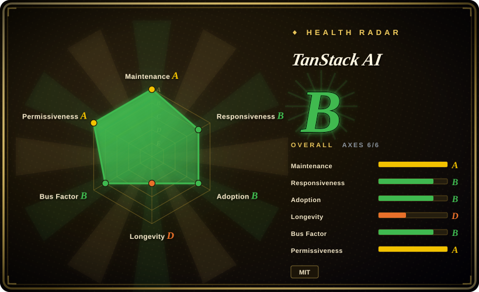
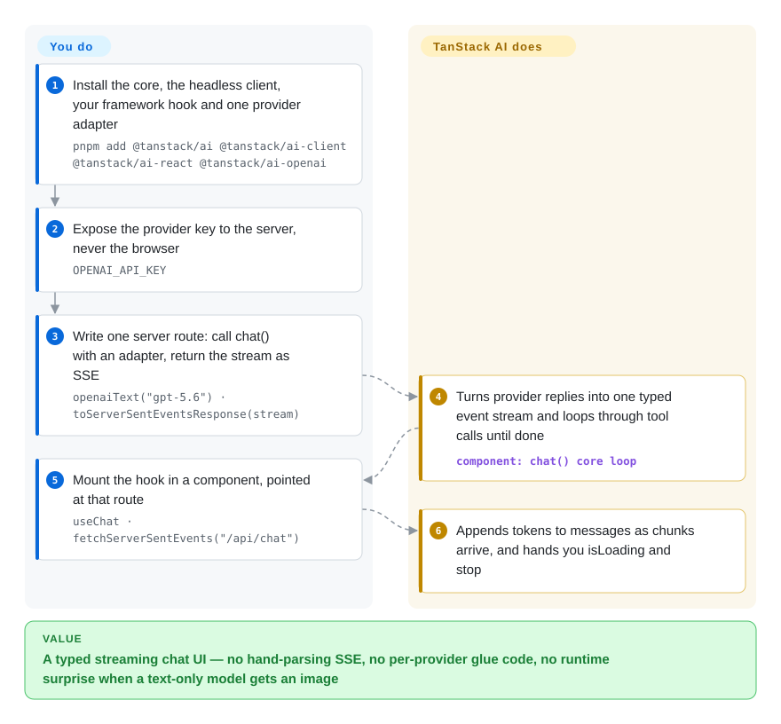

# TanStack AI

Your chat UI is React or Vue, but every provider SDK speaks its own dialect: you hand-parse the stream, tool results cross the wire as untyped JSON, and swapping models means rewriting transport code. TanStack AI puts providers, streaming, tool calling and structured outputs behind one typed contract — you pick an adapter in code (e.g. `openaiText("gpt-5.6")`) and TypeScript knows what that exact model can do.

## When to use

You're building the AI surface of a TypeScript app — a support copilot in a Next.js admin, a chat panel in a TanStack Start product, a voice-and-images demo that has to run in the browser. The model call itself is the easy part; the pain is everything around it: the SSE chunks you parse by hand on the server and re-type on the client, the tool payload that arrives as `any`, the chat that breaks at *runtime* when a user picks a model with no vision input. TanStack AI collapses that into one pipeline: `chat({ adapter, messages })` returns a stream of typed events, `toServerSentEventsResponse()` puts it on the wire, and `useChat` in React, Solid, Vue, Svelte, Preact or Angular renders it as it arrives. Each provider adapter carries a per-model capability table, so the type checker — not your error log — rejects the image sent to a text-only model.

You reach for this over the Vercel AI SDK when you want official framework bindings beyond the usual four (Solid, Preact, React Native are first-party here), a wire protocol that is AG-UI end to end (so a non-TypeScript agent server can speak the same event stream without a translation layer), imports tree-shaken per activity (chat, image, speech — not a monolithic provider package), and zero platform coupling. Over the Python-centric agent SDKs — [LangGraph](langgraph.md), [Pydantic AI](pydantic-ai.md) — when the agent's home is a user-facing web app you own end to end, not a backend pipeline. The same TanStack philosophy as [TanStack Query](../../../web-ui/data-fetching/tanstack-query.md) applies: headless core, thin per-framework layer.

## How it works

You write three things. Install the core plus one provider package plus your framework's hook package. A server route calls `chat()` with the adapter you picked and wraps the returned stream in `toServerSentEventsResponse()`. A client component mounts `useChat({ connection: fetchServerSentEvents("/api/chat") })`. Everything else is the SDK's job: it translates each provider's wire format into one typed event stream (AG-UI events under the hood), runs the agent loop while tool calls come back, and feeds `messages` to your component token by token. The loop is under your control as data, not configuration: each stopping strategy is a plain `(state) => boolean` predicate — `maxIterations(10)`, `untilFinishReason(["stop", "length"])` — that you AND together with `combineStrategies()`. Tools are defined once with a schema (Zod, ArkType, Valibot or plain JSON Schema) via `toolDefinition()`, and `.server()` / `.client()` implementations attach to the same contract, so client-side tool execution stays typed. Structured output rides the same stream as a typed part. Beyond chat, everything is an opt-in package instead of a core dependency: persistence middleware, resumable streams (in-process or durable, without Redis), an MCP client *and* an MCP server builder, Code Mode (the model writes TypeScript that executes in a sandboxed isolate — Node, QuickJS, Cloudflare or Daytona drivers), coding-agent harnesses that run Claude Code, Codex, OpenCode or any ACP agent in a swappable sandbox (local process, Docker, E2B, …), realtime voice, image/audio/video generation hooks, and an in-app devtools panel.

<!-- flow-steps:begin (generated from flows/tanstack-ai.json by tools/flow_card.py — do not edit) -->

Text version of the flow

1. **You**: Install the core, the headless client, your framework hook and one provider adapter — `pnpm add @tanstack/ai @tanstack/ai-client @tanstack/ai-react @tanstack/ai-openai`
2. **You**: Expose the provider key to the server, never the browser — `OPENAI_API_KEY`
3. **You**: Write one server route: call chat() with an adapter, return the stream as SSE — `openaiText("gpt-5.6") · toServerSentEventsResponse(stream)`
4. **TanStack AI**: Turns provider replies into one typed event stream and loops through tool calls until done — component: `chat() core loop`
5. **You**: Mount the hook in a component, pointed at that route — `useChat · fetchServerSentEvents("/api/chat")`
6. **TanStack AI**: Appends tokens to messages as chunks arrive, and hands you isLoading and stop

**Value**: A typed streaming chat UI — no hand-parsing SSE, no per-provider glue code, no runtime surprise when a text-only model gets an image

<!-- flow-steps:end -->

## When NOT to use

- **Your agents live in a Python backend.** Use [LangGraph](langgraph.md) or [Pydantic AI](pydantic-ai.md) instead — TanStack AI is TypeScript-only and its "server" is a JavaScript runtime; there is no Python story.
- **The hard requirement is durable, checkpointed graph state.** TanStack's durability is stream-level (reconnect a run) and sandbox-run-level (journal/detach/takeover); for agents you resume, replay or time-travel across days, LangGraph's checkpointer story is deeper — use LangGraph there.
- **You want a packaged `Agent` class.** The project's own comparison doc concedes Vercel AI SDK ships a reusable `Agent` (`ToolLoopAgent`) bundling model + tools + loop settings with end-to-end UI-message typing, while this SDK composes the loop per call. If you want the agent as an object you pass around, use the Vercel AI SDK or the OpenAI Agents SDK for JS (both `not indexed`).
- **You need breadth of dedicated provider packages.** A first-party, individually maintained adapter per niche provider is Vercel AI SDK's strongest axis (its own comparison puts it at ~38 packages — a TanStack-authored claim, [未验证] against Vercel's side); here you route niche models through the OpenRouter / Vercel-Gateway / `openaiCompatible` adapters or write your own with their extend-adapter guide.
- **You cannot absorb pre-1.0 churn.** Still `0.x`; the docs' migration guide lists breaking renames between releases (monolithic adapters split per activity, `providerOptions` → `modelOptions`, `embedding()` → `embed()`). If your product upgrades APIs once a year, pin hard and budget codemods, or choose a 1.x-stable stack.
- **You want a hosted gateway with failover/caching/one-key bundled.** This is a pure library *by design*; the platform convenience you're looking for is Vercel's AI Gateway (which couples you to that platform). Inside TanStack AI the uncoupled equivalent is the OpenRouter adapter.

## Comparison

| Alternative | In index | Our verdict | Tradeoff |
|---|---|---|---|
| Vercel AI SDK (`vercel/ai`) | not indexed | Pick this page's project when you need official Solid/Preact/React-Native bindings, AG-UI-native streaming, per-activity tree-shaking and no platform layer; pick Vercel AI SDK when you need its packaged `Agent` class, RSC primitives or the widest dedicated-provider coverage. | Not added in this tab-intake batch, so it stays a named rival rather than an actionable page. The deciding axis: provider-package breadth (theirs) vs. type-safe portability without platform coupling (this project's). |
| [LangGraph](langgraph.md) | ✅ | Pick LangGraph when agents must survive as checkpointed graphs you resume or replay across days; pick TanStack AI when the deliverable is a streaming chat UI in a TypeScript front end and each run is short-lived. | LangGraph buys durable graph state and time-travel debugging at the cost of a separate runtime and little front-end integration; TanStack AI inverts that. |
| [Pydantic AI](pydantic-ai.md) | ✅ | Pick Pydantic AI when your agents are typed Python services and output validation is the product; pick TanStack AI when the same type discipline must extend into the browser's chat UI. | Pydantic AI gives you pydantic-grade structured agents server-side with no browser streaming surface; TanStack AI covers the client wall-to-wall but only in TypeScript. |
| OpenAI Agents SDK for JavaScript (`openai/openai-agents-js`) | not indexed | Pick it when you are committed to OpenAI models and want a minimal loop-plus-handoffs library in TS; pick TanStack AI when you need multi-provider adapters, media/realtime activities or framework chat hooks. | Not added in this tab-intake batch; its Python sibling already has a page in this category (`openai-agents-sdk`), and the JS port is the same loop idea, provider-locked. |
| Mastra (`mastra-ai/mastra`) | not indexed | Pick Mastra when you want a TypeScript agent framework that ships its own workflow/memory/eval server layer; pick TanStack AI when the streaming UI, per-model types and tree-shaking are what actually decide for you. | Not added in this tab-intake batch. Mastra's pitch is a batteries-included agent OS; this page's pitch is composable SDK primitives across seven front ends. |

## Tech stack

- **Language / shape:** TypeScript monorepo — 72 package directories under `packages/` as of 2026-09-28 (`gh api`), pnpm workspace + Nx.
- **Core deps (verified in `packages/ai/package.json`, v0.63.0):** `@ag-ui/core` 1.0.0 (the wire event protocol), `@standard-schema/spec` (schema-agnostic tool I/O), `partial-json`; peer dep `@opentelemetry/api >= 1.9`.
- **Adapters:** per-provider packages (`ai-openai`, `ai-anthropic`, `ai-gemini`, `ai-grok`, `ai-groq`, `ai-ollama`, `ai-mistral`, `ai-cohere`, `ai-vertex`, `ai-bedrock`, `ai-openrouter`, `ai-perplexity`, `ai-elevenlabs`, `ai-fal`, `ai-cloudflare`, `ai-vercel-gateway`, …) split per activity (`openaiText`, `geminiSpeech`) for tree-shaking; `openai-base` shared code.
- **Front end:** headless `@tanstack/ai-client` plus official React/Solid/Vue/Svelte/Preact/Angular/Octane/Remix packages and headless UI subpaths.
- **Advanced surfaces:** MCP client + server packages, Code Mode isolate drivers (`isolated-vm`, QuickJS WASM/Bun, Cloudflare, Daytona), sandbox drivers (local process, Docker, E2B, Daytona, Vercel, Sprites, Cloudflare), persistence, durable stream, realtime voice, generation hooks, devtools panels.
- **Transport:** SSE over a Web `Response` by default; alternative connection adapters (HTTP stream, XHR for React Native, RPC, direct async iterables, custom).

## Dependencies

- **What you must run for the core path:** nothing but a JS server that can return a streaming `Response` (Next.js, TanStack Start, SvelteKit, Hono, Remix, Express all documented) and provider credentials on the server (`OPENAI_API_KEY`-style env; a BYOK flow keeps keys in the browser instead). No database, queue or daemon is required.
- **Opt-in subsystems add real infra:** durable stream (a durability store behind `StreamDurability`), Code Mode (`isolated-vm`/QuickJS in-process, or Cloudflare/Daytona services), coding-agent sandboxes (Docker, E2B, Daytona, Vercel, Sprites, Cloudflare Workers), OpenTelemetry exporters if you trace. MCP is a library, not a service, unless you build a server.
- **Model side:** any supported provider's API bill; nothing egresses to a TanStack-hosted gateway — by design (per-model adapter switching is yours).

## Ops difficulty

**Low to medium.** The chat path is npm-install and deploy-anywhere with no stateful service of its own, which is the whole point of the "pure library" stance. The cost sits in the dependency graph, not in servers: 72 interlocking packages released together on a `0.x` train, with breaking renames documented in a migration guide and `codemods/` shipped in-repo — you version-pin and read changelogs on upgrade windows. Medium once you opt into sandboxes or durable streams, since each of those genuinely adds compute/storage to operate.

## Health & viability

- **Maintenance (2026-09-28):** hyperactive — `@tanstack/ai@0.63.0` released 2026-09-27, default branch pushed the same day it was measured; issue/PR numbering past ~1,550 within a year of creation, with same-day maintainer replies on recent issues.
- **Governance / bus factor:** owned by the TanStack **Organization**; the human commit core is small — Alem Tuzlak (243), Tom Beckenham (113), Jack Herr (76) vs. CI-bot noise (265) — so a three-person core under an org umbrella. `LICENSE` is MIT, copyright "Tanner Linsley".
- **Backing & Lindy:** created 2025-10-08 — under a year old, so the repo itself is young-and-hyped, not Lindy; the prior that actually de-risks it is the parent org's ~6-year track record (Query/Router/Table are ecosystem staples) [推断：Lindy 挂在组织而非本 repo 上]. Beta was declared 2026-06-09 with 265 E2E tests across 10 providers (TanStack blog).
- **Adoption (dated):** ~3.1k stars, 341 forks (2026-09-28); the health scorer measured 1,358,318 npm downloads last month for `@tanstack/ai` (2026-09-28; a manual npm-API window 2026-08-29→2026-09-27 read 1,490,026 for `@tanstack/ai` and 621,873 for `@tanstack/ai-react`). Named partners in the README: CodeRabbit, Cloudflare; funded via GitHub Sponsors + a partner program — no foundation or vendor behind the roadmap.
- **External recognition:** README badge claims "2026 JavaScript Open Source Awards — AI Project of the Year" (JSNation ceremony, 2026-06-11); corroborated only by the TanStack blog post of 2026-06-22, not checked against the awards' own site.
- **Risk flags:** pre-1.0 breaking churn (documented renames between releases); very large package surface to keep coherent; competitive feature counts in its docs are one-sided; no semver-stability commitment yet.

## Caveats (unverified)

- [未验证] The award attribution relies on TanStack's own blog (2026-06-22); the JSNation/Open Source Awards site was not independently checked.
- [未验证] "Vercel AI SDK ships ~38 first-party provider packages" is quoted from TanStack's comparison doc, not verified against the Vercel repo itself.
- [未验证] The `durableStream` storage backends were not read in source; the durability story is taken from docs claims (resumable-streams section).
- [未验证] Which of the 72 `packages/` directories are actually published to npm vs internal workspace scaffolding was not checked package-by-package; the count is the directory listing on the default branch (2026-09-28).
- [推断] npm download volume includes CI and bot traffic; treat it as an adoption ceiling, and stars as a noisy signal — neither was normalized.
- [推断] The LangGraph / Pydantic AI / Mastra rows are ecosystem-positioning judgments from this page's reading, not benchmark results.
