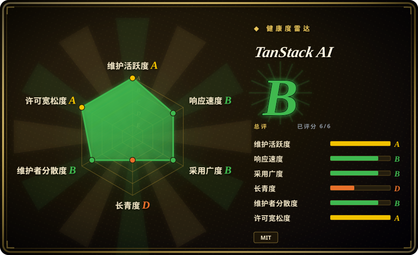
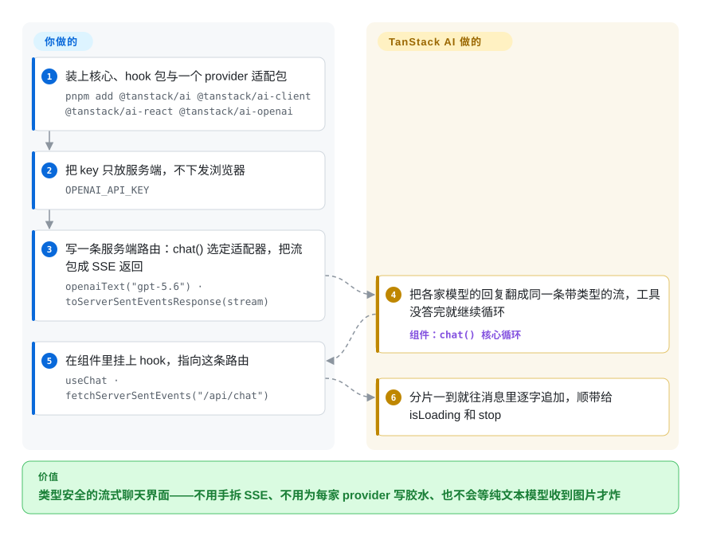

# TanStack AI

你的聊天界面用 React 或 Vue，可各家模型 SDK 各说各话：流式响应要自己拆、工具返回到前端变成 `any`、换一家模型就得重写传输层。TanStack AI 把 provider、流式传输、工具调用和结构化输出收进同一套类型契约——你在代码里选定一个适配器（如 `openaiText("gpt-5.6")`），TypeScript 就知道这个具体模型能做什么、不能做什么。

## 何时使用

你在给一个 TypeScript 应用做 AI 界面——Next.js 后台里的客服副驾、TanStack Start 产品里的聊天面板、必须在浏览器里跑图文和语音的演示。调模型本身是最容易的一环，疼的是它周围的一切：服务端手拆 SSE 分片、客户端再补一遍类型、工具载荷过了网络就成了 `any`、用户选了一个不支持视觉的模型后聊天在*运行时*才炸。TanStack AI 把这些收进一条管道：`chat({ adapter, messages })` 返回一条带类型的事件流，`toServerSentEventsResponse()` 把它送上网络，React、Solid、Vue、Svelte、Preact、Angular 里的 `useChat` 边到边渲染。每家 provider 适配器都带一张按模型的能力表，纯文本模型收到图片会被类型检查器当场拒掉，不用等错误日志。

相对 Vercel AI SDK，选它的理由是：官方绑定的框架更多（Solid、Preact、React Native 都是一等公民）、传输协议端到端就是 AG-UI（非 TypeScript 的 agent 服务端不用翻译层就能说同一种事件流）、按活动粒度做树摇导入（聊天、图像、语音各自成函数，不是整包 provider）、且完全不绑平台。相对以 Python 为中心、[LangGraph](langgraph.zh.md)、[Pydantic AI](pydantic-ai.zh.md) 这类 agent SDK，选它的理由是：agent 的家是一个你自己端到端持有的面向用户的 Web 应用，而不是后端流水线。它和 [TanStack Query](../../../web-ui/data-fetching/tanstack-query.zh.md) 是同一套哲学：headless 内核，外面套一层薄薄的各框架粘合。

## 怎么用起来

你要写的只有三样。装上核心包、一个 provider 包、你框架的 hook 包。服务端路由调 `chat()` 选好适配器，把返回的流交给 `toServerSentEventsResponse()`。客户端组件挂上 `useChat({ connection: fetchServerSentEvents("/api/chat") })`。其余都是 SDK 的活：把各家 provider 的线路格式翻成同一条带类型的事件流（底下走 AG-UI 事件），在工具调用返回的间隙自己续循环，再把 `messages` 逐字喂给组件。循环的停止条件你以数据而非配置掌控：每个策略就是一个 `(state) => boolean` 的普通断言——`maxIterations(10)`、`untilFinishReason(["stop", "length"])`——用 `combineStrategies()` 做与组合。工具用 schema（Zod、ArkType、Valibot 或裸 JSON Schema）经 `toolDefinition()` 定义一次，`.server()`／`.client()` 两份实现挂在同一契约上，客户端执行的工具也全程带类型。结构化输出作为一种带类型的分片走同一条流。聊天之外的一切都是可选包而不是核心依赖：持久化中间件、可恢复流（进程内或持久化，不需要 Redis）、MCP 客户端*和* MCP 服务端构建器、Code Mode（模型写 TypeScript，在沙箱隔离环境里执行——Node、QuickJS、Cloudflare、Daytona 五种驱动）、把 Claude Code、Codex、OpenCode 或任意 ACP agent 塞进可换沙箱（本地进程、Docker、E2B 等）跑的编码代理 harness、实时语音、图像／音频／视频生成 hook，以及应用内的 devtools 面板。

<!-- flow-steps:begin (generated from flows/tanstack-ai.json by tools/flow_card.py — do not edit) -->

流程文字版

1. **你**：装上核心、hook 包与一个 provider 适配包 — `pnpm add @tanstack/ai @tanstack/ai-client @tanstack/ai-react @tanstack/ai-openai`
2. **你**：把 key 只放服务端，不下发浏览器 — `OPENAI_API_KEY`
3. **你**：写一条服务端路由：chat() 选定适配器，把流包成 SSE 返回 — `openaiText("gpt-5.6") · toServerSentEventsResponse(stream)`
4. **TanStack AI**：把各家模型的回复翻成同一条带类型的流，工具没答完就继续循环 — 组件：`chat() 核心循环`
5. **你**：在组件里挂上 hook，指向这条路由 — `useChat · fetchServerSentEvents("/api/chat")`
6. **TanStack AI**：分片一到就往消息里逐字追加，顺带给 isLoading 和 stop

**价值**：类型安全的流式聊天界面——不用手拆 SSE、不用为每家 provider 写胶水、也不会等纯文本模型收到图片才炸

<!-- flow-steps:end -->

## 何时不用

- **你的 agent 活在 Python 后端。**用 [LangGraph](langgraph.zh.md) 或 [Pydantic AI](pydantic-ai.zh.md)——TanStack AI 只有 TypeScript，它的“服务端”是 JavaScript 运行时，没有 Python 的故事。
- **硬需求是可断点续跑的带检查点图状态。**TanStack 的持久化是流级（重连一次运行）和沙箱运行级（journal／detach／takeover）；要按天恢复、回放、时间旅行的 agent，LangGraph 的 checkpointer 方案更深，那种场景用 LangGraph。
- **你想要一个打包好的 `Agent` 类。**这个项目的官方对比文档自己承认：Vercel AI SDK 提供把模型、工具、循环设定装成一个可复用对象（`ToolLoopAgent`）且端到端带 UI 消息类型的 `Agent` 抽象，而这里每次调用现场组装循环。要“对象化的 agent”，用 Vercel AI SDK 或 OpenAI Agents SDK 的 JS 版（两者均`未收录`）。
- **你依赖各家 provider 都有专属维护包。**“每个小众 provider 都有一等公民适配包”仍是 Vercel AI SDK 最强的轴（其对比文档自称约 38 个一方包——这是 TanStack 单方面写的数字，对 Vercel 一侧[未验证]）；在这里，小众模型走 OpenRouter／Vercel-Gateway／`openaiCompatible` 适配器，或者照它的 extend-adapter 指南自己写。
- **你消化不了 pre-1.0 的折腾。**还在 `0.x`：文档的 migration guide 列着发版间的破坏性改名（单体适配器按活动拆开、`providerOptions` 改成 `modelOptions`、`embedding()` 改成 `embed()`）。产品一年才升一次依赖的话，锁死版本并预留跑仓库自带 codemods 的预算，或者选 1.x 稳定的技术栈。
- **你想要自带故障转移、缓存、一把钥匙管全家的托管网关。**这是个*刻意*的纯库；你要的平台便利是 Vercel AI Gateway（代价是绑上那个平台）。不绑平台的等价物，在这里就是 OpenRouter 适配器。

## 横向对比

| 替代品 | 是否收录 | 我们的评价 | 取舍 |
|---|---|---|---|
| Vercel AI SDK（`vercel/ai`） | 未收录 | 需要官方 Solid／Preact／React Native 绑定、AG-UI 原生流、按活动树摇且零平台耦合时，选本页项目；需要打包好的 `Agent` 类、RSC 原语或最广的一方 provider 包覆盖时，选 Vercel AI SDK。 | 本批 tab-intake 未添加，所以它在这里只是被点名的对手，没有可读的页面。决定性的一条轴：一方 provider 包的广度（它的）对无平台耦合的类型安全可移植性（本页项目的）。 |
| [LangGraph](langgraph.zh.md) | ✅ | agent 必须活成可断点恢复、可按天回放的带检查点图时选 LangGraph；交付物是 TypeScript 前端里的流式聊天界面、每次运行短命时选 TanStack AI。 | LangGraph 换来持久图状态与时间旅行调试，代价是多一套运行时、几乎没有前端整合；本页项目正好反过来。 |
| [Pydantic AI](pydantic-ai.zh.md) | ✅ | agent 是带类型的 Python 服务、输出校验就是产品本身时选 Pydantic AI；同一套类型纪律必须一路延伸进浏览器里的聊天界面时选 TanStack AI。 | Pydantic AI 在服务端给你 pydantic 级的结构化 agent，但没有浏览器流式这一面；TanStack AI 把客户端全包了，但只有 TypeScript。 |
| OpenAI Agents SDK for JavaScript（`openai/openai-agents-js`） | 未收录 | 已认定 OpenAI 模型、只想要一个极简的“循环＋移交”TS 库时选它；需要多 provider 适配器、媒体／实时活动或框架聊天 hook 时选 TanStack AI。 | 本批 tab-intake 未添加。它的 Python 同门在本分类已有页面（`openai-agents-sdk`）；JS 版是同一个循环思路，绑在 OpenAI 一家的 provider 上。 |
| Mastra（`mastra-ai/mastra`） | 未收录 | 想要一套自带工作流／记忆／评测服务层的 TypeScript agent 框架时选 Mastra；真正拍板的是流式 UI、按模型类型和树摇时选 TanStack AI。 | 本批 tab-intake 未添加。Mastra 的卖点是电池全含的 agent 操作系统；本页的卖点是横跨七个前端框架的可组装 SDK 原语。 |

## 技术栈

- **语言／形态：**TypeScript 单体仓库——2026-09-28 用 `gh api` 数得 `packages/` 下 72 个包目录，pnpm workspace + Nx。
- **核心依赖（`packages/ai/package.json` v0.63.0 实测）：**`@ag-ui/core` 1.0.0（线路事件协议）、`@standard-schema/spec`（schema 无关的工具输入输出）、`partial-json`；对等依赖 `@opentelemetry/api >= 1.9`。
- **适配器：**每 provider 一个包（`ai-openai`、`ai-anthropic`、`ai-gemini`、`ai-grok`、`ai-groq`、`ai-ollama`、`ai-mistral`、`ai-cohere`、`ai-vertex`、`ai-bedrock`、`ai-openrouter`、`ai-perplexity`、`ai-elevenlabs`、`ai-fal`、`ai-cloudflare`、`ai-vercel-gateway` 等），再按活动拆分导出（`openaiText`、`geminiSpeech`）以支持树摇；`openai-base` 为共享底座。
- **前端：**headless 的 `@tanstack/ai-client`，外加官方 React／Solid／Vue／Svelte／Preact／Angular／Octane／Remix 包与 headless UI 子路径。
- **进阶面：**MCP 客户端＋服务端包、Code Mode 隔离驱动（`isolated-vm`、QuickJS WASM／Bun、Cloudflare、Daytona）、沙箱驱动（本地进程、Docker、E2B、Daytona、Vercel、Sprites、Cloudflare）、持久化、可恢复流、实时语音、生成 hook、各框架 devtools 面板。
- **传输：**默认经 Web `Response` 走 SSE；备选连接适配器有 HTTP 流、XHR（React Native 用）、RPC、直接异步迭代器、自定义。

## 依赖

- **核心路径必须自己跑的：**只有一台能返回流式 `Response` 的 JS 服务器（Next.js、TanStack Start、SvelteKit、Hono、Remix、Express 均有文档示例），外加服务端持有的 provider 凭据（`OPENAI_API_KEY` 式环境变量；或走 BYOK 把钥匙留在浏览器）。不需要任何数据库、队列或常驻进程。
- **可选子系统会加上真基础设施：**可恢复持久流（`StreamDurability` 背后的存储）、Code Mode（进程内 `isolated-vm`／QuickJS，或 Cloudflare／Daytona 服务）、编码代理沙箱（Docker、E2B、Daytona、Vercel、Sprites、Cloudflare Workers）、要做追踪时的 OpenTelemetry exporter。MCP 是库不是服务，除非你自己建 server。
- **模型侧：**任何受支持 provider 的 API 账单；代码默认不向任何 TanStack 托管网关出网——这是设计使然，换模型的控制权在你。

## 运维难度

**低到中。**聊天路径 npm 装上就能到处部署，没有自己的有状态服务——“纯库”姿态图的就是这个。成本在依赖图而不在服务器：72 个互联的包在一条 `0.x` 版本列车上一起发，发版间的破坏性改名写进 migration guide，仓库自带 `codemods/`——升级窗口里你要锁版本、读 changelog。一旦启用沙箱或持久流，就升到中，因为它们确实各自带来要运维的算力／存储。

## 健康度与可持续性

- **维护（2026-09-28 实测）：**极度活跃——`@tanstack/ai@0.63.0` 发布于 2026-09-27，默认分支当天仍在推；创建一年出头，issue／PR 编号已过约 1,550，近期 issue 有维护者当天回复。
- **治理／bus factor：**仓库属 TanStack **Organization**；人类提交核心很小——Alem Tuzlak（243）、Tom Beckenham（113）、Jack Herr（76），其余高频是 CI 机器人（265）——组织伞下的三人大小核心。`LICENSE` 为 MIT，版权行写 “Tanner Linsley”。
- **背书与 Lindy：**创建于 2025-10-08，本 repo 不满一年，就 repo 年龄而言是“年轻且热”，不满足 Lindy；真正给它降风险的先验是母组织约 6 年的履历（Query／Router／Table 都是生态常备件）[推断：Lindy 应挂到组织而不是这个 repo]。Beta 于 2026-06-09 宣布，带跨 10 家 provider 的 265 个端到端测试（TanStack 博客）。
- **采用度（有日期）：**约 3.1k star、341 fork（2026-09-28）；健康度评分器实测 `@tanstack/ai` 上月 npm 下载 1,358,318 次（2026-09-28；另一次手动 npm API 窗口 2026-08-29→2026-09-27 读到 1,490,026 次，`@tanstack/ai-react` 621,873 次）。README 列出的合作方：CodeRabbit、Cloudflare；资金靠 GitHub Sponsors 加伙伴计划——路线图后面没有基金会或大厂。
- **外部认可：**README 徽章称获 “2026 JavaScript Open Source Awards — AI Project of the Year”（2026-06-11 JSNation 颁奖），目前只能对到 TanStack 自家 2026-06-22 博客，未对奖项官网交叉验证。
- **风险旗子：**pre-1.0 破坏性改名频发（发版说明可查）；要维持一致的包面极大；文档里的竞品功能计数是单方口径；尚无 1.x 语义化版本承诺。

## 存疑（未验证）

- [未验证] 获奖一节依据 TanStack 自家博客（2026-06-22），未去 JSNation／Open Source Awards 官网独立核对。
- [未验证] “Vercel AI SDK 约 38 个一方 provider 包”转引自 TanStack 的对比文档，未对 Vercel 仓库核实。
- [未验证] `durableStream` 的存储后端未读源码确认，持久化叙事来自文档声明。
- [未验证] `packages/` 下 72 个目录里哪些真正发布到 npm、哪些是 workspace 脚手架，未逐包核对；该数字是 2026-09-28 默认分支的目录清点。
- [推断：依据 npm API 计数] 下载量含 CI 与机器人流量，只能当采用度上限读；star 同样只是噪声信号，两者都未做归一化。
- [推断] 与 LangGraph／Pydantic AI／Mastra 的行判断来自本页阅读到的生态站位，不是跑分结果。
