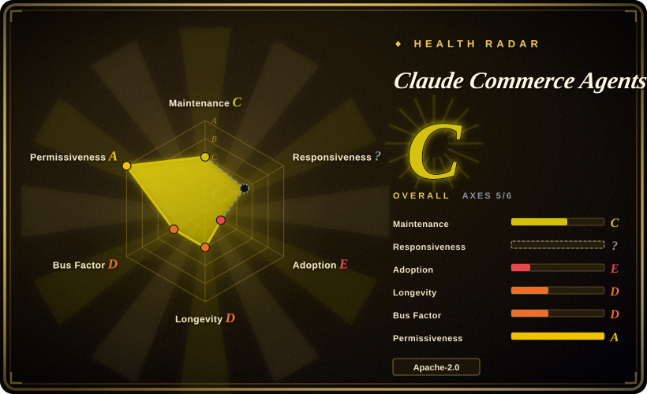
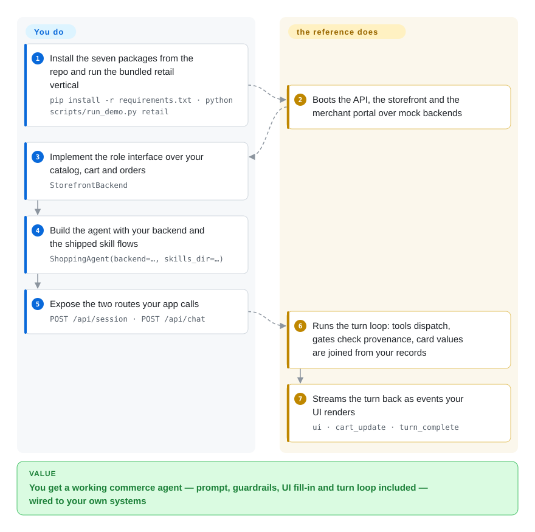

# Claude Commerce Agents

Anthropic's reference blueprint for two commerce agents — a customer-facing **shopping agent** and an operator-facing **merchant agent** — defined once and run on three runtimes (Messages API, Claude Agent SDK, Managed Agents), with four runnable verticals over mock backends.

## When to use

You are building an assistant inside a product that *sells* something — a retailer's storefront, a travel or ticketing site, a telecom catalogue. The ask is concrete: it searches the catalogue, compares options, fills a cart, answers policy questions, and remembers what the customer prefers; and usually a second ask follows for your own staff, an operator agent that reads the numbers, edits listings, restocks, moves prices, and drafts campaigns. You already have an agent framework, but a framework gives you a loop and nothing about commerce — nothing stops the model from inventing a product id, quoting a price it made up, or applying a price change nobody approved — so you would still have to design prompt-cache layout, fencing for third-party content, UI payload validation, and an approval path before the first demo is safe to show anyone.

Reach for this repo when you would rather that whole layer arrived already decided and written down. It is a reference implementation, not a library: two roles over two backend interfaces (14 methods for the storefront, 19 for the merchant), ten skill flows, a fixed set of presentation components, and — the actual payload — 20 rules enforced *in code* rather than asked of the prompt, which hold on all three runtimes because they run inside the tool call. Its closest in-index sibling is [Parlant](parlant.md), also a way to keep a customer-facing agent on-rails; the difference is what you are buying. Parlant constrains how your agent *talks* and leaves your stack and domain alone; this repo also decides how your agent may *write* (cart provenance, guardrail caps, staged approval), at the price of a structure and an Anthropic/Python stack you must follow.

## How it works

The repo hands you the agent and asks you to implement one interface. It also runs standalone over mock fixtures — one command boots a retailer with both agents so you can see the shape before wiring anything — but the value lands on the path below, not on that look: your systems behind the interface. You write a `StorefrontBackend` (catalogue search, cart, orders, policies) or a `MerchantBackend` (metrics, listings, inventory, pricing, campaigns) against your own systems, build the agent with that backend plus the shipped skills directory, and expose the two routes your app calls; the packages supply the system prompt, the tool contracts, the five flows per role, and the turn loop. What the project does for you inside that loop is the part worth reading: third-party text is sanitised and fenced before the model reads it, a cart write is refused unless the product id came back from a tool in this session, every field on a UI card is joined from your records rather than written by the model, and a merchant write only becomes real after your host application marks the staged change approved. You own everything behind the interface — business rules, credentials, auth, and the model's own evals — and the repo says so itself: `docs/safety.md` splits its rules into 20 enforced in code, 5 still asked of the model, and 9 a deployment must add.

<!-- flow-steps:begin (generated from flows/commerce-agents.json by tools/flow_card.py — do not edit) -->

Text version of the flow

1. **You** (Build): Install the seven packages from the repo — `pip install -r requirements.txt`
2. **You** (Build): Implement the role interface over your catalog, cart and orders — `StorefrontBackend`
3. **You** (Build): Build the agent with your backend and the shipped skill flows — `ShoppingAgent(backend=…, skills_dir=…)`
4. **You** (Build): Expose the two routes your app calls — `POST /api/session · POST /api/chat`
5. **Claude Commerce Agents** (Every turn): Runs the turn loop: tools dispatch, gates check provenance, card values are joined from your records
6. **Claude Commerce Agents** (Every turn): Streams the turn back as events your UI renders — `ui · cart_update · turn_complete`

**Value**: You build once; every turn afterwards gets prompt, guardrails, UI fill-in and turn loop for free

<!-- flow-steps:end -->

## When NOT to use

- **You want a dependency you can import.** The seven packages are deliberately unregistered on PyPI and CI fails if any name ever appears there, so `pip install commerce-common` cannot work and any build must vendor the source. If you need a package you can pin and upgrade, use [Parlant](parlant.md) or a general SDK from [agent-sdks](../agent-sdks/INDEX.md).
- **You need a maintained base with an upgrade path.** One squashed commit, no releases, no tags, issues disabled, and a README that states it is not maintained and does not accept contributions. For a base you can pull fixes into, use [LangGraph](../agent-sdks/langgraph.md) or [Pydantic AI](../agent-sdks/pydantic-ai.md) and write the commerce layer yourself.
- **You want a deployable service, not a blueprint to read.** The examples have no authentication, no payment, no rate limiting, and keep sessions in one process's memory (single worker only). If your requirement is a durable agent service rather than a design to copy, [eve](eve.md) or [OpenFang](openfang.md) are the closer starting points.
- **You are not on Python + Claude.** The guardrail logic is Python and the tool contracts are Anthropic-shaped; on another language or model provider you are porting, not reusing. A model-agnostic framework such as [OpenAI Agents SDK](../agent-sdks/openai-agents-sdk.md) or [LangGraph](../agent-sdks/langgraph.md) costs you the shipped guardrails but keeps your stack.
- **Your product is not "a chat assistant that performs commerce actions through card UI".** The interaction grammar — one model owns the conversation, one primary component per turn, chips closing the turn, writes staged for approval — is baked into the prompt and the turn loop. A different UX or approval model means forking core, and there is no upstream to fork from. [推断]
- **You only want the official Claude Code skills.** Then take [Anthropic Skills](../../../agent-skills/vendor-collections/anthropic-skills.md) or read the `commerce-builder` plugin directly; the runnable code here is the part you would be carrying for nothing.

## Comparison

| Alternative | In index | Our verdict | Tradeoff |
|---|---|---|---|
| [Parlant](parlant.md) | ✅ | Choose Parlant when the hard part is keeping one customer-facing agent's *conversation* on-rails on your own stack; choose this repo when you also need the write path — cart provenance, staged price and inventory changes, host approval — decided for you. | Parlant is a configurable behavioural-guideline engine that is model- and domain-agnostic; this repo is a fixed commerce architecture with the guardrails already in code — more design handed to you, less freedom to keep your own. |
| [LangGraph](../agent-sdks/langgraph.md) | ✅ | Choose LangGraph when the orchestration itself is your product and you must stay model-provider-agnostic; choose this repo when orchestration is a solved problem you would rather copy and the commerce guardrails are the actual work. | LangGraph gives you explicit control flow and an ecosystem but no domain opinions, so fencing, UI validation, provenance and approval are yours to build; this repo gives all four and ties you to its structure in exchange. |
| [Anthropic Skills](../../../agent-skills/vendor-collections/anthropic-skills.md) | ✅ | Choose Anthropic Skills when you want the official skill/plugin baseline for Claude Code and nothing to run; choose this repo when you need the agents, backends and runtimes those skills describe to actually exist. | Anthropic Skills installs in minutes and stays out of your architecture; this repo is a 41k-line Python implementation you read, vendor and own — with its Claude Code plugin as one surface, not the product. |
| Roll your own on a provider SDK | n/a | Choose your own build when no shipped interaction grammar fits — a bespoke UX, a different approval model, or a non-Anthropic model — because the template's value is precisely the grammar it fixes. | Full control and zero inherited structure, paid for by re-deriving the cache layout, fencing, provenance gates and approval path that this repo has already written and tested. |

## Tech stack

- **Languages.** Python 3.11+ for the seven packages; TypeScript/Next.js for the eight demo web apps, which share one npm workspace under `examples/`.
- **Agent definition.** Skills are `SKILL.md` directories (five flows per role); tool contracts are pydantic v2 models; the system prompt is a static cached block plus a per-request fenced context block appended after the cache breakpoint.
- **Three runtimes.** A hand-written Messages API turn loop (`ShoppingAgent` / `MerchantAgent`), the same definition as `ClaudeAgentOptions` for the Claude Agent SDK, and a Managed Agents manifest with a role-specific MCP server.
- **Example hosts.** FastAPI + uvicorn for the APIs, an in-memory session store, and a JSON-file memory store in the retail vertical; mock backends load JSON fixtures.
- **Model.** Claude through the `anthropic` SDK (pinned `anthropic==0.122.0`), with `claude-agent-sdk==0.2.139` and `mcp==1.29.0` for the other two paths. `docs/deployment.md` covers Vertex AI, Bedrock, Foundry and gateways.

## Dependencies

- **Runtime.** Python 3.11+; Node 22 for the demo front ends.
- **Install shape.** `pip install -r requirements.txt` installs the seven packages **from their directories** (editable), deliberately not from an index — there is no PyPI package to depend on, by design.
- **Credentials.** An `ANTHROPIC_API_KEY` in the repo-root `.env` or the environment for chat; browsing the demos and the merchant portals needs no key.
- **Optional.** A cloud platform (Vertex / Bedrock / Foundry) or a gateway that serves `/v1/messages` with streaming, if you do not call the Anthropic API directly.
- **No datastore.** Sessions live in one process's memory, so the examples run a single worker; only the retail vertical persists memory, to a gitignored JSON file.

## Ops difficulty

**Medium to run the demos, medium-to-high to deploy for real**, and the split is instructive. Running a vertical is one command that installs, boots uvicorn and two Next.js dev servers and prints the URLs. Deploying your own is ordinary Python-service work plus one extra rule — the seven packages are source installs, so your image must vendor the repo rather than resolve a package. The operational weight sits in what the repo deliberately leaves to you: authentication and authorization on every route and on the MCP servers, credentials your backend calls your services with, rate limits, business rules (fraud, eligibility, pricing, inventory), order placement after `checkout`, memory retention and deletion wired into account deletion, and log hygiene — a `DEBUG` log contains the entire cart and every injected fact, so it needs the retention and access controls of your memory store. The MCP servers bind to loopback unless an env var declares an authenticating gateway in front.

## Health & viability

- **Responsiveness — not scored.** GitHub issues are disabled on this repo (`issues_disabled`), so there is no issue-response signal to measure.
- **Maintenance — frozen by declaration (2026-09).** `main` holds a single squashed import commit (2026-08-31); zero releases and zero tags; `pushed_at` 2026-09-11 comes from side branches. The README states the repo is not maintained and does not accept contributions, and GitHub issues are disabled. This is a published artifact, not a live project. [未验证]
- **Governance / bus factor.** Organization-owned (`anthropics`) but with a single commit and no external contributor history — there is no maintainer team to speak of, and no roadmap to follow. The durability signal is Anthropic's name on the artifact, not an active steward.
- **Age & Lindy.** Created 2026-09-01, roughly three weeks old as of 2026-09-21: **Lindy-unproven**. Age alone would make this a weak bet; what makes it usable anyway is that it is a finished reference rather than a system you expect to evolve. [推断]
- **Adoption & ecosystem.** The machine axis reads **E** structurally, not as evidence nobody uses it: there are no registry packages to measure dependents or downloads against, because the seven names are deliberately unregistered, so the only adoption signal available is attention — ~3.0k stars and 580 forks within three weeks, consistent with a first-party Anthropic release. 35 pull requests are open and none has landed on `main`, so community work is not flowing back. [未验证]
- **Risk flags.** No upstream to pull from — adopting any part of it means owning that code. Bound to the Anthropic stack (instruction format, three named runtimes, MCP). Issues disabled removes a feedback channel. License is clean: Apache-2.0, no relicense history observed.
- **The honest read.** Treat it as a pattern source with unusually high engineering discipline (776 test functions across 79 files, a cross-package suite asserting the three runtimes keep the same prompt and tool bytes, and a CI job that guards the unregistered package names). Test breadth is not deployment evidence: nothing here has been proven under real traffic, real data, or real adversaries. [推断]

## Caveats (unverified)

- [未验证] Star (3,009) and fork (580) counts are from the GitHub API on 2026-09-21 and are volatile; treat them as attention, not quality.
- [未验证] "Not maintained / does not accept contributions" is the README's own statement; whether Anthropic updates the repo later cannot be confirmed from its current state.
- [未验证] The 35 open pull requests figure comes from the GitHub API's `open_issues_count` with issues disabled, so it counts PRs only; whether any are substantive was not reviewed.
- [未验证] Test breadth (776 test functions across 79 files) was counted from the repository tree; the suite was not executed, so "passing" is not claimed here.
- [未验证] "The four verticals prove business-shape breadth" rests on reading their READMEs and API modules, not on running them; each is a mock backend over JSON fixtures, so breadth of *shape* is shown, not scale or data quality.
- [推断] The judgement that it is best used as a pattern source rather than a dependency follows from the deliberately unregistered package names plus the README's no-contributions statement.
- [推断] The claim that a non-Anthropic or non-Python adoption is a port rather than a reuse is inferred from the Python guardrail modules and Anthropic-shaped tool contracts, not from attempting a port.
- [推断] Marketplace, multi-seller and account-pricing support is described in the README but is not exercised by any shipped vertical, so it is documented rather than demonstrated.
