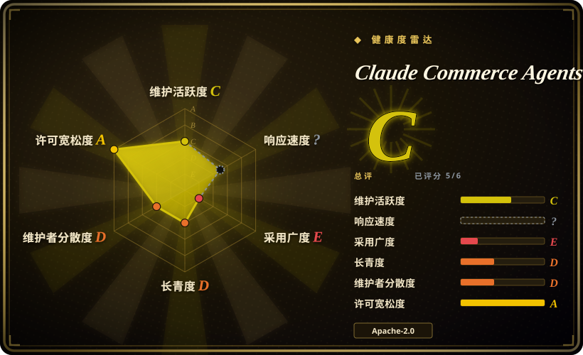
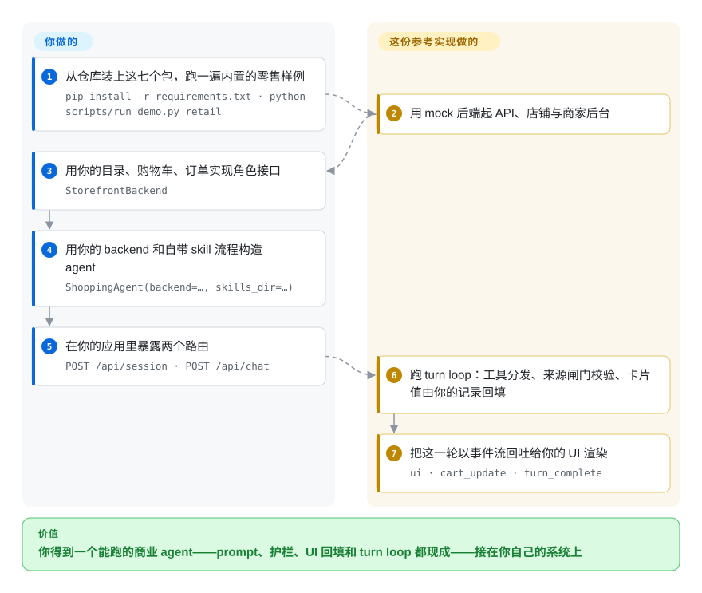

# Claude Commerce Agents

Anthropic 的参考蓝图：两个 commerce agent——面向顾客的**购物 agent** 和面向店员/运营的**商家 agent**——定义一份，跑在三条运行时上（Messages API、Claude Agent SDK、Managed Agents），并配四个可跑在 mock 后端之上的行业样例。

## 何时使用

你要在一个**卖东西**的产品里做助手——零售店铺、旅游或票务站点、电信资费目录。需求很具体：它会搜目录、比方案、填购物车、答政策问题、记住顾客偏好；通常还有第二个需求，给内部员工做一个运营 agent，读数据、改商品、补货、调价、起草活动。你已经有 agent 框架了，但框架只给你一个循环，对 commerce 一无所知——没有任何东西阻止模型编一个商品 ID、报一个自己编的价格、或者让一笔没人批准的价格变更生效。于是你在能给人看第一个 demo 之前，还得自己设计 prompt 缓存布局、第三方内容围栏、UI 载荷校验和审批路径。

想把这整层**已经定好并写下来**的时候，就选这个仓库。它是参考实现而不是库：两个角色建立在两个后端接口之上（店铺侧 14 个方法，商家侧 19 个），十个 skill 流程，一套固定的呈现组件；真正的干货是 **20 条写在代码里、而不是拜托 prompt 的规则**——它们在三条运行时上都成立，因为这些规则跑在工具调用内部。本索引里离它最近的同类是 [Parlant](parlant.zh.md)，同样是让对客 agent 守规的路子，区别在于你买到的是什么：Parlant 约束 agent **怎么说话**，不太管你的技术栈和业务域；本仓库还替你定了 agent **怎么写入**（购物车来源校验、护栏上限、暂存审批），代价是你要接受它的结构，以及 Python 加 Anthropic 的技术栈。

## 怎么用起来

它把 agent 交给你，只要你实现一个接口。它也能独立跑起来——一条命令用 mock 数据起一个零售店、把两个 agent 都拉起来，让你先看清形状——但价值落在下面这条路上，而不在那一眼上：接口背后接你自己的系统。你对着自己的系统实现 `StorefrontBackend`（目录搜索、购物车、订单、政策）或 `MerchantBackend`（指标、商品、库存、价格、活动），用这个 backend 加自带的 skills 目录构造 agent，再暴露应用调用的两个路由；包本身提供 system prompt、工具契约、每个角色五个流程和 turn loop。这个循环里**它替你做的事**才是值得读的部分：第三方文本在模型读到之前先脱敏并围栏；购物车写入只在商品 ID 是本会话工具返回过的时候才放行；UI 卡片上的每个字段都由你的记录回填，而不是模型写的；商家写入只有在你的宿主应用把暂存变更标为已批准之后才真正生效。接口背后的东西全归你——业务规则、凭据、认证授权，以及模型自己的 eval——仓库自己也这么说：`docs/safety.md` 把规则分成 20 条代码强制、5 条仍靠模型自觉、9 项必须由部署方补齐。

<!-- flow-steps:begin (generated from flows/commerce-agents.json by tools/flow_card.py — do not edit) -->

流程文字版

1. **你**（搭建）：从仓库装上这七个包 — `pip install -r requirements.txt`
2. **你**（搭建）：用你的目录、购物车、订单实现角色接口 — `StorefrontBackend`
3. **你**（搭建）：用你的 backend 和自带 skill 流程构造 agent — `ShoppingAgent(backend=…, skills_dir=…)`
4. **你**（搭建）：在你的应用里暴露两个路由 — `POST /api/session · POST /api/chat`
5. **Claude Commerce Agents**（每轮运行）：跑 turn loop：工具分发、来源闸门校验、卡片值由你的记录回填
6. **Claude Commerce Agents**（每轮运行）：把这一轮以事件流回吐给你的 UI 渲染 — `ui · cart_update · turn_complete`

**价值**：你只搭一次；之后每一轮对话都白拿 prompt、护栏、UI 回填和 turn loop

<!-- flow-steps:end -->

## 何时不用

- **你想要一个能 import 的依赖。** 这七个包刻意不在 PyPI 注册，CI 还专门守着这一点，所以 `pip install commerce-common` 不可能成功，任何构建都得 vendor 源码。需要能锁版本、能升级的包，用 [Parlant](parlant.zh.md) 或 [agent-sdks](../agent-sdks/INDEX.zh.md) 里的通用 SDK。
- **你需要一个有升级路径的维护型底座。** 单个 squash 提交、无 release、无 tag、issue 关闭，README 明写不维护、不收贡献。想要能持续拉修复的底座，用 [LangGraph](../agent-sdks/langgraph.zh.md) 或 [Pydantic AI](../agent-sdks/pydantic-ai.zh.md)，commerce 那层自己写。
- **你要的是一个可部署的服务，而不是一份可读的蓝图。** 示例没有认证授权、没有支付、没有限流，会话放在单进程内存里，只能跑一个 worker。如果你要的是持久的 agent 服务而不是一套照抄的设计，[eve](eve.zh.md) 或 [OpenFang](openfang.zh.md) 是更近的起点。
- **你不在 Python 加 Claude 这条线上。** 护栏逻辑是 Python，工具契约是 Anthropic 的形状；换语言或换模型厂商，你是**移植**而不是复用。模型无关的框架，比如 [OpenAI Agents SDK](../agent-sdks/openai-agents-sdk.zh.md) 或 [LangGraph](../agent-sdks/langgraph.zh.md)，会丢掉现成护栏，但保住你自己的技术栈。
- **你的产品不是「一个通过卡片 UI 完成交易动作的对话助手」。** 它的交互语法——一个模型主导对话、每轮一个主组件、chips 收尾、写入暂存待批——写死在 prompt 和 turn loop 里。换个 UX 或换个审批模型就要改核心，而它没有上游可跟。[推断]
- **你只想要官方那套 Claude Code skill。** 那就取 [Anthropic Skills](../../../agent-skills/vendor-collections/anthropic-skills.zh.md)，或者直接读 `commerce-builder` 插件；把这里的可运行代码一起搬走，等于白白背上它。

## 横向对比

| 替代品 | 是否收录 | 我们的评价 | 取舍 |
|---|---|---|---|
| [Parlant](parlant.zh.md) | ✅ | 难点在于让一个对客 agent 的**对话**在自己的技术栈上守规时，选 Parlant；还需要把写入路径（购物车来源校验、暂存调价与补货、宿主审批）也一并定下来时，选本页项目。 | Parlant 是一套可配置的行为准则引擎，模型与业务域都无关；本页项目是一套固定的 commerce 架构、护栏已经写进代码——交给你的设计更多，留给你自己的自由更少。 |
| [LangGraph](../agent-sdks/langgraph.zh.md) | ✅ | 编排本身就是你的产品、且必须与模型厂商无关时，选 LangGraph；编排是已经解决了的问题、你只想照抄，而真正的活在 commerce 护栏上时，选本页项目。 | LangGraph 给你显式控制流与生态，但对业务域不表态，围栏、UI 校验、来源校验和审批全要自己搭；本页项目四样都给，代价是被它的结构绑住。 |
| [Anthropic Skills](../../../agent-skills/vendor-collections/anthropic-skills.zh.md) | ✅ | 只想要官方 skill/plugin 基线、不需要跑任何东西时，选 Anthropic Skills；需要那些 skill 所描述的 agent、后端与运行时真实存在时，选本页项目。 | Anthropic Skills 几分钟装完且不侵入你的架构；本页项目是四万一千行 Python 实现，要你自己读、自己 vendor、自己接手——它那个 Claude Code 插件只是其中一个面，不是主体。 |
| 基于厂商 SDK 自己搭 | 不适用 | 现有交互语法都不贴合时——自定义 UX、不同的审批模型、非 Anthropic 模型——选自己搭，因为这套模板的价值恰恰就是它钉死的那套语法。 | 完全掌控、零继承结构，代价是本页项目已经写好并测过的缓存布局、围栏、来源闸门和审批路径，你得重新推一遍。 |

## 技术栈

- **语言。** 七个包用 Python 3.11+；八个示例前端用 TypeScript 加 Next.js，共用 `examples/` 下的一个 npm workspace。
- **agent 定义。** skill 是 `SKILL.md` 目录（每个角色五个流程）；工具契约是 pydantic v2 模型；system prompt 由静态缓存块加每请求围栏上下文块组成，后者追加在缓存断点之后。
- **三条运行时。** 手写的 Messages API turn loop（`ShoppingAgent` / `MerchantAgent`）、同一份定义转成 Claude Agent SDK 的 `ClaudeAgentOptions`、以及 Managed Agents 的 manifest 加角色专属 MCP server。
- **示例宿主。** API 用 FastAPI 加 uvicorn；会话存在内存里，零售样例的记忆落 JSON 文件；mock backend 读 JSON fixture。
- **模型。** 通过 `anthropic` SDK 调 Claude（锁 `anthropic==0.122.0`），另两条路用 `claude-agent-sdk==0.2.139` 与 `mcp==1.29.0`。`docs/deployment.md` 覆盖 Vertex AI、Bedrock、Foundry 和网关。

## 依赖

- **运行时。** Python 3.11+；跑示例前端需要 Node 22。
- **安装形态。** `pip install -r requirements.txt` 从**各自目录**（editable）装这七个包，刻意不走 index——按设计就没有可依赖的 PyPI 包。
- **凭据。** 聊天要在仓库根 `.env` 或环境里放 `ANTHROPIC_API_KEY`；只浏览示例和商家后台不需要 key。
- **可选。** 不直连 Anthropic API 时，需要一个云平台（Vertex、Bedrock、Foundry）或一个能提供流式 `/v1/messages` 的网关。
- **无数据存储。** 会话在一个进程的内存里，所以示例只能跑单 worker；只有零售样例把记忆持久化到一个被 gitignore 的 JSON 文件。

## 运维难度

**跑 demo 是中等，真上线是中等到偏高**，这个分界很有信息量。跑一个样例就是一条命令，它会装依赖、拉起 uvicorn 和两个 Next.js dev server 并打印 URL。部署自己的版本是普通 Python 服务的活，外加一条额外规则——七个包是源码安装，所以你的镜像必须 vendor 这个仓库，而不是去解析一个包。运维的重量落在仓库**故意留给你**的部分：每个路由和 MCP server 上的认证授权、后端调你服务所用凭据、限流、业务规则（欺诈、资格、定价、库存）、`checkout` 之后的订单落地、记忆的保留期与删除（要接进账号注销流程），以及日志卫生——`DEBUG` 日志会包含整车购物车和每一条注入的事实，需要记忆库同级的保留与访问控制。MCP server 默认只绑回环地址，除非有环境变量声明前面有认证网关。

## 健康度与可持续性

- **响应速度——不计分。** 该仓库的 GitHub issue 已关闭（`issues_disabled`），没有可度量的 issue 响应信号。
- **维护——官方声明冻结（2026-09）。** `main` 只有一个 squash 导入提交（2026-08-31）；零 release、零 tag；`pushed_at` 2026-09-11 来自旁支分支。README 明写不维护、不收贡献，GitHub issue 已关闭。这是一份已发布的作品，不是一个活着的项目。[未验证]
- **治理与 bus factor。** 归 `anthropics` 组织所有，但只有一个提交、没有外部贡献者历史——谈不上维护团队，也没有可跟的路线图。耐久信号是 Anthropic 的名字挂在这份作品上，而不是有一个活跃的托管方。
- **年龄与 Lindy。** 创建于 2026-09-01，截至 2026-09-21 约三周：**Lindy 未经验证**。只看年龄这是个弱下注；让它仍可用的原因是它是一份**定稿的参考**，而不是一个你指望持续演化的系统。[推断]
- **采用与生态。** 机器口径给 **E** 是结构性的，不代表没人在用：没有注册表包可用来量依赖方与下载量，因为七个包名刻意未注册，所以唯一可得的采用信号是关注度——三周内约 3.0k star、580 fork，与 Anthropic 第一方发布相符。挂着 35 个 open PR，没有一个进了 `main`，社区产出没有回流。[未验证]
- **风险标记。** 没有上游可跟——采用它的任何一部分都意味着你拥有那份代码。绑定 Anthropic 技术栈（指令格式、三条具名运行时、MCP）。issue 关闭等于少一条反馈通道。许可干净：Apache-2.0，未观察到改许可历史。
- **诚实的读法。** 把它当作一份工程纪律异常高的模式来源（79 个测试文件里 776 个测试函数，一组跨包测试断言三条运行时的 prompt 与工具字节一致，还有一个 CI job 守着未注册的包名）。测试广度不等于部署证据：这里没有任何东西在真实流量、真实数据或真实对手下被验证过。[推断]

## 存疑（未验证）

- [未验证] star 数（3009）与 fork 数（580）来自 2026-09-21 的 GitHub API，会变动；当作关注度而非质量信号。
- [未验证] 「不维护/不收贡献」是 README 自己的声明；Anthropic 之后是否更新该仓库，无法从当前状态确认。
- [未验证] 35 个 open PR 来自 GitHub API 的 `open_issues_count`，而 issue 已关闭，所以它只统计 PR；其中有几个是实质改动未做审查。
- [未验证] 测试广度（79 个文件 776 个测试函数）是从仓库目录树数出来的；套件未实际执行，因此本页不声称「通过」。
- [未验证] 「四个样例证明业务形状跨度大」来自读它们的 README 与 API 模块，而非实际运行；每个都是读 JSON fixture 的 mock 后端，证明的是**形状**的跨度，不是规模或数据质量。
- [推断] 「更适合当模式来源而非依赖」的判断，来自刻意不注册的包名加上 README 的不收贡献声明。
- [推断] 「换非 Anthropic 或非 Python 栈是移植而非复用」是从 Python 护栏模块与 Anthropic 形状的工具契约推出的，未实际试过移植。
- [推断] 多卖家市场与账户价支持只写在 README 里，没有任何已发布样例实际跑过，属于「有文档、无演示」。
